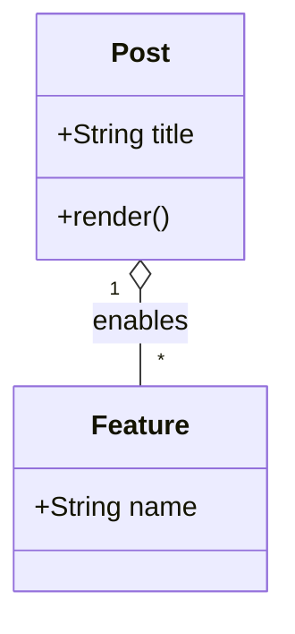

## Theme Image



## Raw Markdown Image

## Mermaid

## KaTeX

인라인 수식 \\(a^2 + b^2 = c^2\\)과 블록 수식을 함께 테스트한다.

$$
E = mc^2
$$

## Callout


이 블록은 참고용 정보를 담을 때 씁니다.



짧은 조언이나 추천은 tip으로 두면 읽는 흐름이 좋습니다.



색이 너무 많아지면 페이지의 톤이 깨질 수 있습니다.



정말 중요한 경고는 적게, 하지만 확실하게 보여주는 편이 좋습니다.

