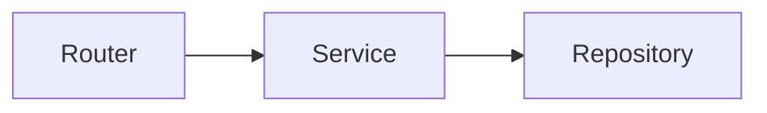
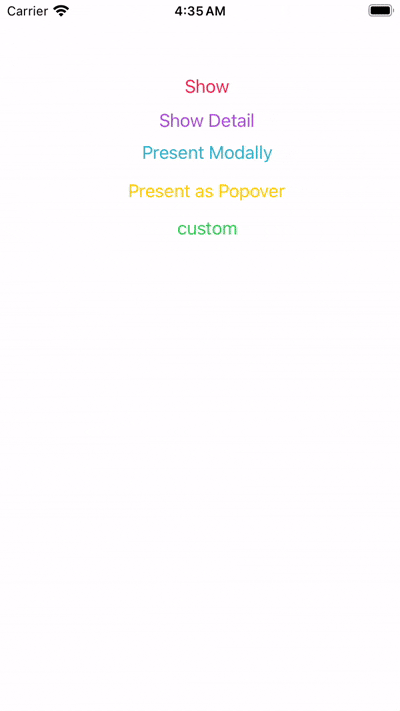

## Mermaid



## KaTeX

인라인 수식은 $f(x)=\int_{-\infty}^{\infty} e^{-t^2}\,dt = \sqrt{\pi}$ 처럼 보이고, 코드 안의 `` `$0` `` 는 그대로 보여야 한다.

블록 수식은 아래처럼 렌더링되어야 한다.

$$
\mathcal{L}\{f\}(s)
= \int_{0}^{\infty} e^{-st} f(t)\,dt
= \frac{1}{\sqrt{2\pi}}
  \int_{-\infty}^{\infty}
  \left(\int_{-\infty}^{\infty} e^{-x^2/2}\,dx\right)
  e^{-st}\,dt
$$

### 예외 (코드블록, 인라인)

`arr.map { $0 + 1 }`

```swift
let xs = [1, 2, 3]
let ys = xs.map { $0 * $0 + 2 * $0 + 1 }
```

## Quote

> 인용문은 본문 속에서 조용하게 보이되, 그래도 분명히 구분되어야 한다.
> 그래서 너무 강한 색보다 읽기 편한 대비가 더 중요하다.

## Callout


이 블록은 참고용 정보를 담을 때 씁니다.



짧은 조언이나 추천은 tip으로 두면 읽는 흐름이 좋습니다.



색이 너무 많아지면 페이지의 톤이 깨질 수 있습니다.



정말 중요한 경고는 적게, 하지만 확실하게 보여주는 편이 좋습니다.


## Image





## Image Row






## Image Grid








## Theme Image



## Video



## Raw Markdown Image



