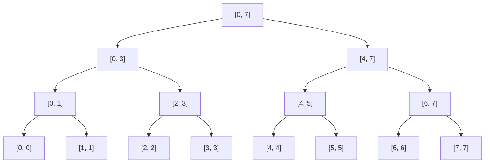
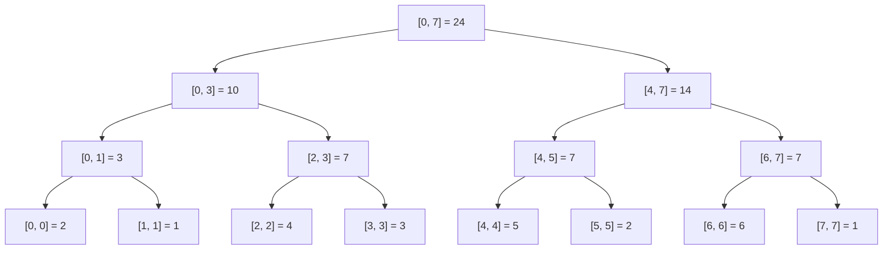
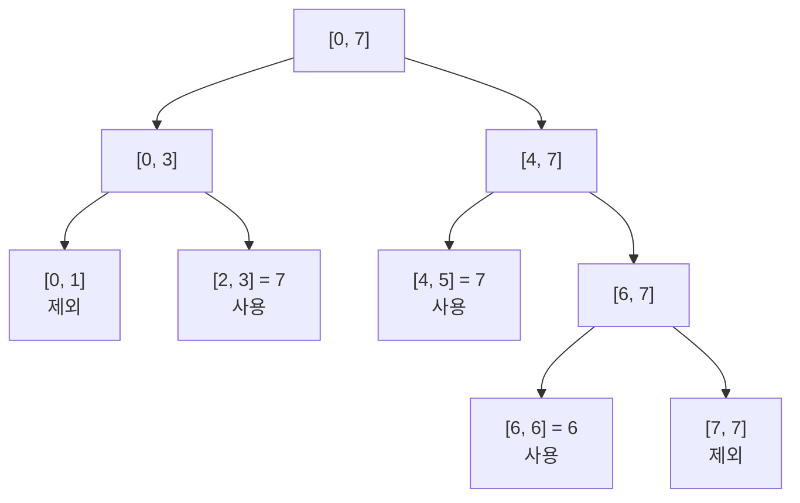
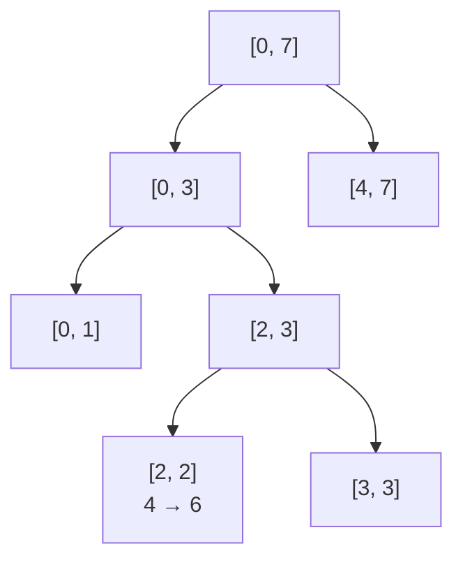

## Segment Tree

배열의 특정 구간에 대한 연산을 빠르게 처리하기 위한 이진 트리 형태의 자료구조. 

구간 합, 최솟값, 최댓값처럼 배열의 일정 범위를 대상으로 반복해서 연산해야 하는 경우에 사용할 수 있다.

일반적인 배열에서 특정 구간의 합을 구하려면 해당 구간의 원소를 직접 순회해야 하므로 $O(n)$의 시간이 필요하다. 세그먼트 트리는 배열의 여러 구간에 대한 연산 결과를 트리 형태로 저장하여 구간 조회를 $O(\log n)$에 처리할 수 있도록 한다.

특히 배열의 값이 변경되는 상황에서도 구간에 대한 연산을 반복해서 수행해야 할 때 사용할 수 있다.

## Structure

세그먼트 트리는 배열의 구간을 이진 트리 형태로 나눈 구조이다.

- 루트 노드: 배열의 전체 구간
- 내부 노드: 담당하는 구간을 두 개의 하위 구간으로 나눈 결과
- 리프 노드: 배열의 개별 원소

하나의 노드가 구간 $[l, r]$을 담당한다면 중간 지점을 $m = \left\lfloor \frac{l+r}{2} \right\rfloor$ 로 정하고, 구간을 $[l,m]$과 $[m+1,r]$로 나눈다. 

하나의 원소만 남을 때까지 이 과정을 반복한다.

예를 들어 원소가 8개인 배열의 구간은 다음과 같이 나눌 수 있다.

각 노드에는 자신이 담당하는 구간에 대한 연산 결과를 저장한다. 구간 합을 구하는 세그먼트 트리라면 각 노드에는 해당 구간에 포함된 원소의 합이 저장된다.

예를 들어 수열 `[2,1,4,3,5,2,6,1]`를 생각해보자.

구간 합을 저장하는 세그먼트 트리는 다음과 같이 구성된다.

리프 노드는 배열의 원소를 나타내고, 내부 노드는 두 자식 노드가 담당하는 구간의 합을 저장한다.

## Operations

### Build

세그먼트 트리를 생성할 때는 전체 배열을 작은 구간으로 계속 나눈다.

하나의 원소만 포함하는 구간에 도달하면 해당 배열의 값을 리프 노드에 저장한다. 이후 두 자식 노드의 결과를 미리 정의한 연산 $\circ$로 결합하여 부모 노드의 값을 계산한다.

$$
tree[node] = tree[left] \circ tree[right]
$$

예를 들어 구간 합을 구하는 세그먼트 트리에서는 $\circ$를 덧셈으로 정의할 수 있다.

$$
a \circ b = a + b
$$

스트링의 구간을 연결한다면 concat으로 정의할 수도 있다.

$$
a \circ b = ab
$$

이 과정을 리프 노드부터 루트 노드까지 반복하여 전체 트리를 구성한다. 전체 노드의 수는 배열의 크기에 비례하므로 트리를 생성하는 데 $O(n)$의 시간이 필요하다.

### Query

특정 구간의 값을 조회할 때는 루트 노드부터 시작하여 필요한 구간만 탐색한다.

현재 노드가 담당하는 구간과 조회하려는 구간의 관계에 따라 다음과 같이 처리할 수 있다.

- 완전히 포함되는 경우: 현재 노드에 저장된 값을 사용한다.
- 일부만 겹치는 경우: 자식 노드를 추가로 탐색한다.
- 전혀 겹치지 않는 경우: 해당 노드를 탐색에서 제외한다.

예를 들어 앞의 배열에서 $[2,6]$ 구간의 합을 조회한다고 하자.

$[2,3]$과 $[4,5]$ 구간은 조회 범위에 완전히 포함되므로 각 노드의 값을 그대로 사용할 수 있다. $[6,7]$은 일부만 포함되므로 자식 노드를 추가로 탐색하고, 조회 범위와 겹치지 않는 구간은 제외한다.

따라서 $[2,6]$의 구간 합은 다음과 같이 구할 수 있다.

$$
7 + 7 + 6 = 20
$$

배열의 원소를 하나씩 확인하는 대신, 이미 계산되어 있는 여러 구간의 결과를 조합하여 값을 구한다. 세그먼트 트리의 구간 조회는 $O(\log n)$에 수행할 수 있다.

### Update

배열의 특정 원소가 변경되면 해당 원소를 담당하는 리프 노드의 값을 변경한다.

이후 해당 리프 노드에서 루트 노드까지 올라가면서 영향을 받은 부모 노드의 값을 다시 계산한다. 변경된 원소를 포함하지 않는 다른 구간의 값은 다시 계산할 필요가 없다.

예를 들어 배열의 인덱스 $2$에 저장된 값이 $4$에서 $6$으로 변경되었다면 $[2,2]$ 노드부터 시작하여 $[2,3]$, $[0,3]$, $[0,7]$에 저장된 값이 차례대로 변경된다.

세그먼트 트리의 높이는 $O(\log n)$이고, 하나의 원소를 변경할 때 리프 노드에서 루트 노드까지 하나의 경로만 갱신하면 된다. 따라서 값 변경 역시 $O(\log n)$에 수행할 수 있다.

## Characteristics

### 장점

- 구간 조회를 $O(\log n)$에 수행할 수 있다.
- 원소 값이 변경되어도 $O(\log n)$에 전체 트리 결과를 갱신할 수 있다.
- 결합법칙이 성립한다면 교환법칙이 성립하지 않는 연산에도 사용할 수 있다. (스트링 concat)

### 단점

- 당연하지만, 배열과 비교했을 때 공간 - 시간 트레이드 오프가 있다.
- Prefix Sum 보다 구현이 훨씬 어렵다.

## Segment Tree vs. Prefix Sum

Prefix Sum은 배열의 누적 합을 미리 계산하여 구간 합을 빠르게 구하는 방법이다.

구간 $[l,r]$의 합은 누적 합 배열을 이용하여 $O(1)$에 조회할 수 있다.

$$
sum(l,r) = prefix[r] - prefix[l-1]
$$

따라서 배열의 값이 변경되지 않고 구간 합 조회만 반복하는 경우에는 세그먼트 트리보다 Prefix Sum이 단순하면서 조회 속도도 빠르다.

하지만 배열의 특정 값이 변경되면 해당 위치 이후의 누적 합도 영향을 받기 때문에 일반적인 Prefix Sum에서는 갱신에 $O(n)$의 시간이 필요하다.

세그먼트 트리는 구간 조회가 $O(\log n)$으로 Prefix Sum보다 느리지만, 값 변경 역시 $O(\log n)$에 처리할 수 있다.

따라서 배열의 값이 변경되면서 구간 조회도 반복해서 수행되는 경우 세그먼트 트리를 사용할 수 있다.

## Time Complexity

세그먼트 트리는 처음 생성할 때 $O(n)$의 시간이 필요하다. 이후 구간 조회와 하나의 원소에 대한 갱신은 $O(\log n)$에 수행할 수 있다.

- 빌드: $O(n)$
- 쿼리: $O(\log n)$
- 업데이트: $O(\log n)$
