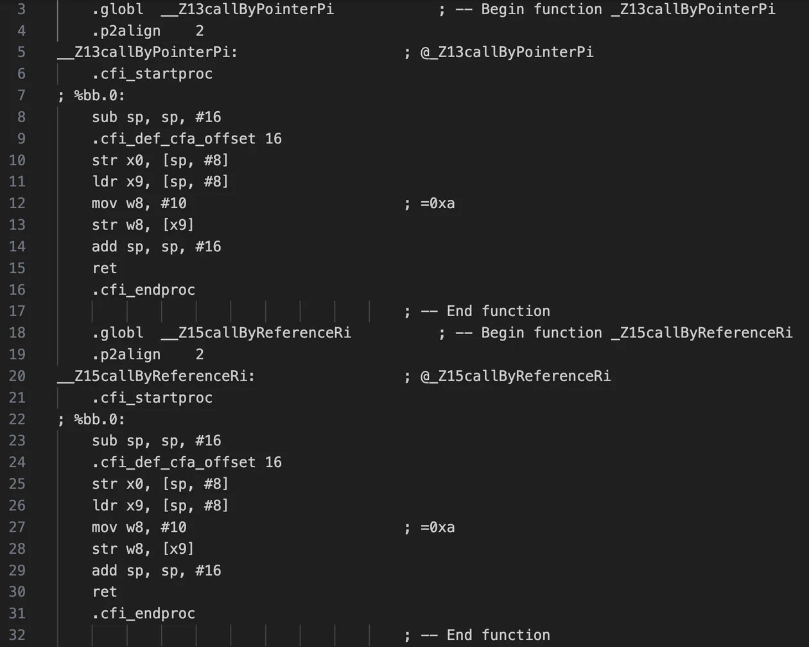

## 데이터베이스(Database, DB)

> 여러 사람이 공동으로 사용하기 위해 통합, 저장하여 운영하는 데이터들의 집합
> 

특정 조직(서비스)의 업무를 수행하는데 필요한 상호 관련된 데이터들의 모임이다.

### DBMS(Database Management System)

데이터베이스를 관리하기 위한 프로그램, 대표적으로 SQL을 사용하는 관계형 데이터베이스(RDBMS)가 있고, SQL을 사용하지 않는 NoSQL DBMS도 있다.

## 관계형 데이터베이스(Relational DB, RDB)

> 2차원 표를 이용해서 데이터간의 상호 관계를 정의하는 데이터베이스
> 

### 스키마(Schema)

데이터베이스의 구조와 제약 조건에 대한 전반적인 명세. 엔티티, 어트리뷰트, 릴레이션, 제약 조건 등을 전반적으로 정의한 DB의 구조적 정의

### 구성 요소

- 엔티티(entity): 데이터베이스에 표현하려는 개념이나 정보 같은 현실 세계의 객체
    - 레코드(record): 데이터베이스에 기록된 각각의 엔티티 (= 튜플)
- 어트리뷰트(attribute): 엔티티의 속성, 데이터의 가장 작은 단위
    - 필드(field): 데이터베이스에 기록된 엔티티 속성 (= 컬럼)
    - 도메인(domain): 하나의 어트리뷰트가 가질 수 있는 같은 타입의 값들의 집합. 예) 요일의 도메인은 월화수목금토일…
- 릴레이션(Relation): 엔티티들의 집합
    - 테이블(table): 데이터베이스에 기록된 2차원 표 형태의 릴레이션

### 트랜잭션(Transaction)

데이터베이스의 상태를 변환시키는 하나의 논리적 작업 단위를 의미한다. 데이터베이스의 무결성을 지키기 위해 트랜잭션이 지켜야 할 4가지 특성(ACID)이 있다.

- 원자성(Atomicity): 트랜잭션은 데이터베이스에 모두 반영되거나, 전혀 반영되지 않아야 한다.
- 일관성(Consistency): 트랜잭션 수행 전후에 데이터베이스가 일관된 상태를 유지해야 한다.
- 고립성(Isolation): 하나의 트랜잭션이 완료되기 전에는, 다른 트랜잭션과 간섭 없이 독립적으로 수행되어야 한다.
- 지속성(Durability): 성공적으로 완료된 트랜잭션의 결과는, 디스크에 영구적으로 반영되어야 한다.

### SQL(Structured Query Language)

관계형 데이터베이스를 다루기 위한 표준 질의 언어. 명령의 목적에 따라 DDL, DML, DCL, TCL 등으로 구분할 수 있다.

- DDL(Data Definition Language): 데이터 정의 언어 (CREATE, ALTER, DROP 등)
- DML(Data Manipulation Language): 데이터 조작 언어 (SELECT, INSERT, UPDATE, DELETE 등)
- DCL(Data Control Language): 권한 제어 언어 (GRANT, REVOKE 등)
- TCL(Transaction Control Language): 트랜잭션 제어 언어 (COMMIT, ROLLBACK, SAVEPOINT 등)
