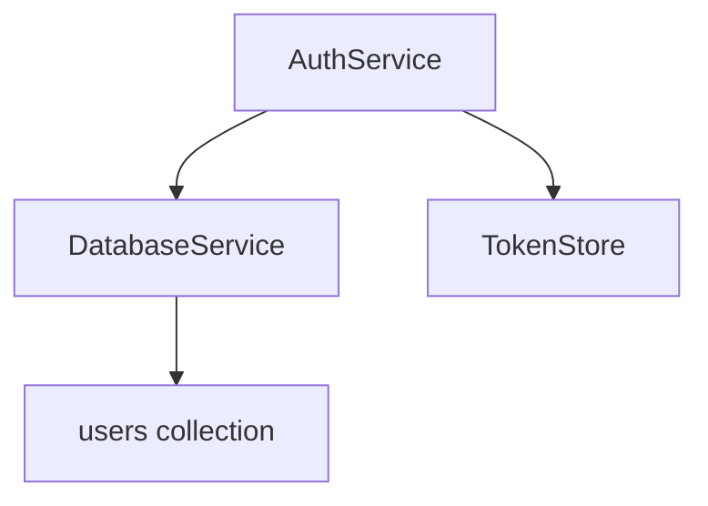
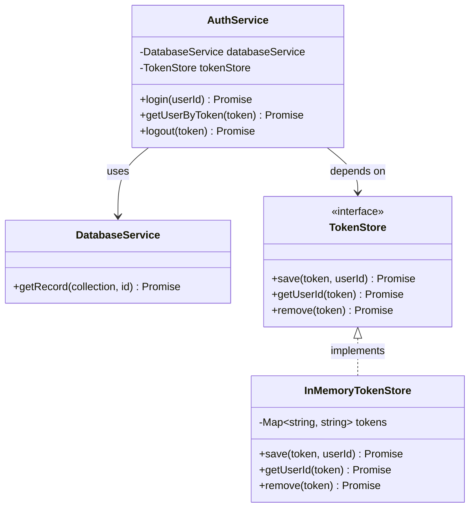

## Auth 설계하기

개발용 목서버에서 실제 서비스 수준의 인증 시스템을 구현하지 않고도, 클라이언트에서 사용하는 로그인과 인증 흐름을 테스트할 수 있도록 Auth 기능을 추가했다.

1. 로그인 요청을 보낸다.
2. access token을 발급받는다.
3. Authorization 헤더에 token을 실어 요청한다.
4. 현재 로그인된 유저를 확인한다.
5. 로그아웃으로 token을 무효화한다.

JWT, 비밀번호, OAuth, Refresh Token, 보안 같은 기능은 의도적으로 제외했다. 프로덕션 인증 로직을 구현하려는 글이 아니라, 개발용 Mock 서버에서 클라이언트의 로그인, 인증, 로그아웃 흐름을 확인하는 것이 목적이기 때문이다.

### 최소한의 Auth 구조

첫 단계에서는 `DatabaseService`를 그대로 사용했다. `users` 컬렉션을 만들어서 그 레코드 ID를 유저 ID로 사용해 로그인할 수 있도록 했다.

별도의 인증용 유저 저장소를 만들지 않고 기존 `DatabaseService`를 그대로 재사용했다.



`AuthService`는 `users` 컬렉션에서 유저를 확인한 뒤, 유저가 존재하면 임의의 access token을 생성한다. 인증 규칙은 `AuthService`가 책임지고 데이터 조회는 `DatabaseService`가 맡도록 역할을 나눴다.

```ts
export class AuthService {
  // ...
  async login(
    userId: string
  ): Promise<{ accessToken: string; user: StoredRecord }> {
    try {
      const user = await this.databaseService.getRecord("users", userId);
      const accessToken = randomUUID();
      await this.tokenStore.save(accessToken, user.id);
      return { accessToken, user };
    } catch (error) {
      if (error instanceof RecordNotFoundError) {
        throw new UserNotFoundError(userId);
      }
      throw error;
    }
  }
}
```

`AuthService` 입장에서는 DB 구현의 세부사항보다 '로그인하려는 유저가 존재하는가?'라는 의미에 집중할 수 있어야 한다. 

그래서 DB에서 발생하는 `RecordNotFoundError`를 그대로 노출하지 않고 인증 도메인의 `UserNotFoundError`로 변환했다.

## 토큰 발급하기(로그인)

클라이언트에서 실제 로그인 요청과 비슷한 흐름을 테스트할 수 있도록 `/auth/login`을 추가했다.

```http
POST /auth/login
Content-Type: application/json
{
  "userId": "1"
}
```

요청이 들어오면, access token을 생성하고, 생성된 access token과 유저 정보를 리턴한다.

```json
{
  "accessToken": "<generated-token>",
  "user": {
    "id": "1",
    "data": {
      "name": "Bob",
      "email": "bob@example.com"
    }
  }
}
```

### TokenStore를 별도의 저장소로 분리하기

처음에는 access token과 로그인된 `storedRecord`를 저장하는 `TokenStore` 인터페이스를 추가하는 방식으로 구현되었다. 

```ts
export interface TokenStore {
  save(token: string, user: storedRecord): Promise<void>;
  getUserId(token: string): Promise<string | undefined>;
}
```

하지만 이 경우 같은 유저 데이터가 `DatabaseService`와 `TokenStore` 양 쪽에 존재하게 된다. 유저 데이터가 수정되면 `TokenStore`가 가지고 있는 복사본과 DB에 있는 원본이 어긋날 수도 있고, 관리가 힘들어진다.

그래서 `DatabaseService`에서 관리하는 `users` 컬렉션에 저장된 유저 데이터를 Source of Truth로 두고, `TokenStore`는 `token`과 `userId` 사이의 관계만 저장하게 하여 책임을 명확하게 분리했다.

```ts
export interface TokenStore {
  save(token: string, userId: string): Promise<void>;
  getUserId(token: string): Promise<string | undefined>;
}
```

토큰으로 유저를 조회할 때도, DB에 있는 `users` 컬렉션 데이터를 기준으로 가져와서 일관성이 보장된다.

## 유저 확인 (me)

access token으로 현재 로그인된 유저를 조회할 수 있는 엔드포인트도 추가했다. 

```http
GET /auth/me
Authorization: Bearer <access-token>
```

### Bearer Token 인증 추가

HTTP 레이어에서 Authorization 헤더를 읽고 Bearer Token을 추출하는 헬퍼 함수를 추가했다.

이 함수는 HTTP 헤더를 해석하는 책임이 있는 라우터에 두었다. `AuthService`는 HTTP 요청 형식을 알 필요 없이 전달받은 토큰을 이용해 인증 로직만 처리해야한다.

```ts
function extractBearerToken(authHeader: string | undefined): string | null {
  if (!authHeader) {
    return null;
  }
  const parts = authHeader.trim().split(" ");
  if (parts.length !== 2 || parts[0]?.toLowerCase() !== "bearer") {
    return null;
  }
  return parts[1]!;
}
```

### 라우터에서 정상/비정상 판단 로직 책임을 분리하자

에이전트가 작성한 코드에서 레이어간 분리가 되지 않은 부분이 있었다. 토큰이 없는 경우에 401 에러, 정상적인 경우에는 `userId` 값을 줘야 하는 상황이었다.

```ts
async getUserByToken(token: string): Promise<StoredRecord | undefined> {
  const userId = await this.tokenStore.getUserId(token);
  if (!userId) {
    return undefined;
  }
  // ...
}
```

에이전트는 `userId`가 존재하지 않음을 `undefined`를 리턴하는 방식으로 구현했다. 이런 코드는 라우터가 '`undefined`는 비정상' 이라는 구분 방식을 알아야 하므로 서비스 <-> 라우터간 분리가 엄밀하지 않다. 

```ts
router.get("/me", async (req, res) => {
  // ...
  try {
    const user = await authService.getUserByToken(token);
    if (!user) {
      res.status(401).json({ error: "unauthorized" });
      return;
    }
    res.json(user);
  }
  // ...
});
```

정상/비정상은 구분하는 책임은 라우터가 아닌 `AuthService`에 있어야 한다. 그래서 `undefined`를 리턴하는 대신 `InvalidTokenError`를 던지도록 수정했다.

```ts
async getUserByToken(token: string): Promise<StoredRecord> {
  const userId = await this.tokenStore.getUserId(token);
  if (!userId) {
    throw new InvalidTokenError();
  }
  // ...
}
```

비정상 상황에서는 에러를 던지기 때문에, `AuthService`에서 반환한 `users`는 정상임이 보장된다. 즉, 라우터가 리턴 값을 판별할 책임이 사라진다.

```ts
router.get("/me", async (req, res) => {
  // ...
  try {
    const user = await authService.getUserByToken(token);
    res.json(user);
  }
  // ...
});
```

## 토큰 삭제하기(로그아웃)

로그아웃은 구현하지 않아도 되나 생각했지만, 앱에서 로그아웃하면 뷰 전환과 인증 상태 갱신이 함께 일어나므로 그 흐름도 검증할 필요가 있었다.

```http
POST /auth/logout
Authorization: Bearer <access-token>
```

정상적인 요청은 토큰을 제거하고 204 No Content를 반환한다.

### Service / 

`AuthService`에서 logout을 하면 단순히 토큰을 삭제하는 정도로 구현했다.

```ts
async logout(token: string): Promise<void> {
  await this.tokenStore.remove(token);
}
```

`TokenStore`에는 `token`을 제거하는 메서드 요구사항을 추가했다.

```ts
export interface TokenStore {
  save(token: string, userId: string): Promise<void>;
  getUserId(token: string): Promise<string | undefined>;
  remove(token: string): Promise<void>;
}
```

로그아웃된 토큰으로 다시 `/auth/me`를 호출하면 `TokenStore`에서 유저 ID를 찾을 수 없기 때문에 `InvalidTokenError`가 발생하고 최종적으로, 401 Unauthorized가 된다.

## in-memory 구현체

개발 도중에는 in-memory 구현체를 사용했다. `Map`에서 get/set/delete 3개만 쓰면 되는 아주 간단한 구현체다.

```ts
export class InMemoryTokenStore implements TokenStore {
  private readonly tokens = new Map<string, string>();

  async save(token: string, userId: string): Promise<void> {
    this.tokens.set(token, userId);
  }
  async getUserId(token: string): Promise<string | undefined> {
    return this.tokens.get(token);
  }
  async remove(token: string): Promise<void> {
    this.tokens.delete(token);
  }
}
```

## 정리

이번 구현에서는 프로덕션 수준의 인증 시스템을 만드는 대신, 개발용 Mock 서버에서 클라이언트의 로그인과 인증 상태 변화를 확인할 수 있는 최소한의 Auth 구조를 만드는 데 집중했다.

- `AuthService`는 로그인, 토큰 검증, 로그아웃과 같은 인증 규칙을 처리한다.
- `DatabaseService`는 `users` 컬렉션의 유저 데이터를 조회한다.
- `TokenStore`는 token과 `userId`의 관계만 저장한다.
- Router는 HTTP 헤더를 해석하고, 서비스에서 발생한 결과를 HTTP 응답으로 변환한다.

이번 작업에서는 OpenCode의 big-pickle 에이전트를 사용했다. 전체적인 모듈 구조와 구현 결과는 생각보다 괜찮았지만, 계층 사이의 책임이 조금씩 섞이는 부분은 직접 리뷰하고 수정할 필요가 있었다.

처음 구현에서는 TokenStore에 유저 데이터를 함께 저장하거나, 유효하지 않은 토큰을 `undefined`로 반환해 라우터가 정상/비정상을 직접 판단하는 부분이 있었다.

코드리뷰 과정에서 이런 부분을 수정해 유저 데이터의 Source of Truth는 `DatabaseService`로 한정하고, 인증 성공 여부는 `AuthService`가 판단하도록 책임을 정리했다.

최종 코드에서 어떤 객체가 어떤 판단을 해야 하는지를 확인하는 과정은 중요하다. 코드리뷰 하면서 생각보다 에이전트가 실수한 부분을 잡아내는게 재밌었다. 아직까지는...

## Auth 클래스 다이어그램


