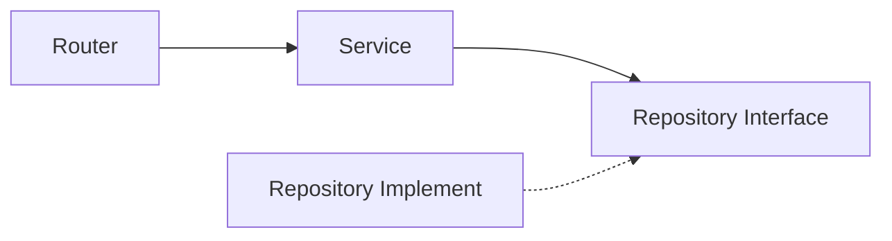

## 도커라이징

영속성까지 추가했으므로 이제 서버를 하나의 실행 단위로 묶을 차례다.

지금까지는 로컬에서 Node.js를 설치하고, 의존성을 설치하고, TypeScript를 빌드한 다음 서버를 실행했다. 혼자 개발할 때는 큰 문제가 없지만, 이 서버를 다른 환경에서 실행하려면 매번 같은 준비 과정을 반복해야 한다.

도커라이징은 이 과정을 이미지 안에 고정하는 작업이다. 이 프로젝트에서는 Express 서버를 빌드하고, 실행에 필요한 파일만 담은 뒤, `.data` 디렉터리를 기준으로 데이터를 유지할 수 있도록 구성했다.

### Dockerfile 작성하기

Dockerfile은 두 단계로 나눴다.

```dockerfile
FROM node:24-alpine AS build
WORKDIR /app
COPY package.json package-lock.json ./
RUN npm ci
COPY tsconfig.json tsconfig.build.json ./
COPY src ./src
RUN npm run build
```

첫 번째 `build` 단계에서는 개발 의존성을 포함해서 설치하고 TypeScript를 빌드한다. `npm run build`를 실행하면 `dist` 디렉터리가 만들어진다.

```dockerfile
FROM node:24-alpine AS runtime
WORKDIR /app
ENV NODE_ENV=production PORT=3000
COPY package.json package-lock.json ./
RUN npm ci --omit=dev
COPY --from=build /app/dist ./dist
RUN mkdir -p /app/.data && chown -R node:node /app
USER node
EXPOSE 3000
HEALTHCHECK --interval=30s --timeout=5s --start-period=5s --retries=3 \
  CMD wget --quiet --output-document=- http://127.0.0.1:${PORT}/system/status || exit 1
CMD ["node", "dist/index.js"]
```

두 번째 `runtime` 단계에서는 서버 실행에 필요한 것만 다시 설치한다. 여기서는 `npm ci --omit=dev`를 사용해서 TypeScript, Vitest, tsx 같은 개발용 의존성은 제외했다. 최종 이미지에는 빌드 결과물인 `dist`와 production dependency만 들어간다.

처음에는 그냥 하나의 이미지 안에서 의존성 설치, 빌드, 실행을 모두 해도 되지 않나 싶었다. 하지만 그렇게 하면 실제 실행에는 필요 없는 개발 도구까지 이미지에 남는다. 이 서버는 작은 개발용 서버이지만, 그래도 실행 환경과 빌드 환경은 분리하는 것이 더 깔끔하다고 판단했다.

### 데이터 디렉터리 준비하기

이 서버는 기본적으로 `.data` 디렉터리에 JSON 데이터와 파일을 저장한다. 이전 글에서 추가한 JSON 기반 영속성이 바로 이 디렉터리를 사용한다.

컨테이너 안에서도 같은 경로를 사용할 수 있도록 Dockerfile에서 `/app/.data`를 만들었다.

```dockerfile
RUN mkdir -p /app/.data && chown -R node:node /app
USER node
```

컨테이너를 root로 실행하지 않기 위해 `node` 유저로 전환했다. 이때 `.data` 디렉터리에 쓸 수 있어야 하므로 `/app`의 소유권도 `node` 유저로 바꿨다.

실행할 때는 호스트의 `.data`를 컨테이너의 `/app/.data`에 연결한다.

```bash
docker run --rm \
  -p 3000:3000 \
  -v "$(pwd)/.data:/app/.data" \
  devbox-light-server:local
```

컨테이너 내부 파일 시스템만 사용하면 컨테이너를 지웠을 때 데이터도 같이 사라진다. 이 프로젝트에서 영속성을 추가한 이유가 서버를 재시작해도 데이터를 유지하기 위함이었으므로, 컨테이너 실행에서도 볼륨 연결이 필요하다.

### Healthcheck 추가하기

이미지에는 healthcheck도 추가했다.

```dockerfile
HEALTHCHECK --interval=30s --timeout=5s --start-period=5s --retries=3 \
  CMD wget --quiet --output-document=- http://127.0.0.1:${PORT}/system/status || exit 1
```

이미 만들어둔 System 모듈의 `/system/status` 엔드포인트를 사용했다. 처음에 System 모듈을 만들 때는 거의 예제용 기능처럼 느껴졌는데, Docker healthcheck에 붙이고 나니 서버가 살아있는지 확인하는 기본 엔드포인트로 자연스럽게 쓰였다.

### .dockerignore 작성하기

이미지를 만들 때 프로젝트 전체를 그대로 Docker 빌드 컨텍스트로 넘길 필요는 없다.

`node_modules`는 이미지 안에서 `npm ci`로 다시 설치한다. `dist`도 이미지 안에서 직접 빌드한다. `.data`는 로컬 실행 중에 만들어지는 데이터이므로 이미지에 포함하면 안 된다.

특히 `.data`를 제외하는 것이 중요하다. 이 디렉터리는 서버의 런타임 데이터이지 애플리케이션 코드가 아니다. 이미지에 데이터가 섞이면, 이미지를 빌드한 시점의 로컬 데이터까지 같이 배포될 수 있다.

### GitHub Container Registry로 올리기

마지막으로 GitHub Actions에서 이미지를 빌드하고 GitHub Container Registry에 올리도록 했다.

```yaml
docker-publish:
  runs-on: ubuntu-latest
  needs: test
  if: github.event_name == 'push'
  permissions:
    contents: read
    packages: write
```

`docker-publish` 작업은 `test` 작업이 끝난 뒤에만 실행된다. PR에서는 테스트와 빌드만 확인하고, `main` 브랜치에 push될 때만 이미지를 publish한다.

```yaml
tags: |
  ghcr.io/${{ github.repository_owner }}/devbox-light-server:${{ steps.vars.outputs.short_sha }}
  ghcr.io/${{ github.repository_owner }}/devbox-light-server:main
```

태그는 두 개를 사용했다. 하나는 짧은 커밋 SHA이고, 하나는 `main`이다.

`main` 태그는 최신 main 이미지를 간단하게 실행할 때 편하다. 반면 특정 시점의 이미지를 다시 실행하거나 문제를 확인하려면 커밋 SHA 태그가 필요하다. 그래서 둘 다 붙였다.

CI가 다 돌아가면 GHCR에 올라간 것을 확인할 수 있다.



## MVP를 마무리하며

이번 편에서 도커라이징까지 마치면서 devbox-light-server의 MVP를 완성했다. 이 프로젝트를 시작한 목적은 앱을 만들 때 Supabase나 Firebase에 곧바로 의존하지 않고, 가볍게 붙여서 개발한 뒤 필요한 시점에 구체적인 저장 방식을 선택해보는 것이었다.

처음에는 DB, 파일, 인증 요청 정도만 생각하고 Express로 시작했다. 백엔드와 Express, TypeScript를 모두 처음 접하는 상태였기 때문에 미들웨어 구조도 제대로 이해하지 못한 상태였다. 

아키텍처에서는 시작 부분, 특히 System 기능을 구현할 때는 'CRUD 서버면 그냥 하나의 거대한 레포지토리 아닌가?' 라는 생각에 유즈케이스와 레포지토리의 경계를 구분하지도 않았다. 결국 DB0 기능부터는 Service 레이어라는 유즈케이스의 묶음을 추가했다.

이 서버의 아키텍처는 딱히 특정 아키텍처를 사용한 것은 아닌데, 완전히 새로운 것은 아니다. 뷰 이벤트가 HTTP로 전달되는 느낌 아닌가? 라는 생각에 기존 개발 경험을 서버에 대입하고, 여러 아키텍처의 패턴을 조합한 것에 가깝다. 



서버를 구현하면서 과정을 통해 가장 많이 고민한 문제는 바로 '레이어의 경계를 어디에 둘 것 인가?' 였다. 

구체적인 서버 구현을 클라이언트에 숨기기 위해서 변수명부터 고민을 많이 했는데, `Collection`이라는 이름을 선택한 것도 특정 데이터베이스 모델을 애플리케이션에 드러내지 않기 위해서였다. 최소한 `Table` 보다는 낫다고 생각했다.

영속성과 도커라이징을 거치면서 이 구조가 실제로 유효한지도 확인했다. DB, 토큰, 파일 저장소를 추가했지만 서비스와 라우터에는 저장 방식의 변화가 전달되지 않았다. 의존성 조립부에서 구현체를 선택하는 것만으로, 저장 방식을 변경할 수 있었다.

MVP 이후에는

- 페이지네이션
- multipart/form-data 업로드

정도를 생각하고 있다. 일단 MVP가 완성되었으니 쓸 일이 생기면 써보고 천천히 기능을 추가해보자.
