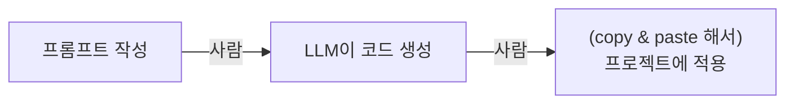

## AI 에이전트에게 프로젝트를 설명하기

예전에는 LLM을 이용해 코드를 작성하려면 필요한 기능을 설명하고, 프로젝트의 구조나 현재 상황을 프롬프트로 설명해야 했다. 즉, 프로젝트와 LLM의 API가 사람이었다...



반면 Codex나 Claude Code 같은 코딩 에이전트는 프로젝트의 파일을 직접 탐색하고 기존 코드를 분석하면서 작업에 필요한 컨텍스트를 스스로 수집한다.

하지만 코드만으로 프로젝트의 모든 것을 알 수 있는 것은 아니다. 프로젝트의 규모가 작거나 코드에 충분한 단서가 없다면 의도를 추론하기 어렵고, 반대로 규모가 커질수록 필요한 정보를 찾기 위해 더 많은 코드를 탐색하고 컨텍스트로 사용해야 한다. 

무엇보다 아키텍처를 선택한 이유나 개발 과정에서 정한 규칙과 정책처럼 코드만으로는 명확하게 드러나지 않는 정보도 있다.

매번 컨텍스트 공백을 프롬프트로 설명하는 것도 비효율적이다. 따라서 에이전트에게 반복해서 전달해야 하는 프로젝트의 컨텍스트 역시 미리 정의해두고 필요할 때 사용할 수 있다. 재사용할 수 있는건 재사용하자.

## AGENTS.md

[AGENTS.md 사이트](https://agents.md)에선 `AGENTS.md`를 *README for agents*라고 소개한다.

> README.md files are for humans: quick starts, project descriptions, and contribution guidelines.
>
> AGENTS.md complements this by containing the extra, sometimes detailed context coding agents need: build steps, tests, and conventions that might clutter a README or aren’t relevant to human contributors.

`README.md`와 가장 큰 차이는 문서를 읽는 대상이다. `README.md`가 사람을 위한 문서라면, `AGENTS.md`는 AI 코딩 에이전트를 위한 문서다.

따라서 프로젝트 소개나 사용 방법처럼 사람에게 필요한 정보는 `README.md`에 작성하고, 빌드 및 테스트 방법, 코딩 규칙처럼 에이전트가 작업하면서 알아야 할 세부적인 정보는 `AGENTS.md`에 작성할 수 있다.

LLM은 자연어를 추론하므로 복잡한 포맷이 존재하지 않는다. `AGENTS.md`는 이름 그대로 일반적인 Markdown 파일이며 정해진 필수 항목이나 구조도 없다.

### AGENTS.md 작성하기

일단 가상 프로젝트의 컨벤션과 도메인을 나열한 문서에서 시작해보자. 

프로젝트 루트에 다음과 같은 상태의 `AGENTS.md`가 있다고 가정한다.

- Project: 프로젝트 설명, 기술 스택 나열
- Coding Rules: 코딩 컨벤션
- SwiftUI: 뷰 작성 규칙, 특정 뷰 정의
- Concurrency: 동시성 관련 규칙
- Testing: 테스트 방법론, 검증 절차 정의
- Adding a Feature: 기능을 추가할 때 작업 순서 정의
- Git: 깃 관련 컨벤션, 커밋 규칙, 푸시 규칙

이렇게 작성해도 에이전트에게 의도를 전달하는 데는 문제가 없다. 하지만 자세히 보면 성격이 전혀 다른 지침들이 하나의 파일에 섞여 있다. 

프롬프트를 수행할 때 `AGENTS.md`에 작성된 모든 내용이 항상 필요한 것은 아니다. 예를 들어 SwiftUI 코드를 수정하는 작업에 Git Conventional Commits 규칙은 거의 필요하지 않다. 

하지만 하나의 `AGENTS.md`에 모두 작성해두면, 작업과 관계없는 부분까지 에이전트에게 함께 제공될 수 있다. 다행히 여러 코딩 에이전트는 이러한 컨텍스트들을 역할이나 스코프에 따라 나눠 관리할 수 있는 기능을 제공한다. 


코딩 에이전트마다 Rules, Skills, Workflows 같은 기능의 이름과 동작 방식은 서로 다를 수 있다. 같은 이름이라도 의미가 완전히 같다고 가정하면 안 된다.

예를 들어 Codex의 `.codex/rules/`는 코딩 규칙을 작성하는 곳이 아니라, 에이전트가 sandbox 외부에서 실행할 수 있는 명령을 제어하기 위한 실행 정책이다. 반면 Antigravity의 `.agent/rules/`는 코드 작성 방식이나 에이전트의 동작에 대한 규칙을 정의하는 용도로 사용된다.

그래서 이 글에서는 특정 서비스에만 존재하는 기능은 의도적으로 제외하고, 여러 코딩 에이전트에서 공통적으로 사용되는 `AGENTS.md`와 Skill을 중심으로 설명한다. 

구체적인 파일 경로나 동작 방식은 OpenAI Codex를 기준으로 하며, 다른 에이전트에서는 해당 서비스의 문서를 확인해야 한다.


## 전처리: 진짜 에이전트가 알아야 하는 정보인가?

`AGENTS.md`를 분리하기 전에 먼저 확인할 것이 있다. 우리가 작성한 내용이 정말 에이전트에게 제공해야 하는 정보인가?

### LLM을 다시 가르칠 필요는 없다.

LLM이 이미 충분히 알고 있을 법한 일반적인 내용을 프로젝트의 `AGENTS.md`에서 다시 설명할 필요는 없다. 

프로젝트에서 강조하는 내용에 따라 달라질 수 있겠지만, 일반적으로 다음과 같은 것들을 예시로 들 수 있다.

- immutable 해야 한다면 변수가 아닌 상수로 선언한다.
- 불필요한 추상화를 피한다.
- MVVM은 ...아키텍처고, View와 ViewModel은 ... 역할을 한다.

이런 일반적인 원칙까지 모두 작성하기 시작하면 `AGENTS.md`는 끝없이 길어진다...


LLM이 무엇을 "충분히 알고 있다"고 볼지는 명확한 기준이 없다. 따라서 처음부터 많은 내용을 제거하기보다, 우선 지나치게 일반적인 설명부터 걷어내는 편이 안전하다.

또한 `AGENTS.md`는 고정된 문서가 아니라 프로젝트와 에이전트의 작업 결과에 따라 계속 수정되는 문서다. 에이전트가 특정 내용을 반복해서 잘못 이해하거나 프로젝트의 중요한 결정을 놓친다면, 그때 필요한 정보를 추가하면 된다.

프로젝트의 구조와 정책이 일관되게 유지되고 있다면 이렇게 추가되는 내용도 기존 코드와 크게 충돌하지 않을 가능성이 높다.


에이전트에게 필요한 것은 코드 작성을 다시 가르치는 문서가 아니라, 코드만으로 알기 어려운 이 프로젝트만의 구조, 도메인, 정책이다.

### 자동화할 수 있는 것은 자동화하기

LLM보다 자동화 툴이 더 잘하는 영역도 있다.

- 코드 스타일과 포맷팅 -> Linter
- 커밋 전 검사 -> Git Hook
- 빌드, 테스트, 정적 분석 통과 여부 -> CI/CD

별도의 컨텍스트 없이 기계적으로 검사할 수 있는 규칙은 `AGENTS.md`에 작성해 LLM에게 추론시키기보다, 해당 규칙이 정의된 도구를 실행하는 편이 더 정확하고 확실하다. 

규칙 자체는 Linter나 CI/CD가 검증하고, 필요한 경우 에이전트가 해당 도구를 실행하도록 안내할 수 있다. 필요하다면 Git Hook이나 CI/CD에 연결해 에이전트가 규칙을 기억하는지와 관계없이 항상 검증되도록 만들 수 있다.

즉, `AGENTS.md`에 들여쓰기, force unwrap 금지, `import` 정렬 같은 세부 규칙을 하나씩 작성하기보다는, 해당 규칙이 이미 설정된 Linter나 Formatter를 사용하도록 하는 편이 낫다.

### 전처리 결과

```
project-root/AGENTS.md

Project        ← 유지
Coding Rules   ← Linter, CI/CD로 이동
SwiftUI        ← 유지, 일부 삭제 (일반적인 내용)
Concurrency    ← 유지, 일부 삭제 (일반적인 내용)
Testing        ← 유지, 일부 삭제 (일반적인 내용)
Adding Feature ← 유지
Git            ← 유지, 일부는 .githook으로 이동
```

불필요하거나 자동화할 수 있는 내용을 제거했지만, 여전히 프로젝트 루트의 `AGENTS.md`에는 모든 작업에서 필요하지 않은 정보가 남아 있다. 이제 이들을 필요할 때만 사용할 수 있도록 분리해보자.

## AGENTS.md의 스코프 나누기

Codex는 루트의 `AGENTS.md` 하나만 사용하는 것이 아니다. 프로젝트 루트에서 현재 작업 디렉토리까지 내려가면서 각 디렉토리의 `AGENTS.md`를 찾고, 발견한 내용을 순서대로 결합한다.

따라서 프로젝트 전체에서 필요한 내용은 루트 `AGENTS.md`에 작성하고, 특정 영역에서만 필요한 내용은 해당 디렉토리의 `AGENTS.md`로 분리할 수 있다.

앞에서 가정한 `AGENTS.md`에서 테스트 항목이 다음과 같이 작성되어있다고 가정하자.

```markdown
- 새로운 테스트는 Swift Testing으로 작성한다.
- 테스트 fixture는 프로젝트에서 제공하는 방법을 사용한다.
- 성공과 실패 케이스를 함께 작성한다.
- 관련 테스트를 실행한 뒤 작업을 마무리한다.
```

이런 내용은 테스트 코드를 작성하거나 수정할 때는 필요하지만, 프로덕션 코드만 수정하는 동안에는 굳이 필요하지 않을 수 있다.

따라서 테스트 코드가 `Tests/` 아래에 모여 있다면, 테스트 코드에만 적용되는 내용 역시 해당 디렉토리의 `AGENTS.md`로 분리할 수 있다.

SwiftUI 관련 내용도 마찬가지다, 특정 기능의 뷰에서만 필요한 내용은 그 기능의 디렉토리로 분리하면 된다.

```text
project/
├── AGENTS.md
├── Sources/
│   └── SomeFeature
│       └── AGENTS.md
└── Tests/
    └── AGENTS.md
```

### AGENTS.md 스코프 분리 결과

```text
project-root/AGENTS.md

Project        ← 유지
Coding Rules   ← Linter, CI/CD로 이동
SwiftUI        ← 일부 유지, 일부 하위 AGENTS.md로 이동, 일부 삭제
Concurrency    ← 유지, 일부 삭제 (일반적인 내용)
Testing        ← 일부 Tests/AGENTS.md로 이동, 일부 삭제
Adding Feature ← 유지
Git            ← 유지, 일부는 .githook으로 이동
```

불필요한 내용을 제거하고 `AGENTS.md`의 스코프도 나누었다. 하지만 아직 특정 디렉토리에 종속되지는 않으면서, 반복해서 수행하는 작업에 필요한 지식과 방법이 루트 AGENTS.md에 남아 있다.

## Skills

`AGENTS.md`를 정리하다 보면 프로젝트의 규칙이나 컨텍스트가 아니라, 반복해서 수행하는 작업의 절차까지 포함되어 있는 경우가 있다.

`AGENTS.md`의 Adding Feature 항목이 다음과 같다고 가정하자.

```markdown
1. 관련된 기존 Feature를 탐색한다.
2. 새로운 코드가 위치할 Layer를 결정한다.
3. Domain 로직을 구현한다.
4. 테스트를 작성한다.
5. UI를 구현한다.
6. 테스트와 빌드를 실행한다.
7. 변경사항을 검토한다.
```

이것은 프로젝트에 적용되는 하나의 규칙이라기보다, 새로운 Feature를 추가하기 위한 하나의 Workflow에 가깝다.

Codex의 Skill은 이처럼 특정 작업을 수행하기 위한 지식과 절차를 재사용 가능한 형태로 만들 수 있는 기능이다. 하나의 Skill은 작업 방법을 작성하는 `SKILL.md`를 중심으로, 필요한 경우 참고 문서나 실행 가능한 스크립트나 템플릿 같은 리소스를 함께 구성할 수 있다.

또한 Skill의 전체 내용이 항상 컨텍스트에 포함되는 것은 아니다. Codex는 먼저 Skill의 이름과 설명을 확인하고, 현재 작업에 필요하다고 판단했을 때 전체 `SKILL.md`를 불러온다. 사용자가 Skill을 명시적으로 호출할 수도 있다.

### Feature Skill 만들기

기존 `AGENTS.md`의 `Adding Feature`에 작성했던 내용을 별도의 Skill로 분리해보자.

Codex는 프로젝트에서 사용할 Skill을 `.agents/skills/` 아래에 둘 수 있다. 하나의 Skill은 디렉토리 단위로 구성되며, `SKILL.md`를 필수로 가진다.

```text
.agents/
└── skills/
    └── adding-feature/
        └── SKILL.md
```

`SKILL.md`에는 Skill의 이름과 언제 사용해야 하는지를 설명하는 metadata와, 실제 작업 방법을 작성한다.

```markdown
---
name: adding-feature
description: Use when adding a new feature to this project.
---

# Adding a Feature
1. Inspect related existing features.
2. Identify the appropriate layer for the new code.
3. Implement the domain logic.
4. Add or update tests.
5. Implement the UI.
6. Run the relevant tests and build the project.
7. Review the final diff.
```

에이전트는 Skill의 `description`과 현재 작업을 바탕으로 관련 Skill을 선택할 수 있다.

다만, 자동 선택 여부는 description의 내용과 작업의 일치 정도에 따라 달라지므로, 자동 호출을 전제로 하기보다 언제 사용해야 하는지와 범위를 description에 명확하게 작성해야 한다. 프롬프트에서 Skill을 직접 명시해 호출하는 것도 가능하다.

### Skill 분리 결과

```
project-root/AGENTS.md

Project        ← 유지
Coding Rules   ← Linter, CI/CD로 이동
SwiftUI        ← 일부 Skill, 일부 하위 AGENTS.md로 이동, 일부 삭제
Concurrency    ← 일부 Skill, 일부 삭제 (일반적인 내용)
Testing        ← 일부 Skill, 일부 Tests/AGENTS.md로 이동, 일부 삭제
Adding Feature ← Skill
Git            ← 유지, 일부는 .githook으로 이동
```

Git 관련 내용은 Skill로 분리하지 않았다. Conventional Commits처럼 프로젝트 전체에서 지속적으로 적용되는 간단한 규칙은 루트 `AGENTS.md`에 남길 수 있다. (`AGENTS.md`에 고정된 정답은 없다.)

다만, 커밋 절차 자체가 복잡한 Workflow로 발전한다면 별도의 Skill로 분리할 수도 있다.

## 최종적인 에이전트 설정 구조

지금까지 하나의 `AGENTS.md`에 섞여 있던 내용을 성격에 따라 정리했다. 최종적인 프로젝트 구조는 다음과 같다.

```text
project/
├── AGENTS.md
├── Sources/
│   └── SomeFeature/
│       └── AGENTS.md
├── Tests/
│   └── AGENTS.md
├── .agents/
│   └── skills/
│       ├── adding-feature/
│       │   └── SKILL.md
│       ├── testing/
│       │   └── SKILL.md
│       ├── swiftui/
│       │   └── SKILL.md
│       └── concurrency/
│           └── SKILL.md
├── .githooks/
│   └── pre-commit
└── .github/
    └── workflows/
        └── ci.yml
```

0. Linter나 CI/CD처럼 더 정확하게 자동화할 수 있는 내용은 `AGENTS.md`에서 제거하고 각각의 도구가 검증하도록 하고, 필요한 경우에 에이전트가 그 도구를 사용하게 했다.
1. 루트의 `AGENTS.md`에는 프로젝트 전체에서 지속적으로 필요한 컨텍스트와 규칙을 남겼다. 특정 코드 영역에서만 필요한 내용은 해당 디렉토리의 `AGENTS.md`로 범위를 좁혔다.
2. adding-feature나 테스트 작성처럼 반복해서 수행하는 작업에 필요한 지식과 워크플로우는 Skill로 분리했다.

처음에는 모든 내용을 하나의 `AGENTS.md`에 작성했지만, 결과적으로 항상 필요한 컨텍스트, 특정 영역에 적용되는 컨텍스트, 특정 작업을 위한 Skill, 자동화할 수 있는 규칙으로 나눌 수 있다.

이렇게 분리하면 관리해야 할 파일과 설정은 늘어나지만, 각각의 역할과 변경 범위가 명확해진다. 테스트 정책이 바뀌면 테스트 영역만 수정하고, Feature를 추가하는 절차가 바뀌면 해당 Skill만 수정하면 된다. 코드 스타일처럼 자동화할 수 있는 규칙은 에이전트가 기억하고 있는지와 관계없이 일관되게 검증할 수 있다.

즉 약간의 구조적 복잡성을 추가하는 대신, 서로 다른 이유로 변경되는 컨텍스트와 규칙을 독립적으로 관리할 수 있게 된다.

## 결론

AI 에이전트는 프로젝트의 코드를 직접 탐색하고 많은 정보를 스스로 추론할 수 있다. 하지만 코드만으로 알기 어려운 프로젝트의 결정이나 정책도 있고, 이를 매번 프롬프트로 설명하는 것은 비효율적이다. `AGENTS.md`와 Skill을 이용하면 이런 프로젝트의 컨텍스트와 작업 방법을 재사용할 수 있다. 

처음부터 완벽한 구조를 만들 필요도 없다. 우선 프로젝트에서 에이전트가 반복해서 놓치는 결정이나 정책을 루트 `AGENTS.md`에 기록하고, 특정 디렉토리나 작업에만 필요한 내용이 생겼을 때 하위 `AGENTS.md`나 Skill로 분리하면 된다. 이후 실제 작업 결과를 보면서 불필요한 지침은 제거하고, 반복되는 실수와 검증 절차는 보완하는 방식이 현실적이다.

다만 컨텍스트를 분리한다고 해서 파일을 계속 추가하는 것이 항상 좋은 것은 아니다. 지침이 많아질수록 관리 비용이 커지고 서로 충돌할 가능성도 높아진다.

분리의 목적은 작업 효율을 높이는 데 있다. 지침이 서로 충돌하거나 모순된다면, 오히려 분리하지 않은 것보다 못한 결과를 만들 수 있다.

따라서 새로운 `AGENTS.md`나 Skill을 추가할 때마다, 그것이 실제로 코드 작성의 효율과 품질을 높이는지가 가장 중요하다.

## 레퍼런스

- [AGENTS.md - Why AGENTS.md?](https://agents.md)
- [Configuration Smells in AGENTS.md Files: Common Mistakes in Configuring Coding Agents](https://arxiv.org/abs/2606.15828)
- [OpenAI Codex - Custom instructions with AGENTS.md](https://developers.openai.com/codex/guides/agents-md)
- [OpenAI Codex - Build skills](https://developers.openai.com/codex/skills)
- [OpenAI Codex - Rules](https://developers.openai.com/codex/rules)
