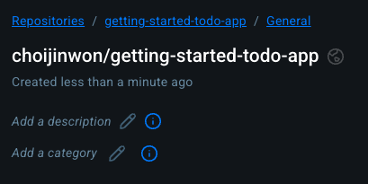
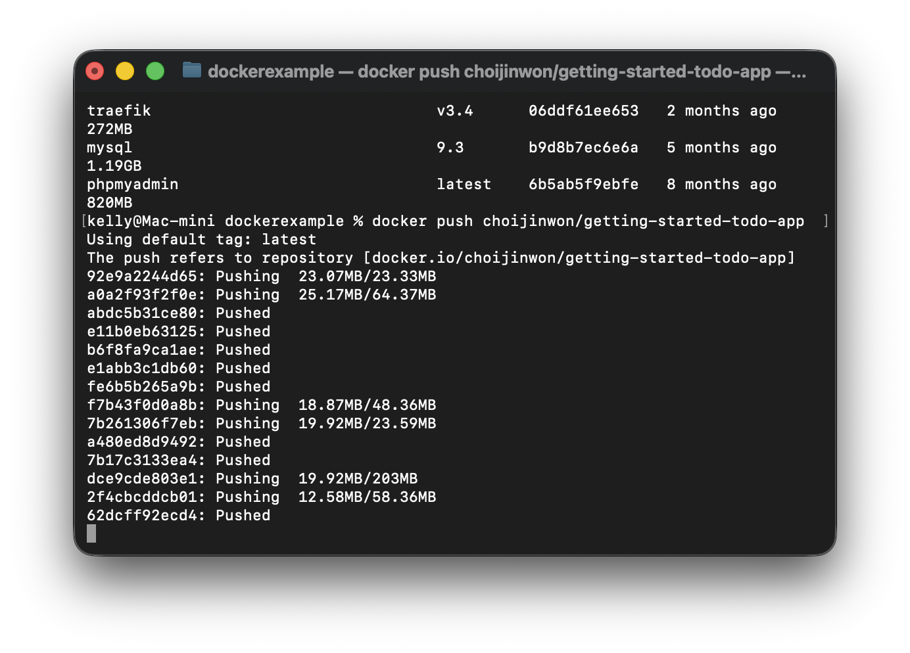

## 사전준비하기 & Docker Hub

### Docker Hub

Docker 이미지를 공유하기 위해서는 이미지를 저장할 공간이 필요하고, 이 때 Docker Hub가 이미지 저장소로 사용된다. 다른 사람들이 올린 이미지를 검색하여 실행하거나 자신의 이미지를 기반으로 사용할 수 있는 공간을 제공한다.

### 컨테이너 이미지

컨테이너 이미지는 애플리케이션을 실행하기 위한 파일, config, 종속성을 모두 포함한 표준화된 패키지이다. 이미지를 배포하면 다른 사람과 공유할 수 있다.

## Docker Hub에 이미지 푸시하기

GitHub가 소스 코드를 저장하는 것처럼 Docker Hub는 컨테이너 이미지를 저장한다.

### Docker Hub에서 레포지토리 만들기



### 빌드하고 배포하기

1. 프로젝트 빌드하기

```bash
docker build -t <DOCKER_USERNAME>/getting-started-todo-app .
```

1. 이미지 푸시하기

```bash
docker push <DOCKER_USERNAME>/getting-started-todo-app
```


