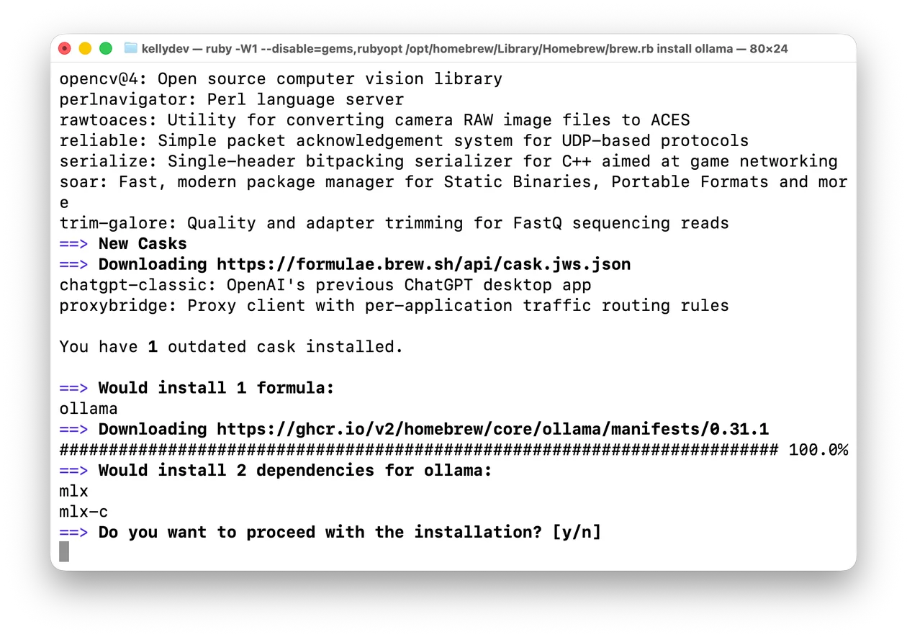
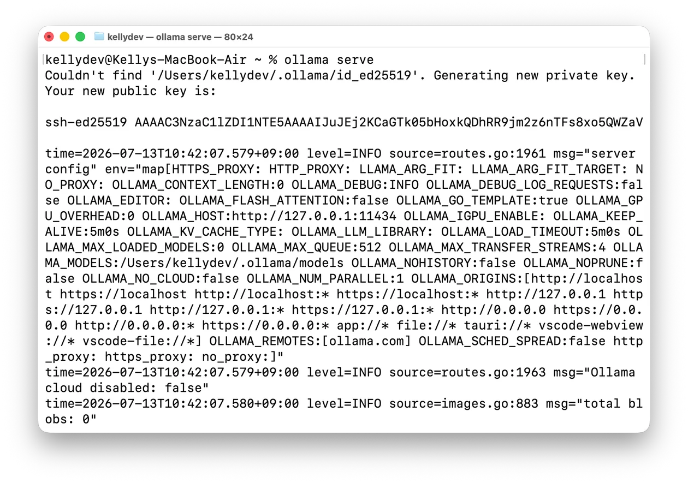
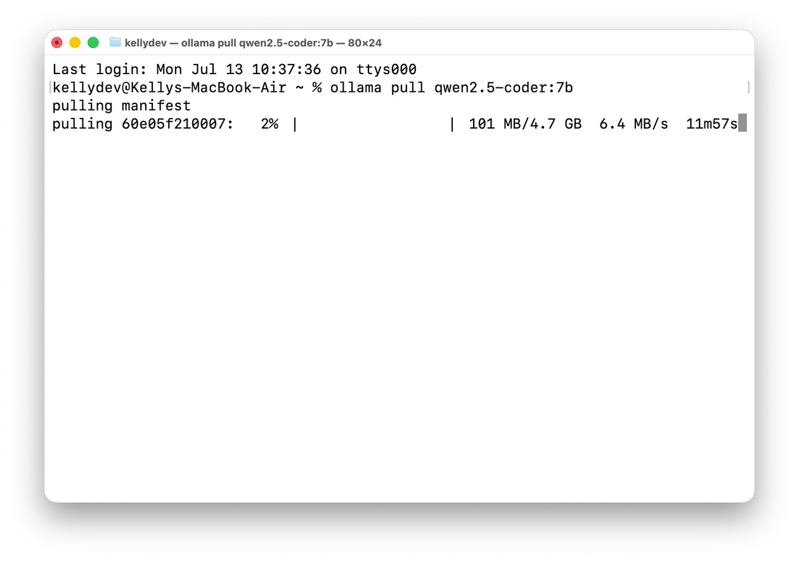
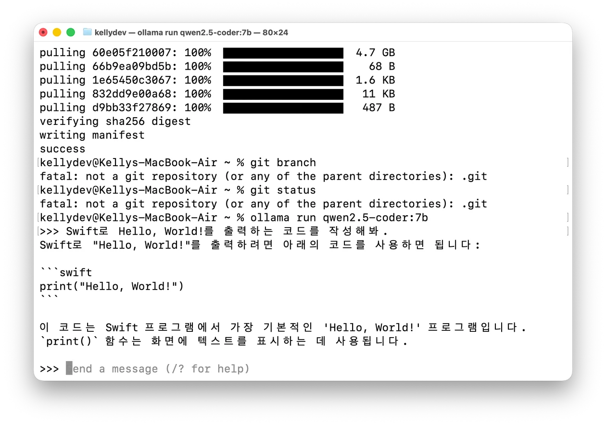

Codex는 iOS 개발할 때만 사용하고, 다른 작업은 주로 무료 모델로 처리했다.

`dev-data-server-light`를 개발할 때는 Cursor를 사용했는데, 개발 도중 사용량이 모두 소진돼 Antigravity로 옮겨야 했다.

그래서 로컬에서 직접 실행하는 LLM 환경을 찾았고, 생각보다는 쉽게 환경을 구축할 수 있었다., 맥미니에서 만족스럽게 사용하고 있다. 이번 글에서는 맥북 에어에도 같은 환경을 설치한 과정을 정리한다.

## 맥북 에어 사양


{ width="300" }

## 설치하기

### ollama 설치하고 서버 켜기

맥에서는 Homebrew로 쉽게 설치할 수 있다.

```zsh
brew install ollama
```



설치가 끝났으면 Ollama 서버를 켜야 한다. Ollama는 단순히 실행하는 앱이 아니라, 서버 형태로 동작한다.

```zsh
ollama serve
```



### 모델 pull 받아오기

여기서 컴퓨터 사양이 중요하다. 내가 쓰는 맥 미니와 맥북 에어는 둘 다 통합 메모리가 16GB라서, 14B(140억 파라미터) 모델 정도가 한계였다.

여러 모델을 찾아봤는데, qwen2.5-coder의 평이 좋아서 선택했다. 여기서는 7B 모델을 사용한다.

서버가 실행 중인 터미널과는 별도로 다른 터미널을 열어 모델을 설치한다.

```zsh
ollama pull qwen2.5-coder:7b
```



7B 모델은 대략 5GB, 14B 모델은 대략 10GB 정도다. 양자화 방식에 따라 차이는 있지만, 대략 이 정도로 보면 된다.


양자화는 모델의 파라미터를 더 적은 비트로 표현해서 메모리 사용량과 연산량을 줄이는 방식이다.


### 테스트

```zsh
ollama run qwen2.5-coder:7b
```



`ollama run <모델명>` 으로 터미널에서 바로 모델을 실행시킬 수 있다.

## 결론

이렇게 해서 맥북 에어에도 로컬 LLM 실행 환경을 설치해봤다. 학습처럼 거대한 연산이 필요한 작업은 아니지만, 추론 환경을 직접 구성해두면 사용량 제한 없이 꽤 안정적으로 활용할 수 있다.

생각보다 설치 과정도 복잡하지 않았고, 기본적인 실행 환경만 갖추면 로컬에서도 충분히 실용적으로 쓸 수 있었다. 다음에는 실제로 어떤 모델을 쓰면 좋은지, 그리고 로컬 LLM을 어떻게 활용하면 좋을지 더 정리해볼 생각이다.
