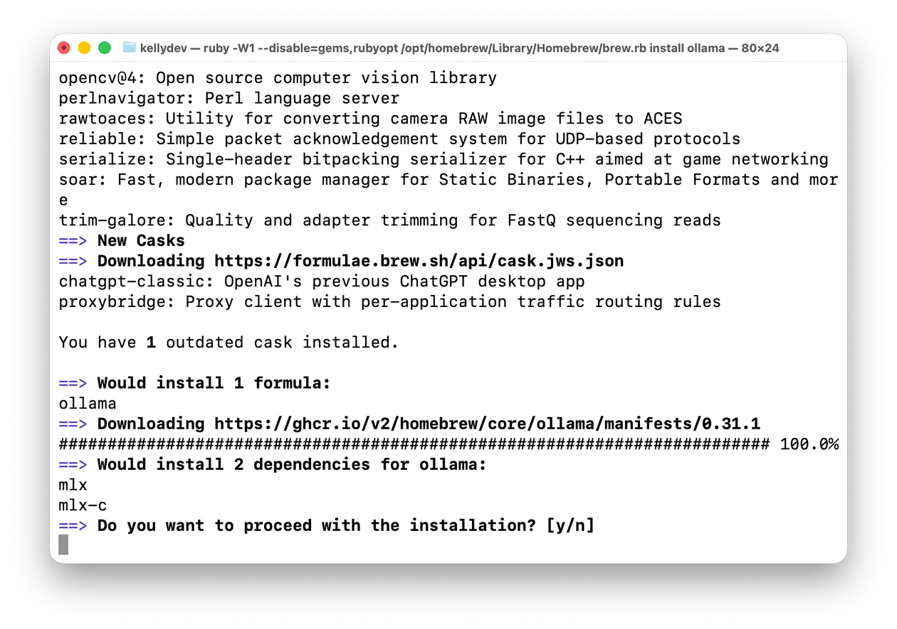
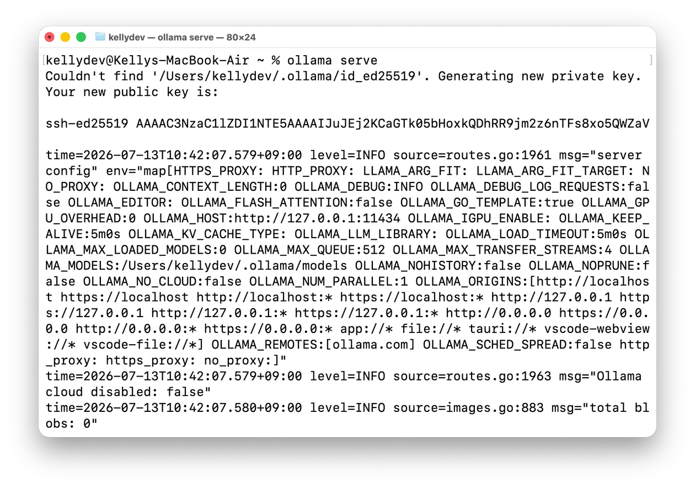
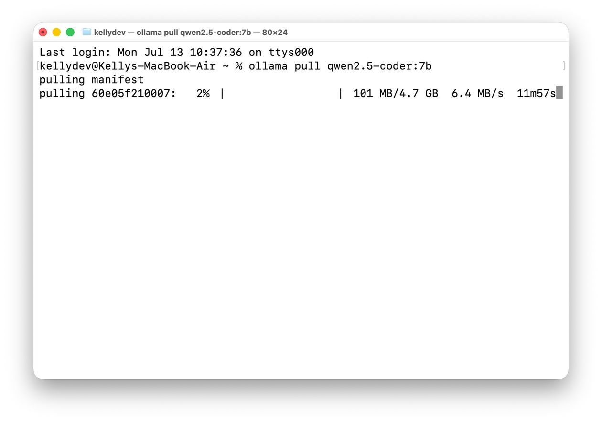
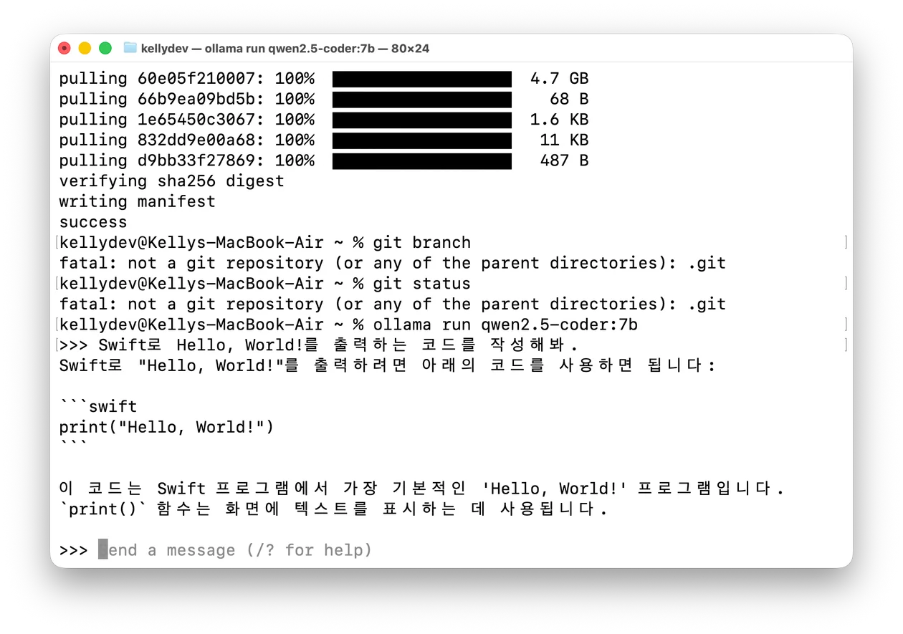
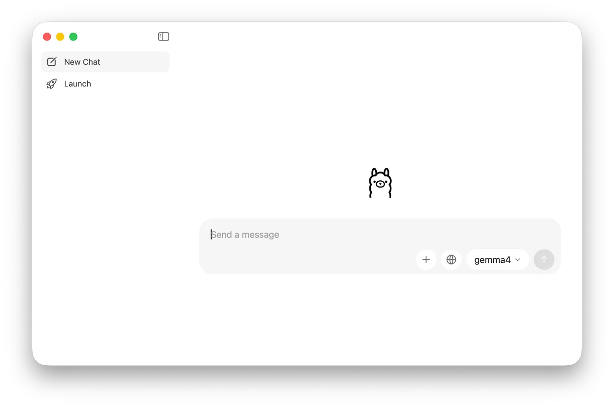
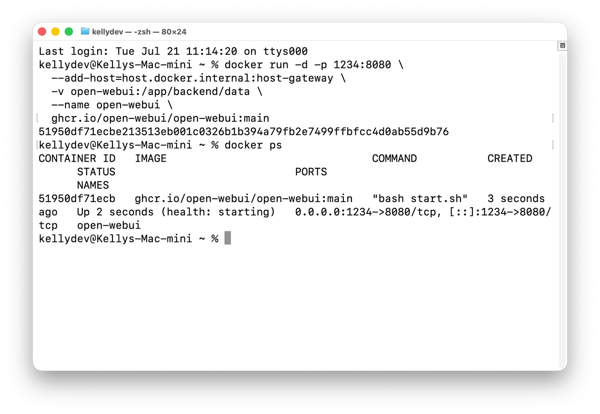
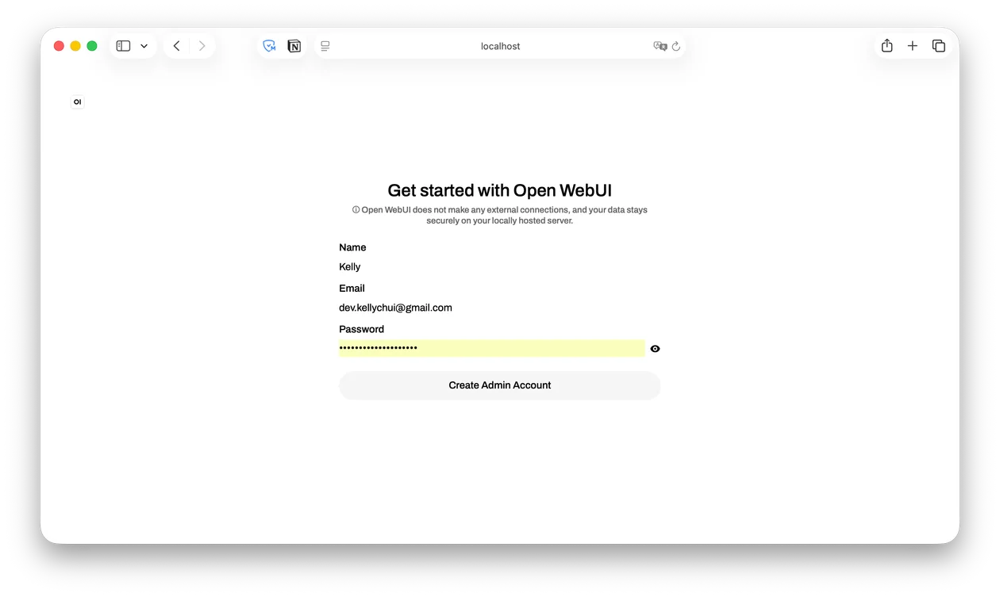

Codex는 iOS 개발할 때만 사용하고, 다른 작업은 주로 무료 모델로 처리했다.

`dev-data-server-light`를 개발할 때는 Cursor를 사용했는데, 개발 도중 사용량이 모두 소진돼 Antigravity로 옮겨야 했다.

그래서 로컬에서 직접 실행하는 LLM 환경을 찾았고, 생각보다는 쉽게 환경을 구축할 수 있었다., 맥미니에서 만족스럽게 사용하고 있다. 이번 글에서는 맥북 에어에도 같은 환경을 설치한 과정을 정리한다.

## 맥북 에어 사양


{ width="360" }

## 설치

### ollama 설치하고 서버 켜기

맥에서는 Homebrew로 쉽게 설치할 수 있다.

```zsh
brew install ollama
```



설치가 끝났으면 Ollama 서버를 켜야 한다. Ollama는 단순히 실행하는 앱이 아니라, 서버 형태로 동작한다.

```zsh
ollama serve
```



### 모델 pull 받아오기

여기서 컴퓨터 사양이 중요하다. 내가 쓰는 맥 미니와 맥북 에어는 둘 다 통합 메모리가 16GB라서, 14B(140억 파라미터) 모델 정도가 한계였다.

여러 모델을 찾아봤는데, qwen2.5-coder의 평이 좋아서 선택했다. 여기서는 7B 모델을 사용한다.

서버가 실행 중인 터미널과는 별도로 다른 터미널을 열어 모델을 설치한다.

```zsh
ollama pull qwen2.5-coder:7b
```



7B 모델은 대략 5GB, 14B 모델은 대략 10GB 정도다. 양자화 방식에 따라 차이는 있지만, 대략 이 정도로 보면 된다.


일반적으로 LLM의 파라미터는 32비트 혹은 16비트 Float 타입으로 저장된다. 이러한 파라미터를 8비트, 4비트와 같은 가벼운 타입으로 표현해 모델의 크기를 줄이는 방법이다.

예를 들어 7B 모델의 파라미터를 16비트로 저장하면 파라미터만 약 14GB가 필요하지만, 4비트로 표현하면 이론적으로 약 3.5GB까지 줄일 수 있다.

물론 모델의 정확도나 품질이 일부 떨어지는 트레이드 오프가 있지만, 메모리 사용량과 연산량을 크게 줄일 수 있기 때문에 개인용 컴퓨터에서 LLM을 실행할 때 많이 사용된다.


### 테스트

```zsh
ollama run qwen2.5-coder:7b
```



`ollama run <모델명>` 으로 터미널에서 바로 모델을 실행시킬 수 있다.

## UI

터미널에서 바로 사용할 수도 있지만, `ollama run`을 매번 입력하는 것은 번거롭다. 파일 첨부나 대화 기록 관리도 불편하다.

로컬 LLM에 기능과 편의성을 제공하는 대표적인 방법이 두 가지가 있다.

- Ollama Desktop
- Open WebUI

## Ollama Desktop

Ollama Desktop은 Ollama에서 제공하는 네이티브 GUI 앱이다. 로컬에 설치된 모델이 자동으로 연동되기 때문에 별도 설정 없이 바로 사용할 수 있다.



UI는 일반적인 LLM 서비스와 비슷하다. 모델을 선택하고 메시지를 입력하면 된다. PDF나 이미지를 드래그 앤 드롭으로 넣을 수도 있고, 컨텍스트 길이도 조절할 수 있다.

`ollama run`을 치지 않아도 되는게 큰 장점이다. GUI 자체를 자주 쓰지 않더라도, Ollama를 편하게 켜두는 용도로 쓸 만하다.

## Open WebUI

Open WebUI는 브라우저에서 사용하는 웹 기반 UI다. Docker 컨테이너로 직접 띄워야 하지만, 기능은 Ollama Desktop보다 많다.



다음 명령어로 실행할 수 있다.


```zsh
docker run -d -p 1234:8080 \
  --add-host=host.docker.internal:host-gateway \
  -v open-webui:/app/backend/data \
  --name open-webui \
  ghcr.io/open-webui/open-webui:main
```

여기서는 `1234` 포트로 접속하도록 설정했다. 다른 포트를 쓰고 싶다면 `-p 1234:8080`에서 앞쪽 숫자만 바꾸면 된다.



처음 접속하면 `Sign up` 화면이 나온다. 외부 서비스에 가입하는 것이 아니라. 내 로컬 컴퓨터 안에 띄운 Open WebUI 서비스에 로그인할 계정을 만드는 것이다. 서비스의 운영자가 나고 입력한 정보는 컨테이너 내부의 로컬 DB에 저장된다. 당연히 인터넷은 필요없다.

가장 먼저 가입한 계정이 자동으로 관리자(admin) 권한을 갖게 된다.


{ width = "360" }

같은 네트워크에 있는 다른 기기에서도 접속할 수 있다. 맥에서 컨테이너를 띄워두고, 아이패드나 다른 노트북에서 내부 IP와 포트 번호로 접속하면 된다.

## 결론

간단히 쓰려면 Ollama Desktop이 편하다. 설정이 거의 없고, 로컬에 설치된 모델을 바로 사용할 수 있다. 가장 큰 장점은 터미널을 매번 열지 않아도 된다는 점이다. 

Ollama 자체를 Docker로 띄우는 방법도 있지만, Metal 가속을 쓰기 어려워진다. 따라서 Ollama Desktop을 기본으로 사용하고 Open WebUI를 사용할지는 나중에 결정하는 것이 더 편하다.

다음에는 이렇게 띄운 로컬 LLM을 Xcode나 VS Code 같은 개발 도구에 연결해서 사용하는 방법을 정리해볼 생각이다.
