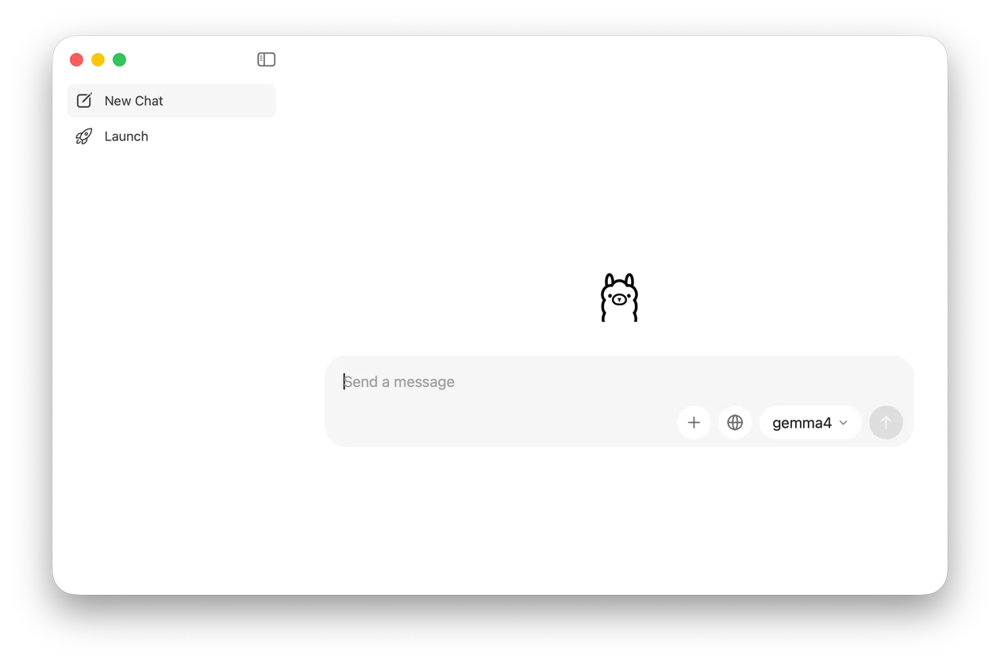
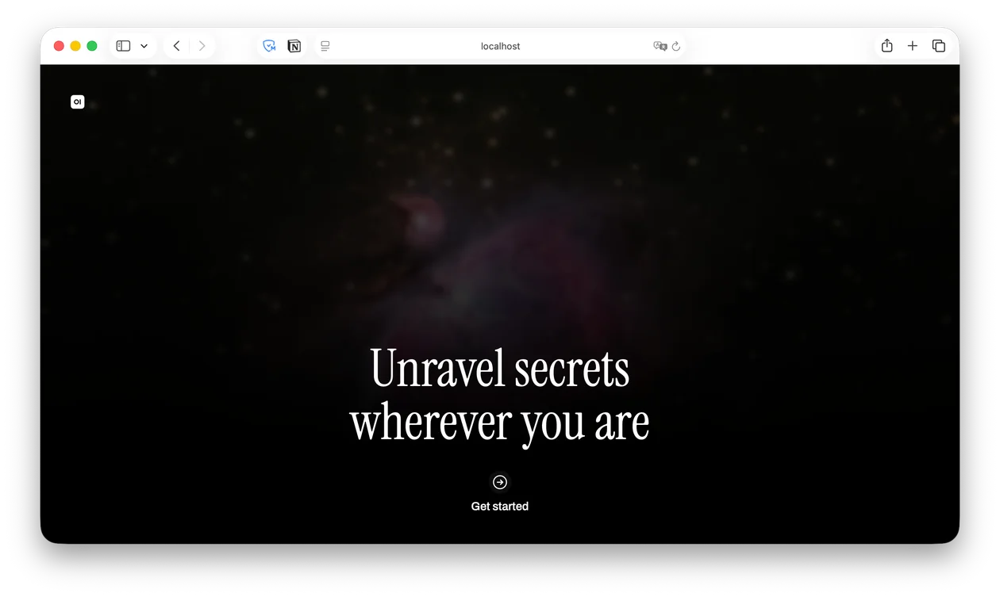
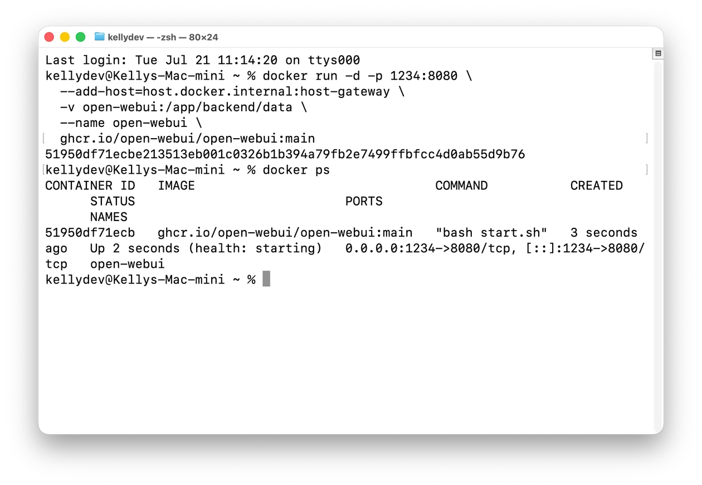
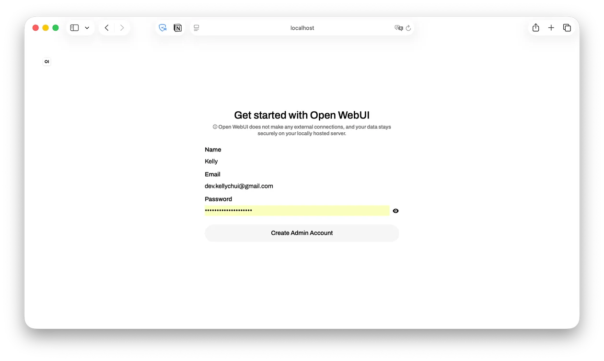

1편에서는 Ollama를 설치하고 터미널에서 로컬 LLM을 실행해봤다.

터미널에서 바로 사용할 수도 있지만, `ollama run`을 매번 입력하는 것은 번거롭다. 파일 첨부나 대화 기록 관리도 불편하다.

이번 글에서는 로컬 LLM을 조금 더 편하게 쓰기 위해 UI를 붙여본다. 대표적인 선택지는 두 가지다.

- Ollama Desktop
- Open WebUI

## Ollama Desktop

Ollama Desktop은 Ollama에서 제공하는 네이티브 GUI 앱이다. 로컬에 설치된 모델이 자동으로 연동되기 때문에 별도 설정 없이 바로 사용할 수 있다.



UI는 일반적인 LLM 서비스와 비슷하다. 모델을 선택하고 메시지를 입력하면 된다. PDF나 이미지를 드래그 앤 드롭으로 넣을 수도 있고, 컨텍스트 길이도 조절할 수 있다.

`ollama run`을 치지 않아도 되는게 큰 장점이다. GUI 자체를 자주 쓰지 않더라도, Ollama를 편하게 켜두는 용도로 쓸 만하다.

## Open WebUI

Open WebUI는 브라우저에서 사용하는 웹 기반 UI다. Docker 컨테이너로 직접 띄워야 하지만, 기능은 Ollama Desktop보다 많다.



다음 명령어로 실행할 수 있다.



```zsh
docker run -d -p 1234:8080 \
  --add-host=host.docker.internal:host-gateway \
  -v open-webui:/app/backend/data \
  --name open-webui \
  ghcr.io/open-webui/open-webui:main
```

여기서는 `1234` 포트로 접속하도록 설정했다. 다른 포트를 쓰고 싶다면 `-p 1234:8080`에서 앞쪽 숫자만 바꾸면 된다.



처음 접속하면 `Sign up` 화면이 나온다.

외부 서비스에 가입하는 것은 아니다. 내 컴퓨터 안에 띄운 Open WebUI에 로그인할 계정을 만드는 절차다. 입력한 정보는 컨테이너 내부의 로컬 DB에 저장된다.

참고로 가장 먼저 가입한 계정이 자동으로 관리자(admin) 권한을 갖게 된다.


{ width = "360" }

같은 네트워크에 있는 다른 기기에서도 접속할 수 있다. 맥에서 컨테이너를 띄워두고, 아이패드나 다른 노트북에서 내부 IP와 포트 번호로 접속하면 된다.

## 결론

간단히 쓰려면 Ollama Desktop이 편하다. 설정이 거의 없고, 로컬에 설치된 모델을 바로 사용할 수 있다.

가장 큰 장점은 터미널을 매번 열지 않아도 된다는 점이다. Ollama 자체를 Docker로 띄우는 방법도 있지만, Metal 가속을 쓰기 어려워진다.

따라서 Ollama Desktop은 거의 기본으로 사용하고 Open WebUI를 사용할지는 나중에 결정하는게 맞는 것 같다. 웹 기반이라 여러 기기에서 쓰기도 좋고

다음에는 이렇게 띄운 로컬 LLM을 Xcode나 VS Code 같은 개발 도구에 연결해서 사용하는 방법을 정리해볼 생각이다.
