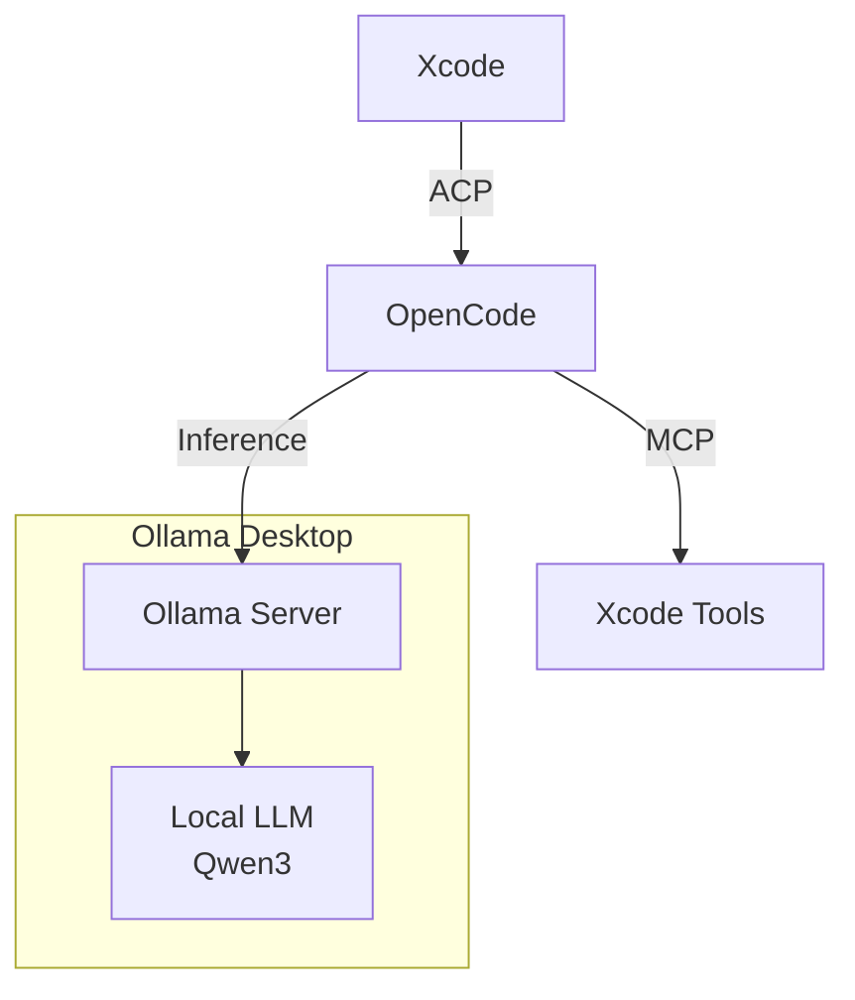

[로컬 LLM 모델을 설치하고]() 이어서 로컬 LLM 모델을 Xcode와 VSCode에 연동해보자. 

우선 VSCode에 연결해보고 다음엔 Xcode의 'Chat' 기능, 최종적으론 OpenCode와 Xcode를 ACP로 연동해서 로컬 LLM을 코딩 에이전트로 이용하려 한다.

## VSCode 연결

### Ollama 익스텐션 설치 및 모델 연동

Ollama에서 공식적으로 VSCode 익스텐션을 제공한다. 단순히 설치만 하면된다.



로컬 LLM을 VS Code에서 사용하려면, 빌트인 되어있는 Copilot Chat 기능을 이용해야 한다. Copilot Chat의 UI와 코드 컨텍스트 수집 기능을 사용하고, 실제 응답을 생성하는 언어 모델은 Ollama에서 실행 중인 로컬 모델을 사용할 것이다.


Copliot Chat에서 에이전트 코딩을 위한 '기능'만을 지금 로컬에서 호스팅하는 LLM이 사용하게 하는 것이다. 실제 Copilot 모델을 사용하는 것은 아니다.


macOS에서 단축키는 Control + Command + I인데, Copilot 기능이 켜져있지 않으면, Shift + Command + P로 `Chat: `을 검색해서 Copilot 기능을 먼저 활성화한다.



사이드바 하단에서 Auto로 선택되어 있는 부분에서 설치되어 있는 로컬 LLM 모델을 선택할 수 있다.



세 가지 모드를 선택할 수 있다. 여기서는 Plan으로 테스트하고, 실제 코드 수정은 이후 Xcode와 연동한 뒤 Xcode에서 진행한다.

- Ask: 설명이나 제안을 받는 데 사용한다.
- Plan: 프로젝트를 분석하고, 작업 계획을 세운다.
- Agent: 계획과 판단을 바탕으로 실제 작업을 수행한다.

프롬프트를 작성하기 전에 컨텍스트 길이 설정부터 해주자. 컨텍스트 길이가 너무 짧으면 LLM 모델이 컨텍스트를 정확하게 파악하지 못한다. 

길이 설정은 ollama 데스크톱의 설정에서 쉽게 할 수 있다. 여기선 대략 16k 정도로 잡았다.



### qwen2.5-coder:7B/14B, qwen3:9B 사용하기

프로젝트는 SwiftUI + SwiftData + Observation을 사용하는 작은 연습용 앱을 사용했다. 모델의 크기와 컨텍스트 제약상 새 기능을 추가하는건 무리다.(시도해봤는데, 그럴싸하게 틀린 답을 내놓는다.) 

그래서 단순한 타입 불일치 에러를 만들었다. 기존에 `Set`이었던 프로퍼티의 타입을 `Array`로 바꿨다.



이런 간단한 에러는 생각보다 잘 찾는다. 수정은 Xcode에서 해보자.



## Xcode에 Ollama 연결하기

Xcode도 내부에 AI Agents 대화 기능이 빌트인 되어 있어서, 단순히 연결만 해주면 된다.

우선 settings > Intelligence > Add a Chat Provider > Locally Hosted로 Ollama를 추가한다.



포트를 바꾸지 않았다면, Ollama의 기본 포트 '11434'를 사용하면 된다.



추가가 끝나면 'Chat'에서 Ollama를 선택할 수 있다. 이 방식은 Xcode가 현재 코드나 사용자가 선택한 컨텍스트를 로컬 LLM에 전달하고 응답을 받는 일반적인 채팅 방식이다. 하지만 여러 파일을 탐색하고 수정하거나, 프로젝트를 빌드하고 테스트하는 것처럼 실제 개발 작업을 수행하려면 코딩 에이전트가 필요하다.

Xcode가 외부 코딩 에이전트와 연결하기 위해서는 ACP를 사용해야 한다. 또한 MCP를 통해 파일 탐색, 빌드, 테스트 등의 Xcode 기능을 에이전트가 사용할 수 있도록 제공해야한다.


MCP는 요즘 자주 보이는데, ACP는 이번에 Xcode에 에이전트를 연결하면서 처음 알게 됐다. MCP가 에이전트에게 도구를 연결하는 프로토콜이라면, ACP는 에디터와 에이전트 자체를 연결하는 프로토콜이다. 

IDE와 코딩 에이전트 사이의 통신을 표준화하기 위해서 만들었다고 한다.


## OpenCode에서 Ollama 연동하기

그러면 Ollama를 어떻게 에이전트로 사용할 수 있을까? OpenCode를 사용하면 로컬 LLM을 성능을 빼곤 클로드 코드나 코덱스처럼 사용할 수 있다.

우선 Homebrew에서 OpenCode를 설치한다.

```zsh
brew install sst/tap/opencode
```

OpenCode에서 자동으로 Ollama 모델을 잡아주진 않으므로 설정을 해줘야 한다. 친절하게도 ollama에서 쉽게 끝낼수 있도록 커맨드를 제공한다.

```zsh
ollama launch opencode
```



원하는 모델(여기선 qwen3)을 선택하면, 자동으로 OpenCode에 내 컴퓨터에서 호스팅하는 로컬 LLM이 모델로 잡히게된다.



여기까지 하면 OpenCode에서 설정할 것은 끝났다. 다음은 OpenCode와 Xcode를 연동해야한다. 

## OpenCode를 ACP를 이용해서 Xcode와 연동하기

우선 OpenCode가 MCP를 사용할 수 있도록, MCP 기능을 켠다.



그리고 Xcode MCP 서버를 연다. MCP 서버가 열려있어야 OpenCode에서 Xcode 파일 탐색, 빌드, 테스트와 같은 개발 기능을 불러와서 쓸 수 있다.

```zsh
xcrun mcpbridge
```

사람이 직접 쓰는 서버가 아니므로? 아무런 출력이 없는게 정상이다.

```zsh
which opencode
```

OpenCode가 설치된 디렉토리를 확인하고, Xcode의 Settings > Intelligence > Add and Agent...에 확인한 정보를 작성한다.



Arguments에는 `acp`를 추가해야 하는데, OpenCode를 기본 모드가 아닌 ACP 서버 모드로 띄워야 하기 때문이다.



다 완료했으면, 대화 모델 목록에 'Chat' 말고 'Agents'에 OpenCode가 나오게 된다. 이러면 모든 연결을 마무리 하게 된거다.

아까 만들었던 타입 불일치 에러를 수정하도록 시켜보자.



중간에 한 번 파일 읽기에 실패했지만, 바로 다른 Xcode 툴을 선택해 다시 파일을 읽었다. 이후 에러 발생 부분을 찾아, 프로퍼티를 다시 `Set` 타입으로 수정했다. 

이처럼 MCP를 통해 Xcode의 도구를 에이전트에 제공해야 에이전트가 실제 프로젝트를 탐색하고 수정할 수 있다.

## 결론

지금까지 우리가 구축한 구조를 표현하면 다음과 같다. 생각보다 많은 계층을 거쳐야 Xcode에 도착할 수 있다...


```mermaid
flowchart TB
    Xcode["Xcode"]
    OpenCode["OpenCode"]

    subgraph Ollama["Ollama Desktop"]
        Server["Ollama Server"]
        LLM["Local LLM<br/>Qwen3"]
        Server --> LLM
    end

    Tools["Xcode Tools"]

    Xcode -->|ACP| OpenCode
    OpenCode -->|Inference| Server
    OpenCode -->|MCP| Tools
```

아무래도 개인용 컴퓨터에서는 모델 크기와 사양에 한계가 있다 보니 로컬 LLM으로 새로운 기능을 추가하는건 거의 불가능하다. (한 32GB쯤 되면 해볼만 할 수도 있을 것 같다.) SwiftUI앱에 UIKit 코드를 넣으려 하고, `@Published`를 쓰려 하는거 보면 꽤 그럴싸하지만 쓸 수는 없는 정도였다.

반면 단순한 에러의 원인을 찾고, 작은 스코프의 코드를 수정하는 작업 정도는 충분히 가능하다. 의외로 시간도 오래 걸리지 않고 내가 호스팅 하고 있으니 전기 말고는 비용이 들지 않는다.

물론 이 정도 오류라면 사람이 고치는게 더 빠를 수 있지만, 로컬 LLM 자체가 신기하지 않나? 앞으로 써보면서 어떻게 사용해야 할지 더 생각을 해봐야 할 것 같다.

## 레퍼런스

- [⁠Apple — Setting up coding intelligence](https://developer.apple.com/documentation/Xcode/setting-up-coding-intelligence?utm_source=chatgpt.com)
- [⁠Apple — Giving external agents access to Xcode](https://developer.apple.com/documentation/xcode/giving-external-agents-access-to-xcode?utm_source=chatgpt.com)
- [⁠OpenCode — ACP Support](https://dev.opencode.ai/docs/acp/?utm_source=chatgpt.com)
