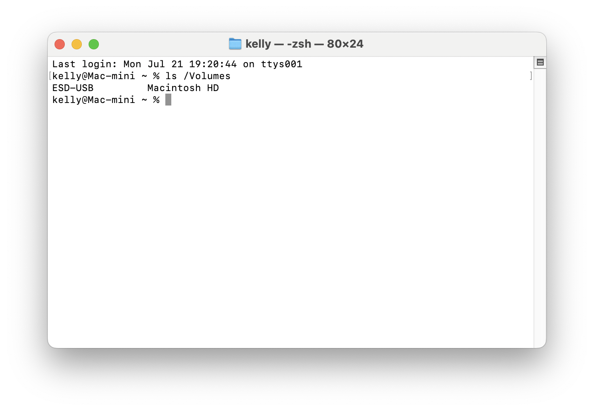
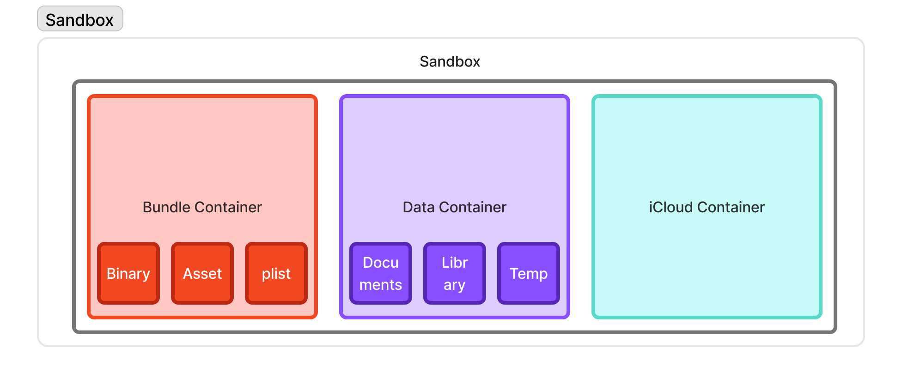
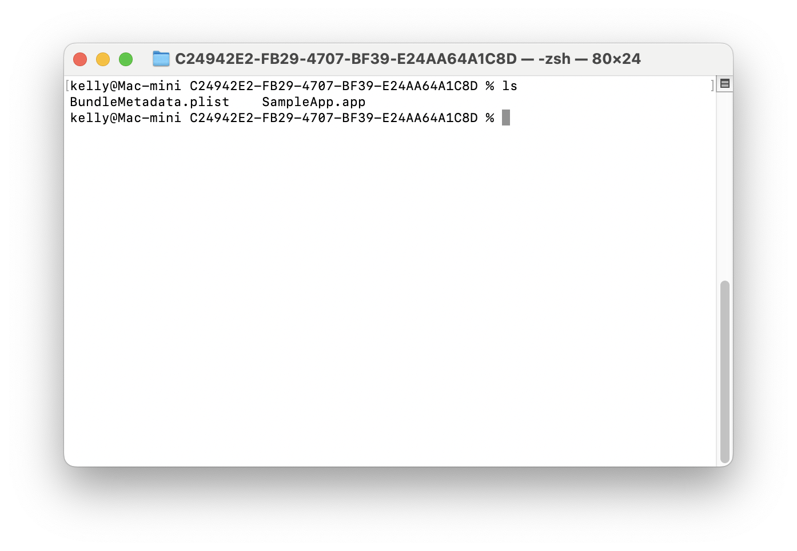
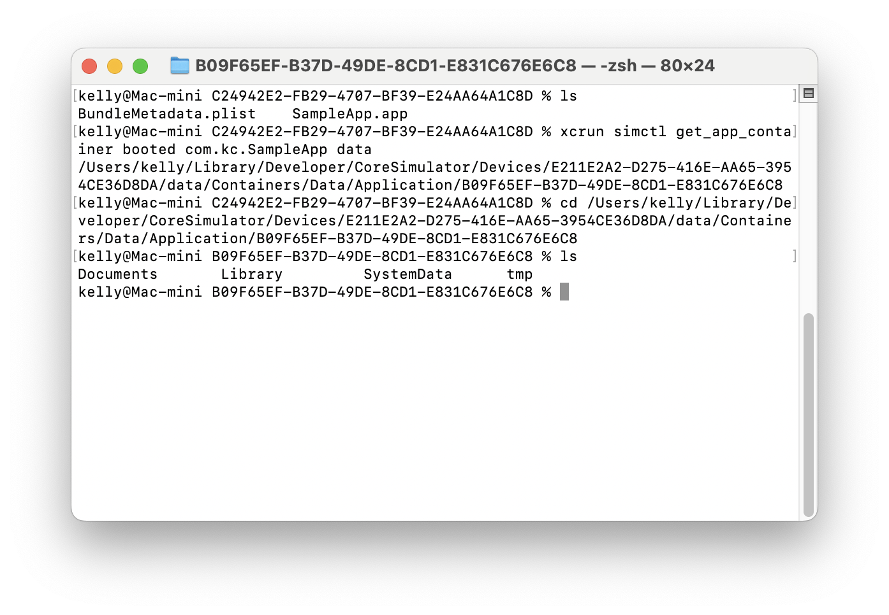

앱은 종료된 뒤에도 데이터를 유지하기 위해 파일 시스템을 사용한다. iOS, macOS 같은 애플 플랫폼에서는 APFS(Apple File System)라는 파일 시스템을 쓴다. 애플은 사용자 파일과 앱 내부 파일을 분리해서 관리하는 것을 목표로 한다.

개발자 문서에서는 파일 시스템의 목표를 다음과 같이 제시한다.

  - 사용자 파일은 쉽게 찾을 수 있도록 한다.
  - 앱 내부적으로 사용하는 파일은 사용자 눈에 띄지 않도록 한다.

많은 파일 시스템처럼 APFS도 디렉토리 구조를 통해 계층적으로 파일을 관리한다. 모든 디스크가 '단일 파일 컬렉션'을 구성한다는 점이 특징이다. 즉, 여러 디스크를 연결해도 사용자에게는 하나의 계층에 있는 것처럼 보인다.



맥 터미널에서 `ls /Volumes` 명령어를 실행하면 Volumes 디렉토리 내부에 서로 다른 디스크 (USB 메모리와 내장 SSD)가 잡히는 것을 볼 수 있다. 이렇게 서로 다른 디스크라도 하나의 큰 단일 컬렉션을 구성한다.

## 샌드박스

iOS 앱은 샌드박스라는 격리된 환경에서 실행된다. 샌드박스는 파일 시스템 내부에 존재하는 경계로 이해할 수 있다. 각각의 앱은 독립적인 파일 시스템, 메모리 공간을 갖춘다. 따라서 다른 앱이나 시스템 리소스에 직접 접근할 수 없게 된다.

따라서 샌드박스 구조는 다음과 같은 특징을 가진다.

  - 앱이 다른 앱이나 시스템 파일에 접근하지 못하도록 제한해서 위험한 접근이나 변경이 일어나지 않도록 한다.
  - 다른 앱이 현재 앱의 데이터에 접근하지 못하도록 한다.
  - 각 앱은 샌드박스 환경 내에서만 실행되어 충돌이나 오류를 최소화한다.



기본적으로 샌드박스는 번들 컨테이너, 데이터 컨테이너로 구성되고 만약 앱이 iCloud를 사용한다면 iCloud 컨테이너가 추가된다. 번들 컨테이너와 데이터 컨테이너에 대해 자세하게 살펴보자.

### 번들 컨테이너

번들 컨테이너는 앱 자체가 들어간다. 컴파일 된 바이너리나 스토리보드 UI파일, 에셋, plist등 앱이 동작하기 위한 기본 파일들이 들어간다. 즉 번들 컨테이너가 저장하고 있는 정보는 앱 그 자체와 같기 때문에 기본적으로 읽기 전용이며, 내부에 있는 파일을 수정할 수 없다.



샘플 앱을 만들고 시뮬레이터에 설치한 뒤 번들 컨테이너를 열어봤다. plist 파일과 app 파일이 있는 것을 확인할 수 있다.

### 데이터 컨테이너

데이터 컨테이너는 앱이 동작하면서 생성되는 모든 유저 데이터, 캐시, 임시 파일들이 저장되는 공간이다. 먼저 구조를 확인해보자.



Documents, Library, SystemData, tmp를 확인할 수 있다. 각각의 디렉토리들의 역할이 다 다르다.

  - Documents는 사용자가 생성한 데이터로, 보존과 백업이 필요한 파일들이 저장된다.
  - Library는 UserDefaults, Application Support, Caches 같은 앱이 관리하는 데이터들이 저장된다.
  - tmp는 임시 파일들이 저장되며, 시스템에 의해 언제든 삭제될 수 있다.
  - SystemData는 시뮬레이터에서는 보이지만, 실제 개발자는 보통 직접 접근하지 않는 시스템 내부 데이터가 저장된다.

실제로 개발자는 주로 Documents, Library, tmp 디렉토리 내에서 작업한다.

### 실제로 접근해보기

실제로는 디렉토리에 직접 접근하지 않고 `FileManager`를 통해 필요한 디렉토리의 URL을 얻어서 사용한다.

예를 들어 Documents 디렉토리는 다음과 같이 가져올 수 있다.

```swift
let documentsURL = FileManager.default.urls(
    for: .documentDirectory,
    in: .userDomainMask
).first!
```

Library나 tmp 디렉토리도 같은 방식으로 접근할 수 있다. 대부분의 파일 입출력은 이렇게 `FileManager`를 통해 시작한다고 생각하면 된다.

## 샌드박스 넘어 데이터 공유하기

하지만 여러 앱을 사용하다 보면, 다른 앱에서 데이터를 가져오는 경우가 종종 있다. 대표적으로 메세지를 보낼 때 우리는 사진 앱에 접근해서 사진 데이터를 가져온다.

원칙적으로 샌드박스 외부에서 다른 앱의 데이터를 가져오는 것은 불가능하다. 현재 앱도 자신의 샌드박스에 격리되어 있고, 다른 앱도 각자의 샌드박스에 격리되어 있기 때문이다. 하지만 몇 가지 예외 케이스들이 있다.

### App Group

같은 개발자 혹은 같은 팀이 만든 앱 끼리는 데이터 공유가 가능하다. 즉 앱 단위가 아닌 앱들이 묶인 그룹 단위의 샌드박스가 하나 더 있다고 생각하면 된다.

항상 되는 것은 아니고 등록을 한 앱들 끼리만 공유가 가능하고, 같은 개발자이어야 한다.

### System Interface

위에서 언급한 사진 앱에 접근해서 사진을 가져오는 경우를 생각해보자. 이럴 땐 시스템이 중개를 해주는 방식을 이용한다. 만약 내가 사진을 전송하고 싶어서 사진들에 접근해야 한다면, 직접 사진 앱의 파일 시스템에 접근하게 하는 것이 아니라 시스템이 대신 간접적으로 접근 한 다음 제공해주는 방식이다.

이 원칙은 사진뿐만 아니라 문서 선택기(Document Picker), 공유 시트(Share Sheet) 같은 API들도 모두 똑같이 따른다. 시스템이 중개자가 되어 다른 앱의 샌드박스를 직접 노출하지 않고 데이터를 안전하게 공유할 수 있게 해준다.

샌드박스의 기본적인 원칙을 깨지 않고도, 외부의 데이터를 사용할 수 있다.

## 정리

- 번들 컨테이너는 앱 자체를 저장하며 읽기 전용이다.
- 데이터 컨테이너에는 앱이 생성하는 데이터가 저장된다.
- 파일 입출력은 대부분 `FileManager`를 통해 시작한다.
- 샌드박스는 앱 간 직접적인 데이터 접근을 차단한다.
- App Group과 시스템 인터페이스는 샌드박스의 원칙을 유지하면서 데이터를 공유하는 방법이다.

iOS는 APFS를 기반으로 파일을 관리하고 각 앱을 샌드박스로 격리해 보안과 안정성을 보장한다. 앱에서 생성되는 데이터는 데이터 컨테이너에 저장되며, 실제 개발에서는 `FileManager`를 통해 필요한 디렉토리에 접근한다. 

다른 앱의 데이터는 직접 접근할 수 없지만, App Group이나 시스템이 제공하는 인터페이스를 통해 안전하게 데이터를 공유할 수 있다.
