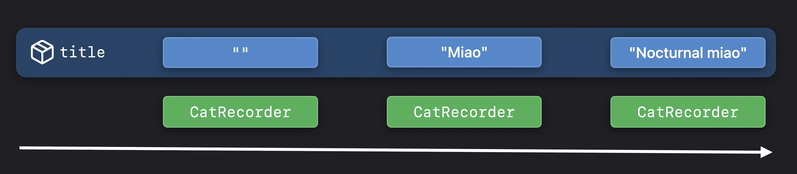

## Lifetime

1편에서는 SwiftUI가 View를 구분하는 방식인 Identity를 정리했다. 


고양이가 하루 동안 이곳 저곳 움직이더라도 계속 같은 고양이라고 생각한다. 이것처럼 Identity는 시간에 따라 달라지는 여러 값을 하나의 안정적인 원소로 연결한다. 즉 시간의 흐름 속에 연속성을 만들어 준다.

View는 Lifetime 동안 여러 상태를 가진다. 각 상태는 서로 다른 값이다. SwiftUI는 이 서로 다른 값들을 시간의 흐름 속에서 하나의 동일한 존재, 즉 하나의 View로 연결한다.

```swift
struct PurrDecibelView: View {
	var intensity: Double
	var body: some View {
		// ...
	}
}
```

SwiftUI가 `body`를 평가(evaluate)하면 새로운 View Value를 만든다.


말 그대로 뷰 값이다. `let x: Int = 1` 이라는 코드에서 `x`가 Int Value 인 것 처럼, `body`를 evaluate 하면 새로운 View(를 채택한 타입의) Value가 만들어진다는 것이다.



#### 고양이 데시벨 측정 예제

```swift
var body: some View {
	PurrDecibelView(intensity: 25)
}
```

처음에는 `intensity`가 `25`인 `PurrDecibelView`가 만들어진다. (이때 생성된 것이 바로 View Value)

```swift
var body: some View {
	PurrDecibelView(intensity: 50)
}
```

값을 `50`으로 증가시키면 `body`가 다시 호출되고 새로운 View Value가 생성된다. 같은 View 정의로부터 만들어졌지만, 둘은 서로 다른 값이다.

SwiftUI는 View가 변경되었는지 확인하기 위해 이전 Value의 복사본을 잠시 보관하고 비교한다. 비교가 끝나면 그 Value는 사라진다.

여기서 주의해야 할 점은 View Value와 View Identity가 서로 다르다는 것이다. View Value는 일시적이다. 따라서 View Value 자체의 Lifetime에 의존해서는 안 된다.


SwiftUI의 View는 값 타입이다. 업데이트가 일어날 때마다 새로운 View Value가 만들어질 수 있다. 하지만 SwiftUI는 그 값들이 같은 Identity에 연결되어 있다면 같은 View가 변화한 것으로 본다. UIKit처럼 객체 하나를 메모리상에 상주시켜 내부 값을 계속 변경하는 방식이 아니라, 새로운 View Value를 만들고 Identity를 유지해서 "같은 View"인 걸로 한다.

즉, SwiftUI에서 뷰의 연속성은 인스턴스의 연속성과 다르다. 같은 메모리 주소를 붙잡고 있어야만 같은 View인 게 아니라, 새로운 View Value가 계속 만들어져도 Identity가 같으면 같은 View다.


하지만 우리가 제어할 수 있는 것은 View의 Identity다. SwiftUI는 1편에서 설명한 여러 방법으로 View에 Identity를 부여한다. 앱이 실행되면서 값이 변할 때마다 새로운 View Value가 생성되더라도, 같은 Identity에 연결되어 있다면 이 모든 Value는 같은 View를 나타낸다.

View의 Identity가 바뀌거나 View가 제거되는 순간, 그 View의 Lifetime은 끝난다.

> A view's lifetime is the duration of the identity.

### State와 StateObject

View Identity를 Lifetime과 연결해서 이해해야 SwiftUI가 상태를 어떻게 유지하는지도 제대로 이해할 수 있다. `State`와 `StateObject`를 함께 살펴본다.

```swift
struct CatRecorder: View {
	@State var title = ""
	@StateObject var mic = Microphone ()
	var body: some View {
		VStack {
			TextField ("Title:", text: $title)
			MicView(mic)
		}
	}
}
```

SwiftUI가 View에서 `State`나 `StateObject`를 발견하면, 해당 데이터를 View의 Lifetime 동안 계속 유지해야 한다는 사실을 알게 된다.

즉, `State`와 `StateObject`는 View의 Identity와 연결된 영속 저장소다. View가 처음 만들어 질 때, SwiftUI는 `State`와 `StateObject`의 초기값을 사용해 메모리 안에 저장 공간을 할당한다.



위 캡처처럼 `title`이 `"" -> "Miao" -> "Nocturnal miao"`처럼 변하면 View Value가 새로 생성되지만, Identity가 유지되므로 같은 저장 공간이 사용된다.


만약 일반 저장 프로퍼티를 쓴다면 View가 새로 그려질 때마다(View Value가 새로 생성될 때 마다) 변수도 초기화되어 'Source of Truth'가 파괴된다.

반면, `@State`를 사용하면 값이 View 구조체 내부가 아닌 SwiftUI 엔진의 별도 외부 저장소에 보관된다. 덕분에 View 인스턴스가 아무리 새로 생성되더라도 이전 상태 값을 안전하게 유지한다. 이 외부에 저장된 `@State` 값이 현재 어떤 View와 연결되어야 하는지 알려면 당연히 View Identity가 필요하다.


### Identity 변경이 State에 미치는 영향

```swift
var body: some View {
	if dayTime {
		CatRecorder()
	} else {
		CatRecorder()
			.nightTimeStyle()
	}
}
```

겉보기에는 같은 View가 조건문의 서로 다른 두 분기에 존재한다. 하지만 Structural Identity 때문에 SwiftUI는 이 두 View를 서로 다른 Identity를 가진 View로 판단한다.

처음 `body`를 평가했을 때, `true` 분기로 들어가면, SwiftUI는 `State`의 초기값을 사용하여 영속 저장 공간을 할당한다. 그 View의 Lifetime 동안 여러 동작에 의해 State가 변경되더라도 SwiftUI는 그 값을 계속 보존한다.

하지만 `dayTime`이 변한다면 어떻게 될까? `false` 분기의 View는 다른 Identity를 가진 별개의 View다. 따라서 SwiftUI는 `false` 분기용 새로운 저장 공간을 만들고 `State`의 초기값부터 다시 시작한다. `true` 분기에서 사용하던 저장 공간은 해제된다. 다시 `true` 분기로 돌아가더라도 새로 생성되는 View이므로 `State`의 초기값부터 시작한다.

즉, Identity가 바뀔 때 마다 `State`도 교체된다.


State lifetime = View lifetime.

`@State`는 View Value의 일시적인 값들과 분리되어 있고(계속 말하지만, 이 일시적인 값이 변하면 새로운 View Value가 생성되어서 모든 값들이 초기화된다.), View Identity에 연결된다. 그래서 View Value가 다시 만들어져도 Identity가 유지되는 동안 상태는 유지되고, Identity가 바뀌면 상태도 함께 끝난다.


### 데이터 기반 View와 ForEach

SwiftUI에는 데이터의 Identity를 View의 Explicit Identity로 사용하는 여러 데이터 기반 구조가 마련되어 있다. 대표적으로 `ForEach`가 있다.

가장 단순한 형태의 `ForEach` initializer는 고정된 범위를 받는다.

#### 정적 데이터 컬렉션 예제

```swift
ForEach(0..<5) { offset in
	Text("🐑 \(offset)")
}
```


{ width = "360" }

이 범위 안의 `offset`을 활용해 `ViewBuilder`가 생성한 각각의 View를 식별한다.


`offset`은 `Text`의 프로퍼티가 아니다. 대신 `ForEach`가 `offset`을 기준으로 자식 View에 Identity를 부여한다. `ForEach`는 각 데이터 요소를 `content` 클로저에 넘겨 View를 만들고, 그 데이터 요소의 Identity를 방금 만들어진 View의 Identity로 사용한다. 그래서 데이터의 Identity가 `ForEach` 안에서 View Identity로 이어진다.


고정된 범위만 받도록 제한하면 해당 View의 Lifetime 동안 각 Identity가 안정적으로 유지된다는 사실을 보장할 수 있다.

#### 동적 데이터 컬렉션 예제

```swift
struct RescueCat {
	// ...
		var tagID: UUID // 여기서 Apple 공식은 Id가 아닌 ID임을 알 수 있다...
}

ForEach(rescueCats, id: \.tagID) { rescueCat in
	ProfileView(rescueCat)
}
```

여기서는 컬렉션과 함께 식별자 역할을 하는 프로퍼티의 KeyPath를 받는다.

이 프로퍼티는 `Hashable`해야 한다. SwiftUI가 컬렉션의 각 원소로부터 생성된 View에 Identity를 부여할 때 이 값을 사용하기 때문이다. 데이터에 안정적인 Identity를 제공하는 일은 매우 중요하다.


`Hashable`은 값을 비교하고 해시 기반 자료구조에서 다룰 수 있게 하는 능력이다. `ForEach(_:id:)`의 `id` 값은 여러 원소를 구분해야 하므로 `Hashable`이어야 한다. 반면 `Identifiable`은 타입이 자기 자신의 안정적인 식별자인 `id`를 제공한다는 약속이다. 직접 `id: \.tagID`를 넘기면 그 값이 `Hashable`이어야 하고, 원소 타입이 `Identifiable`이면 SwiftUI가 `element.id`를 자동으로 사용한다.

왜 `Equtable`이 아니라 `Hashable` 이어야 하는지는 궁금해서 따로 찾아봤는데, 글의 내용이 길어 질 것 같아서, 다른 포스트에서 다루겠다.


그래서 Swift 표준 라이브러리에는 이 능력을 위한 `Identifiable` 프로토콜이 정의되어 있다.

```swift
struct RescueCat: Identifiable {
	// ...
	var tagID: UUID
	var id: UUID { tageID }
}

ForEach(rescueCats) { rescueCat in
	ProfileView(rescueCat)
}
```

컬렉션의 원소가 `Identifiable`을 준수하면 KeyPath 없이 프로토콜이 제공하는 식별자를 사용해 데이터와 View의 Identity를 정의할 수 있다.

### ForEach 이니셜라이저 정의

Swift에서는 타입 시스템을 이용해 데이터가 시간의 흐름 속에서도 같은 데이터인지 SwiftUI가 알 수 있게 한다.

```swift
extension ForEach where Content: View, Data.Element: Identifiable, ID == Data.Element.ID {
	public init(
		_ data: Data,
		@ViewBuilder content: @escaping (Data.Element) -> Content
	)
}
```

- 제네릭 아규먼트 `Data`로 표현되는 컬렉션
- 컬렉션의 각 원소로부터 `View`를 생성하는 방법, 즉 escaping closure

컬렉션의 원소 `Data.Element`가 `Identifiable`을 준수하도록 제한하여 SwiftUI가 데이터의 Lifetime 동안 해당 데이터를 계속 추적할 수 있게 한다.

이런 `For Each`와 같은 View는 우리가 제공한 데이터의 Identity를 이용해 그 데이터와 연결된 View들의 Lifetime 범위를 결정한다. 따라서 좋은 Identifier를 선택하는 것은 View와 데이터의 Lifetime을 제어할 수 있는 기회다.

### Lifetime 정리

- View Value는 일시적이고, View Value의 Lifetime에 의존해서는 안 된다. Identity는 View가 시간의 흐름 속에서도 같은 존재로 이어지도록 연속성을 부여한다. (UIKit에서 이어져 온 상식을 파괴하자)
- View의 Identity를 직접 제어하면 `State`의 Lifetime이 어디서 시작되고 어디서 끝나는지도 명확하게 정할 수 있다.
- 마지막으로 SwiftUI는 데이터 기반 컴포넌트에서 `Identifiable` 프로토콜을 적극적으로 활용한다. View로 만들 데이터에는 반드시 안정적인 Identifier를 선택해야 한다. 데이터의 Identity가 흔들리면 그 데이터로부터 만들어지는 View의 Lifetime도 함께 흔들린다.
