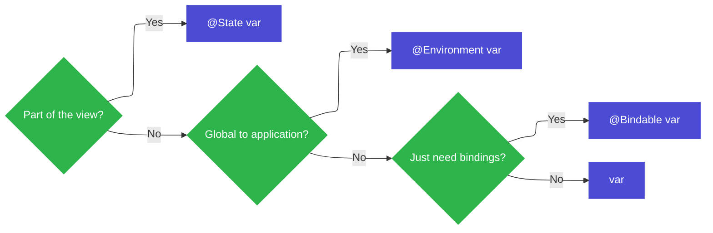

SwiftUI의 Observation은 모델의 프로퍼티 변화를 추적하고, 그 변화에 맞춰 UI를 업데이트하는 기능이다. `@Observable` 매크로를 사용하면 별도의 `ObservableObject`, `@Published`, `@ObservedObject` 없이도 일반 Swift 타입에 가까운 형태로 관찰 가능한 모델을 만들 수 있다.

핵심은 간단하다.

> View가 읽은 프로퍼티가 바뀌면, 그 View가 다시 계산된다.

이 글에서는 Observation의 동작 방식, `@State`, `@Environment`, `@Bindable`을 언제 써야 하는지, 그리고 기존 `ObservableObject` 기반 코드를 `@Observable`로 옮기는 방법을 정리한다.

## Observation

`@Observable`은 Swift 매크로다. 타입에 이 매크로를 붙이면 컴파일러가 해당 타입을 관찰할 수 있도록 코드를 확장한다.

### 도넛 트럭 예제

```swift
@Observable
class FoodTruckModel {
	var orders: [Order] = []
	var donuts = Donut.all
}
```

이제 이 모델을 SwiftUI View에서 사용할 수 있다.

```swift
struct DonutMenu: View {
	let model: FoodTruckModel

	var body: some View {
		List {
			Section("Donuts") {
				ForEach(model.donuts) { donut in
					Text(donut.name)
				}
				Button("Add new donut") {
					model.addDonut()
				}
			}
		}
	}
}
```


{ width = "360" }

`DonutMenu`의 `body`가 실행될 때 SwiftUI는 `model.donuts`에 접근했다는 사실을 기록한다. 이후 `donuts`가 변경되면 SwiftUI는 `DonutMenu`를 무효화하고 `body`를 다시 계산해서 그린다.

반대로 `orders`가 변경되면 어떨까? 이 View는 `orders`를 읽은 적이 없다. 따라서 `orders`가 바뀌어도 `DonutMenu`를 다시 계산할 필요가 없다.

기존 `ObservableObject`에서는 `objectWillChange`가 객체 단위로 전달되는 경우가 많았다(이 예제로 치면, `order`가 바뀌어도 모델 전체가 통째로 전달된다) 반면 Observation은 View가 실제로 접근한 프로퍼티를 기준으로 업데이트 범위를 더 좁힐 수 있다.

## Computed Property

Computed Property를 사용해도 Observation은 자연스럽게 동작한다.

```swift
@Observable
class FoodTruckModel {
	var orders: [Order] = []
	var donuts = Donut.all
	var orderCount: Int { orders.count }
}

struct DonutMenu: View {
	let model: FoodTruckModel

	var body: some View {
		List {
			Section("Donuts") {
				ForEach(model.donuts) { donut in
					Text(donut.name)
				}
				Button("Add new donut") {
					model.addDonut()
				}
			}
			Section("Orders") {
				LabeledContent("Count", value: "\(model.orderCount)")
			}
		}
	}
}
```


`orderCount`는 저장 프로퍼티가 아니라 Computed Property다. 하지만 값을 계산하는 과정에서 `orders`를 읽는다. `body`가 `model.orderCount`에 접근하면 결국 `orders` 접근도 함께 추적되므로, `orders`가 바뀔 때 View가 업데이트될 수 있다.


Computed Property 자체에 값이 저장되는 것은 아니지만, 그 getter 안에서 읽는 저장 프로퍼티는 추적된다. 그래서 `var orderCount: Int { orders.count }`처럼 Observable 타입 내부의 저장 프로퍼티를 기반으로 계산하는 경우에는 별도 작업이 필요 없다.


## 프로퍼티 래퍼

Observation이 들어오면서 SwiftUI에서 모델을 다루는 프로퍼티 래퍼가 줄었다. Observable 모델을 단순히 읽기만 한다면 일반 프로퍼티로 충분한 경우가 많다.

### @State

View가 자기 생명주기 동안 직접 소유해야 하는 상태라면 `@State`를 사용한다.

```swift
struct DonutListView: View {
	var donutList: DonutList
	@State private var donutToAdd: Donut?

	var body: some View {
		List(donutList.donuts) { DonutView(donut: $0) }
		Button("Add Donut") { donutToAdd = Donut() }
			.sheet(item: $donutToAdd) {
				TextField("Name", text: $donutToAdd.name)
				Button("Save") {
					donutList.donuts.append(donutToAdd)
					donutToAdd = nil
				}
				Button("Cancel") { donutToAdd = nil }
			}
	}
}
```

위 예제의 `donutToAdd`는 시트에서 임시로 편집 중인 도넛이다. 이 값은 앱 전체 모델이라기보다 `DonutListView`의 Lifetime에 묶인 임시 상태다. 따라서 `@State`가 맞다.


`@State`는 View Value 안에 직접 저장되는 값이 아니라 SwiftUI가 View의 Identity에 연결해 관리하는 저장소다. 그래서 `body`가 다시 평가되어 View Value가 새로 만들어져도, Identity가 유지되는 동안 `@State` 값은 유지된다.

이 내용은 [SwiftUI. Demystify SwiftUI (2)](/posts/ios-swiftui-wwdc-demystify-swiftui-2/)에서 View Lifetime과 함께 정리했다.


### @Environment

앱의 여러 View에서 공유해야 하는 값은 Environment로 전달할 수 있다.

```swift
@Observable
class Account {
	var userName: String?
}

struct FoodTruckMenuView: View {
	@Environment(Account.self) var account

	var body: some View {
		if let name = account.userName {
			HStack {
				Text(name)
				Button("Log out") { account.logOut() }
			}
		} else {
			Button("Login") { account.showLogin() }
		}
	}
}
```

Environment는 값을 하위 View 트리에 전달하는 통로다. 여기에 Observable 타입을 넣으면, 필요한 View에서 모델을 꺼내 쓸 수 있고 업데이트도 실제로 접근한 프로퍼티 기준으로 일어난다.


Environment는 넓은 범위에 값을 전달한다. 예전 방식에서는 전역적으로 공유되는 객체가 바뀔 때 불필요하게 많은 View가 업데이트될 수 있었다.

Observation을 사용하면 Environment로 같은 객체를 넓게 전달하더라도, 각 View는 자신이 실제로 읽은 프로퍼티 변경에만 반응할 수 있다. 위 예제에서는 `userName`을 읽었으므로 `userName` 변경에 반응하지만, `Account`의 다른 프로퍼티 변경까지 모두 같은 무게로 다룰 필요가 줄어든다.


### @Bindable

`@Bindable`은 Observable 타입의 프로퍼티에서 `Binding`을 만들어야 할 때 사용한다.

```swift
@Observable
class Donut {
	var name: String
}

struct DonutView: View {
	@Bindable var donut: Donut

	var body: some View {
		TextField("Name", text: $donut.name)
	}
}
```

`TextField`의 `text` 파라미터는 `Binding<String>`을 요구한다. `donut.name`을 읽기만 하는 것이 아니라, 사용자가 입력한 값을 다시 모델에 써야 하기 때문이다.

`@Bindable`을 붙이면 `$donut.name` 문법으로 Observable 모델의 프로퍼티에 대한 Binding을 만들 수 있다.


`@Binding`은 이미 만들어진 `Binding<Value>`를 View에 전달받을 때 사용한다. 반면 `@Bindable`은 Observable 객체를 감싸서 그 객체의 프로퍼티들로부터 Binding을 만들 수 있게 해준다.

즉 `@Binding var name: String`은 바인딩 자체를 받는 것이고, `@Bindable var donut: Donut`은 `donut`이라는 Observable 모델에서 `$donut.name` 같은 바인딩을 파생시키는 것이다.


### 선택 기준

프로퍼티 래퍼를 고를 때는 세 가지 질문으로 시작할 수 있다.



- View 자체의 상태로 관리해야 하는가? 그러면 `@State`
- 앱의 환경을 통해 여러 View에서 공유해야 하는가? 그러면 `@Environment`
- 모델에서 Binding만 만들면 되는가? 그러면 `@Bindable`
- 모두 아니라면 일반 프로퍼티

Observation 이후의 SwiftUI에서는 `@ObservedObject`, `@StateObject`, `@EnvironmentObject`를 먼저 떠올리기보다 이 세 가지 질문을 먼저 던지는 편이 좋다.

## Advanced Uses

Observation은 저장 프로퍼티 하나만 추적하는 기능이 아니다. Observable 모델의 배열, Optional, 중첩된 Observable 모델처럼 실제 앱에서 자주 만나는 구조도 함께 다룰 수 있다.

```swift
@Observable
class Donut {
	var name: String
}

struct DonutList: View {
	var donuts: [Donut]

	var body: some View {
		List(donuts) { donut in
			HStack {
				Text(donut.name)
				Spacer()
				Button("Randomize") {
					donut.name = randomName()
				}
			}
		}
	}
}
```


이 예제에서 `DonutList`는 `Donut` 배열을 가지고 있고, 각각의 `Donut`은 Observable이다. `Text(donut.name)`은 각 도넛 인스턴스의 `name`을 읽는다. 따라서 어떤 도넛의 `name`이 바뀌었는지에 따라 필요한 View만 업데이트할 수 있다. 따라서 Randomize 버튼으로 도넛 이름을 변경해도, 해당 View만 적절하게 업데이트한다.

심지어는 Observable 모델의 배열을 사용할 수도 있고, 다른 Observable 모델을 포함하는 모델을 만들 수도 있습니다. 


모델이 자연스럽게 여러 객체의 관계로 나뉘는 경우가 있다. 예를 들어 `FoodTruckModel`이 주문 목록을 가지고 있고, 각 `Order`나 `Donut` 자체도 독립적으로 수정될 수 있다면 각 요소를 Observable로 두는 편이 자연스럽다.

반드시 중첩 Observable을 만들어야 하는 것은 아니다. 값 타입 배열만으로 충분한 경우도 있다. 다만 개별 요소가 독립적인 참조 모델이고, 하위 View가 그 요소의 일부 프로퍼티만 읽고 수정한다면 Nested Observable이 업데이트 범위를 좁히는 데 도움이 된다.


### 수동 접근 추적

Observable의 일반적인 규칙은 다음과 같다.

> 읽은 프로퍼티가 바뀌면 View가 업데이트된다.

하지만 이 규칙이 자동으로 적용되지 않는 경우도 있다.

Computed Property가 Observable 타입 내부의 저장 프로퍼티를 기반으로 계산된다면 별도 작업이 필요 없다. 하지만 값이 Observable이 아닌 외부 저장소에 있다면 `@Observable` 매크로가 접근과 변경을 자동으로 추적할 수 없다.

이런 드문 경우에는 Observation API를 직접 사용해 접근과 변경을 알려야 한다.

```swift
@Observable
class Donut {
	var name: String {
		get {
			access(keyPath: \.name)
			return someNonObservableLocation.name
		}
		set {
			withMutation(keyPath: \.name) {
				someNonObservableLocation.name = newValue
			}
		}
	}
}
```

getter에서는 `access(keyPath:)`로 이 프로퍼티를 읽었다고 알린다. setter에서는 `withMutation(keyPath:)`로 이 프로퍼티가 변경된다고 알린다.

대부분의 앱 코드에서는 여기까지 직접 작성할 일이 많지 않다. `@Observable`이 저장 프로퍼티에 대한 접근과 변경 추적 코드를 생성해 주기 때문이다. 수동 제어는 Observable 바깥의 저장소, 캐시, 브리지된 객체처럼 매크로가 직접 볼 수 없는 값을 연결할 때 필요하다.

## ObservableObject에서 @Observable로

기존 SwiftUI 앱에서는 `ObservableObject`와 `@Published`를 많이 사용했다.

```swift
public class FoodTruckModel: ObservableObject {
	@Published public var truck = Truck()
	@Published public var orders: [Order] = []
	@Published public var donuts = Donut.all
	var dailyOrderSummaries: [City.ID: [OrderSummary]] = [:]
	var monthlyOrderSummaries: [City.ID: [OrderSummary]] = [:]
}
```

`@Observable`로 바꾸는 작업은 대부분 어노테이션을 덜어내는 형태다.

1. `ObservableObject` 채택을 제거한다.
2. `@Published`를 제거한다.
3. 타입에 `@Observable`을 붙인다.

```swift
@Observable
class FoodTruckModel {
	public var truck = Truck()
	public var orders: [Order] = []
	public var donuts = Donut.all
	var dailyOrderSummaries: [City.ID: [OrderSummary]] = [:]
	var monthlyOrderSummaries: [City.ID: [OrderSummary]] = [:]
}
```

View 쪽도 단순해진다.

```swift
struct AccountView: View {
	@ObservedObject var model: FoodTruckModel

	@EnvironmentObject private var accountStore: AccountStore
	@Environment(\.authorizationController) private var authorizationController

	@State private var isSignUpSheetPresented = false
	@State private var isSignOutAlertPresented = false
}
```

`@Observable` 모델에서는 단순히 읽기만 하는 모델은 일반 프로퍼티로 둘 수 있다. Environment로 전달하던 Observable 객체는 타입 기반 `@Environment`로 꺼낸다.

```swift
struct AccountView: View {
	var model: FoodTruckModel

	@Environment(AccountStore.self) private var accountStore
	@Environment(AuthorizationController.self) private var authorizationController

	@State private var isSignUpSheetPresented = false
	@State private var isSignOutAlertPresented = false
}
```

Binding이 필요한 경우에만 `@Bindable`을 사용한다.

```swift
struct DonutEditor: View {
	@Bindable var donut: Donut

	var body: some View {
		TextField("Name", text: $donut.name)
	}
}
```


기존 `ObservableObject`는 객체가 변경되었다는 신호를 비교적 넓은 단위로 전달한다. 그래서 View가 실제로 사용하지 않는 프로퍼티가 바뀌어도 객체 변경으로 인해 관련 View가 다시 계산될 수 있다.

Observation은 `body` 평가 중에 읽은 프로퍼티를 추적하고, 그 프로퍼티가 변경될 때만 View를 무효화할 수 있다. 불필요한 `body` 재평가가 줄어들 수 있으므로 성능상 이점이 생긴다.


## 마무리

Observation의 핵심은 모델 전체가 아니라 View가 실제로 읽은 프로퍼티를 기준으로 업데이트한다는 점이다.

- 새 모델 타입에는 `@Observable`을 붙인다.
- View가 소유하는 상태는 `@State`로 관리한다.
- 앱 전역 또는 View 트리 전체에 공유할 값은 `@Environment`로 전달한다.
- Observable 모델에서 Binding이 필요할 때만 `@Bindable`을 사용한다.
- 기존 `ObservableObject`, `@Published`, `@ObservedObject`, `@EnvironmentObject` 사용처는 대부분 더 단순한 형태로 옮길 수 있다.

이전 SwiftUI가 "어떤 객체가 바뀌었는가"에 가까웠다면, Observation 이후의 SwiftUI는 "이 View가 실제로 읽은 값이 바뀌었는가"에 더 가까워졌다. 이 차이를 이해하면 프로퍼티 래퍼 선택도 훨씬 단순해진다.
