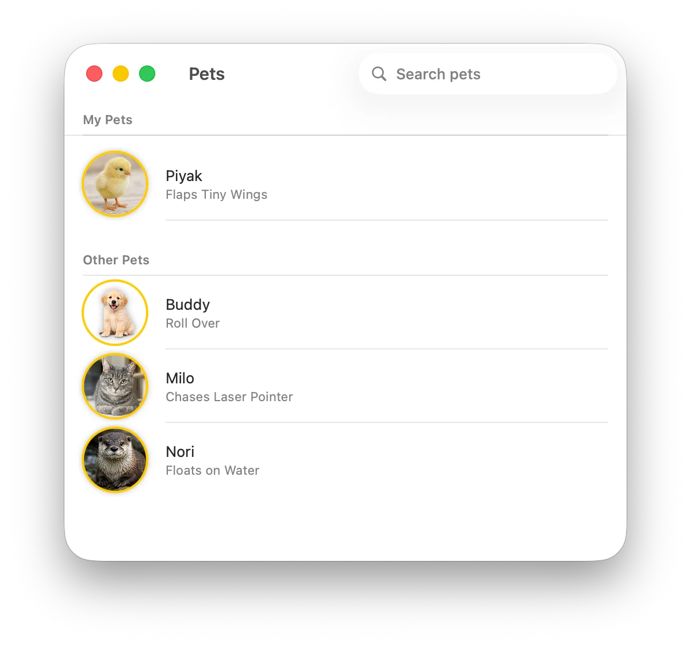
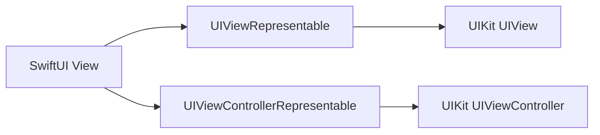
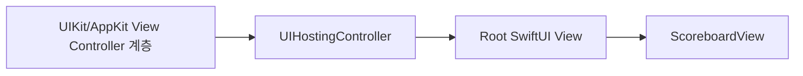

SwiftUI는 선언형 UI 프레임워크다.
- Rich Feature Set, 다양한 기능과 기기 고유의 이점을 활용할 수 있는 풍부한 기능 집합
- Less Code, 더 적은 코드
- Incremental adoption, 필요한 순간에 적절하게 사용 가능. 전체 앱이 반드시 SwiftUI일 필요는 없다.

### SwiftUI Essentials

SwiftUI는 선언형 UI 프레임워크이기 때문에 UIKit 처럼 `UIView` 객체가 계속 메모리에 상주해있고, 그 객체를 직접 변화시키는게 아니라, `View`를 보고 SwiftUI가 그리는 방식이다. 즉, `View`는 그냥 UI 요소를 정의하는 설계도이다. (Demistify SwiftUI 세션에서도 한 말이다!)

SwiftUI에서 핵심은 view와 modifier인데, 이 세션에서는 custom view와 modifier를 이용해서 각각의 사용법과 구조를 설명한다. view는 코드에서 보이는것과 거의 유사한 계층 구조를 이루고, modifier는 순서에 따른 계층 구조를 이룬다.

가장 인상깊었던 부분은 적응형 view다. 아무래도 선언형 프레임워크다 보니, UIKit처럼 세세하게 컨트롤 하지 않고. '이건 뭘 하는 버튼' 식으로 코드를 짜니까, 그 버튼이 있는 환경에 맞게 버튼의 모양이 바뀐다. UIKit은 버튼의 액션 뿐만 아니라 모양도 하나하나 지정해주기 때문에, 이 부분에서 '선언형 UI 프레임워크와 명령형 UI 프레임워크의 차이'가 가장 확실하게 와닿았다.


View에 대한 설명이 끝난 뒤에는 SwiftUI의 앱 구조를 다룬다. App, Scene, WindowGroup도 View와 비슷한 선언형 구조를 따르며, 하나의 일관된 방식으로 앱을 구성할 수 있다. (App, Window, Scene, View가 모두 비슷한 구조를 가진다) 그리고 SwiftUI는 멀티 플랫폼 이라는 사실도 말한다.

마지막으로는 UIKit과 SwiftUI의 상호 운용성을 설명한다. SwiftUI는 UIKit을 대체하는 프레임워크라기보다 함께 사용할 수 있는 프레임워크에 가깝다. 지금은 아니지만 애플 디벨로퍼 아카데미에 있을땐 카메라를 로드하려면 UIKit을 불러와야 했다. 그리고 아직 SwiftUI가 못하는 것들이 `UICollectionView`의 상세한 레이아웃 설정이라든지 몇개 있긴 하다.

별개로 이미지와 비디오가 많아서 포스팅중 제일 공들이고 힘들였다, 예제가 많고 24분 세션 치고 정보 밀도가 엄청나게 높다....

### 이번 세션의 토픽

- Fundamentals of views
- Built-in capability
- Across all platforms
- SDK interoperability

## Fundamentals of views

View는 사용자 인터페이스의 기본 구성 단위다. SwiftUI 앱에서 화면의 모든 픽셀은 View를 통해 정의된다.

### Declarative

```swift
List(pets) { pet in
	HStack {
		Label(pet.name, systemImage: pet.kind.systemImage)
		Spacer()
		Text(pet.trick)
	}
}
```


{ width = "360" }

이 코드에서는 수평으로 뷰를 나열하기 위한 `HStack`, 아이콘과 텍스트로 이루어진 뷰를 표시하기 위한 `Label`, 텍스트를 표시하기 위한 `Text`, 스크롤 가능한 리스트를 만들기 위한 `List`를 사용한다.

리스트에 행을 추가하거나 제거하는 작업처럼, 이 UI를 생성하기 위해 필요한 세부 절차를 직접 설명할 필요는 없다.


명령형: 과정의 각 단계를 순서대로 명령하기 (UIKit 스타일)

선언형: 원하는 결과를 선언 (SwiftUI 스타일)

SwiftUI가 코드를 작성하고 있으니 아무것도 설명하지 않는 것은 아니다. 차이는 설명의 대상이다. 명령형 코드에서는 "행을 만들고, 위치를 잡고, 리스트에 넣고, 변경되면 다시 갱신한다"처럼 절차를 설명한다. SwiftUI에서는 "이 데이터는 이런 리스트로 보이면 된다"는 최종 UI의 구조를 설명한다.


선언형 프로그래밍과 명령형 프로그래밍은 상호 배타적이지 않다. 선언형 코드는 결과에 집중하고, 명령형 코드는 상태를 변경하거나 기존의 선언적 구성 요소가 없을 때 사용한다. 

SwiftUI 뷰는 명령형 명령을 받는 오래 지속되는 객체 인스턴스가 아니라, UI의 현재 상태가 어떤지 기술하는 설명이다. 그래서 값 타입이고 클래스 대신 스트럭처로 작성한다. SwiftUI는 이 설명을 받고, 이를 표현하기 위한 데이터 구조를 생성한다. 그리고 백그라운드에서 이 구조를 유지하며, 뷰 그리기, 제스처와 인터랙션, 접근성 같은 다양한 출력에 사용한다.

뷰는 선언적 설명이므로 뷰 하나를 여러 개로 나누어도 앱 성능은 저하되지 않는다. 따라서 성능을 위해 코드의 구조를 억지로 변경할 필요가 없다. (UIKit에서는 뷰 계층이 깊어져서 별도의 비용이 생길수도 있었다.)


[WWDC21. Demystify SwiftUI]() 세션에서 `if` 때문에 SwiftUI의 Identity가 달라지는 현상을 봤다. 하지만 말하는 것은 "성능을 위해 큰 View 하나로 뭉쳐 둘 필요가 없다"는 의미에 가깝다. 작은 커스텀 View로 나누는 리팩토링 자체는 SwiftUI 성능을 해치지 않는다. 

다만 `if` 분기 위치를 바꾸거나 `.id(_:)`를 새로 주는 것처럼 뷰의 Identity가 달라지는 구조 변경은 State Lifetime이나 애니메이션에 영향을 줄 수 있다. 성능을 위해 구조를 숨기는 문제와, Identity를 의도에 맞게 유지하는 문제는 구분한다.


### Compositional

SwiftUI에서 조합성은 사용자 인터페이스를 만드는 핵심 방식이다.


{ width = "360" }

```swift
HStack {
	Image(whiskers.profileImage)
	VStack(alignment: .leading) {
		Label(pet.name, systemImage: pet.kind.systemImage)
		Text(pet.trick)
	}
}
```

SwiftUI에서는 코드 자체가 생성되는 뷰 계층 구조와 거의 비슷하기 때문에 컨테이너를 재배열하기 쉽다.

```text
HStack
├─ Image
├─ VStack
│  ├─ Label
│  └─ Text
└─ Spacer
```


`UIStackView`에 들어있던 뷰를 `arrangedSubview`에서 제거하고, 새 `UIStackView`에 다시 추가하고, `axis`, `alignment`, `distribution`, `spacing`을 변경하고. 새 `constraint`를 추가해서 오토레이아웃을 다시 잡고 하는 과정을 거쳤는데,

반면 SwiftUI에서는 코드의 구조 자체가 View의 조합과 레이아웃을 드러내기 때문에, 컨테이너를 바꾸거나 자식 View의 위치를 옮기는 작업이 훨씬 단순하다.


`HStack`의 이니셜라이저에서는 `ViewBuilder` 클로저를 사용해서 컨테이너의 하위 항목을 선언한다.

```swift
struct HStack<Content: View>: View {
	public init(@ViewBuilder content: () -> Content)
}
```

여기서는 `HStack` 이니셜라이저 안에 `ViewBuilder`가 있다. SwiftUI의 컨테이너 뷰에서 자주 사용되는 패턴이며, SwiftUI 코드는 Swift 문법보다는 사실상 별개의 DSL이라는 것을 알 수 있다! (생각해보면 많은 부분이 Swift 문법과 다르다.)

`ViewBuilder`에 대한 자세한 설명은 [WWDC21. Demystify SwiftUI]()에 있다.

#### Modifier


{ width = "360" }

modifier는 기본 View에 수정 사항을 적용하고, 해당 View를 커스텀할 수 있게 한다.

```swift
Image(ppiyak.profileImage)
    .clipShape(.circle)
    .shadow(radius: 3)
    .overlay {
        Circle().stroke(.yellow, lineWidth: 2)
    }
```

컨테이너 뷰(특히 앞서 말한 `HStack`)와 겉보기에는 다르지만, 결과적으로는 유사한 계층 구조를 만든다. modifer의 계층 구조와 순서는 modifier를 적용한 정확한 순서에 따라 정의된다.








modifier를 사용하면 결과가 생성되는 방식과 결과를 커스텀하는 방법이 명확해진다.

#### 커스텀 뷰

뷰 계층은 커스텀 View와 View Modifier로 캡슐화할 수 있다.


여기서 캡슐화한다는 것은 정보 은닉보다는 반복되는 View 계층이나 Modifier 조합에 이름을 붙여 하나의 View처럼 다룬다는 뜻이다. 예를 들어 이미지에 원형 클리핑, 그림자, 테두리를 매번 직접 붙이는 대신 `profileImage` 프로퍼티나 `PetRowView` 안에 넣어 두면, 바깥에서는 "프로필 이미지"나 "펫 row"이라는 의미 단위로 사용할 수 있다.


커스텀 뷰는 `View` 프로토콜을 준수하고, 자신이 나타내는 View를 반환하는 `body` 프로퍼티를 가진다. `body`에서 리턴된 뷰는 지금까지 본 (`Text`나 `Image` 같은)기본 뷰들과 동일한 방식으로 사용할 수 있다.

커스텀 뷰에서는 `View` 타입 프로퍼티를 통해서 코드를 더 정리할 수도 있다.

```swift
struct PetRowView: View {
	var pet: Pet

	var body: some View {
		HStack {
			profileImage
			VStack(alignment: .leading) {
				Text(pet.name)
				Text(pet.trickName)
					.font(.subheadline)
					.foregroundStyle(.secondary)
			}
			Spacer()
		}
	}

	private var profileImage: some View {
		Image(whiskers.profileImage)
			.clipShape(.circle)
			.shadow(radius: 3)
			.overlay {
				Circle().stroke(.green, lineWidth: 2)
			}
	}
}
```


{ width = "360" }

위 예제에서는 `profileImage` 프로퍼티를 private 프로퍼티로 만들어 리팩토링했다. 커스텀 View에는 `body`가 생성되는 방식을 변경하는 입력이 있을 수 있다. 이 View가 나타낼 펫에 대한 프로퍼티 `pet`을 추가했고, `body`에서 반환된 View에 해당 프로퍼티를 사용했다.

이렇게 하면 다양한 동물에 대한 정보를 표시할 수 있다.

커스텀 뷰는 기본 뷰들과 똑같이 사용할 수 있다. 각 펫에 대응하는 View로 `List`에서 이 커스텀 View를 사용해 보자.

```swift
List(model.allPets) { pet in
	PetRowView(pet: pet)
}
```

`List`는 뷰의 구성을 잘 보여주는 예다. 위 코드는 List가 컬렉션을 직접 받아 각 요소에 대한 View를 생성하는 컨비니언스 이니셜라이저를 사용한 것이다. (컨비니언스 이니셜라이저는 [여기]()에서 설명했었다...)

실제로는 다음 코드와 같은 의미다.

```swift
List {
	ForEach(model.allPets) { pet in
		PetRowView(pet: pet)
	}
}
```

`ForEach` 역시 하나의 View다. 컬렉션의 각 요소에 대해 `PetRowView`를 생성하고, 그 결과를 `List`의 자식 뷰로 구성하도록 넘긴다.


`List(model.allPets) { ... }`는 리스트가 직접 컬렉션을 받아 각 요소의 행을 만든다. 반면 `List { ForEach(model.allPets) { ... } }`는 `List`의 content 안에 `ForEach`라는 View를 넣는 방식이다. 

단순한 리스트만 만들 때는 앞의 형태가 짧고, 여러 `Section`을 섞거나 정적인 행과 동적인 행을 함께 배치해야 할 때는 `ForEach`를 직접 쓰는 형태가 더 유연하다.


섹션도 가능하다.

```swift
List {
	Section("My Pets") {
		ForEach(model.myPets) { pet in
			PetRowView(pet: pet)
		}
	}
	Section("Other Pets") {
		ForEach(model.otherPets) { pet in
			PetRowView(pet: pet)
		}
	}
}
```


{ width = "360" }

`List`도 뷰니까 당연히 modifier를 이용하여 커스텀할 수 있다.

```swift
PetRowView(pet: pet)
	.swipeActions(edge: .leading) {
		Button("Award", systemImage: "trophy") {
			pet.giveAward()
		}
		.tint(.orange)
		ShareLink(item: pet, preview: SharePreview(...))
	}
```


{ width = "360" }

### State-driven

시간이 지남에 따라 View의 상태가 변경되면, SwiftUI는 자동으로 UI를 최신 상태로 유지해 준다. 덕분에 보일러플레이트를 줄이고(델리게이트의 보일러 플레이트를 생각해보면 된다...), 수동 업데이트 과정에서 생길 수 있는 버그도 줄일 수 있다.

SwiftUI는 백그라운드에서 UI 표현을 유지한다. 데이터가 변경되면 새로운 View Value가 생성되어 SwiftUI에 제공된다. 이후 SwiftUI는 바뀐 View Value를 가지고 출력을 업데이트하는 방법을 결정한다.

예제에서 각 행에 스와이프 동작을 추가하고, award 버튼을 탭하면 해당 작업이 호출되도록 했다.

```swift
Button("Award", systemImage: "trophy") {
	pet.giveAward()
}
```


award 버튼을 탭하면, 연관된 펫 객체의 `hasAward` 상태가 `true`로 변경된다. SwiftUI는 이 `pet`에 의존하는 모든 뷰를 추적한다. 예를 들면 `List`의 각 row를 표시하는 뷰가 여기에 해당한다.

```swift
struct PetRowView: View {
	var pet: Pet

	var body: some View {
		// ...
		if pet.hasAward {
			Image(systemName: "trophy.fill")
				.foregroundStyle(.orange)
		}
		// ...
	}
	// ...
}
```

`PetRowView`가 `pet`의 레퍼런스를 가지고 있고, `body`에서 award를 받았는지 읽으므로 의존성이 생긴다. SwiftUI는 업데이트된 `pet`을 가지고 이 View의 `body`를 다시 호출한다. 그러면 View가 업데이트된다.

`body` 안에서 사용하는 모든 데이터는 그 뷰의 의존성이다. 이 예제에서는 `Pet`이라는 Observable 펫 클래스를 만들었으므로, SwiftUI는 특정 프로퍼티를 기준으로 의존성을 생성한다. (객체를 통째로 넘기던 Combine 기반 방식과 다르게 효율적이다.)

SwiftUI는 상태 관리를 위한 여러 도구를 제공하는데, 가장 중요한 것은 두 가지다.

- `@State`
- `@Binding`

프로퍼티를 `@State`로 선언하면, 그 데이터의 저장 공간은 SwiftUI가 관리하고 뷰에서 자유롭게 읽고 쓸 수 있게 해 준다. `@Binding`은 다른 뷰의 상태를 양방향으로 참조할 수 있게 한다.


`@Binding`은 값을 소유하지 않고, 다른 곳에 있는 Source of Truth를 읽고 쓸 수 있는 연결이다. 부모 뷰가 가진 `@State`를 자식 뷰에 `$rating`처럼 넘기면, 자식은 그 값을 읽을 수도 있고 변경할 수도 있다. 하지만 실제 저장 공간은 여전히 부모 쪽 `@State`에 있다.


```swift
struct RatingView: View {
	@State private var rating: Int = 5

	var body: some View {
		Button("Decrease", systemImage: "minus.circle") {
			rating -= 1
		}
		.disabled(rating == 0)

		Text("\(rating)")

		Button("Increase", systemImage: "plus.circle") {
			rating += 1
		}
		.disabled(rating == 10)
	}
}
```


{ width = "360" }

새로운 뷰에서 `rating`은 `@State`이므로 SwiftUI가 관리하고 추적한다. 버튼을 눌러 값이 변경되면 `body`를 다시 호출해서 그린다.

```swift
Button("Decrease", systemImage: "minus.circle") {
	withAnimation {
		rating -= 1
	}
}
```

상태를 변경하는 코드를 `withAnimation`으로 감싸면, 그 결과 발생하는 View 업데이트에 애니메이션이 적용된다.


전환 효과를 커스터마이즈할 수도 있다.

```swift
Text("\(rating)")
	.contentTransition(.numericText(value: Double(rating)))
```

직접적으로 전환 효과가 적용되는 부분이 `Text`라서 커스텀 전환 Modifier는 `Text`에 붙인다. `numericText`는 숫자 변화에 맞게 제공되는 빌트인 전환 효과다.


`@State`와 애니메이션을 사용하면 원하는 상호작용을 하는 View를 만들 수 있다.


여기서 말하는 상태는 일반적인 의미의 UI 상태이면서, 동시에 그 상태를 저장하는 대표적인 도구로 `@State`를 보여주는 흐름이다. 모든 상태가 반드시 `@State`인 것은 아니지만, View가 자기 Lifetime 동안 직접 소유하는 단순한 값이라면 `@State`가 알맞다.


다른 View도 하나 만들어 보자.

```swift
struct RatingContainerView: View {
	@State private var rating: Int = 5

	var body: some View {
		Gauge(value: rating, in: 0...10) {
			Text("Rating")
		}
		RatingView()
	}
}
```

게이지와 `RatingView`를 결합한 View인데, `RatingView`에도 State가 있고 이 View에도 State가 있다. 서로 다른 State는 서로 다른 Source of Truth인데 둘 다 같은 rating을 표현한다. 이러면 `RatingView`에서 버튼으로 값을 증가시켜도 게이지에는 반영되지 않는다.


```swift
struct RatingView: View {
	@Binding private var rating: Int
	// ...
}

struct RatingContainerView: View {
	@State private var rating: Int = 5

	var body: some View {
		// ...
		RatingView(rating: $rating)
	}
}
```

이럴 때 `@Binding`을 사용하면 된다. 부모 View가 자신의 State를 양방향으로 참조할 수 있는 Binding을 하위 View에 줄 수 있다.

이때 Source of Truth는 상위 View인 `RatingContainerView`에 있다. 부모 View는 `Gauge`에는 값을 전달하고(`value: rating`), `RatingView`에는 Binding을 전달한다(`rating: $rating`).

그러면 서로 연동되어 잘 동작한다.


#### 적응형 기능

SwiftUI는 자동으로 다크 모드, 다이나믹 타입을 지원하고, Localization도 적용할 수 있다.







선언형 뷰의 장점 중 하나는 적응성이다. 정확히 어떤 모양으로 그릴지 설명하기보다는 어떤 목적을 가진 UI인지 설명하기 때문이다.

버튼을 예로 들면, 스와이프 액션에서 사용하면 스와이프 액션에 맞게 보이고, 메뉴에서는 메뉴에 맞게 보이고, 폼에서는 폼에 맞게 보인다. 다른 환경에서 자동으로 그 상황에 맞는 형태로 표현된다.


완전히 아무 설정 없이 모든 상황이 해결된다는 뜻은 아니지만, SwiftUI의 표준 컨트롤은 플랫폼과 컨테이너 맥락을 반영한다. 같은 `Button`이라도 toolbar, list row swipe action, menu, form 안에서 서로 다른 표현을 가질 수 있다. 개발자는 "버튼"이라는 의미를 선언하고, SwiftUI는 현재 컨텍스트에 맞는 기본 표현을 선택한다.


`Button`뿐만 아니라 SwiftUI의 모든 컨트롤에 적용된다. `Toggle`도 마찬가지다.

스위치, 체크박스, 버튼, 스와이프 액션, 메뉴, 폼처럼 다양한 표현을 가질 수 있다. (그런데 `Toggle` 스와이프 액션에서 안먹는다. 빌드는 되는데, 아래 영상은 버튼으로 찍음)

```swift
Toggle("Nocturnal Mode", systemImage: "moon", isOn: $pet.isNocturnal)
```



맞다. 명령형 방식에서는 특정 UI 요소를 어떤 모양으로 만들고 어디에 붙일지 비교적 구체적으로 지시하는 경우가 많다. 반면 선언형 방식에서는 "여기에 토글이 있다", "여기에 검색이 있다"처럼 더 높은 수준의 의도를 표현한다. SwiftUI는 그 의도를 현재 플랫폼, 컨테이너, 접근성 설정에 맞는 표현으로 바꿀 수 있다.


SwiftUI의 많은 View들은 이런 적응성을 가지고 있고, 조합하는 방식을 사용해 동작을 바꾸거나 커스터마이징할 수 있다.

Modifier도 마찬가지인데, `searchable`을 한번 보자.

```swift
struct PetListView: View {
	var viewModel: PetStoreViewModel

	var body: some View {
		List {
			Section { ... }
			Section { ... }
		}
		.searchable(text: $viewModel.searchText)
	}
}
```






`searchable`을 붙이면 `List`가 검색 가능해진다. 이는 검색 기능을 제공한다는 의도를 선언하는 것이고, SwiftUI가 나머지 세부 구현을 처리하여 플랫폼에 가장 자연스러운 방식으로 UI를 제공한다.

다른 modifier를 추가하면 검색 경험을 커스터마이징할 수도 있다.


그런데 자신만의 UX를 만들고 싶을 때는 한 단계 더 낮은 수준의 API도 제공한다.


`ButtonStyle`, `ToggleStyle` 같은 API는 기본 컨트롤의 표현을 더 직접적으로 정의하게 해 주므로 확실히 한 단계 낮은 수준의 커스터마이징이다. 하지만 여전히 SwiftUI의 선언형 모델 안에 있다. UIKit을 직접 감싸는 `UIViewRepresentable`과는 다르게, SwiftUI 컨트롤의 의미와 상태 흐름은 유지하면서 표현만 바꾸는 방식에 가깝다.


## Built-in capability

SwiftUI의 기능은 View에만 국한되지 않는다. 앱 전체를 정의하는 방식도 View와 같다. App은 Scene들로 구성된 선언형 구조다.

```swift
@main
struct SwiftUIEssentialsApp: App {
	var body: some Scene {
		WindowGroup {
			ContentView()
		}
	}
}
```

`WindowGroup`은 Scene의 한 종류로, 화면에 표시할 `ContentView`를 받아 하나 이상의 윈도우를 생성한다. 또한, 여러 Scene을 함께 조합하여 사용할 수도 있다.

macOS처럼 멀티 윈도우를 지원하는 플랫폼에서는 추가적인 scene을 통해 앱의 기능을 다양한 방식으로 사용자에게 제공한다.

```swift
@main
struct SwiftUIEssentialsApp: App {
	var body: some Scene {
		WindowGroup {
			ContentView()
		}
		WindowGroup("Training History", id: "history", for: TrainingHistory.ID.self) {
			// ...
		}
		WindowGroup("Pet Detail", id: "detail", for: Pet.ID.self) {
			// ...
		}
	}
}
```

위젯도 마찬가지다.

```swift
struct ScoreboardWidget: Widget {
	var body: some WidgetConfiguration { ... }
}

struct ScoreboardWidgetView: View {
	var petTrick: PetTrick

	var body: some View {
		ScoreCard(rating: petTrick.rating)
			.overlay(alignment: .bottom) {
				Text(petTrick.pet.name)
					.padding()
			}
			.widgetURL(petTrick.pet.url)
	}
}
```

## Across all platforms

SwiftUI는 모든 Apple 플랫폼에서 사용할 수 있으며, 한 플랫폼에서 들인 개발 노력을 다른 플랫폼의 네이티브 앱을 만드는 데에도 활용할 수 있게 한다. 한 플랫폼용으로 SwiftUI 기반 UI를 만들어 두었다면, 이를 다른 플랫폼으로 가져가는 데에도 훌륭한 출발점이 된다.



덕분에 한 번 배우면 어디서든 사용할 수 있지만, 각각의 플랫폼에 특화된 API도 존재한다... 그러므로 HIG 잘 읽고 플랫폼에 맞게 잘 적용하자.

```swift
ScoreCardStack(rating: $rating)
	.focusable()
	#if os(watchOS)
	.digitalCrownRotation($rating, from: 0, through: 10)
	#endif
```

### SDK interoperability

SwiftUI는 Apple 플랫폼의 SDK 중 하나다. SwiftUI 외에도 다양한 프레임워크들이 있고, SwiftUI는 이러한 프레임워크들과 자연스럽게 함께 사용할 수 있다.

많은 경우에는 View 하나나 프로퍼티 하나를 추가하는 것만으로도 기능을 사용할 수 있다.

UIKit이나 AppKit은 명령형 UI 프레임워크다. SwiftUI와 유사한 UI 구성 블록을 제공하지만, View를 생성하고 업데이트하는 패턴은 다르다.

SwiftUI의 중요한 특징 중 하나는 UIKit, AppKit과의 자연스러운 상호 운용이다. Apple 앱들도 이런 식으로 점진적으로 SwiftUI를 도입하고 있으며, 앱 전체를 반드시 SwiftUI로 작성할 필요는 없다.

#### SwiftUI에서 UIKit 사용하기.



SwiftUI에서 UIKit의 `UIView` 혹은 `UIViewController`를 사용하고 싶으면, `UIViewRepresentable` 또는 `UIViewControllerRepresentable`을 사용할 수 있다.

이러면 다른 SwiftUI `View`처럼 `UIView`를 사용할 수 있다.

#### UIKit에서 SwiftUI View 사용하기



UIKit에서는 SwiftUI `View`를 `UIHostingController`를 이용해 사용할 수 있다. 이러면 UIKit이나 AppKit View Controller 계층에 SwiftUI View를 사용할 수 있다.

Root SwiftUI View를 받아 UIKit/AppKit의 View 계층 안에 포함시킨다.


`UIHostingController`가 처음 감싸는 최상위 SwiftUI View를 Root View라고 부른다. 예를 들어 `UIHostingController(rootView: ScoreboardView())`를 만들면 `ScoreboardView`가 Root SwiftUI View다. 그 아래에 있는 `ScoreCard`, `Text`, `Image` 같은 하위 View들은 SwiftUI 계층 안에서 함께 구성된다.


---

## 정리

SwiftUI는 선언형, 조합형, 상태 기반 View라는 기반 위에 만들어졌다. 그 위에 플랫폼에 자연스러운 기능과 SDK 전체와의 통합을 제공한다.

- 앱만의 고유한 가치
- 더 적은 코드
- 자연스럽고 완성도 높은 사용자 경험
- 어느 단계에서든 점진적으로 SwiftUI를 도입할 수 있다

기존 앱에 SwiftUI를 조금씩 도입해 보고, 다른 SwiftUI 세션도 함께 시청해 보자. 새 앱은 SwiftUI로 만들고!
