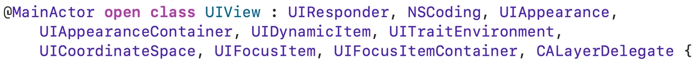
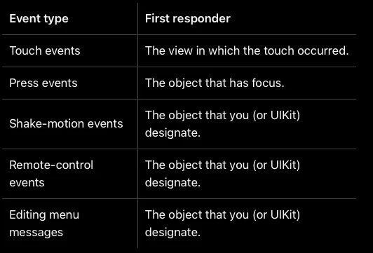
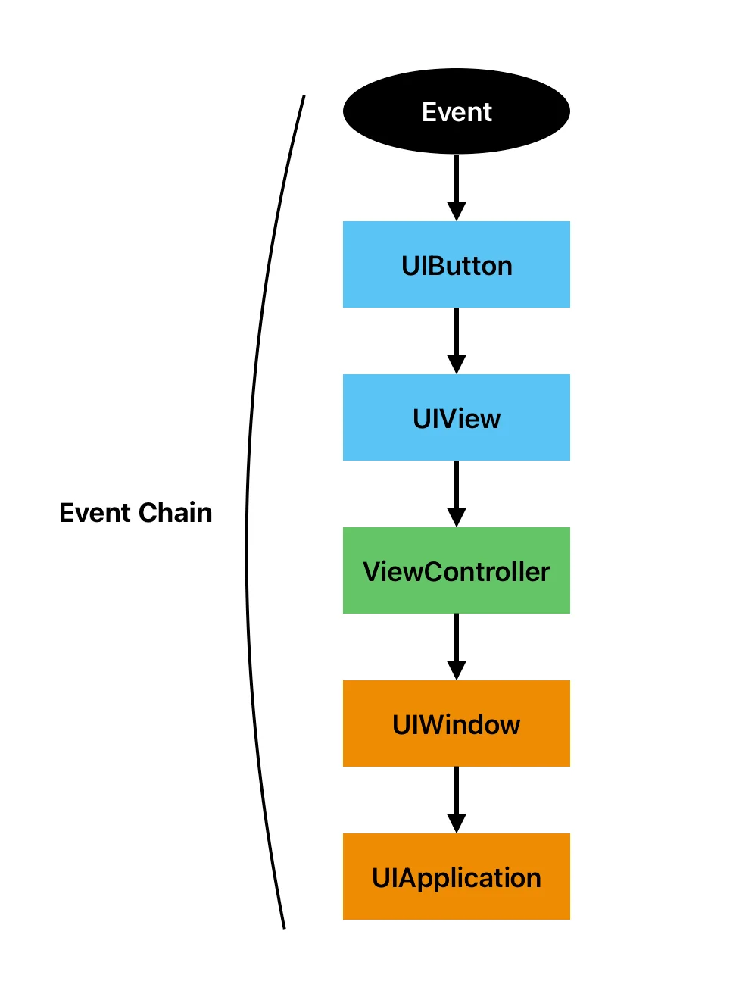

앱에서 터치 입력과 같은 유저 인터랙션을 처리할 때, UIKit은 `UIResponder` 객체를 통해 이벤트를 감지하고 적절히 처리한다. 그렇다면 이벤트가 발생했을 때, 어떻게 적절한 `UIResponder` 객체를 찾아서 처리할까? 

UIKit에서 이벤트가 어떻게 전달되고 처리되는지, 특히 `UIResponder`와 Responder chain의 흐름을 정리했다.

## UIResponder와 UIEvent

개발자 문서에서 `UIResponder`는 '이벤트에 응답하고 처리하기 위한 추상 인터페이스'로 소개한다. 여기서 이벤트란, UIKit에서 `UIEvent`라는 클래스로 표현되는 단일 유저 인터랙션(예: 터치)을 의미한다. `UIEvent` 역시 개발자 문서에서 '앱에서 단일 유저 인터랙션을 설명하기 위한 객체'라고 정의되어 있다.

가장 쉽게 볼 수 있는 리스폰더는 `UIView` 객체이다. `UIView`가 `UIResponder`를 상속받았기 때문에, 모든 `UIView`는 리스폰더가 된다. 이 외에도 `UIViewController`와 `UIApplication` 역시 `UIResponder`를 상속받아 리스폰더 역할을 한다.

UIKit 앱에서 터치 입력 이벤트는 `UIEvent` 객체로 포장되고, 이 객체를 `UIResponder`가 처리한다. 그렇다면 이벤트마다 어떻게 가장 적절한 `UIResponder` 객체를 찾을 수 있을까?

## Responder chain

리스폰더는 단순히 이벤트를 받고 처리하는 역할뿐만 아니라, 이벤트를 다음 리스폰더에게 전달하는 역할도 한다. 앱에서 이벤트가 발생하면, 이를 처리할 적절한 리스폰더에게 전달하는 과정이 바로 Responder chain이다.

### First responder

UIKit에서는 이벤트가 발생하면, 우선 해당 이벤트를 받을 가장 적합한 리스폰더인 First responder에게 전달한다. 예를 들어, 텍스트 필드를 터치하면 그 텍스트 필드가 First responder가 되어 키보드를 띄우는 식이다.

First responder를 정하는 기준은 문서에 명확히 나와 있다:

이처럼 이벤트 종류에 따라 First responder가 선정되는 기준이 다르다.

### First responder 찾기

First responder가 누구인지 찾는 방법도 직관적이다. UIKit은 `UIWindow`에서부터 시작해 `hitTest(_:with:)` 메소드를 재귀적으로 호출하며, 터치 위치에 있는 가장 안쪽의 `UIView`를 찾아낸다. 즉, 윈도우에서부터 가장 깊은 뷰까지 차례로 탐색하는 방식이다.

### 이벤트 전달

First responder가 이벤트를 처리하지 못하는 경우, 이벤트는 다음 리스폰더로 전달된다. 예를 들어, 버튼이 First responder가 되었지만 이벤트를 처리하지 못하면, 이벤트는 버튼의 상위 뷰로 전달된다. 

만약 그 상위 뷰도 처리하지 못하면, 뷰 컨트롤러 → 윈도우 → 애플리케이션 순으로 이벤트가 전달된다.

이 과정은 `nextResponder`를 따라 올라가는 과정이다. UIKit은 각 리스폰더가 다음 리스폰더를 알고 있기 때문에, 이벤트를 처리하지 못하면 자연스럽게 다음 객체로 전달할 수 있다.

이렇게 이벤트가 리스폰더에서 리스폰더로 전달되는 과정이 Responder chain의 핵심이다. 최종적으로 `UIApplication`까지 전달했는데도 처리되지 않으면, 그 이벤트는 아무런 처리 없이 사라진다.

## 정리

지금까지 살펴본 내용을 정리하면, UIKit의 이벤트는 `UIEvent` 객체로 표현되고 `UIResponder`가 이를 처리한다. 이벤트가 발생하면 먼저 가장 적절한 First responder가 선택되고, 처리하지 못한 이벤트는 Responder chain을 따라 다음 리스폰더로 전달된다. 이 과정은 `nextResponder`를 따라 계속 이어지며, 최종적으로도 처리되지 않으면 이벤트는 아무런 처리 없이 사라진다.

정리하면 다음과 같다:

- `UIEvent`는 하나의 사용자 인터랙션을 나타내는 객체이다.
- `UIResponder`는 이벤트를 처리하거나 다음 리스폰더로 전달한다.
- 이벤트는 먼저 First responder에게 전달된다.
- 처리되지 않은 이벤트는 Responder chain을 따라 전달된다.
