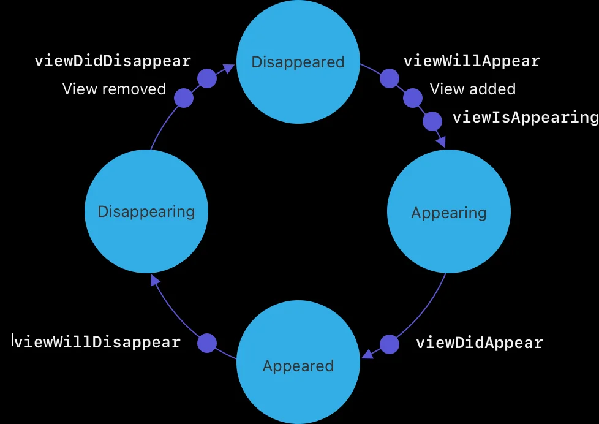
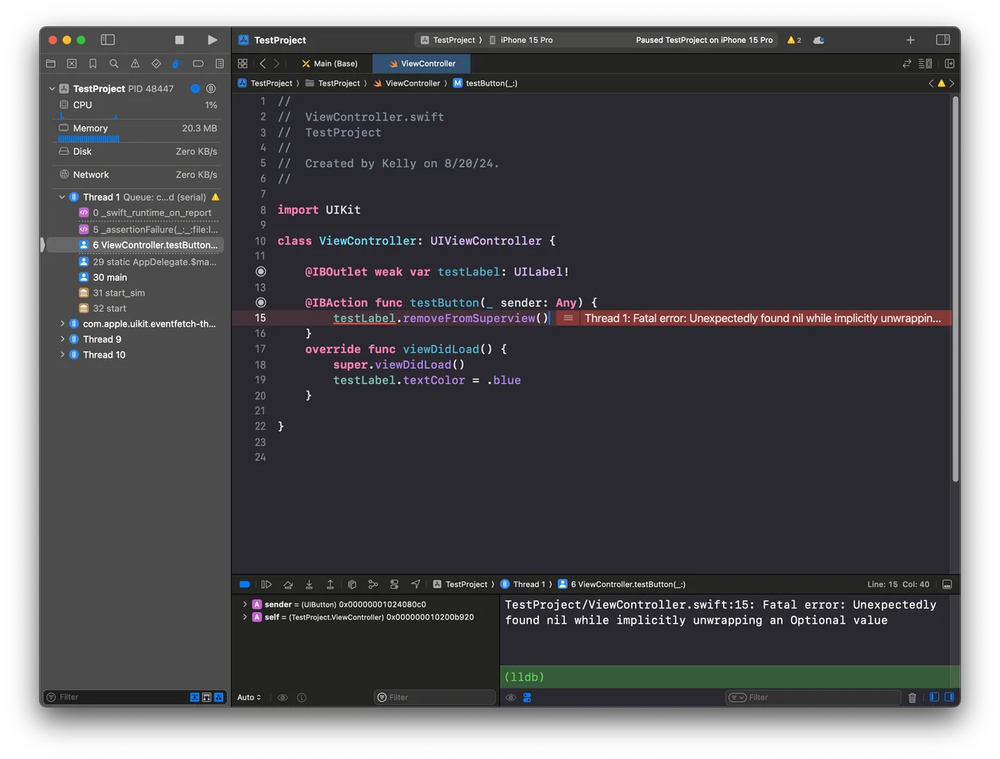

## 공식문서 먼저

### UIView

> An object that manages the content for a rectangular area on the screen.

- 화면의 사각형 영역을 나타내며, 내부에 다른 뷰를 포함할 수 있다. 대부분의 UI 요소가 UIView를 상속받는다.
- 콘텐츠를 화면에 나타내고, 사용자의 터치나 제스처를 감지한다.

### UIViewController

> An object that manages a view hierarchy for your UIKit app.

- 하나 이상의 뷰를 관리하고, 이 뷰들이 사용자와 상호작용하는 방법을 제어한다.
- 뷰를 생성하고, 화면에 표시하며, 뷰의 생명 주기를 관리한다.

### 두 줄 요약

- UIView는 화면의 직사각형 영역에 표시되는 콘텐츠를 관리하고, 사용자의 동작을 감지하는 역할을 한다.
- UIViewController는 이 UIView를 관리하는 역할을 한다. (사용자의 동작을 감지하면 이 뷰가 어떻게 상호 작용을 해야 할지, UIView 라이프 사이클 관리 등…)

## 뷰 라이프 사이클 + 뷰 컨트롤러 관련 메소드

순서대로 작성하면

- `loadView`: 뷰 컨트롤러의 view 속성을 초기화 할 때 호출된다.
- `viewDidLoad`: 뷰 컨트롤러의 뷰가 메모리에 로드된 직후 호출된다.
- `viewWillAppear`: 뷰가 화면에 나타나기 직전에 호출된다.
- `viewDidAppear`: 뷰가 화면에 나타난 후 호출된다.
- `viewWillDisappear`: 뷰가 화면에서 사라지기 직전에 호출된다.
- `viewDidDisappear`: 뷰가 화면에서 완전히 사라진 후 호출된다.

## 생각해보기

### Xcode에서 IBOutlet을 코드와 연결할 때, 기본적으로 암시적 언래핑으로 제공되는 이유

1. 뷰 컨트롤러가 생성되는 시점에서는 `IBOutlet`으로 선언된 것들이 `nil` 상태이다.
2. `loadView` 시점에서 스토리보드에 정의된 뷰가 로드된다.
3. 따라서 `IBOutlet`으로 선언된 변수들은 일단은 옵셔널 변수여야 한다.
4. 하지만 개발자가 스토리보드에서 UI요소를 올바르게 연결 했다면, `IBOutlet`은 항상 뷰 컨트롤러의 라이프 사이클동안 유효할 것으로 예상한다.
5. 따라서 이후에 `IBOutlet` 변수는 `nil` 상태가 될 가능성이 없다고 판단하고, `?` 대신 암시적 언래핑 `!`을 사용한다.

그러면 스토리 보드에 추가한 뷰가 사라지는 경우에는 어떻게 될까?

옵셔널 언래핑 에러가 뜬다. (이 시점에서 암시적 언래핑은 강제 언래핑과 같게 되기 때문)
