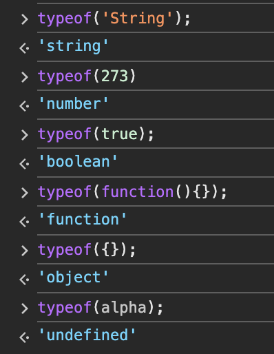

# 기본 명령어

### 표현식

- 문장 표현식이 하나 이상 모일 경우, 마지막에 **종결 의미로 세미콜론(;)**

### 프로그램

- 문장이 모이면 프로그램이 됨
- 문장을 작성하고, 다음 줄에 문장을 작성하면 앞 문장 끝에 세미콜론이 없어도 자바스크립트 **엔진이 자동으로 세미콜론 추가**
    - 자바스크립트 엔진이 세미콜론을 생략한 줄이 다음 줄과 이어지고 있다고 판단하면?
    
    ```jsx
    // 세미콜론을 안붙이면
    c = a + b
    (x + y).toString()
    // 이렇게 해석될 수 있다
    c = a + b(x + y).toString()
    ```
    

### 예악어

자바스크립트 문법을 규정짓기 위해 자바스크립트 언어 사양에서 사용하는 특수한 키워드는 식별자로 사용하지 않는 편이 좋다.

| break | case | catch | class | const | continue |
| --- | --- | --- | --- | --- | --- |
| debugger | default | delete | do | else | export |
| extends | finally | for | function | if | import |
| in | instanceof | let | new | return | super |
| switch | this | throw | try | typeof | var |
| void | while | with | yield |  |  |

앞으로 언어가 확장되면 어떤 예약어가 추가될지는 모르지만, 확장을 위해 예약된 키워드들이 있다.

- await, enum, implements, package, protected, interface, private, public…

### 식별자

이름을 붙일 때 사용하는 단어, 변수와 함수 이름 등으로 사용

- 특수 문자는 `_`와 `$`만 허용
- 숫자로 시작하면 안됨
- 공백은 입력하면 안됨

### 식별자 사용 규칙

- 생성자 함수의 이름은 항상 대문자로 시작
- 변수, 함수, 속성, 메소드의 이름은 항상 소문자로 시작
- 여러 단어로 된 식별자는 각 단어의 첫 글자를 대문자로 함

```jsx
alert('Hello World') // 함수
Array.length // 속성
input // 변수 또는 상수
prompt('Message', 'Defstr') // 함수
Math.PI // 속성
Math.abs(-273) // 메소드
```

### 주석

C 주석이랑 똑같음

## 문자열

문자열 생성 시 큰 따옴표나 작은 따옴표를 사용

```jsx
console.log("This is 'String'") // This is 'String'
console.log('This is "String"') // This is "String"
```

### 문자열 집합

자바스크립트를 HTML 요소에 끼워 넣을 때는 자바스크립트 프로그램을 문자열로 작성

```html
<input type="Button" value="Click" onclick="alert('Thanks!')">
```

- HTML 코드에는 큰따옴표를 사용하지 않고 자바스크립트 코드에는 작은따옴표를 사용하여 HTML과 자바스크립트에서 사용하는 따옴표를 구분하는 것이 좋다.

### 이스케이프 문자

- 따옴표를 문자 그대로 사용 가능
- 문자열 줄 바꿈 할 경우 사용

| **이스케이프 문자** | **의미** |
| --- | --- |
| \' | 작은따옴표 |
| \" | 큰따옴표 |
| \\ | 역슬래시 (\) 자체 |
| \n | 줄바꿈 (newline) |
| \r | 캐리지 리턴 (줄 맨 앞으로) |
| \t | 탭 (tab) |
| \b | 백스페이스 (backspace) |
| \f | 폼 피드 (form feed) |
| \v | 수직 탭 (vertical tab) |
| \uXXXX | 유니코드 문자 코드 |
| \xXX | 16진수 문자 코드 |

### 문자열 합치기

`+`연산자를 이용해서 문자열 합치기를 할 수 있음

## 변수와 상수

### 상수

항상 같은 수 라는 의미 ↔ 변수

- `const` - 상수(constant)를 만드는 키워드
- 변하지 않을 대상에 상수를 적용

### 변수

값을 저장할 때 사용하는 식별자, 변수 선언 후에 변수에 값을 할당

```jsx
// 변수 pi 선언
let pi;
// 변수 pi에 값을 할당
pi = 3.14159;
// 선언과 초기화 동시에
let pi = 3.14159;
```

## 연산자

### 연산자

스위프트랑 차이 없어보임

### 증감 연산자

- 전위연산자는 문장을 실행하기 전에 값을 변경하라는 의미
- 후위연산자는 문장을 실행한 후에 값을 변경하라는 의미

```jsx
let number = 10; 
number++; 
console.log(number); // 11
number--;
console.log(number); // 10
```

### 자료형 확인 연산자

`typeof`: 해당 변수의 자료형을 추출한다.

```jsx
typeof(10) // "number"
typeof("문자열") // "String"
```

### Undefined 자료형

변수를 선언했으나 초기화 하지 않은 자료형

### 강제 자료형 변환

- `Number()`: 숫자로 자료형 변환
- `String()`: 문자열로 자료형 변환
- `Boolean()`: 부울리언 값으로 자료형 변환

숫자로 변환할 수 없는 문자열을 변환하면 `NaN`을 출력 `NaN`은 숫자 자료형이지만 숫자가 아닌 것을 의미함

