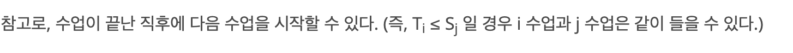
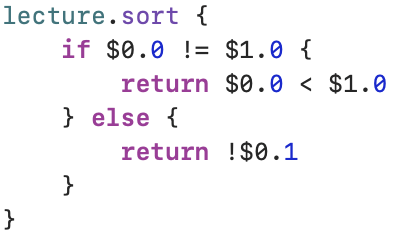

## 문제

<https://www.acmicpc.net/problem/11000>

## 풀이

정렬 후 그리디를 수행하는 전형적인 그리디 알고리즘 문제이다.

강의가 시작하는 시간과 끝나는 시간이 주어져 있으므로 배열에 입력으로 주어진 시간들을 저장한 다음에 정렬해서, 강의가 가장 많은 시간의 강의 수를 출력하면 된다.

알고리즘을 글로 표현하면 다음과 같다.

1. 수업이 시작하는 시간과 끝나는 시간을 배열 `lecture`에 저장한다. 이때 배열은 `[(Int, Bool)]` 타입이며, `Int`에는 시간, `Bool`에는 강의가 시작하는 시간일 경우 `true`, 끝나는 시간일 경우 `false`를 저장한다.     
2. 배열 `lecture`를 정렬한다.     
3. `lecture`를 for 반복문으로 전체 순회한다. 튜플의 두 번째 원소가 `true`인 경우 현재 진행 중인 강의 수를 저장하는 변수 `current`의 값을 1 더한다. `false`인 경우 강의가 끝난 것 이므로 변수 `current`의 값을 1 뺀다.

이때, 배열 lecture를 시간순으로만 정렬하게 되면 문제에서 다음과 같은 부분 때문에 문제가 생긴다.



강의가 입력으로 들어오는 순서는 랜덤이므로, `Ti = Sj` 인 경우일 때 정렬에 문제가 생긴다. **특정 시점 `X`에 끝나는 강의와 시작하는 강의가 있을 때, 시점 `X`에 끝나는 강의를 모두 `current`에 반영한 다음, 시작하는 강의를 `current`에 반영해야 한다.**

따라서 정렬 코드에 비교 클로저를 더 상세하게 작성할 필요가 있다.



처음에는 시간을 비교하고, 시간이 같다면 그 시점에 끝나는 강의가 앞으로 오도록 정렬을 해야 한다.

### 코드

```swift
import Foundation

let n = Int(readLine()!)!
var lecture: [(Int, Bool)] = []
var current = 0
var answer = 0
for _ in 0..<n {
    let st = readLine()!.split(separator: " ").map { Int(String($0))! }
    lecture.append((st[0], true))
    lecture.append((st[1], false))
}
lecture.sort {
    if $0.0 != $1.0 {
        return $0.0 < $1.0
    } else {
        return !$0.1
    }
}

for o in lecture {
    if o.1 {
        current += 1
        answer = max(current, answer)
    } else {
        current -= 1
    }
}

print(answer)
```
