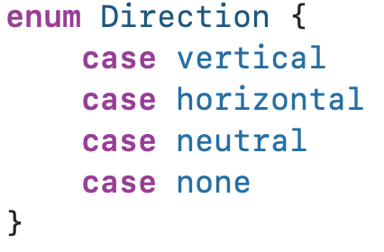
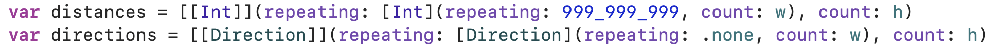
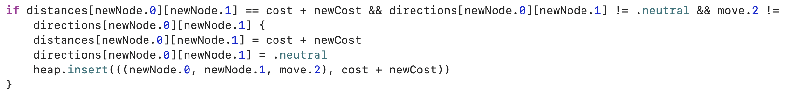

## 문제

<https://www.acmicpc.net/problem/6087>

## 풀이

다익스트라 알고리즘을 사용하여 해결하는 문제이다. 각 인접한 노드가 연결되어있다고 생각하고, 전의 노드에서 현재 노드로 온 방향과 수직인 노드만 거리를 1로 설정해주면 된다.

일반적인 다익스트라 알고리즘 문제에서는 연결된 노드간의 거리가 주어지는데, 이 문제에서는 연결된 노드의 거리를 0으로 할지, 1로 할지 선택해야한다. 하지만 다익스트라 알고리즘과 BFS의 관계를 잘 생각해보면, 어렵지 않게 풀 수 있다(개인적으로 BFS는 일종의 다익스트라 특이 케이스라고 생각한다.)

알고리즘은 다음과 같다.

1. 그래프에서 인접한 칸끼리는 서로 연결된 노드라고 가정함 (노드간 거리는 기본적으로 0으로 생각)  
2. 현재 있는 칸에서 내가 바라보고 있는 방향을 기준으로 수직인 노드는 거리가 1, 아닌 노드는 0으로 설정  
3. 2.를 반복하면서 다익스트라 수행



`vertical`은 가로 이동 `horizontal`은 세로 이동 `neutral`은 중립 방향인데, 시작 지점이나 아래에서 설명할 다른 `Direction`이지만 같은 거리에 있는 노드가 가지는 방향이다. `none`은 아직 탐색하지 않은 노드가 가지는 방향이다.

문제에서 미처 생각하지 못하고 넘어갈만한 부분은 같은 거리로 도착했어도 그 칸에서 바라볼수 있는 방향이 다르다는 것이다. 따라서 `directions` 배열을 만들었다. `distances` 배열을 `(Int, Direction)`꼴로 만들어도 좋다.



따라서 `distances` 배열 값은 같지만 `directions` 배열 값이 다른 경우도 `heap`에 추가를 해야한다.



이 때, 이미 방향이 `neutral`인 노드였으면, 이 과정을 한번 거친 노드이므로 무한 루프를 방지하기 위해 제외한다.

### 코드

```swift
import Foundation

enum Direction {
    case vertical
    case horizontal
    case neutral
    case none
}

struct Heap {
    private var heap: [((Int, Int, Direction), Int)] = []
    var isEmpty: Bool {
        heap.isEmpty
    }
    mutating func insert(_ v: ((Int, Int, Direction), Int)) {
        heap.append(v)
        var curIdx = heap.count - 1
        
        while curIdx > 0 && heap[curIdx].1 < heap[(curIdx - 1) / 2].1 {
            heap.swapAt(curIdx, (curIdx - 1) / 2)
            curIdx = (curIdx - 1) / 2
        }
    }
    mutating func delete() -> ((Int, Int, Direction), Int) {
        let popped = heap[0]
        heap.swapAt(0, heap.count - 1)
        heap.removeLast()
        var curIdx = 0
        while curIdx * 2 + 1 < heap.count {
            let lChildIdx = curIdx * 2 + 1
            let rChildIdx = lChildIdx + 1
            var mChildIdx = lChildIdx
            if rChildIdx < heap.count && heap[rChildIdx].1 < heap[mChildIdx].1 {
                mChildIdx = rChildIdx
            }
            if heap[curIdx].1 > heap[mChildIdx].1 {
                heap.swapAt(curIdx, mChildIdx)
                curIdx = mChildIdx
            } else {
                break
            }
        }
        return popped
    }
}

func dijkstra() {
    let moves = [(-1, 0, Direction.vertical), (1, 0, Direction.vertical), (0, -1, Direction.horizontal), (0, 1, Direction.horizontal)]
    var distances = [[Int]](repeating: [Int](repeating: 999_999_999, count: w), count: h)
    var directions = [[Direction]](repeating: [Direction](repeating: .none, count: w), count: h)
    var heap = Heap()
    heap.insert(((cs[0].0, cs[0].1, .neutral), 0))
    distances[cs[0].0][cs[0].1] = 0
    
    while !heap.isEmpty {
        let (node, cost) = heap.delete()
        if distances[node.0][node.1] < cost {
            continue
        }
        let currentDir = node.2
        for move in moves {
            let newNode = (node.0 + move.0, node.1 + move.1)
            if newNode.0 < 0 || newNode.0 >= h || newNode.1 < 0 || newNode.1 >= w { continue }
            if graph[newNode.0][newNode.1] == "*" {
                continue
            }
            var newCost = 0
            if currentDir != move.2 && currentDir != .neutral {
                newCost += 1
            }
            if distances[newNode.0][newNode.1] > cost + newCost {
                distances[newNode.0][newNode.1] = cost + newCost
                directions[newNode.0][newNode.1] = move.2
                heap.insert(((newNode.0, newNode.1, move.2), cost + newCost))
            }
            if distances[newNode.0][newNode.1] == cost + newCost && directions[newNode.0][newNode.1] != .neutral && move.2 != directions[newNode.0][newNode.1] {
                distances[newNode.0][newNode.1] = cost + newCost
                directions[newNode.0][newNode.1] = .neutral
                heap.insert(((newNode.0, newNode.1, move.2), cost + newCost))
            }
        }
    }
    print(distances[cs[1].0][cs[1].1])
}

let wh = readLine()!.split(separator: " ").map { Int(String($0))! }
let (w, h) = (wh[0], wh[1])
var graph = [[String]]()
var cs = [(Int, Int)]()
for _ in 0..<h {
    graph.append(readLine()!.map {
        let element = String($0)
        return element
    })
}
for row in 0..<h {
    for column in 0..<w {
        if graph[row][column] == "C" {
            cs.append((row, column))
        }
    }
}
dijkstra()
```
