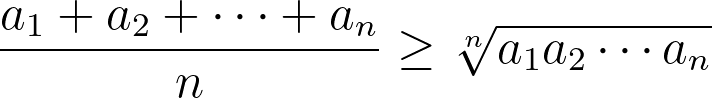
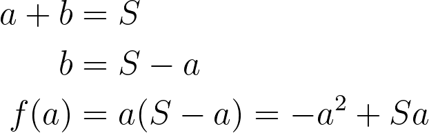
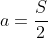
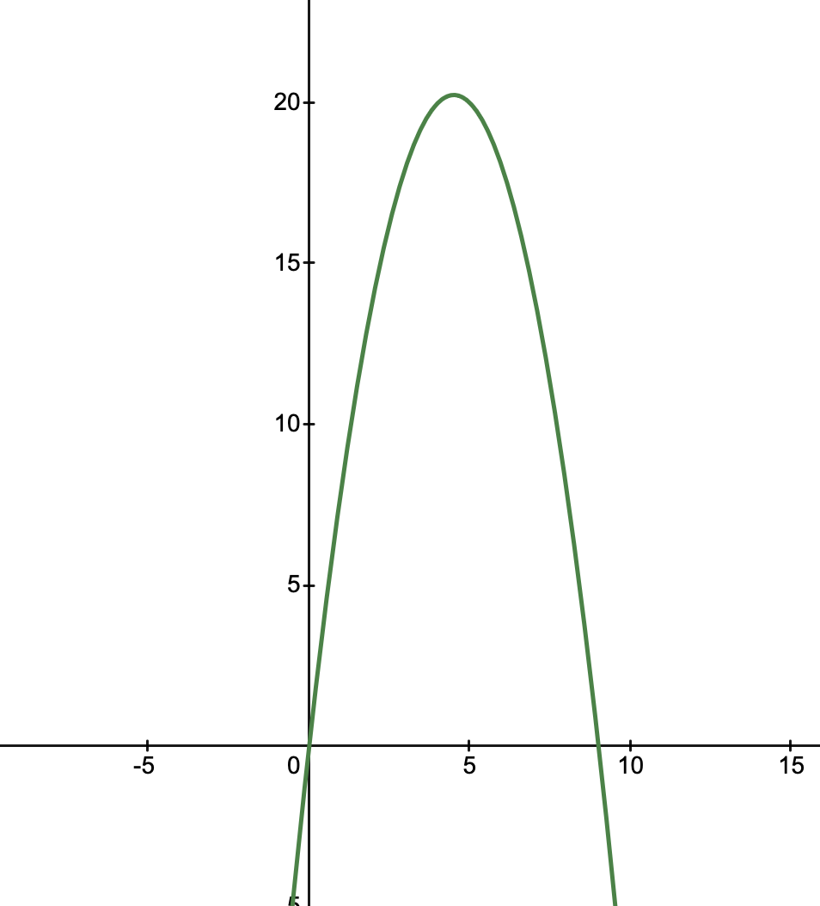

## 문제

<https://school.programmers.co.kr/learn/courses/30/lessons/12987>

## 풀이

`n`의 값이 최대 10000, `s`의 값이 최대 1000000의 값을 가질 수 있으므로 모든 경우의 수를 DFS로 탐색하는 것은 매우 비효율적이다.

하지만 수학적 직관을 이용해 생각해보자. 예시로 주어진 s = 9, n = 2인 경우에서도 {4, 5}가 최고의 집합이다. 만약 s = 5, n = 2인 경우에는? {2, 3}이다. s = 10, n = 2인 경우는 {5, 5} 이다. 집합 원소들이 최대한 고르게 되어있을 때 원소들의 곱이 최대가 된다는 것(= 최고의 집합이라는 것)을 알 수 있다. 그러면 이 직관을 증명해보자.

'곱'과 '합' 그리고 '최대값' 이 세 가지 키워드를 조합해보면 고등학교에서 배운 산술 기하 평균 부등식이 떠오른다.



문제에서 합이 s가 되므로 좌변은 고정이다. 그러면 우변이 최대가 되는 경우는 어떤 경우일까? 위 부등식에서 두 변이 같아지는 경우는, a의 모든 수가 모두 같은 경우이다. 두 변이 같을 때 우변이 최대값이 되므로, 최대한 원소들을 '고르게' 분포시켜야 한다. 이걸 알면 코드는 매우 단순하게 짤 수 있다.

물론 엄밀하게 말하면, 산술 기하 평균 부등식은 a들이 모두 완전히 같은 경우에만 최대값이 된다는 것을 보장하지만, 원소들이 점점 고르게 분포될 수록 값이 점점 커진다는 것도 알 수 있다. 간단하게 수학적으로 증명하면 다음과 같다



여기서 함수 f(x)는 2차 함수고 a의 계수가 마이너스 이므로 아래로 열려있는 포물선이다. 따라서 꼭짓점 부분이 최대값이 된다. 그 꼭짓점 부분은 쉽게 대수적으로 구할 수 있다.



다음 그래프는 s = 10일때의 그래프이다. 가로 축은 a, 세로 축은 곱의 최대값을 의미한다:



불연속적이지 않고, a와 b가 고르게 될수록 즉, a가 5에 가까워질수록 값이 커지는 것을 알 수 있다. 따라서 최대한 고르게 분포된 것이 곱의 최대값임을 증명할 수 있다.

### 코드

```py
def solution(n, s):
    if s < n:
        return [-1]
    q = s // n
    r = s % n
    answer = [q] * n
    for i in range(r):
        answer[i] += 1
    return sorted(answer)
```
