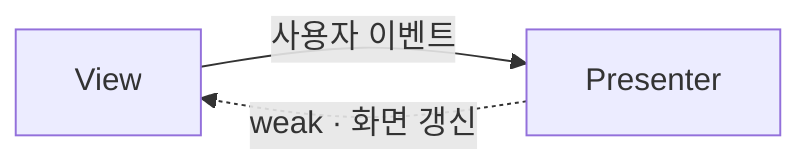
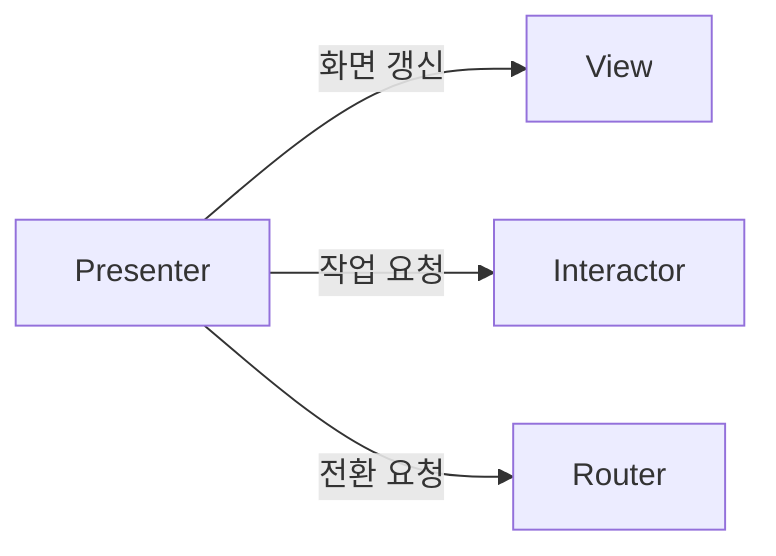
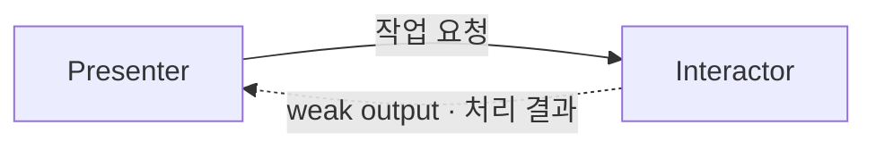
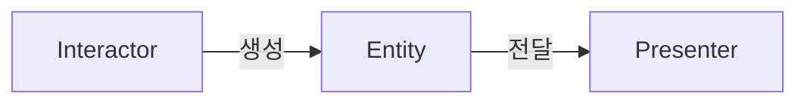
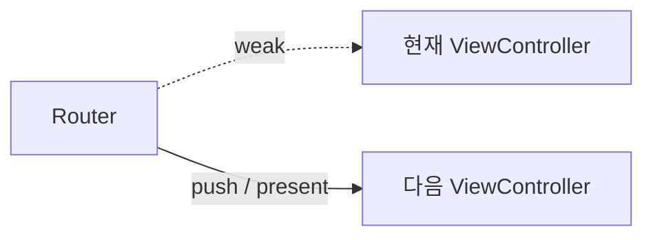

## VIPER란


VIPER는 화면을 View, Interactor, Presenter, Entity, Router로 나누는 아키텍처 패턴이다. 각 객체의 역할과 의존 방향을 제한해 UI, 비즈니스 로직, 화면 전환을 분리한다.

## 구성 요소

### View

화면을 그리고 사용자 입력을 Presenter에 전달한다. Presenter가 전달한 값을 UI에 반영하며, 비즈니스 로직은 직접 처리하지 않는다.

```swift
protocol ExampleViewProtocol: AnyObject {
    func displayMessage(_ message: String)
    func displayError(_ message: String)
}

final class ExampleViewController: UIViewController {
    var presenter: (any ExamplePresenterProtocol)?

    override func viewDidLoad() {
        super.viewDidLoad()
        presenter?.viewDidLoad()
    }
    @IBAction private func buttonTapped(_ sender: UIButton) {
        presenter?.handleButtonTapped()
    }
}

extension ExampleViewController: ExampleViewProtocol {
    func displayMessage(_ message: String) {
        label.text = message
    }
    func displayError(_ message: String) {
        errorLabel.text = message
    }
}
```



### Presenter

View의 입력을 해석해 Interactor나 Router에 작업을 요청한다. Interactor가 반환한 Entity는 화면에 표시할 값으로 가공해 View에 전달한다.

```swift
protocol ExamplePresenterProtocol: AnyObject {
    func viewDidLoad()
    func handleButtonTapped()
}

protocol ExampleInteractorOutputProtocol: AnyObject {
    func didFetchMessage(_ message: Message)
    func didFailToFetchMessage(_ error: Error)
}

final class ExamplePresenter: ExamplePresenterProtocol {
    weak var view: (any ExampleViewProtocol)?
    private let interactor: any ExampleInteractorProtocol
    private let router: any ExampleRouterProtocol

    init(
        view: any ExampleViewProtocol,
        interactor: any ExampleInteractorProtocol,
        router: any ExampleRouterProtocol
    ) {
        self.view = view
        self.interactor = interactor
        self.router = router
    }

    func viewDidLoad() {
        interactor.fetchMessage()
    }

    func handleButtonTapped() {
        router.navigateToDetail()
    }
}

extension ExamplePresenter: ExampleInteractorOutputProtocol {
    func didFetchMessage(_ message: Message) {
        view?.displayMessage(message.text)
    }

    func didFailToFetchMessage(_ error: Error) {
        view?.displayError(error.localizedDescription)
    }
}
```



### Interactor

화면에 필요한 비즈니스 로직과 데이터 작업을 담당한다. 작업 결과는 출력 프로토콜을 통해 Presenter에 전달한다.

```swift
protocol ExampleInteractorProtocol: AnyObject {
    func fetchMessage()
}

final class ExampleInteractor: ExampleInteractorProtocol {
    weak var presenter: (any ExampleInteractorOutputProtocol)?

    func fetchMessage() {
        let message = Message(text: "데이터를 불러왔습니다.")
        presenter?.didFetchMessage(message)
    }
}
```



### Entity

Interactor와 Presenter가 주고받는 데이터 모델이다. 특정 UI 컴포넌트에 종속되지 않는 형태로 정의한다.

```swift
struct Message {
    let text: String
}
```



### Router

다른 화면으로 이동하거나 모달을 표시하는 작업을 담당한다. Presenter는 전환 의도만 전달하고, 구체적인 UIKit 코드는 Router가 실행한다.

```swift
protocol ExampleRouterProtocol: AnyObject {
    func navigateToDetail()
}

final class ExampleRouter: ExampleRouterProtocol {
    weak var viewController: UIViewController?

    init(viewController: UIViewController) {
        self.viewController = viewController
    }

    func navigateToDetail() {
        let detailViewController = DetailViewController()
        viewController?.navigationController?.pushViewController(
            detailViewController,
            animated: true
        )
    }
}
```



## 의존성 주입 방식

의존성 주입은 객체가 필요한 의존성을 직접 생성하지 않고 외부에서 전달받는 방식이다. VIPER에서는 생성자 주입과 프로퍼티 주입을 주로 사용하며, 필요에 따라 메서드로도 전달할 수 있다.

### 생성자 주입

필수 의존성을 객체 생성 시점에 전달한다. 누락된 의존성을 컴파일 단계에서 발견할 수 있고, 테스트 대역으로 교체하기도 쉽다.

```swift
let presenter = ExamplePresenter(
    view: view,
    interactor: interactor,
    router: router
)
```

### 프로퍼티 주입

객체를 먼저 만든 뒤 프로퍼티를 통해 연결한다. 생성 순서가 얽힌 객체를 조립하기 쉽지만, 주입을 빠뜨리면 불완전한 객체가 만들어질 수 있다.

```swift
view.presenter = presenter
interactor.presenter = presenter
```

위 예제에서는 Presenter의 필수 의존성에는 생성자 주입을 사용하고, View와 Interactor가 Presenter를 다시 참조하는 연결에는 프로퍼티 주입을 사용했다.

### 메서드 주입

객체의 전체 생명주기에는 필요하지 않고 특정 작업에서만 필요한 값이나 협력 객체는 메서드 인자로 전달할 수 있다.

```swift
func refresh(using repository: any MessageRepository) {
    let message = repository.fetchLatestMessage()
    presenter?.didFetchMessage(message)
}
```

항상 필요한 의존성은 생성자로 받고, 선택적이거나 나중에 연결해야 하는 의존성에만 프로퍼티 주입을 사용하는 편이 객체의 완전성을 보장하기 쉽다.

## 모듈 조립 방식

주입 방식을 정한 뒤에는 구성 요소를 실제로 생성하고 연결하는 장소가 필요하다. 이 조립 책임을 Router에 둘 수도 있고, 별도의 Builder로 분리할 수도 있다.

### Router에서 조립하기

Router의 정적 메서드가 현재 모듈의 구성 요소를 생성한다. 파일 수가 적고 화면 전환 코드에서 곧바로 다음 모듈을 만들 수 있다는 장점이 있다.

```swift
extension ExampleRouter {
    static func build() -> UIViewController {
        let view = ExampleViewController()
        let interactor = ExampleInteractor()
        let router = ExampleRouter(viewController: view)
        let presenter = ExamplePresenter(
            view: view,
            interactor: interactor,
            router: router
        )

        view.presenter = presenter
        interactor.presenter = presenter
        return view
    }
}
```

다만 Router가 화면 전환뿐 아니라 객체 생성까지 담당하므로 모듈이 커질수록 책임이 함께 늘어난다.

### Builder에서 조립하기

별도의 Builder를 두면 Router는 화면 전환에 집중하고, 객체 생성과 연결은 Builder가 담당한다.

```swift
enum ExampleModuleBuilder {
    static func build() -> UIViewController {
        let view = ExampleViewController()
        let interactor = ExampleInteractor()
        let router = ExampleRouter(viewController: view)
        let presenter = ExamplePresenter(
            view: view,
            interactor: interactor,
            router: router
        )

        view.presenter = presenter
        interactor.presenter = presenter
        return view
    }
}
```

두 방식은 사용하는 의존성 주입 방식이 다르지 않다. 차이는 모듈을 조립하는 책임을 Router에 함께 둘지 별도 Builder로 분리할지에 있다. 모듈이 단순하면 Router에서 조립하고, 생성 과정이 복잡하거나 조립 규칙을 분명히 드러내고 싶다면 Builder로 분리할 수 있다.

## 장단점

VIPER는 구성 요소의 책임과 모듈 경계를 명확하게 만들며, 프로토콜을 이용해 각 객체를 독립적으로 테스트하기 좋다. 화면이 복잡해져도 비즈니스 로직과 전환 코드가 ViewController에 집중되는 것을 막을 수 있다.

반면 화면 하나에도 여러 프로토콜과 객체가 필요하고 이를 연결하는 코드도 작성해야 한다. 따라서 단순한 화면에 기계적으로 적용하면 얻는 이점보다 코드량과 복잡도가 커질 수 있다.
