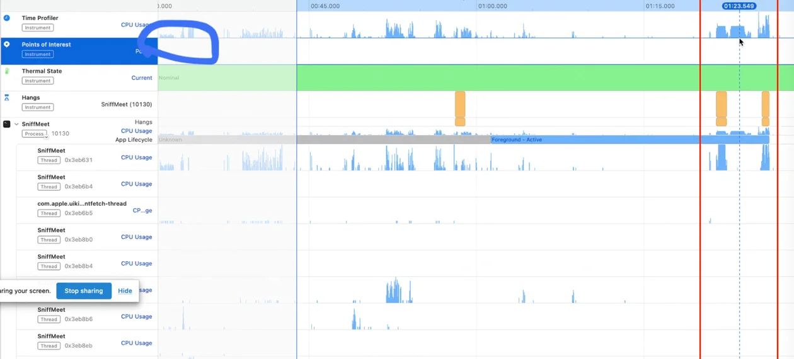
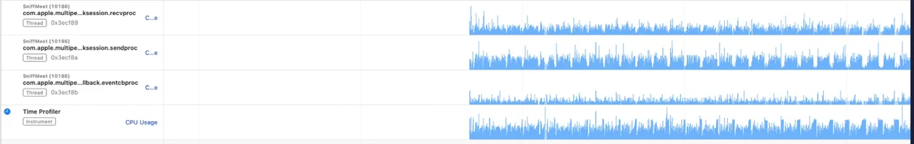

## 들어가며

성능 개선이 필요해 보이는 지점을 감으로 고르지 않기 위해, 먼저 SniffMeet의 주요 흐름에서 CPU와 네트워크 사용량을 훑어봤다.

이 측정만으로 병목 원인을 확정할 수는 없다. 다만 어떤 화면과 기능을 먼저 의심해야 하는지, 이후 리팩토링 후보를 정하는 기준으로는 충분했다.

## CPU 사용량 측정

Instruments의 Time Profiler로 주요 사용자 흐름을 따라가며 CPU 사용량이 튀는 구간을 확인했다.

측정 중 비교적 사용량이 높았던 지점은 다음과 같았다.

| 시점 | 동작 | 관찰 |
| --- | --- | --- |
| 0:26 | 프로필 입력 뷰 로드 | CPU 70% |
| 0:53 | 텍스트 필드 입력 | CPU 70% |
| 1:44 | 사진, 닉네임 입력 뷰 로드 | CPU 70% |
| 2:08 | 포토피커 | CPU 90% |
| 3:00 | 등록 완료 버튼 터치 | CPU 100%, 약 0.7초 유지 |
| 3:28 | 메이트 리스트 뷰 로드 | CPU 50% |
| 3:41 | 산책 요청 보내기 터치 | CPU 80% |
| 4:10 | 지도 로드 | CPU 95% |
| 5:05 | 요청 보내기 | CPU 100%, 약 0.2초 |
| 6:36 | MPC 연결 | CPU 100%, 약 1.2초 |

특히 회원가입 완료 버튼을 눌렀을 때와 MPC 연결 시점이 눈에 띄었다. 회원가입 완료 시점에는 메인 스레드에서만 작업이 몰리는 것처럼 보였고, MPC 연결 시점에는 MultipeerConnectivity 관련 스레드가 지속적으로 동작했다.

또한 메이트 리스트에서 산책 신청 뷰로 진입할 때 `low memory warning`이 발생했다. 이 부분은 CPU 사용량만으로 원인을 단정할 수는 없지만, 화면 전환 과정에서 이미지나 뷰 상태를 어떻게 들고 있는지 확인할 필요가 있어 보였다.

## 개선 후보

측정 결과를 바탕으로 먼저 볼 지점을 다음처럼 정리했다.

1. 회원 등록 흐름
   - 등록 완료 버튼을 누른 뒤 CPU가 짧게 100%까지 올라갔다.
   - 이미지 처리, 네트워크 요청, DB 저장 중 메인 스레드에서 처리되는 작업이 있는지 확인이 필요하다.

2. 지도 로드
   - 지도 화면과 위치 검색 허용 시점에서 CPU 사용량이 높았다.
   - 지도 로드, 위치 권한 요청, 검색 UI 초기화가 한 번에 몰리는지 확인해야 한다.

3. MPC 연결
   - 연결 시점에 CPU가 100%까지 올라갔고, 관련 스레드들이 계속 동작했다.
   - 연결 시작과 종료 흐름을 더 명확히 만들 필요가 있다.

4. 이미지 로딩
   - 네트워크 사용량 측면에서는 이미지가 가장 큰 개선 후보였다.
   - 특히 메이트 리스트에서 원본 이미지를 그대로 내려받고 있다면 다운샘플링이나 썸네일 분리가 필요하다.

## 네트워크 사용량

네트워크 사용량은 CPU 측정보다 덜 정리된 상태로 남았다. 다만 당시 판단은 분명했다.

이미지 다운샘플링과 썸네일 분리는 네트워크 사용량을 줄일 수 있는 가장 직접적인 리팩토링 후보였다. 그래서 해당 작업에 들어가기 전에 메이트 리스트에서 이미지가 얼마나 전송되는지 기준값을 먼저 잡을 필요가 있었다.

이후에는 원본 이미지 업로드와 리스트용 썸네일을 분리하고, 목록에서는 작은 썸네일만 내려받는 방향으로 개선을 이어갈 수 있다.

## 정리

이번 측정은 최적화를 완료하기 위한 작업이 아니라, 어디부터 봐야 할지 정하기 위한 사전 점검에 가까웠다.

수치만 보고 원인을 단정할 수는 없지만, 회원 등록, 지도 로드, MPC 연결, 이미지 로딩이 우선 확인해야 할 후보라는 점은 확인할 수 있었다. 특히 이미지 로딩은 CPU와 네트워크 양쪽에 영향을 줄 가능성이 있어, 다운샘플링과 썸네일 분리 작업으로 이어질 만한 지점이었다.
