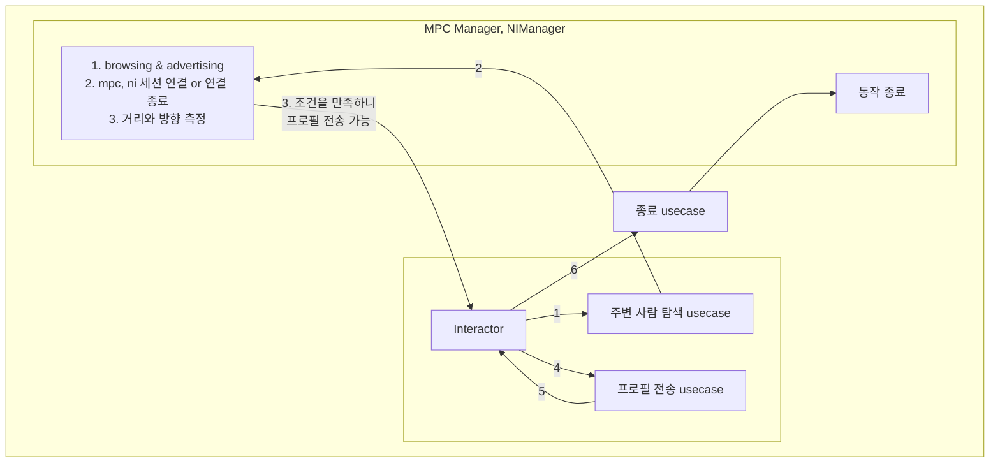
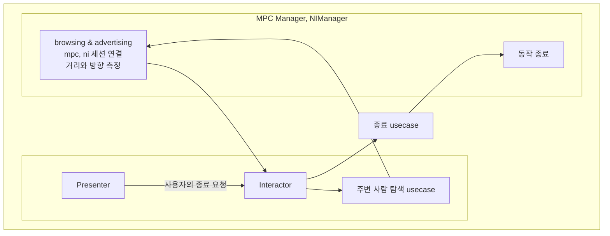

## 들어가며

SniffMeet의 프로필 드랍 기능은 주변 사용자를 찾고, 기기 간 연결을 만들고, 거리와 방향 조건을 만족했을 때 프로필을 전달하는 흐름이다.

겉으로 보면 "주변 사람 찾기"와 "프로필 보내기"를 나누면 될 것 같았다. 하지만 실제 흐름을 펼쳐보니 MPC, NI, 유즈케이스, 인터랙터가 서로 맞물려 있었고, 단순히 기능 이름으로 유즈케이스를 나누기 어려웠다.

이 글은 프로필 드랍 흐름을 유즈케이스로 나누면서 고민했던 지점을 정리한 기록이다.

## 기존에 생각한 흐름

당시 프로필 드랍은 대략 다음 순서로 동작한다고 봤다.

1. browsing과 advertising을 시작한다.
2. MPC 연결을 만든다.
3. NI discovery token과 프로필 데이터를 주고받는다.
4. NI 세션을 수립하고 거리와 방향을 측정한다.
5. 받은 프로필 데이터를 기반으로 메이트 요청 뷰를 띄운다.

처음에는 이 흐름을 다음 세 가지 유즈케이스로 나누려고 했다.

- 주변 사람을 탐색한다.
- 메이트 요청을 보낸다.
- 탐색을 종료한다.

이렇게 나누면 각 유즈케이스가 하는 일이 명확해 보였다. 하지만 문제는 흐름의 중간 이벤트가 모두 같은 레이어에서 발생하지 않는다는 점이었다.

## 문제: 조건 만족 이벤트는 NI delegate에서 발생한다

프로필 전송은 아무 때나 실행되면 안 된다. MPC 연결이 되고, NI 세션이 수립되고, 거리와 방향 조건을 만족한 뒤에야 가능하다.

그런데 조건을 만족했는지 판단하는 이벤트는 NI session delegate 쪽에서 발생한다. 즉, `SendProfileUseCase`를 따로 만들더라도, 그것을 언제 호출해야 하는지는 NI 이벤트를 받아야 알 수 있었다.

당시 고민은 이런 형태였다.

```text
Interactor -> FindMateUseCase -> MPCManager / NIManager
```

이 구조에서 NI delegate 내부에서 조건 만족을 알게 되었을 때, 바로 `SendProfileUseCase`를 호출해도 되는지가 애매했다.

## 시도해볼 수 있었던 선택지

### UseCase가 NI delegate를 채택한다

유즈케이스가 직접 NI delegate를 채택하면, NI 이벤트를 받은 자리에서 바로 다음 흐름을 이어갈 수 있다.

하지만 이 방식은 유즈케이스가 delegate 생명주기와 프레임워크 이벤트에 너무 가까워진다. 또한 인터랙터에 결과를 알려야 하는 문제는 여전히 남는다. 결국 이벤트 전달을 위해 Combine 같은 별도 통로가 필요해진다.

### Interactor가 NI delegate를 채택한다

인터랙터가 delegate를 직접 채택하면 화면 흐름과 이벤트 처리는 가까워진다. 하지만 이 경우 인터랙터가 MPC/NI 세부 구현을 너무 많이 알게 된다.

인터랙터는 유즈케이스를 호출해서 흐름을 시작하는 쪽에 가깝고, NI delegate 이벤트까지 직접 받는 것은 역할이 무거워 보였다.

### 유즈케이스를 하나의 흐름으로 합친다

마지막 선택지는 탐색과 전송을 너무 이른 시점에 분리하지 않는 것이었다.

프로필 드랍은 사용자가 보기에는 "주변 사람에게 프로필을 드랍한다"는 하나의 흐름이다. 사용자는 MPC를 쓰는지, NI를 쓰는지, 프로필 전송이 어느 시점에 일어나는지 알 필요가 없다.

따라서 `FindMateUseCase`와 `SendProfileUseCase`를 억지로 나누기보다, 프로필 드랍 시도라는 하나의 흐름이 MPC/NI 연결과 조건 만족 이후의 전송까지 소유하는 편이 더 자연스럽다고 봤다.

## 흐름을 그려보며 확인한 것

성공 흐름을 그려보면, 인터랙터가 탐색 유즈케이스를 실행하고, MPC/NI Manager가 연결과 측정을 진행한다. 조건을 만족하면 다시 인터랙터 쪽으로 프로필 전송 가능 상태가 돌아오고, 이후 프로필 전송과 종료 흐름이 이어진다.



사용자가 중간에 종료하는 경우도 있었다. 이때는 Presenter에서 종료 요청이 올라오고, 인터랙터가 종료 유즈케이스를 실행해 MPC/NI 쪽 동작을 종료해야 한다.



이 그림을 그리면서 유즈케이스를 잘게 나누는 것보다, 전체 흐름을 누가 책임질지 정하는 것이 더 중요하다는 점이 보였다.

## 같이 고려한 종료 시나리오

프로필 드랍은 연결 흐름이 길기 때문에 사용자가 중간에 종료할 수 있다. 종료 시점에 따라 고려해야 할 문제가 달라진다.

1. MPC peer 연결 전에 종료하는 경우
   - browsing, advertising 중에 종료 요청이 들어올 수 있다.
   - 종료 작업과 peer 발견 작업이 동시에 실행될 수 있다.

2. NI 연결 수립 전에 종료하는 경우
   - discovery token이나 프로필 데이터를 주고받는 중에 종료 요청이 들어올 수 있다.
   - 데이터 송수신 작업과 세션 종료 작업이 겹칠 수 있다.

3. NI 연결 이후 종료하는 경우
   - 조건을 만족하는 순간과 사용자의 종료 요청이 거의 동시에 발생할 수 있다.
   - 화면 전환과 세션 종료가 충돌하지 않도록 해야 한다.

4. 두 명 이상의 사용자가 동시에 조건을 만족하는 경우
   - available peer 같은 공유 상태에 여러 이벤트가 동시에 접근할 수 있다.

이 시나리오들을 보면, 단순히 "탐색", "전송", "종료"를 메소드 이름으로 나누는 것만으로는 부족했다. 각 단계가 동시에 일어날 수 있고, 어떤 이벤트가 먼저 도착하느냐에 따라 다음 흐름이 달라질 수 있었기 때문이다.

## 변경 방향

논의 후에는 프로필 데이터를 처음부터 주고받기보다, NI 조건을 만족한 뒤에 전송하는 흐름이 더 낫다고 봤다.

변경된 흐름은 다음에 가까웠다.

1. browsing과 advertising을 시작한다.
2. MPC 연결을 만든다.
3. NI discovery token을 주고받는다.
4. NI 세션을 수립하고 거리와 방향을 측정한다.
5. 조건을 만족하면 프로필 데이터를 전송하고 메이트 요청 뷰를 띄운다.
6. 핸드셰이크를 마치고 NI/MPC 연결을 종료한다.

이렇게 하면 프로필 데이터 전송은 조건 만족 이후로 밀리고, 프로필 드랍이라는 전체 흐름은 하나의 유즈케이스가 소유하는 방향으로 정리할 수 있다.

## 정리

이번 고민의 핵심은 유즈케이스를 몇 개로 나눌지가 아니었다. 더 중요한 것은 "누가 프로필 드랍 흐름을 소유하는가"였다.

MPC와 NI는 연결과 측정이라는 인프라 이벤트를 제공한다. 하지만 그 이벤트를 바탕으로 탐색을 계속할지, 프로필을 전송할지, 종료할지를 결정하는 것은 비즈니스 흐름에 가깝다.

처음에는 `FindMateUseCase`와 `SendProfileUseCase`를 나누는 것이 자연스러워 보였지만, NI delegate에서 조건 만족 이벤트가 발생하는 순간 그 경계가 애매해졌다. 결국 프로필 드랍은 사용자가 인식하는 하나의 흐름이고, 유즈케이스도 그 흐름을 기준으로 나누는 편이 더 자연스럽다는 결론에 가까워졌다.
