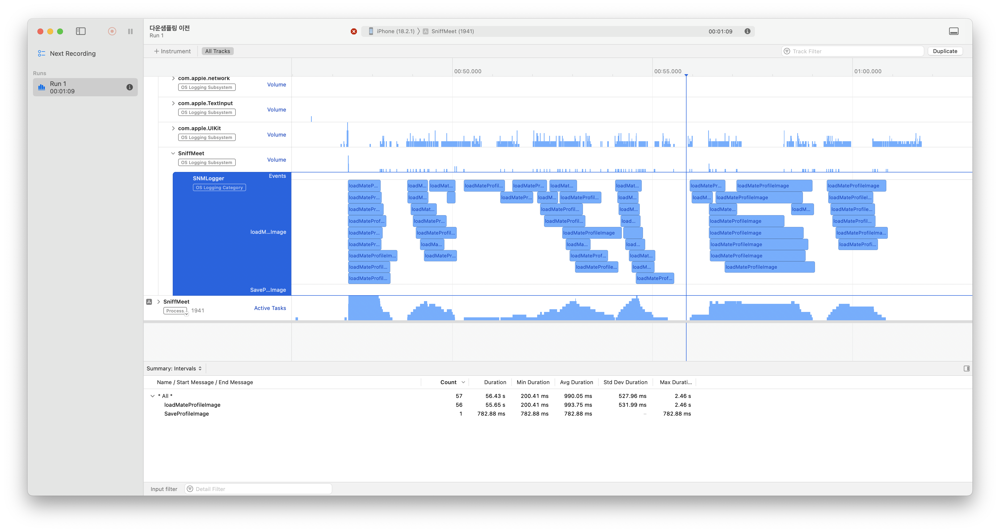

## 들어가며

성능 개선을 하려면 먼저 어떤 작업이 얼마나 걸리는지 볼 수 있어야 한다. CPU 사용량만 보면 어느 시점에 부하가 생겼는지는 알 수 있지만, 앱 내부의 어떤 작업이 그 구간에 실행됐는지는 바로 드러나지 않는다.

그래서 Instruments에서 앱 내부 작업 구간을 이름으로 확인할 수 있도록 `OSSignposter`를 래핑해보기로 했다.

## 어디에 붙일까?

처음에는 측정용 타입을 따로 만들지, 기존 `SNMLogger`에 붙일지 고민했다.

```swift
private static let logger: Logger = Logger(
    subsystem: "SniffMeet",
    category: "SNMLogger"
)
```

별도의 `SNMBenchMarker` 같은 타입을 만들 수도 있었지만, 이미 프로젝트에 로그 시스템이 있었기 때문에 기존 `SNMLogger`에 통합하는 쪽을 선택했다.

## start/end 방식과 closure 방식

작업 시간을 재는 API는 크게 두 방식으로 생각할 수 있었다.

하나는 `start`와 `end`를 직접 호출하는 방식이다. 이 방식은 비동기 작업에서도 원하는 구간을 감쌀 수 있지만, 시작과 끝의 짝을 잘 관리해야 한다.

```swift
let state = SNMLogger.begin(name: "RegisterProfile")
// measured work
SNMLogger.end(name: "RegisterProfile", state: state)
```

다른 하나는 closure로 감싸는 방식이다.

```swift
measure(name: "RegisterProfile") {
    // measured work
}
```

closure 방식은 호출부가 깔끔하지만, 비동기 작업을 다룰 때 캡처와 실행 범위가 애매해질 수 있었다. 당시 측정 대상에는 `Task`, 네트워크 요청, 이미지 저장처럼 비동기 흐름이 많았기 때문에 start/end 방식이 더 맞다고 봤다.

## 구현

최종적으로 `SNMLogger`에 `OSSignposter`를 감싼 메서드를 추가했다.

```swift
enum SNMLogger {
    private static let logger: Logger = Logger(
        subsystem: "SniffMeet",
        category: "SNMLogger"
    )
    private static let poster: OSSignposter = OSSignposter(logger: logger)
}

extension SNMLogger {
    static func begin(name: StaticString) -> OSSignpostIntervalState {
        let id = poster.makeSignpostID()
        return poster.beginInterval(name, id: id)
    }

    static func end(name: StaticString, state: OSSignpostIntervalState) {
        poster.endInterval(name, state)
    }

    static func emitEvent(name: StaticString) {
        let id = poster.makeSignpostID()
        poster.emitEvent(name, id: id)
    }
}
```

`begin`에서 signpost ID를 만들고, `OSSignpostIntervalState`를 반환한다. 이후 `end`에 같은 state를 넘겨 구간을 닫는다. 이렇게 하면 호출부에서 시작과 끝을 명시적으로 관리할 수 있다.

## 사용 예시

이후 프로필 등록 흐름의 지연 시간을 확인하기 위해 임시로 signpost를 심었다.

```swift
func signInWithProfileData(dogInfo: UserInfo, imageData: (png: Data?, jpg: Data?)) {
    Task {
        let state = SNMLogger.begin(name: "RegisterProfile")
        do {
            try await SupabaseAuthManager.shared.signInAnonymously()
            // save user info, upload profile image...
        } catch {
            presenter?.didFailToSaveUserInfo(error: error)
        }
        SNMLogger.end(name: "RegisterProfile", state: state)
    }
}
```

## Instruments에서 확인

Signpost를 추가한 뒤 Instruments에서 앱 내부 작업 구간을 이름으로 볼 수 있었다.



캡처에서는 `loadMateProfileImage`, `SaveProfileImage` 같은 작업 구간이 표시된다. 단순히 CPU 그래프만 보는 것보다, 특정 시점에 어떤 앱 내부 작업이 실행됐는지 확인하기 쉬워졌다.

## 정리

이번 작업은 최적화 자체가 아니라, 최적화를 위한 관찰 지점을 만드는 작업이었다.

`OSSignposter`를 직접 여러 곳에서 다루기보다 `SNMLogger`에 감싸두면, 필요한 구간에 짧게 측정 코드를 심고 Instruments에서 확인할 수 있다. 특히 비동기 작업이 많은 흐름에서는 closure보다 begin/end 방식이 더 다루기 쉬웠다.

## 레퍼런스

[Recording Performance Data | Apple Developer Documentation](https://developer.apple.com/documentation/os/recording-performance-data)
