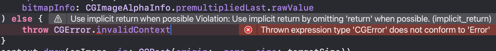

## 개요

사용자가 고해상도 사진을 그대로 업로드하면, 앱에서는 훨씬 작은 크기로만 이미지를 표시하는데도 원본 이미지를 계속 전송하고 저장하게 된다.

SniffMeet에서도 프로필 이미지는 홈 화면의 프로필 카드나 메이트 리스트의 작은 썸네일로 표시되는 경우가 대부분이었다. 그런데 원본 이미지를 그대로 업로드하고, 목록에서도 같은 이미지를 다시 내려받고 있었다.

불필요한 네트워크 사용량과 메모리 사용을 줄이기 위해 두 가지를 적용했다.

- 업로드 전에 프로필 이미지를 앱에서 필요한 크기로 다운샘플링한다.
- 메이트 리스트에서는 원본 프로필 이미지가 아니라 별도의 썸네일 이미지를 내려받는다.

## 다운샘플링 기준 정하기

이미지를 어느 크기까지 줄일지 먼저 정해야 했다. 기준은 앱에서 프로필 이미지가 가장 크게 표시되는 홈 화면의 프로필 카드로 잡았다.

프로필 카드 뷰는 오토레이아웃으로 크기가 결정되기 때문에 디바이스별로 표시 크기가 달라질 수 있다. 그래서 몇 가지 디바이스에서 프로필 카드 크기를 확인했다.

| 디바이스 | 프로필 카드 크기 |
| --- | --- |
| iPhone 16 Pro Max | 392 x 591 |
| iPhone SE 3 | 327 x 372 |
| iPhone 12 mini | 327 x 453 |

가장 큰 표시 크기는 iPhone 16 Pro Max의 `392 x 591`이었다. 모든 디바이스에 맞춰 각각 다른 크기로 저장하기보다는, 가장 큰 표시 크기를 기준으로 하나의 목표 크기를 정하는 편이 단순했다.

비율 기반으로 줄이는 방식도 생각했지만, 원본 이미지 크기가 제각각이면 결과 크기도 제각각이 된다. 예를 들어 `8000 x 4000` 이미지를 절반으로 줄여도 여전히 `4000 x 2000`이고, `1000 x 500` 이미지를 절반으로 줄이면 기준 크기에 못 미칠 수 있다.

그래서 비율이 아니라 앱에서 필요한 최대 표시 크기를 기준으로 다운샘플링하기로 했다.

## ImageDownsampler

이미지를 실제로 줄이는 역할은 `ImageDownsampler`가 맡는다.

먼저 target size를 기준으로 `CGContext`를 만든다.

```swift
private func resizeImage(to targetSize: CGSize) -> CGContext? {
    let colorSpace = CGColorSpaceCreateDeviceRGB()
    return CGContext(
        data: nil,
        width: Int(targetSize.width),
        height: Int(targetSize.height),
        bitsPerComponent: 8,
        bytesPerRow: 0,
        space: colorSpace,
        bitmapInfo: CGImageAlphaInfo.premultipliedFirst.rawValue
    )
}
```

다운샘플링할 때는 원본 이미지의 가로, 세로 중 짧은 쪽을 기준으로 비율을 계산했다. 원본 비율은 유지하되, 앱에서 필요한 표시 크기를 넘지 않도록 줄이는 방식이다.

```swift
func downscaleProfileImage(_ data: Data) async throws -> Data {
    guard let cgImage = CGImage.createFromData(data: data) else {
        throw ImageSamplingError.invalidImageData
    }

    let ratio = cgImage.width > cgImage.height
        ? ImageConstants.profileTargetSize.height / Double(cgImage.height)
        : ImageConstants.profileTargetSize.width / Double(cgImage.width)

    let newSize = CGSize(
        width: Double(cgImage.width) * ratio,
        height: Double(cgImage.height) * ratio
    )

    guard let context = resizeImage(to: newSize) else {
        throw ImageSamplingError.downsamplingFailed
    }

    context.draw(cgImage, in: CGRect(origin: .zero, size: newSize))

    guard let data = context.makeImage()?.jpgData else {
        throw ImageSamplingError.downsamplingFailed
    }
    return data
}
```

## 저장 흐름에 적용하기

프로필 저장 과정에서는 프로필용 이미지와 리스트용 썸네일을 함께 만든다. 둘 다 비용이 있는 작업이라 Swift Concurrency로 비동기 처리했다.

```swift
let downsampledImageData = try await downsampledData
let thumbnailImageData = try await thumbnailData

async let uploadDownsampled: () = remoteImageManager.upload(
    imageData: downsampledImageData,
    fileName: fileName,
    mimeType: .image
)

async let uploadThumbnail: () = remoteImageManager.upload(
    imageData: thumbnailImageData,
    fileName: thumbnailName,
    mimeType: .image
)

try await uploadDownsampled
try await uploadThumbnail
```

이렇게 저장하면 프로필 화면에서는 다운샘플링된 이미지를 사용하고, 메이트 리스트에서는 더 작은 썸네일만 내려받을 수 있다.

## 메이트 리스트에서 썸네일만 불러오기

메이트 리스트에서는 원본 프로필 이미지 대신 `thumbnail_` prefix가 붙은 이미지를 요청하도록 바꿨다.

```swift
func requestProfileImage(id: UUID, imageName: String) {
    Task { @MainActor in
        let imageData = try await requestProfileImageUseCase.execute(
            fileName: "thumbnail_\(imageName)"
        )
        presenter?.didFetchProfileImage(id: id, imageData: imageData)
    }
}
```

목록 화면은 작은 이미지만 필요하므로, 여기서 원본 이미지를 내려받는 것은 낭비였다. 썸네일을 분리하면 메이트 수가 늘어날수록 네트워크 사용량 차이가 더 커진다.

## 측정 결과

동일한 UI 테스트로 20개의 메이트 프로필 이미지를 불러오며 적용 전후를 비교했다. 실제 사용자가 올릴 가능성이 높은 사진 형식에 맞추기 위해 PNG는 측정 대상에서 제외했다.

네트워크는 Instruments의 Network에서 `SniffMeet` 프로세스의 `Bytes In`을 기준으로 봤다. 테스트 러너나 소유자를 식별하기 어려운 `Unknown` 트래픽은 앱 내부 이미지 로딩 효과를 설명하기 어렵기 때문에 제외했다.

| 항목 | 적용 전 | 적용 후 | 감소율 |
| --- | ---: | ---: | ---: |
| Network Bytes In | 18.37 MiB | 1.29 MiB | 약 93.0% |
| Allocations Persistent Heap | 38.83 MiB | 5.93 MiB | 약 84.7% |
| VM Tracker Resident Size | 812.61 MiB | 647.38 MiB | 약 20.3% |
| VM Tracker Dirty Size | 278.23 MiB | 100.94 MiB | 약 63.7% |

시간 지표는 로컬 환경의 영향을 크게 받을 수 있어 제외했다. 대신 같은 화면을 구성할 때 실제로 내려받은 데이터와, 테스트가 끝난 시점에 살아 있던 메모리 지표를 비교했다.

가장 직접적인 변화는 네트워크 수신량이었다. 메이트 리스트에서는 작은 썸네일만 필요하므로, 원본 프로필 이미지를 내려받지 않는 것만으로도 수신량이 `18.37 MiB`에서 `1.29 MiB`로 줄었다.

메모리에서도 같은 흐름을 확인할 수 있었다. Allocations의 `Persistent Heap`은 `38.83 MiB`에서 `5.93 MiB`로 줄었고, VM Tracker의 `Resident Size`와 `Dirty Size`도 함께 감소했다. 단순히 네트워크 사용량만 줄어든 것이 아니라, 목록 화면에서 이미지 데이터를 다루는 부담 자체가 작아진 셈이다.

## 삽질 메모

`CGError`는 `Error`를 채택하지 않는다.



## 정리

이미지 최적화는 단순히 파일 하나를 줄이는 작업이 아니었다. 앱에서 실제로 필요한 표시 크기를 정하고, 저장용 이미지와 목록용 썸네일을 분리해야 했다.

다운샘플링으로 프로필 이미지를 필요한 크기까지 줄이고, 메이트 리스트에서는 썸네일만 불러오도록 바꾸면서 네트워크와 메모리 사용량을 함께 줄일 수 있었다.

## 레퍼런스

[Converting bitmap data between Core Graphics images and vImage buffers | Apple Developer Documentation](https://developer.apple.com/documentation/accelerate/converting_bitmap_data_between_core_graphics_images_and_vimage_buffers)
