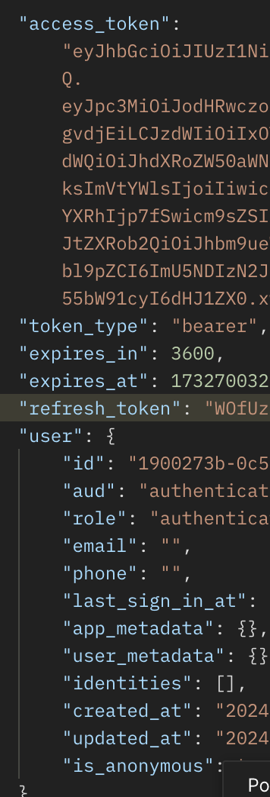

## 익명 로그인 생성, 복원, 갱신 로직 구현

JWT, Refresh Token, 세션의 개념이 아직 명확하게 정리되지 않은 상태에서 익명 계정을 먼저 만들게 됐다. 개념이 명확하지 않아서, 세션 관리에 꽤 애를 먹었는데, 앱 재실행 이후에도 익명 계정을 어떻게 이어서 사용할지부터 정리할 필요가 있었다.

생성, 복원, 갱신 로직은 서로 밀접하게 연결되어 있어서, 처음 앱을 실행했을 때와 다시 실행했을 때의 흐름을 먼저 구분해야 했다.

### 실제 문제 해결 과정

먼저 시점별로 세션 상태를 표로 정리했다.

|  | 최초로 앱 실행 | 앱 다시 실행 | 실행 중 |
| --- | --- | --- | --- |
| 라이브 세션 | X | X | O |
| 유저 정보 | X | X | O |
| 키체인 저장 토큰 | X | O | O |

이 표를 기준으로, 앱이 실행될 때는 키체인에 토큰이 있는지 먼저 확인하고, 없으면 익명 로그인을 새로 수행하도록 정리했다.

토큰이 있다면 복원을 시도하고, 복원이 실패할 때만 익명 로그인을 수행하는 흐름으로 잡았다.

#### 갱신 로직

1. 현재 세션에서 `Refresh Token`을 가져온다.
2. `Refresh Token`으로 네트워크에 `JWT Token` 갱신을 요청한다.
3. 새로 받아온 토큰으로 현재 토큰을 업데이트한다.

### 복원 로직

1. 키체인에서 토큰을 가져와 세션을 업데이트한다.
2. 토큰이 만료되었는지 확인한다. 토큰 만료 시점을 가지고 있으므로 서버와 연결 없이 바로 확인할 수 있다.
3. 만료된 토큰이라면 갱신을 요청한다.
4. 만료되지 않은 토큰이라면 서버에 유저 정보를 요청한다. 키체인에는 유저 정보가 없기 때문이다.
5. 새로 받아온 토큰, 유저 정보로 세션 객체를 생성한다.

### 해결 과정 중 추가적으로 알게 된 부분

우선, JWT의 수명이 1시간으로 매우 짧다. 또한 갱신을 수행했을 때 토큰만 내려주는 것이 아닌, 세션 전체가 응답으로 내려온다.

따라서 세션 복원과 세션 갱신을 굳이 크게 구분할 필요가 없다고 판단했고, 복원 로직을 수정했다.

#### 수정된 복원 로직

갱신 자체가 토큰만 갱신하는 것이 아닌 세션 전체를 갱신하는 로직이기 때문에, 복원작업이 갱신과 큰 차이가 없게 되었다.

기존 복원 로직처럼 토큰을 불러오고, 만료 시점을 계산하고, 유저 정보를 요청하고... 하는 것 보다 바로 갱신하는 것이 로직이 훨씬 간단해진다.

1. (만료 여부랑 상관없이) 키체인에서 토큰을 가져와서 세션을 업데이트한다.
2. (만료 여부랑 상관없이) 바로 세션 갱신을 요청하여 서버에서 세션을 받아와서 세션 객체를 생성한다.

## 정리

세션 복원과 갱신은 처음엔 별개처럼 보였지만, 실제로는 서로 거의 붙어 있는 흐름이었다.  

키체인에 토큰이 있느냐를 기준으로 앱 첫 실행과 재실행을 나누고, 결국에는 서버에서 세션 전체를 다시 받아오는 방식으로 정리하면서 구조가 훨씬 단순해졌다.
