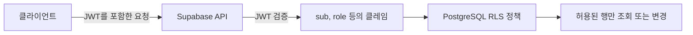

Supabase Auth로 로그인하면 클라이언트는 Access Token으로 JWT를 받는다. Supabase는 요청에 포함된 JWT를 검증하고, 그 안의 사용자 정보와 역할을 RLS 정책에 전달한다.



## JWT의 클레임

JWT는 헤더, 페이로드, 서명으로 구성된다. 각 부분은 Base64URL로 인코딩되지만 암호화되지는 않으므로 페이로드에 비밀 정보를 넣으면 안 된다. 서명은 헤더와 페이로드가 변조되지 않았는지 검증하는 데 사용한다.

Supabase의 JWT에는 다음과 같은 클레임이 포함된다.

- `sub`: 사용자의 고유 ID
- `role`: RLS를 적용할 PostgreSQL 역할
- `iat`: 토큰이 발급된 시각
- `exp`: 토큰이 만료되는 시각

## Supabase에서 JWT 사용하기

RLS는 PostgreSQL이 행 단위로 접근을 제한하는 기능이다. Supabase에서는 `auth.uid()`로 현재 JWT의 `sub` 값을 가져와 행의 사용자 ID와 비교할 수 있다.

```sql
alter table profiles enable row level security;

create policy "Users can read their own profile"
on profiles
for select
to authenticated
using ((select auth.uid()) = user_id);

create policy "Users can create their own profile"
on profiles
for insert
to authenticated
with check ((select auth.uid()) = user_id);
```

`USING`은 기존 행을 조회하거나 변경할 수 있는지 검사하고, `WITH CHECK`는 새로 생성되거나 수정된 행이 조건을 만족하는지 검사한다. 따라서 수정 정책에는 두 조건이 함께 필요할 수 있다.

## anon 역할과 익명 사용자

Supabase의 `anon` 역할과 익명 로그인 사용자는 서로 다르다. 로그인하지 않은 요청은 `anon` 역할을 사용하지만, `signInAnonymously()`로 생성한 사용자는 JWT를 발급받고 `authenticated` 역할을 사용한다. 영구 사용자와 구분해야 한다면 JWT의 `is_anonymous` 클레임을 확인할 수 있다.

결국 JWT는 사용자가 누구인지 전달하고, RLS는 그 정보를 이용해 어떤 행에 접근할 수 있는지 결정한다.

## 참고

- [JSON Web Token](https://supabase.com/docs/guides/auth/jwts)
- [Row Level Security](https://supabase.com/docs/guides/database/postgres/row-level-security)
- [Anonymous Sign-Ins](https://supabase.com/docs/guides/auth/auth-anonymous)
