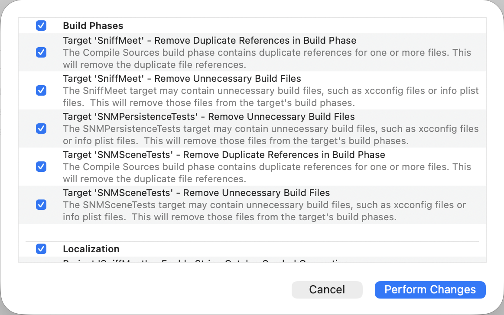
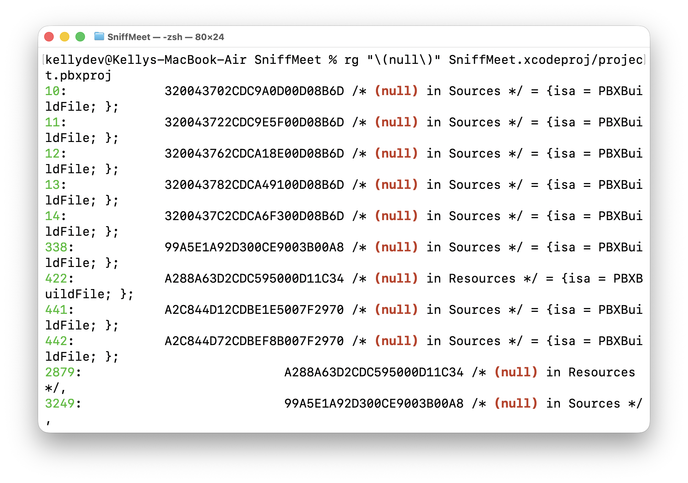

## 작업 내역



Xcode에서 프로젝트 파일 관련 경고가 많이 떠서 정리했다.

## 작업 내역

### null 파일 제거

```
320043702CDC9A0D00D08B6D /* (null) in Sources */ = {isa = PBXBuildFile; };
320043722CDC9E5F00D08B6D /* (null) in Sources */ = {isa = PBXBuildFile; };
320043762CDCA18E00D08B6D /* (null) in Sources */ = {isa = PBXBuildFile; };
320043782CDCA49100D08B6D /* (null) in Sources */ = {isa = PBXBuildFile; };
3200437C2CDCA6F300D08B6D /* (null) in Sources */ = {isa = PBXBuildFile; };
```

이전에 있었던 구조 변경이나, git 충돌/머지 등 다양한 이유로 프로젝트 파일 안에 `(null)` 파일을 참조하는 라인이 많이 있었다.

```zsh
rg "\(null\)" SniffMeet.xcodeproj/project.pbxproj
```



`(null)` 파일의 참조를 제거하는건 위험하지 않은 작업이라서 과감하게 제거했다.


### 중복으로 잡혀있는 항목 제거하기

```text
A2CF8D1C2D79B71F00FAB817 /* Release.xcconfig in Resources */ = {isa = PBXBuildFile; fileRef = A2CF8D1B2D79B71F00FAB817 /* Release.xcconfig */; };
A2CF8D1D2D79B71F00FAB817 /* Debug.xcconfig in Resources */ = {isa = PBXBuildFile; fileRef = A2CF8D1A2D79B71F00FAB817 /* Debug.xcconfig */; };
A2CF8D1E2D79B71F00FAB817 /* Release.xcconfig in Resources */ = {isa = PBXBuildFile; fileRef = A2CF8D1B2D79B71F00FAB817 /* Release.xcconfig */; };
A2CF8D1F2D79B71F00FAB817 /* Debug.xcconfig in Resources */ = {isa = PBXBuildFile; fileRef = A2CF8D1A2D79B71F00FAB817 /* Debug.xcconfig */; };
A2CF8D202D79B71F00FAB817 /* Release.xcconfig in Resources */ = {isa = PBXBuildFile; fileRef = A2CF8D1B2D79B71F00FAB817 /* Release.xcconfig */; };
A2CF8D212D79B71F00FAB817 /* Debug.xcconfig in Resources */ = {isa = PBXBuildFile; fileRef = A2CF8D1A2D79B71F00FAB817 /* Debug.xcconfig */; };
```

`Release.xcconfig`와 `Debug.xcconfig` 파일의 경우 앱 타겟 뿐만 아니라 테스트에도 적용되는 컨픽 파일이기 때문에 `/Resource` 외부에 있어야 한다. 

프로젝트 초반에 이 파일들을 몇 번 이동시키도 했고, 하술할 이유 때문에도 여러 유령 참조들이 생긴 것 같아서, 전부 제거했다.

### CI 워크플로우 수정

```zsh
touch SniffMeet/SniffMeet/Resource/Release.xcconfig
echo "SERVER_URL" = ${{ secrets.SERVER_URL }} >> SniffMeet/SniffMeet/Resource/Release.xcconfig
echo "PUBLIC_KEY" = ${{ secrets.PUBLIC_KEY }} >> SniffMeet/SniffMeet/Resource/Release.xcconfig
echo "NOTIFICATION_SERVER" = ${{ secrets.NOTIFICATION_SERVER }} >> SniffMeet/SniffMeet/Resource/Release.xcconfig
```

`/Resource` 내부에 `Release.xcconfig`을 생성하는 부분을 제거했다. 이미 프로젝트 파일 바로 아래 디렉토리에 `Release.xcconfig`, `Debug.xcconfig`을 생성하고 있기 때문에, 불필요하다.

### 빌드 페이즈에 중복된 파일 제거하기

```text
A24CD92B2D362E8F00492339 /* NearByProfileDropUsecase.swift in Sources */,
99525F132D6E80FB00B6E17E /* SigninRouter.swift in Sources */,
A24CD92B2D362E8F00492339 /* NearByProfileDropUsecase.swift in Sources */,
(중략)
3200445E2CE5CA1B00D08B6D /* SaveUserInfoUsecase.swift in Sources */,
99525F102D6E80C300B6E17E /* SigninPresenter.swift in Sources */,
FD14C2752DD4739F00AC9ABB /* SignInEmailUsecase.swift in Sources */,
3200445E2CE5CA1B00D08B6D /* SaveUserInfoUsecase.swift in Sources */,
```

`NearByProfileDropUsecase.swift`와 `SaveUserInfoUsecase.swift` 두 파일이 빌드 페이즈에 중복으로 포함되어 있었다.

원인은 프로젝트 파일을 옮기거나 수정하는 과정에서 같은 파일이 서로 다른 참조로 다시 추가되었기 때문으로 보인다. Xcode 프로젝트는 파일 경로만 보는 것이 아니라 내부 UUID 기준으로 관리되기 때문에, 같은 실제 파일이라도 중복 등록이 생길 수 있다.

### 설정 수정하기

iOS 빌드 버전이 18.0으로 되어있던 것을 15.0으로 변경했다. 프로젝트의 iOS 최소 요구 사항이 iOS 15.0 이고 특정 버전을 요구하는 기능도 아닌데, iOS 18.0 이상을 요구하는 테스트가 있었다.

프로젝트 전반적으로 최소 요구 iOS 버전과, 각 타겟들의 최소 요구 iOS 버전을 15.0 으로 맞췄다.

```
IPHONEOS_DEPLOYMENT_TARGET = 15.0;
```

### SceneTest 삭제

현재 SceneTest가 제대로 된 테스트 기능을 수행하지 못한다고 판단하여 삭제했다.

1. 테스트가 실제 로직을 검증하지 못하고 있다.
2. Spy가 메소드 호출만 검증하고 있다.
3. Mock 객체가 내부 구현 없이 그냥 프로토콜을 채택만 하고 실제 테스트에서 의미있게 사용되고 있지 않다.
4. 테스트 타겟이 빌드 페이즈 파일을 전부 다 포함하고 있다. 타겟 앱보다 더 많은 파일을 컴파일 한다.

또한, 테스트가 정확하게 수행되고 있지 않는데도, 프로젝트 구조가 조금 변하거나, 새로운 기능이 추가되었을 때마다 컴파일 에러를 일으켰다. 

테스트 자체는 큰 의미를 가지지 못하고 컴파일 통과 자체에 가까운 상태였고, 테스트는 컴파일만 되면 통과하니, 의미가 없어지고 컴파일 통과하기에 더 많은 노력이 들어가고 있었다.

새로 작성하는 것이 좋다는 판단 하에 삭제했다.

## 추가 사항

현재 프로젝트 내부에 중복으로 레퍼런스가 잡힌 파일도 있습니다. 대표적으로 `SaveUserInfoUsecase.swift`가 있습니다.

```text
3200445E2CE5CA1B00D08B6D /* SaveUserInfoUsecase.swift in Sources */ = {isa = PBXBuildFile; fileRef = 3200445D2CE5CA1A00D08B6D /* SaveUserInfoUsecase.swift */; };
32BD484E2D3FF02C0078DA9C /* SaveUserInfoUsecase.swift in Sources */ = {isa = PBXBuildFile; fileRef = 3200445D2CE5CA1A00D08B6D /* SaveUserInfoUsecase.swift */; };
3200445D2CE5CA1A00D08B6D /* SaveUserInfoUsecase.swift */ = {isa = PBXFileReference; lastKnownFileType = sourcecode.swift; path = SaveUserInfoUsecase.swift; sourceTree = "<group>"; };
```

같은 빌드 페이즈에 레퍼런스가 2개 잡혀있는데, 이건 일부러 건들지 않았다. 각자 브랜치를 나눠서 작업하고 있는데, 여기서 수정된 브랜치를 merge 받아서 각자 충돌 해결을 해야한다.

팀원들이 단체로 머지한 이후에, 수정사항을 dev 브랜치 적용한 이후에 다시 브랜치를 따면 충돌 해결을 한 번만 해도 되기 때문에, 일단은 부채 사항으로 남겨두었다.

## 마무리

이번 정리를 통해 프로젝트 파일 안에 쌓여 있던 유령 참조와 중복 항목들을 조금 정리할 수 있었다. 작은 작업처럼 보여도 이런 찌꺼기들을 하나씩 치워 두면 빌드 경고를 줄이고 프로젝트 구조를 파악하는 데 훨씬 도움이 된다.

앞으로도 프로젝트 파일이 다시 꼬이지 않도록 주기적으로 확인해봐야겠고, Tuist를 다음부턴 적용해봐야겠다.
