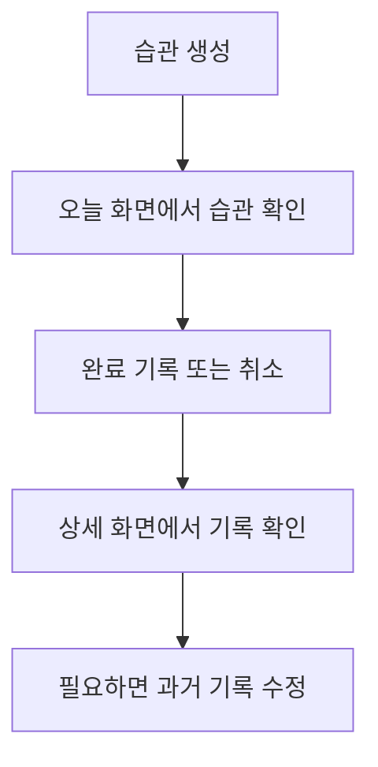

## 시작하기

애플 리마인더나 마이크로소프트 To do를 쓰면 매일 해야하는 일들을 관리할 수 있다.

나도 매일 LeetCode Daily를 풀고, Bing 출석체크를 하고, 매일 TIL 을 적으려고 한다.



하지만 기본적으로 Reminder, Todo 앱과 습관 형성 앱은 차이가 있다. 

첫 번째로 기능 요구사항이 다르다. 애플 리마인더는 매일 반복해야 하는 태스크를 하지 않았을 경우에, 날짜가 새로 갱신되지 않고, 그 날짜에 계속 남아있는다. 마이크로소프트 To do는 하루를 빠뜨리면 그 태스크가 사라지지 않고 누적된다.

내가 원하는 습관 형성 앱은 리마인더의 방식, 마이크로소프트 투 두의 방식 등등을 포괄할 수 있는 앱이었다.

### 습관 타입

우선 어떤 습관들이 있고, 그 습관을 어떻게 관리해야 할지 표로 만들어서 정리했다. 4가지의 타입을 만들었고, 예시도 같이 적었다.

| 타입 | 의미 | 예시 | 잘 맞는 경우 |
| --- | --- | --- | --- |
| 주기형 | 일정 간격으로 했는지 여부를 체크하는 방식 | 리트코드 데일리, 방 청소 | 주기적인 실천이 중요한 습관 |
| 횟수형 | 하루 안에서 몇 번 했는지를 세는 방식 | 물 마시기 8잔, 푸시업 30개, 메모 3개 작성 | 반복 횟수가 중요한 습관 |
| 총량형 | 전체 기간 동안 누적된 양을 보는 방식 | 독서 300쪽, 운동 10시간 | 누적 성과가 중요한 습관 |
| 타이머형 | 시작 시점부터 시간이 얼마나 지났는지 보는 방식 | 금연, 금주 | 끊는 것 자체가 중요한 습관 |

StackDay는 이 두 가지 감정에서 출발한 습관 추적 앱이다. 과거의 미완료를 계속 보여주기보다 오늘의 실천에 집중하게 하고, 기록이 끊겨도 부담 없이 다시 돌아올 수 있는 경험을 만드는 것이 목표다.

### 스트릭

이런 앱들은 주로 스트릭이 있다. 앞서 말한 리마인더와 투 두는 앱의 목적 자체가 스트릭이 필요 없기 때문에 지원하지 않는다.

스트릭은 분명하게 직관적이고 간단한 동기부여지만, 역효과를 만들기도 한다. 예를 들어서 LeetCode Daily 스트릭을 쌓아가고 있는데, 하루 안하면 쌓인 스트릭이 와르르 무너지게 된다.



즉 공든 탑이 한순간에 와르르 무너지는 경험을 할 수 있다. 

이를 방지하기 위해 많은 스트릭을 지원하는 앱에서 '스트릭 보호'와 같은 기능들을 넣는데, Stack Day에선 스트릭도 사용자가 계산 방식을 선택할 수 있었으면 좋겠다는 생각을 했다.

스트릭 정책은 어떤 것들을 지원해야 하는지에 대해서 생각을 좀 했고, 우선 어떻게 스트릭을 계산할 것인지 타입을 표로 정리했다.

| 방식 | 의미 | 장점 | 단점 |
| --- | --- | --- | --- |
| 진짜 스트릭 | 한 번이라도 실패하면 스트릭이 바로 끊김 | 성취감이 강함 | 한 번 실수하면 쉽게 꺾임 |
| 보호 스트릭 | 특정 조건마다 스트릭 실패 보호 | 회복력이 좋음 | 엄격한 느낌은 조금 줄어듦 |
| 스트릭 없음 | 스트릭 대신 총 수행일/비율만 봄 | 부담이 적음 | 연속성 자극은 약함 |

그러면 스트릭을 표시하는 방식에 대한 생각도 했다. 박살난 스트릭은 보고싶어하는 사람이 많지 않을 것 같다.

| 방식 | 의미 |
| --- | --- |
| 현재 스트릭 | 지금 이어가고 있는 스트릭을 강조 |
| 최대 스트릭 | 지금까지 달성한 가장 긴 스트릭을 강조 |

여기까지가 1차 기획의 끝이었다. 그냥 투두 앱에 적당히 정책을 덧붙인 정도의 앱이라 생각했고 바로 구현에 들어갔다.

## 뒤엎기

구현을 시작한지 2일이 안되어서 싹 버리기로 했다.



기본적으로 '습관을 반복하는 앱'과 '해야 할 일을 기록하는 앱'은 다른 앱이다. 해결하려는 문제부터 다르고, 결국 데이터 자체도 달라져야 한다.

초반임에도 에이전트가 쏟아내는 코드를 이해하기 어려워졌고, 에이전트도 너무 얇은 기획 컨텍스트만 있어서 스스로 앱을 추측하면서 만들기 시작했다. 내가 그걸 직접 수정하는 것도 시간이 오래 걸리고, 갈수록 프로젝트가 망가지는 기분이 들었다.

'Stack Day가 어떤 앱인지부터 다시 명확하게 정해보자' 라는 생각을 했고, 코드들을 싹 밀어버렸다.

## StackDay가 해결하려는 문제

StackDay는 해야 할 일을 빠짐없이 처리하도록 돕는 To do 앱이 아니다. 사용자가 반복하고 싶은 행동을 꾸준히 이어가고, 그 흐름을 기록할 수 있도록 돕는 습관 앱이다.

> StackDay는 할 일을 관리하는 것이 아니라, 실제로 이어온 습관을 기록하고 관리할 수 있어야 한다.

이 원칙은 어떤 기능을 제공할지 결정하는 기준이 된다. 기록은 사용자의 실제 행동을 반영해야 하므로 과거 기록은 수정할 수 있다. 어제 책을 읽었지만 기록하지 못했다면 나중에 그 사실을 반영할 수 있어야 한다. 

반면 아직 실천하지 않은 미래의 행동을 미리 완료로 기록할 수는 없다. 미래의 계획이 아니라 실제로 이어온 행동의 흐름을 기록하는 것이 StackDay의 목적이기 때문이다.

## MVP 범위 정하기

처음 MVP에서는 매일 기록하는 습관만 지원하기로 했다. 위 표에서 '주기형'에 해당하고, 주기 중에서도 매일 기록해야 하는 케이스이다.

데일리형은 하루에 해당 습관을 수행했는지만 기록한다. 예를 들면 매일 LeetCode Daily를 풀기, 명상하기, 영양제 먹기 같은 습관이다. 횟수나 누적량을 다루지 않아도 습관 기록, 날짜 처리, 스트릭, 통계, 시각화라는 핵심 흐름을 충분히 보여줄 수 있다.

MVP의 사용자 흐름은 다음처럼 단순하게 잡았다.

화면도 네 개면 충분하다.

- 오늘 습관 목록
- 습관 생성과 수정
- 습관 상세
- 과거 기록 편집

로그인, 서버, 클라우드 동기화, 알림, 위젯, 여러 종류의 차트는 MVP에서 제외했다. 이 기능들이 중요하지 않아서가 아니라, StackDay의 핵심 경험을 검증하는 데 당장 필요하지 않기 때문이다. 

우선 로컬 저장만으로 앱을 재실행해도 습관과 기록이 유지되는 흐름을 완성하는 것을 목표로 한다...

## 최소한의 정책

앱에서 정책을 정해야, 구현 과정중에 흔들리지 않을 수 있다. 이미 코드를 작성했는데 정책을 붙여나가다 보면 기존 코드와 충돌하는 부분이 있을 수도 있다.

정책은 아직 사용자에게 보이는 기능이라기보다, 이후 도메인과 데이터 모델이 따라야 할 기준에 가깝다. 예를 들어 완료 기록을 취소했을 때 단순히 체크 표시만 지우는 것이 아니라, 스트릭과 완료율도 같은 원본 데이터에서 다시 계산할 수 있어야 한다.

### 기록 가능한 날짜

완료 기록은 습관이 유효한 기간에만 생성하거나 수정할 수 있다.

- 미래 날짜에는 기록을 생성하거나 수정할 수 없다.
- 습관 생성일 이전에는 기록을 생성하거나 수정할 수 없다.

### 과거 기록 수정

과거의 실제 수행 여부를 반영하기 위해 이전 날짜의 기록을 수정할 수 있다.

#### 미완료 → 완료

예시: 어제 책을 읽었지만 완료를 기록하지 않았다.

- 해당 날짜의 엔트리 생성
- 인라인 안내 표시
- 스트릭 및 통계 즉시 재계산

#### 완료 → 미완료

예시: 실수로 완료를 기록했다.

- 해당 날짜의 엔트리 삭제
- 스트릭 및 통계 즉시 재계산

### 기록 중복

동일한 습관은 동일 날짜에 하나의 완료 기록만 가질 수 있다.

### 습관 보관

습관을 더 이상 이어나가진 않지만 기존 기록을 보존하고 싶은 경우

- 오늘 화면에서 제외
- 신규 기록 생성 중단
- 기존 엔트리 유지
- 기존 통계 조회 가능

### 습관 삭제

습관과 관련된 모든 데이터를 제거한다.

- 습관 삭제
- 관련 엔트리 삭제
- 관련 통계 삭제
- Alert 보여주기

### 미완료

오늘은 아직 완료할 수 있는 시간이 남아 있으므로, 스트릭을 종료하지 않는다. 하루가 종료되고도 완료 기록이 없으면, 스트릭이 끊긴 것으로 처리한다.

### 스트릭

- 매일 수행하는 습관을 기준으로 계산한다.
- 연속해서 완료한 날짜를 현재 스트릭으로 계산한다.
- 최고 스트릭은 현재 스트릭과 별도 계산한다.

## 다음 단계

기획과 정책을 정리하고 나니, 이제 어떤 데이터를 실제로 저장해야 하는지 고민할 수 있게 되었다.

다음은 도메인 모델링 -> 데이터 모델링 -> 유즈케이스 산출 순서로 컨셉을 검증하고, 수정하는 과정에 대해 기록한다.
