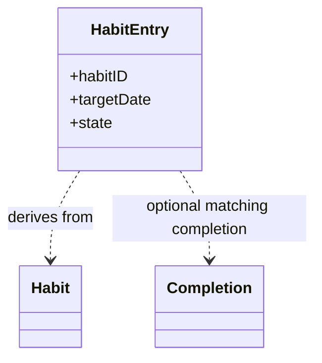
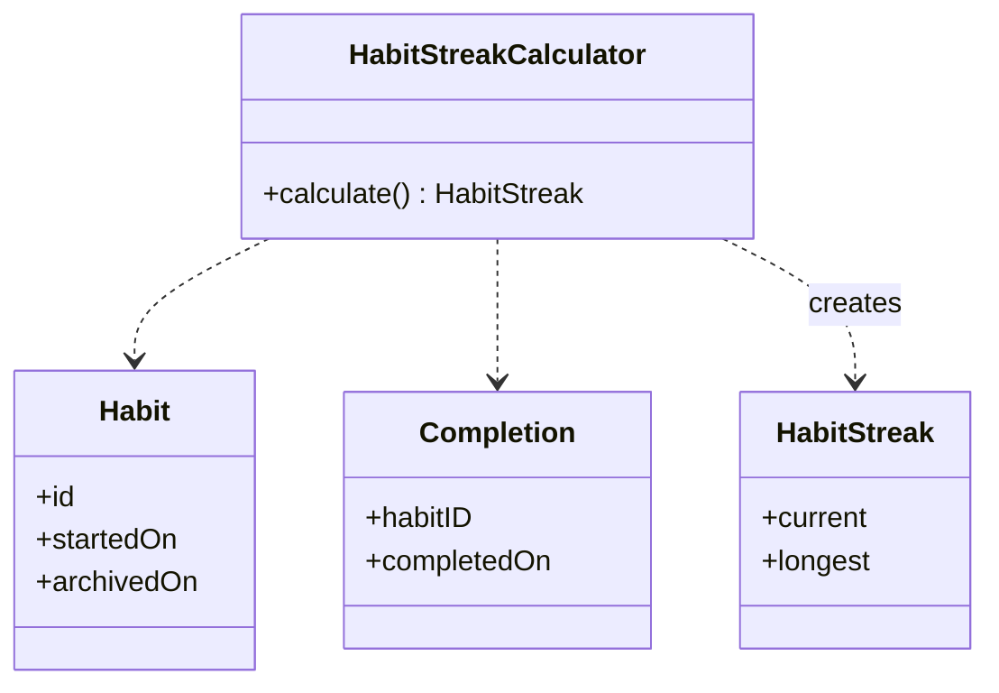

앞서 도메인, 데이터 모델링한 내용을 실제 코드로 옮기기 시작했다. 

모델 자체의 구조는 이미 정해져 있었지만 코드로 구현하니 `Habit Entry`같은 파생 값들은 어디서 생성해야 하는지 책임이 정해지지 않았다.

## Completion

먼저 습관을 수행했다는 사실을 기록하는 `Completion`을 구현했다.

```swift
struct Completion: Equatable {
    let id: UUID
    let habitID: UUID
    let completedOn: Date
    let recordedAt: Date
}
```

`Completion`은 저장되는 원본 데이터이므로 완료 사실을 표현하는 데 필요한 값만 가진다.

미래의 날짜인지, `Habit`의 시작일 이전인지, 같은 날짜의 `Completion`이 이미 존재하는지와 같은 검증은 `Completion` 하나만으로 판단할 수 없기 때문에 넣지 않았다.

## HabitEntry

`HabitEntry`는 특정 날짜에 Habit이 어떤 상태인지를 표현하는 파생 값이다.

상태는 세 가지다.

```swift
enum State: Equatable {
    case pending
    case completed
    case missed
}
```

Habit과 날짜, Completion을 바탕으로 상태를 결정한다.

- 해당 날짜의 Completion이 존재하면 `completed`
- 오늘이고 Completion이 없다면 `pending`
- 과거이고 Completion이 없다면 `missed`

또한 Habit의 추적 기간 밖에 있는 날짜에는 Entry 자체가 존재하지 않는다.

이 과정에서 아카이브 날짜의 경계도 확정했다. `archivedOn` 당일은 마지막 추적일로 포함한다.

```text
startedOn <= targetDate <= archivedOn
```

처음에는 다음과 같이 구현했다.

```swift
init(
    habit: Habit,
    targetDate: Date,
    completions: [Completion],
    referenceDate: Date
) throws
```

`HabitEntry`가 전체 Completion 목록을 받아 자신의 Habit과 날짜에 대응하는 Completion을 직접 찾았다.

```swift
if completions.contains(where: {
    $0.habitID == habit.id &&
    $0.completedOn == targetDate
}) {
    state = .completed
}
```

뭔가 이상하지 않나? `HabitEntry`가 앱에서 생성된 모든 `Completion`을 순회하면서 자신에 맞는 `Completion`을 찾고 있다.

`HabitEntry`가 상태를 결정하기 위해 알아야 하는 것은 해당 날짜의 `Completion`이 존재하는지만 알면 된다. 이를 위해서 전체 `Completion`을 순회할 책임은 없다.

그래서 입력을 바꿨다.

```swift
init(
    habit: Habit,
    targetDate: Date,
    completion: Completion?,
    referenceDate: Date
) throws
```

이제 `Completion`을 찾는 책임은 외부(유즈케이스)에 있고, `HabitEntry`는 전달받은 정보로 상태만 결정한다.

```swift
if completion != nil {
    state = .completed
} else if targetDate == referenceDate {
    state = .pending
} else {
    state = .missed
}
```



`Completion`의 전체 목록을 받는 것을 수정 후에는 자신의 상태를 결정하는 데 필요한 하나의 `Completion?`에만 의존하도록 했다.

## HabitStreak

다음으로 현재 스트릭과 최장 스트릭을 구현했다.

Streak 역시 저장하지 않는다. `Habit`의 추적 기간과 `Completion` 기록을 바탕으로 계산할 수 있는 파생 값이다.

처음에는 `HabitStreak` 자체에서 모든 계산을 수행했다.

```swift
struct HabitStreak: Equatable {
    let current: Int
    let longest: Int

    init(
        habit: Habit,
        completions: [Completion],
        referenceDate: Date,
        calendar: Calendar = .current
    ) {
        // streak calculation
    }
}
```

구현하고 나니 `HabitStreak`이 두 가지 역할을 하고 있었다. 현재 스트릭과 최장 스트릭이라는 값을 저장하면서, 동시에 `Habit`과 `Completion`을 이용해 그 값을 직접 계산하고 있었다.

생각해보면 `HabitStreak`은 계산을 수행하는 객체라기보다 계산이 끝난 결과를 표현하는 값에 가깝다. 

그래서 스트릭을 계산하는 책임은 별도로 분리하고, `HabitStreak`은 계산된 현재 스트릭과 최장 스트릭만 가지도록 변경했다.

```swift
struct HabitStreak: Equatable {
    let current: Int
    let longest: Int
}
```

계산은 `HabitStreakCalculator`로 이동했다.

```swift
struct HabitStreakCalculator {
    func calculate(
        habit: Habit,
        completions: [Completion],
        referenceDate: Date,
        calendar: Calendar = .current
    ) -> HabitStreak {
        // ...
    }
}
```



이제 `HabitStreak`은 계산 방법을 알 필요 없이 결과만 표현하게 된다. Calculator의 계산 과정도 역할별로 나눴다.

```swift
let completedDays = makeCompletedDays(...)
let longest = calculateLongestStreak(
    // ...
)
let current = calculateCurrentStreak(
    // ...
)

return HabitStreak(
    current: current,
    longest: longest
)
```

## Calculator는 어떤 타입이어야 할까?

여기까지 만들고 나니 `HabitStreakCalculator`을 어떤 타입으로 둬야 할지도 고민하게 되었다. 

현재 Calculator는 공유해야 할 상태도 없고, 변경 가능한 상태도 없다. 따라서 클래스의 reference semantics가 필요하지 않고, 액터로 격리해야 할 상태 역시 없다.

그렇다면 `enum`과 static method를 사용해야 하나?

```swift
enum HabitStreakCalculator {
    static func calculate(...) -> HabitStreak {
        // ...
    }
}
```

하지만 Streak 계산은 정책에 영향을 받는 로직이다. 이후 정책이 추가되면 Calculator가 다른 객체나 설정을 의존하게 될 가능성이 있다.

당장 static 함수 모음으로 고정할 이유도 없다고 판단해 일단 `struct`로 유지했다.

여기서 `struct`와 `class`를 고르는 기준도 다시 생각하게 됐다. 단순히 상태가 있는가 없는가만으로 결정하기보다는, 그 객체에 identity와 reference semantics가 필요한가를 먼저 보는 편이 더 적절하다.

현재 `HabitStreakCalculator`에는 둘 다 필요하지 않다.

```swift
struct HabitStreakCalculator
```

## 정리

모델링 단계에서는 저장해야 하는 값과 파생 값을 구분하는 데 집중했다.

그런데 이를 코드로 옮기다 보니, 파생 값이라는 이유만으로 계산 과정까지 모두 책임져야 하는 것은 아니라는 점이 보였다.

`HabitEntry`는 파생 값이지만 전체 `Completion`을 탐색할 필요는 없었다. 필요한 Completion?만 전달받아 자신의 상태를 결정하면 된다.

`HabitStreak` 역시 파생 값이지만, 자신을 계산하는 방법까지 알 필요는 없었다.

그래서 구현하면서 책임을 한 번 더 나눴다.

```text
HabitEntry
[Completion] 탐색 + 상태 결정
        ↓
Completion?을 받아 상태 결정

HabitStreak
계산 + 결과 표현
        ↓
HabitStreakCalculator → HabitStreak
```

도메인 모델에서 어떤 데이터를 원본으로 두고 무엇을 파생할지 정하는 것과, 실제 코드에서 그 파생 과정을 어느 타입이 책임질지를 정하는 것은 별개의 문제다.
