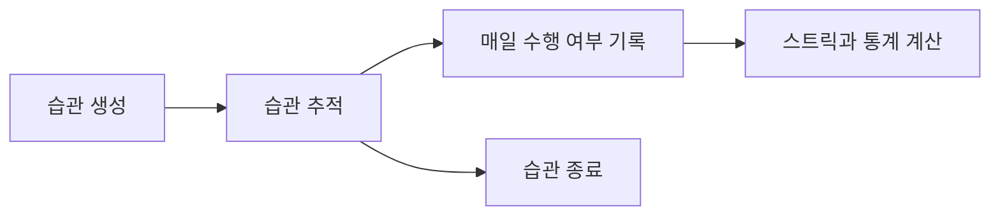
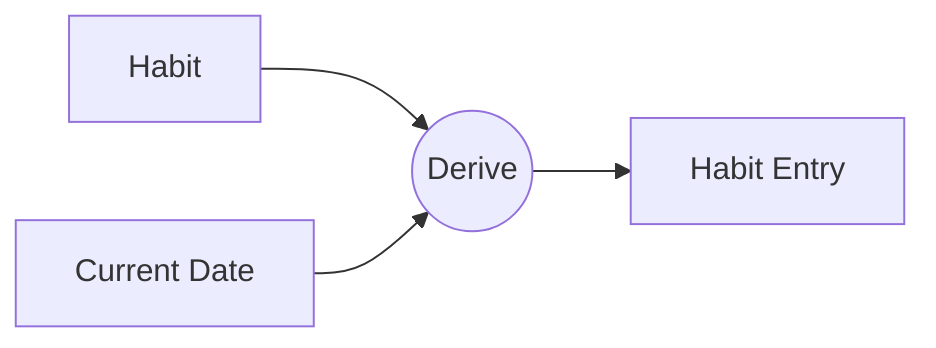
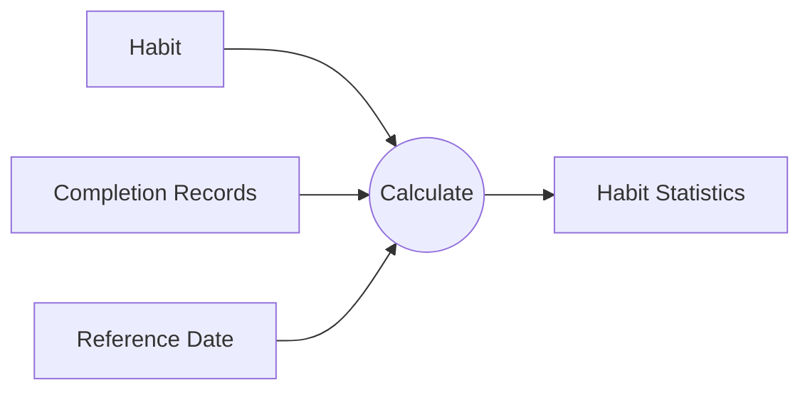
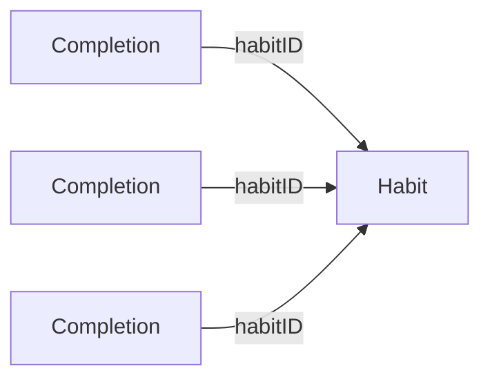

StackDay의 MVP 범위와 정책을 가지고 앱의 도메인과 데이터를 모델링한다.

도메인 모델링 -> 데이터 모델링 -> 유즈케이스 검증 순서로 진행하고, 각각의 단계가 이전 단계를 검증하는 방향이다.

## 앱의 핵심 동작

[이전 포스트]()에서 정한 앱의 컨셉과 정책에서부터, 이 앱이 어떤 동작을 해야 할지 먼저 정리했다.



사용자가 습관을 만들면 그날부터 습관의 추적이 시작된다. 사용자는 매일 습관을 수행했는지 기록하고, 앱은 누적된 기록을 바탕으로 현재 스트릭과 통계를 보여준다. 더 이상 이어가지 않을 습관은 추적을 종료할 수 있다.

흐름 자체는 단순하다. 하지만 실제로 구현하려면 몇 가지 개념을 더 명확하게 정의할 필요가 있었다. 

- 특히 오늘 해야 하는 습관을 어떻게 표현할까 
- 실제로 수행한 기록을 어떻게 표현할까

이 부분을 정하기 위해서 도메인과 용어를 확실하게 정리해야 한다.

## 핵심 도메인 용어 정리

앞에서 정리한 동작을 구현하려면 먼저 앱에서 어떤 정보를 다뤄야 하는지 정할 필요가 있었다. 가장 먼저 필요한 것은 당연히 습관이다.

아직 구현이나 데이터 구조를 결정하는 단계는 아니므로, 여기서는 구체적인 타입이나 프로퍼티보다는 각 도메인 용어의 의미와 역할을 중심으로 정리했다. 

저장을 위한 객체 뿐만 아니라 행위나 상태도 같이 정리했고, 아직 코드도 아닌데 코드 블록에 넣기는 싫어서 이태릭체로 적었다.

### *Habit*

*Habit*은 사용자가 지속하려는 행동을 정의하는 핵심 Entity다. 예를 들면 '매일 책 읽기'나 '매일 명상하기' 같은 습관 하나를 표현한다.

*Habit*은 이름뿐 아니라 언제부터 추적하는지와 현재 추적 중인지도 알아야 한다. MVP에서는 다음 정도의 정보를 가진다.

- 습관 정의(이름)
- 추적 시작일
- 생명주기 상태

*Habit*의 생명주기는 *Active*와 *Archived*로 나눴다. *Active*는 현재 추적 중인 습관이고, *Archive*는 추적하지 않는 습관이다. 이전 정책에서 정했듯이, 습관을 보관하더라도 기록은 사라지지 않는 대신에, 아래의 *Habit Entry*를 생성하지 않는다.

### *Habit Entry*

특정 Habit의 수행 단위를 *Habit Entry* 라고 한다. To-do 앱과 비교하면 눈에 보는 지금 당장 해야 할 항목에 해당한다.



*Habit Entry*는 *Habit*과 현재 날짜를 결합하면 생성된다.



#### *Entry State*

현재 엔트리의 상태를 나타낸다.

- *Pending*: 평가 대상이지만 아직 완료되지 않은 상태고, 마감 시간이 종료되지 않음
- *Completed*: 완료된 상태
- *Missed*: 평가 대상이었지만, 완료되지 않은 채로 마감 시간이 지남

### *Completion*

*Completion*은 특정 날짜의 *Habit*을 사용자가 실제로 완료했다는 사실을 나타낸다.

예를 들어서 '매일 책을 읽는다' 라는 *Habit*이 존재하고, 오늘 그 *Habit*을 수행했으면, *Completion*이 생성된다. 

따라서 *Completion*과 *Habit*과 *Habit Entry*의 관계는 다음과 같이 된다.

```text
Habit + Date -> Habit Entry
Habit Entry + Completion + Date -> Entry State
```

*Completion*은 *Habit Entry* 의 단순한 상태가 아니라 그 *Entry*가 완료되었다는 사실만을 기록한다.

이미 정책에서 '중복 완료'는 되지 않는다고 만들었기 때문에, *Completion*은 고유해야 한다.

### *Habit Statistics*

지금까지 쌓인 수행 기록을 사용자에게 보여주기 위한 통계이다. 사용자가 직접 생성하거나 수정하는 데이터가 아니며, *Habit*과 *Completion*을 기반으로 계산되는 값들이다.

#### *Streak*

*Habit*이 연속해서 완료된 기간을 나타내는 객체이다. 시작일, 종료일, 연속 완료 횟수 등을 가지고 있다.

### *Arhive & Deletion*

*Habit*을 변화시키는 행위다. *Archive*는 *Habit*이 더 이상 *Habit Entry*를 만들지 않도록 하고. *Deletion*은 *Habit*과 그 관련된 정보를 제거한다.

정책에서 직접적으로 파생된 행위이다.

## 도메인에서 데이터로

앞에서는 각 도메인 개념의 역할과 관계만 정리했다. 이제 이 개념들을 실제로 저장할 수 있는 데이터 형태로 옮겨볼 차례다.

여기서부터는 각 개념이 어떤 정보를 가져야 하는지 조금 더 구체적으로 정리했다. 예를 들어 Habit은 언제부터 추적을 시작했는지, 언제 추적을 종료했는지를 알아야 하고, Completion은 실제 수행 날짜와 기록된 시각을 구분할 필요가 있다.

이런 정보들을 하나씩 필드로 옮기면서 저장 모델을 정리했다. 도메인 객체를 크게 원본 데이터와 파생 데이터로 나눴다. 우선 나눈 결과는 다음과 같다.

- 원본 데이터: Habit, Completion
- 파생 데이터: HabitEntry, HabitStatistics, Streak

### 엔트리는 어떻게 가지고 있어야 하나?

처음에는 *Habit*이 여러 *Habit Entry*를 가지고 있어야 한다고 생각했다. 코드로 표현하면 대략적으로 다음과 같다.

```swift
struct Habit {
    //...
    var entries: [HabitEntry]
}
```

그런데, 특정 날짜에 한 내역을 보려면 모든 *Habit*을 보면서 그 내부에 있는 *HabitEntry*를 파싱해야하나? 라는 생각이 들었고, *Habit*과 *HabitEntry*를 따로 저장하는게 어떤가 싶었다.

```swift
var habits: [Habit]
var habitEntries: [HabitEntries]
```

하지만 *Habit Entry*는 사용자가 직접 만든 사실이 아니다. *Habit*이 존재하고, 그 *Habit*을 추적해야 하는 날짜가 주어지면 자연스럽게 생성되는 하루치 수행 단위다.

그리고 엔트리의 상태는 *Completion*이 있는지와 기준 시점에 따라 달라진다. 

즉, HabitEntry는 별도 테이블이나 모델로 저장해야 하는 원본 데이터가 아니라, 조회 시점에 *Habit*, *Completion*, 현재 시간을 조합해 만드는 파생 도메인 객체가 된다.

```swift
var habits: [Habit]
var completions: [Completion]
```

이렇게 두면 과거의 미완료 항목을 매일 생성하거나 지우지 않아도 된다. 오늘 화면에서는 오늘 날짜의 Entry만 만들면 되고, 월간 히트맵에서는 해당 월의 날짜들에 대해 Entry를 만들면 된다.

### 통계와 스트릭도 저장할 필요가 없다.

현재 스트릭, 최고 스트릭, 총 완료일, 완료율은 화면에서 중요하게 보여줄 값이다. 

하지만 이 값들도 사용자가 직접 수정하는 데이터는 아니다. *Habit*과 *Completion*, 그리고 기준 날짜에서 파생되는 값들이다.



스트릭 역시 *Completion*들을 바탕으로 계산할 수 있다.

처음부터 통계를 계산하는 대신, 이전 계산 결과를 캐시하거나 특정 시점의 값을 남겨두어 계산량을 줄일 수도 있다. 다만 MVP에서는 이런 최적화가 꼭 필요하다고 보지는 않았다.

그래서 우선은 `Habit`과 `Completion`만 원본 데이터로 저장하고, 통계와 스트릭은 필요할 때 다시 계산하기로 했다. 

## 저장 모델은 단순하게

실제로 영속화되는 관계는 다음처럼 정리된다.

```text
Habit 1 --- * Completion
```

Habit 하나는 여러 Completion을 가질 수 있고, Completion은 반드시 하나의 Habit에 속한다. 관계 자체는 단순하지만, 이 구조만으로 오늘 화면, 과거 기록 수정, 스트릭, 월간 히트맵까지 만들 수 있다.



모델을 단순하게 유지할 수 있었던 이유는 저장하는 데이터와 계산하는 데이터를 구분했기 때문이다. 화면에 필요하다는 이유만으로 모든 값을 저장하면, 나중에 어떤 값이 사실이고 어떤 값이 결과인지 알기 어려워진다.

## 유즈케이스로 다시 검증하기

도메인 모델을 정리한 뒤에는 실제 사용자 흐름을 유즈케이스로 옮겨보며 모델을 다시 검증했다. 

앱의 핵심 동작을 하나씩 적어보고 유즈케이스의 입력, 출력, 동작을 정의한 이후 앞에서 정의한 모델이 실제 앱의 동작을 설명할 수 있는지 검증하는 과정이다.

### 유즈케이스 목록

위에서 언급한 앱의 핵심 동작을 기반으로, 다음과 같은 8개의 유즈케이스 목록을 만들었다.

- CreateHabitUseCase: 습관 생성
- ArchiveHabitUseCase: 습관 보관
- DeleteHabitUseCase: 습관 삭제
- RecordCompletionUseCase: 완료 기록
- CancelCompletionUseCase: 완료 취소
- LoadTodayEntriesUseCase: 오늘의 엔트리 목록 조회
- LoadHabitStatisticsUseCase: 습관 통계 조회
- LoadMonthlyEntriesUseCase: 특정 습관의 월간 엔트리 조회

### 유즈케이스 기반으로 정책, 모델링 보완하기

이 과정에서 미처 정하지 않았던 정책도 발견했다.

예를 들어 `Habit`을 보관하는 날짜 당일까지 추적할 것인지, 보관한 뒤에도 과거 `Completion`을 수정할 수 있는지 결정할 필요가 있었다. 

모델 자체의 한계가 드러나는 경우도 있었다. 모델링 했을 때, `Habit`은 하나의 `startedOn`과 `archivedOn`만 가지기 때문에 보관한 `Habit`을 다시 시작하면 여러 추적 기간을 표현할 수 없다. 

이를 지원하려면 별도의 `TrackingPeriod` 같은 모델이 필요하지만, MVP에서는 `Habit` 재개를 지원하지 않는 것으로 범위를 정했다.

삭제에서도 추가로 고려할 점이 생겼다. `Habit`을 삭제할 때 관련 `Completion`도 함께 제거되어야 하므로, 둘은 중간 상태가 남지 않도록 하나의 작업처럼 처리할 필요가 있다.

이런 방식으로 유즈케이스를 작성하는 과정을 모델을 실제 동작에 대입해보는 검증 과정으로 사용했다.

동작을 끝까지 설명할 수 없다면 빠진 정책이 있거나 현재 모델로 표현할 수 없는 경우이고, 반대로 자연스럽게 설명할 수 있다면 모델에 불필요한 상태를 추가하지 않아도 된다는 것을 확인할 수 있다.

## 정리

이번 모델링에서는 화면에 보이는 상태를 그대로 저장하기보다, 그 상태를 다시 만들 수 있는 원본 데이터를 남기는 방향으로 정리했다.

특히 StackDay에서는 날짜도 상태를 결정하는 입력이 된다. `Completion`이 없는 오늘의 엔트리는 `Pending`이지만, 하루가 지나면 같은 엔트리가 `Missed`가 된다. 데이터가 바뀌지 않아도 기준 시점에 따라 상태가 달라진다.

따라서 수행한 날짜의 `Completion`만 기록하면 엔트리의 상태와 통계, 스트릭은 필요할 때 다시 계산할 수 있다. 과거 기록을 수정할 때도 `Completion` 하나를 추가하거나 제거하면 나머지 값이 함께 따라온다.

결국 MVP에서는 `Habit`과 `Completion`을 원본으로 두고, 나머지는 이 두 데이터에서 파생하는 모델로 정리했다.
