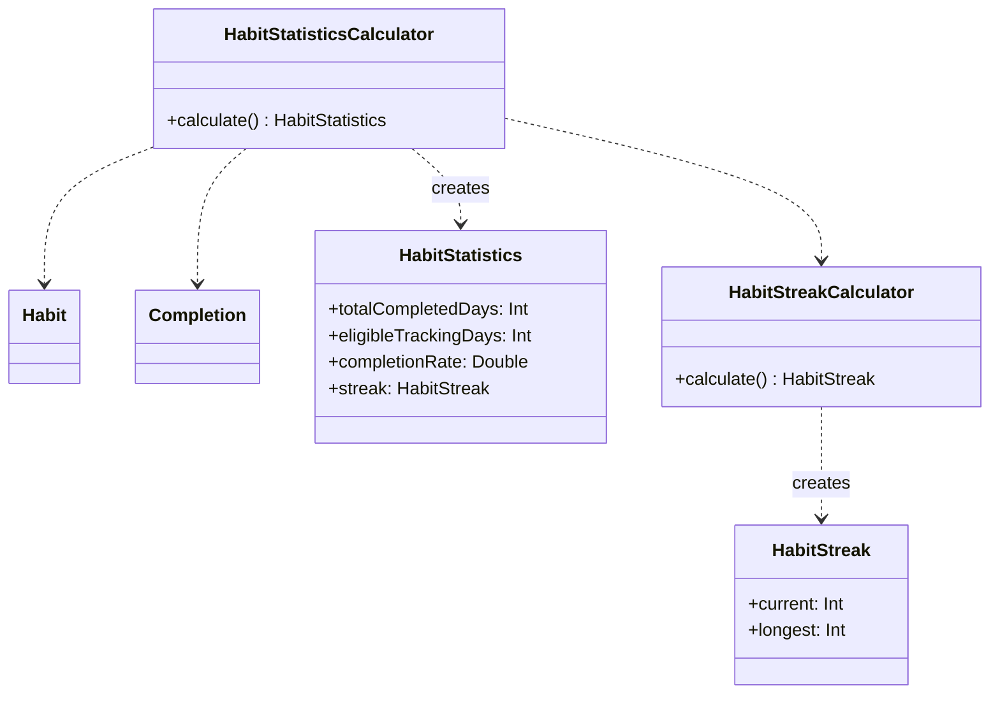
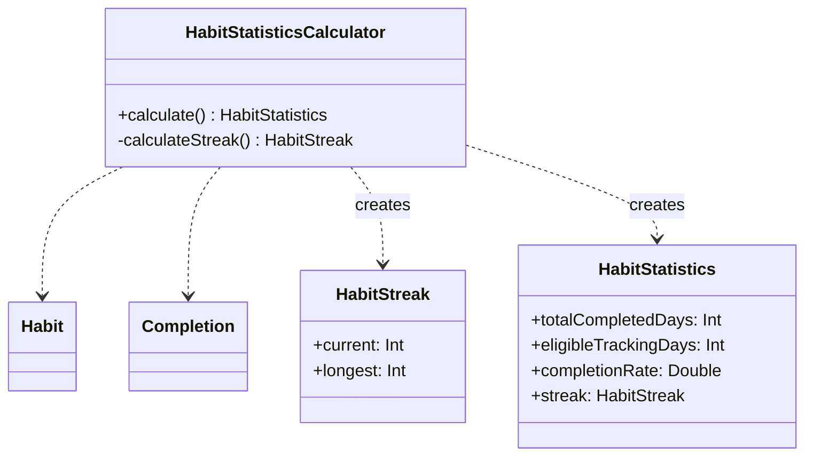

이전 작업에서 `HabitStreak`을 구현하면서 계산 결과와 계산 로직을 분리했다.

`HabitStreak`은 현재 스트릭과 최장 스트릭이라는 값만 표현하고, 계산은 `HabitStreakCalculator`가 담당한다.

```swift
struct HabitStreak: Equatable {
    let current: Int
    let longest: Int
}

struct HabitStreakCalculator {
    func calculate(
        habit: Habit,
        completions: [Completion],
        referenceDate: Date,
        calendar: Calendar = .current
    ) -> HabitStreak {
        // ...
    }
}
```

같은 원리로 `HabitStatistics`도 파생 값과 계산 책임을 분리해서 구현했다.

## HabitStatistics

`HabitStatistics`는 Habit의 수행 기록을 요약한 파생 값이다.

MVP에서는 다음 값을 제공한다.

```swift
struct HabitStatistics: Equatable {
    let totalCompletedDays: Int
    let eligibleTrackingDays: Int
    let completionRate: Double
    let streak: HabitStreak
}
```

`totalCompletedDays`는 추적 기간 안에서 완료한 날짜의 수이고, `eligibleTrackingDays`는 시작일부터 기준일까지 추적 대상이 된 날짜의 수다. 아카이브된 Habit은 `archivedOn`을 마지막 추적일로 사용한다.

`completionRate`는 두 값으로 계산한다.

```swift
completionRate = totalCompletedDays / eligibleTrackingDays
```

이 값들은 저장하지 않는다. `Habit`, `[Completion]`, 기준 날짜가 있으면 다시 계산할 수 있다.

에이전트가 작성한 코드에서는 `HabitStatistics`의 이니셜라이저에서 계산까지 처리했다.

```swift
init(
    habit: Habit,
    completions: [Completion],
    referenceDate: Date,
    calendar: Calendar = .current,
    streakCalculator: HabitStreakCalculator
) {
    // eligible tracking days
    // completed days
    // completion rate
    // streak
}
```

`HabitStatistics`는 계산 결과를 표현하는 값이다. 계산까지 맡기면 `HabitStreak`에서 분리했던 책임을 다시 합치게 된다.

따라서 `HabitStatisticsCalculator`를 만들었다.



## 계산마다 Calculator가 필요한가?

`HabitStatistics`에는 `HabitStreak`이 포함된다. 따라서 `HabitStatisticsCalculator`는 통계를 계산하면서 `HabitStreakCalculator`를 사용한다.

문제는 두 Calculator가 계산에 필요한 데이터를 각각 준비한다는 점이다.

둘 다 Habit의 시작일과 기준일로 추적 기간을 정하고, `[Completion]`에서 해당 Habit과 추적 기간에 포함되는 완료 기록을 골라낸다.

```text
HabitStatisticsCalculator
├─ tracking range 계산
├─ Completion 필터링
└─ HabitStreakCalculator
   ├─ tracking range 계산
   └─ Completion 필터링
```

Streak과 Statistics는 서로 다른 결과지만 같은 추적 기간과 `Completion`을 기반으로 계산한다. 하지만 지금 상태는 별도의 Calculator로 분리하면서 같은 데이터를 두 번 다루게 된다.

여기서 결과와 계산을 분리하는 것과 계산마다 별도의 타입을 만드는 것은 다른 문제라고 봤다.

## HabitStreakCalculator 제거

`HabitStreakCalculator`를 제거하고 Streak 계산을 `HabitStatisticsCalculator` 안으로 옮겼다.

`HabitStreak`은 그대로 유지한다.

```swift
struct HabitStreak: Equatable {
    let current: Int
    let longest: Int
}
```

Streak은 여전히 현재 스트릭과 최장 스트릭을 묶어서 표현하는 하나의 값이다. 없어진 것은 이 값을 계산하기 위한 별도의 타입이다.



Streak 계산 자체는 함수로 분리한다. 별도의 타입이 없어도 계산 책임을 구분할 수 있다.

## 책임의 경계와 타입의 경계

`HabitStreak`은 계산 결과만 표현하고, Streak 계산은 굳이 분리하지 않고, `HabitStatisticsCalculator` 내부 함수로 두었다.

```text
Derived Value
     ↑
Calculator
```

별도의 상태나 identity가 필요하거나, 독립적인 의존성을 가지거나, 구현을 교체해야 하는 등의 이유가 있다면 타입을 분리할 수 있지만 지금의 Streak 계산에는 그런 경계가 필요하지 않아보인다...

책임을 구분하는 것과 타입을 구분하는 것은 별개의 문제다. 지금은 `HabitStatisticsCalculator` 안에서 함수로 나누는 것으로 충분하다.

## 정리

이번에는 `HabitStreak`이라는 결과 타입은 유지하고, 계산은 `HabitStatisticsCalculator` 내부 함수로 합쳤다.

처음에는 책임을 분리하면 이를 별도의 타입으로 만들어야 한다고 생각했다. 그래서 `HabitStreak`에서 계산 책임을 떼어내면서 `HabitStreakCalculator`를 만들었다.

하지만 책임을 분리하는 것과 타입을 분리하는 것은 별개의 문제다. 

함수로도 충분히 책임을 나눌 수 있고, 타입을 추가하려면 그 타입이 별도로 존재해야 할 이유가 필요하다.
