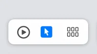
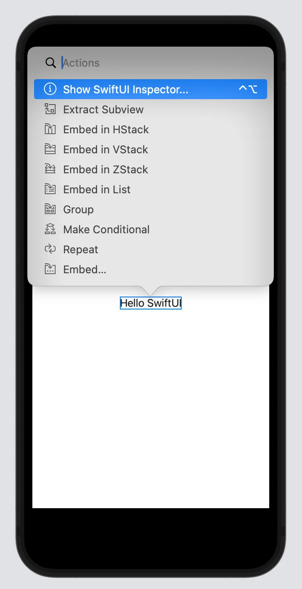
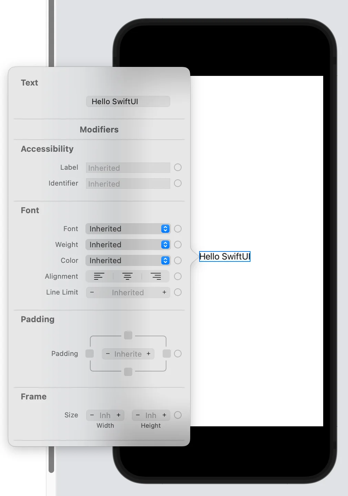
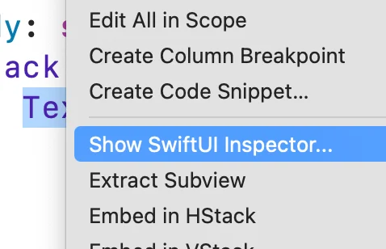
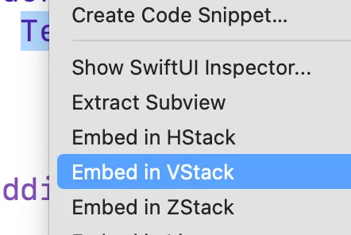
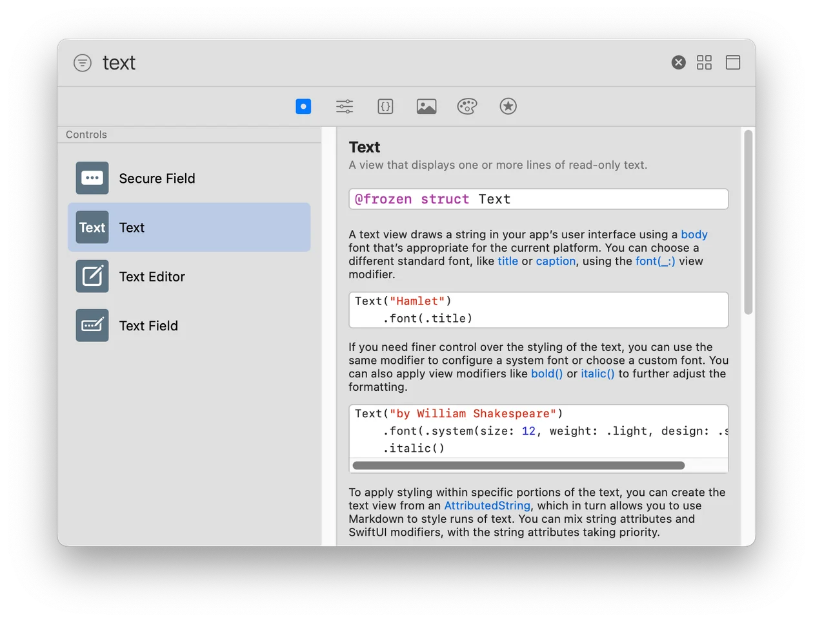
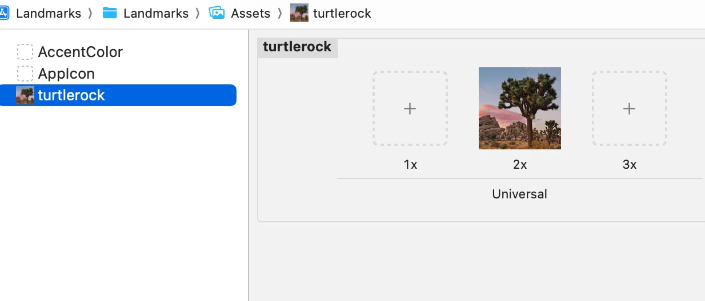
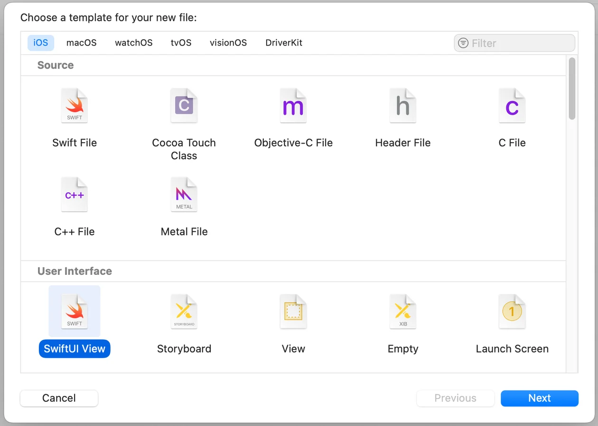
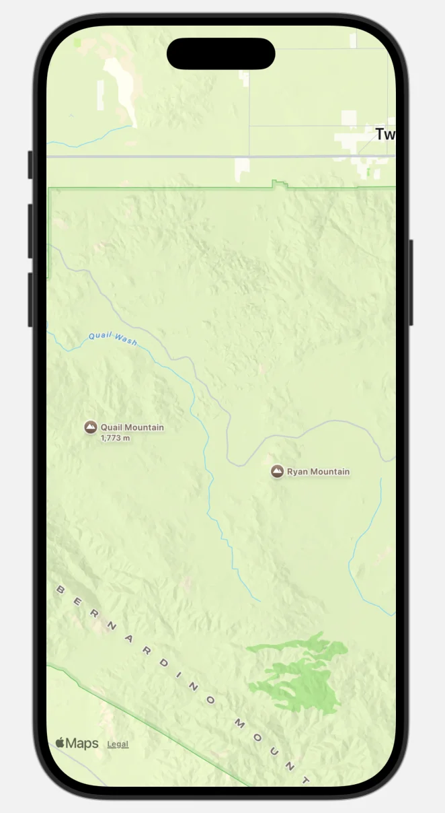
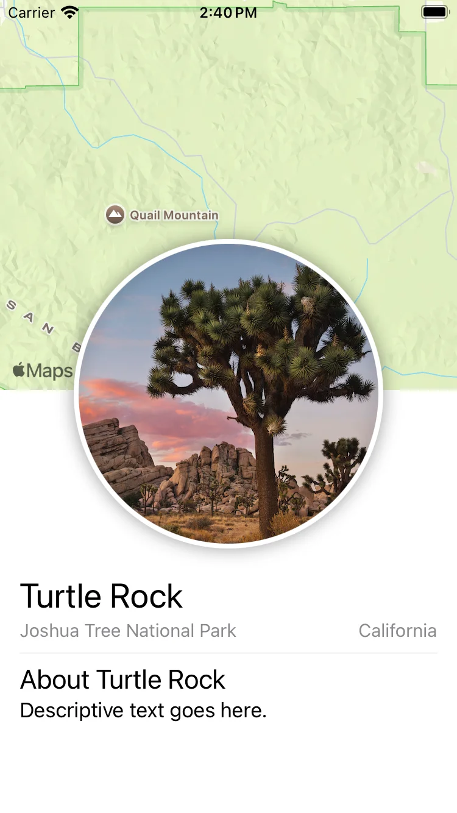

## Section 1. Create a new project and explore the canvas

SwiftUI를 사용하는 새로운 Xcode 프로젝트를 만든다. 캔버스, 미리보기 및 SwiftUI 템플릿 코드를 탐색한다.

### Step 1-3

프로젝트 생성 부분

### Step 4

SwiftUI 앱 라이프 사이클을 사용하는 앱은 `App` 프로토콜을 컨펌하는 스트럭처를 가지고 있다. 스트럭처의 `body` 프로퍼티는 디스플레이에 보여줄 컨텐츠를 제공하는 하나 이상의 씬이 있다. `@main` 어트리뷰트는 앱의 엔트리 포인트를 지정한다.


```swift
//
//  LandmarksApp.swift
//  Landmarks
//
//  Created by Kelly Chui on 6/25/25.
//

import SwiftUI

@main
struct LandmarksApp: App {
    var body: some Scene {
        WindowGroup {
            ContentView()
        }
    }
}
```
 

### Step 5-7

기본적으로, SwiftUI 뷰 파일은 스트럭처와 프리뷰를 선언한다. 구조체는 `View` 프로토콜을 컨펌하며, 뷰의 내용과 레이아웃을 정의한다. `preview` 선언은 해당 뷰의 미리보기를 생성한다.


```swift
struct ContentView: View {
    var body: some View {
        VStack {
            Image(systemName: "globe")
                .imageScale(.large)
                .foregroundStyle(.tint)
            Text("Hello, world!")
        }
        .padding()
    }
}
```
 

## Section 2. Customize the text view

뷰를 커스터마이즈 하려면 코드를 직접 수정하거나, 인스펙터를 사용해서 사용가능한 것들을 찾아보고 코드 작성에 도움을 받을 수 있다.

Landmarks 앱을 만들면서, 소스 에디터, 캔버스, 인스펙터를 어떤 조합으로든 사용할 수 있다. 어떤 도구를 사용하든 코드는 항상 최신 상태로 유지된다.

### Step 1

> 다음은 인스펙터를 이용해서 텍스트 뷰를 커스터마이즈 하는 방법이다.



캔버스 모드를 Selectable로 변경한다. (캔버스는 기본적으로 라이브 모드이다. 편집하려면 Selectable로 변경해야한다.)

### Step 2



프리뷰에서 인사 문구(Hello SwiftUI)를 Command-Control-click 하면, 구조화된 편집 팝오버가 열린다, 그리고 “Show SwiftUI Inspector”를 고른다.

### Step 3, 4



인스펙터를 이용하여 텍스트를 “Turtle Rock”으로 변경하고, Font modifier를 “Title”로 변경한다.

### Step 5

> SwiftUI 뷰를 커스터마이즈 하려면, modifiers라는 메소드들을 호출하면 된다. Modifiers는 뷰를 감싸서 화면 표시 방식이나 다른 프로퍼티를 변경한다. 각각의 modifier는 새로운 뷰를 반환하기 때문에, 여러 modifier를 수직으로 체인하는 것이 일반적이다.

`foregroundColor(.green)` modifier를 작성한다. 이는 텍스트의 색을 초록색으로 변화시킨다.


```swift
Text("Turtle Rock")
        .font(.title)
        .foregroundColor(.green)
```
 

### Step 6, 7

> 코드는 항상 뷰의 source of truth이다. modifier를 변경하거나 삭제하기 위해 인스펙터를 사용하면, Xcode가 그 변경사항을 코드에 즉시 반영한다.



`Text`선언을 Control - 클릭해서 인스펙터를 열고, 팝오버에서 “Show SwiftUI Inspector”를 선택한다.

색상 팝업 메뉴를 클릭하고 Inherited를 선택하면 글자색이 검정색으로 돌아온다. Xcode는 `foregrourndColor(.green)` modifier를 제거하여 변화를 즉시 코드에 반영한다.

> 💡Kelly 주  
> source of truth는 뷰의 상태를 결정하는 기준, Storyboard는 코드와 뷰가 각각 따로 뷰를 구성했지만, SwiftUI에선 코드가 말하는 대로만 그려진다. (Diffable data source에도 비슷한 내용 있음)

## Section 3. Combine views using stacks

이전 섹션에서 만든 타이틀 뷰를 넘어, 랜드마크의 자세한 정보를 포함하는 텍스트 뷰를 추가한다.

SwiftUI 뷰를 만들 때, 뷰의 컨텐트, 레이아웃, 동작을 뷰의 `body` 프로퍼티 안에 작성한다. 하지만 `body` 프로퍼티는 하나의 뷰만 리턴한다. 여러 개의 뷰를 사용하려면 스택을 이용해서 결합하고 포함시킬 수 있는데, 스택은 뷰들을 가로, 세로, 그리고 앞 뒤로 그룹화한다.

이 섹션에서는, 공원의 디테일한 정보를 포함하는 수평 스택 위에 타이틀을 위치시키기 위해 수직 스택을 사용할 것이다.

### Step 1

텍스트 뷰의 이니셜라이저를 Control - 클릭 해서 컨텍스트 메뉴를 띄운다, 그리고 “Embed in VStack”을 선택한다.



### Step 2-5

Xcode 윈도우 우상단의 + 버튼을 클릭하여 라이브러리를 연다. 그리고 `Text` 뷰를 “Turtle Rock” 텍스트 뷰의 아래로 드래그한다.



`Text`뷰의 플레이스 홀더를 “Joshua Tree National Park”로 업데이트하고, 폰트를 subheadline으로 변경한다.

뷰를 leading edge에 정렬하기 위해 `VStack`의 이니셜라이저를 수정한다. 기본적으로, 스택은 컨텐츠를 축의 중앙에 위치시키고 콘텍스트에 적합한 스페이싱을 제공한다.


```swift
VStack(alignment: .leading) {
    Text("Turtle Rock")
        .font(.title)
    Text("Joshua Tree National Park")
        .font(.subheadline)
}
```
 

### Step 6, 7

“Joshua Tree National Park” 텍스트 뷰를 HStack에 임베드한다. 이후에 location 옆에 새로운 텍스트 뷰를 추가한다. 플레이스 홀더를 공원이 위치한 주로 변경한 다음에 font를 subheadline으로 변경한다.


```swift
VStack(alignment: .leading) {
    Text("Turtle Rock")
        .font(.title)
    HStack {
        Text("Joshua Tree National Park")
            .font(.subheadline)
        Text("California")
            .font(.subheadline)
    }
}
```
 

### Step 8

레이아웃이 기기의 전체 너비를 사용하도록 만들기 위해서 두 개의 텍스트 뷰를 담고 있는 수평 스택에 Spacer를 추가하여 두 텍스트를 분리한다.


```swift
Text("Joshua Tree National Park")
    .font(.subheadline)
Spacer()
Text("California")
    .font(.subheadline)
```
 

spacer는 컨텐츠에 의해서만 사이즈가 정의되도록 하는 것 대신에, 자신이 포함된 뷰가 부모 뷰의 전체 공간을 차지하도록 확장된다.

### Step 9

마지막으로 `padding()` modifier를 사용하여 랜드마크 이름과 디테일한 정보 주의 바깥 가장자리에 약간의 여백을 추가한다.


```swift
VStack(alignment: .leading) {
    Text("Turtle Rock")
        .font(.title)
    HStack {
        Text("Joshua Tree National Park")
            .font(.subheadline)
        Spacer()
        Text("California")
            .font(.subheadline)
    }
}
.padding()
```
 

## Section 4. Create a custom image view

이름과 장소 뷰를 다 설정했으므로, 다음 스텝은 랜드마크의 이미지를 추가하는 것이다.

파일에 코드를 더 추가하는 대신 이미지에 마스크, 보더, 드랍 쉐도우를 적용하는 커스텀 뷰를 만들 것이다.

### Step 1

에셋 카탈로그 에디터에 이미지를 드래그한다. Xcode가 새로운 이미지 셋을 만들어준다.



### Step 2, 3

> 커스텀 이미지 뷰를 만들기 위해 새로운 SwiftUI 뷰를 만든다.

SwiftUI View 템플릿을 선택하고 CircleImage.swift 파일을 생성한다.



> 이미지를 삽입하고 원하는 디자인대로 이미지를 수정할 준비가 되었다.

`Image(_:)` 이니셜라이저에 보여줄 이미지의 이름을 전달하여서 텍스트 뷰를 이미지 뷰로 대체한다.


```swift
struct CircleImage: View {
    var body: some View {
        Image("turtlerock")
    }
}
```
 

### Step 4

`clipShpae(Circle())`을 호출해서 이미지를 둥글게 클리핑 한다.


```swift
struct CircleImage: View {
    var body: some View {
        Image("turtlerock")
            .clipShape(Circle())
    }
}
```
 

`Circle`타입은 마스크로 사용하거나, 스트로크나 채우기를 이용해서 뷰로 사용할 수도 있다.

### Step 5, 6

초록색 스트로크를 가진 다른 원을 만든 다음, overlay로 추가해서 이미지에 테두리를 만든다. 다음에는, 7포인트의 반지름을 가진 그림자를 추가한다.


```swift
Image("turtlerock")
    .clipShape(Circle())
    .overlay {
        Circle().stroke(.gray, lineWidth: 4)
    }
    .shadow(radius: 7)
```
 

## Section 5. Use SwiftUI view from other frameworks

다음에는 주어진 좌표를 중심으로 하는 지도를 만들 것이다. MapKit을 이용하여 지도를 렌더링 할 수 있다.

### Step 1, 2

> 우선 지도를 관리하기 위해 새로운 커스텀 뷰를 만든다.

`MapKit`을 import한다. SwiftUI와 다른 프레임워크를 같은 파일 안에 import 하면, 해당 프레임워크의 SwiftUI 특화 기능을 사용할 수 있다.


```swift
import SwiftUI
import MapKit

struct MapView: View {
    var body: some View {
        Text("Hello, World!")
    }
}
```
 

### Step 3, 4

지역 정보를 보유하는 `private` 컴퓨티드 변수를 하나 생성하고, 카메라 포지션을 초기화 한 맵 뷰로 대체한다.


```swift
struct MapView: View {
    var body: some View {
        Map(initialPosition: .region(region))
    }
    private var region: MKCoordinateRegion {
        MKCoordinateRegion (
            center: CLLocationCoordinate2D(latitude: 34.011_286, longitude: -116.166_868),
            span: MKCoordinateSpan(latitudeDelta: 0.2, longitudeDelta: 0.2)
        )
    }
}
```
 

### Step 5



이제 Turtle Rock이 중앙에 있는 지도를 프리뷰에서 볼 수 있다. 라이브 프리뷰에서 Option-클릭-드래그를 하면 지도를 약간 조작할 수 있다.

## Section 6. Compose the detail view

이제 필요한 모든 컴포넌트를 가지고 있다. 지금까지 사용한 툴을 이용하여 커스텀 뷰를 조합하여 랜드마크의 디테일 뷰의 최종 디자인을 만든다.

### Step 1, 2

`ContentView` 파일로 가서, 3개의 텍스트 뷰를 보유한 `VStack`을 새로운 `VStack`으로 감싼다.


```swift
var body: some View {
    VStack {
        VStack(alignment: .leading) {
            Text("Turtle Rock")
                .font(.title)
            HStack {
                Text("Joshua Tree National Park")
                    .font(.subheadline)
                Spacer()
                Text("California")
                    .font(.subheadline)
            }
        }
        .padding()
    }
}
```
 

### Step 3

커스텀 맵 뷰를 스택의 최상단에 추가한다. 맵 뷰의 사이즈는 `frame(width:height:)`를 이용해서 설정한다.


```swift
VStack {
    MapView()
        .frame(height: 300)
    VStack(alignment: .leading) {
        Text("Turtle Rock")
            .font(.title)
        HStack {
            Text("Joshua Tree National Park")
                .font(.subheadline)
            Spacer()
            Text("California")
                .font(.subheadline)
        }
    }
    .padding()
}
```
 

`height`파라미터만 지정한 경우에, 뷰는 자동적으로 콘텐츠의 크기에 맞게 너비가 설정된다. 이 경우에, 맵 뷰는 가능한 영역만큼 확장된다.

### Step 4, 5

`CircleImage` 뷰를 스택에 추가한다. 맵 뷰의 위에 이미지 뷰를 겹치기 위해 수직적으로 -130의 오프셋을 주고, 뷰의 아래에 -130의 패딩을 준다.


```swift
VStack {
    MapView()
        .frame(height: 300)
    CircleImage()
        .offset(y: -130)
        .padding(.bottom, -130)
    VStack(alignment: .leading) {
        Text("Turtle Rock")
            .font(.title)
        HStack {
            Text("Joshua Tree National Park")
                .font(.subheadline)
            Spacer()
            Text("California")
                .font(.subheadline)
        }
    }
    .padding()
}
```
 

이 조정은 이미지를 위쪽으로 조정하여 텍스트를 위한 공간을 만든다.

💡 

Kelly 주)

`offset`은 이미지의 보여지는 위치를 조절하지만, 부모 뷰는 여전히 원래 위치를 차지한다고 생각하게 된다. 따라서 `padding`또한 조절하여서 레이아웃이 어긋나지 않게 한다.

### Step 6

`VStack`의 아래에 spacer를 추가해서 컨텐츠가 스크린의 상단에 위치하도록 한다.


```swift
VStack {
    MapView()
        .frame(height: 300)
    CircleImage()
        .offset(y: -130)
        .padding(.bottom, -130)
    VStack(alignment: .leading) {
        Text("Turtle Rock")
            .font(.title)
        HStack {
            Text("Joshua Tree National Park")
                .font(.subheadline)
            Spacer()
            Text("California")
                .font(.subheadline)
        }
    }
    .padding()
    Spacer()
}
```
 

### Step 7

랜드마크를 설명하는 추가적인 텍스트와 디바이더를 추가한다.


```swift
VStack {
    MapView()
        .frame(height: 300)
    CircleImage()
        .offset(y: -130)
        .padding(.bottom, -130)
    VStack(alignment: .leading) {
        Text("Turtle Rock")
            .font(.title)
        HStack {
            Text("Joshua Tree National Park")
                .font(.subheadline)
            Spacer()
            Text("California")
                .font(.subheadline)
        }
        Divider()
        Text("About Turtle Rock")
            .font(.title2)
        Text("Descriptive text goes here.")
    }
    .padding()
    Spacer()
}
```
 

### Step 8

마지막으로 각 텍스트 뷰에 적용되어 있던 subheadline 폰트 modifier를 `HStack`으로 이동시킨다. 그리고 subheadline 텍스트에 secondary 스타일을 적용한다.


```swift
VStack {
    MapView()
        .frame(height: 300)
    CircleImage()
        .offset(y: -130)
        .padding(.bottom, -130)
    VStack(alignment: .leading) {
        Text("Turtle Rock")
            .font(.title)
        HStack {
            Text("Joshua Tree National Park")
            Spacer()
            Text("California")
        }
        .font(.subheadline)
        .foregroundStyle(.secondary)
        Divider()
        Text("About Turtle Rock")
            .font(.title2)
        Text("Descriptive text goes here.")
    }
    .padding()
    Spacer()
}
```
 

스택과 같은 레이아웃 뷰에 modifier를 적용하면, SwiftUI는 그 그룹 안에 포함된 모든 요소에 해당 modifier를 적용한다.

## 전체 코드

### ContentView.swift


```swift
//
//  ContentView.swift
//  Landmarks
//
//  Created by Kelly Chui on 6/25/25.
//

import SwiftUI

struct ContentView: View {
    var body: some View {
        VStack {
            MapView()
                .frame(height: 300)
            CircleImage()
                .offset(y: -130)
                .padding(.bottom, -130)
            VStack(alignment: .leading) {
                Text("Turtle Rock")
                    .font(.title)
                HStack {
                    Text("Joshua Tree National Park")
                    Spacer()
                    Text("California")
                }
                .font(.subheadline)
                .foregroundStyle(.secondary)
                Divider()
                Text("About Turtle Rock")
                    .font(.title2)
                Text("Descriptive text goes here.")
            }
            .padding()
            Spacer()
        }
    }
}

#Preview {
    ContentView()
}
```
 

### CircleImage.swift


```swift
//
//  CircleImage.swift
//  Landmarks
//
//  Created by Kelly Chui on 6/25/25.
//

import SwiftUI

struct CircleImage: View {
    var body: some View {
        Image("turtlerock")
            .clipShape(Circle())
            .overlay {
                Circle().stroke(.white, lineWidth: 4)
            }
            .shadow(radius: 7)
    }
}

#Preview {
    CircleImage()
}
```
 

### MapView.swift


```swift
//
//  MapView.swift
//  Landmarks
//
//  Created by Kelly Chui on 6/25/25.
//

import SwiftUI
import MapKit

struct MapView: View {
    var body: some View {
        Map(initialPosition: .region(region))
    }
    private var region: MKCoordinateRegion {
        MKCoordinateRegion (
            center: CLLocationCoordinate2D(latitude: 34.011_286, longitude: -116.166_868),
            span: MKCoordinateSpan(latitudeDelta: 0.2, longitudeDelta: 0.2)
        )
    }
}

#Preview {
    MapView()
}
```
 

### 동작 화면



## 정리

이번 튜토리얼에서 다룬 내용은 다음과 같다.

- `App` 프로토콜과 `@main`을 이용한 SwiftUI 앱 진입점
- `View` 프로토콜과 `body` 프로퍼티를 통한 화면 구성
- `Text`, `Image`, `Map` 같은 기본 뷰 사용
- `VStack`, `HStack`, `Spacer`를 이용한 레이아웃 구성
- modifier를 이용한 뷰 스타일링
- 커스텀 뷰 분리와 재사용
- `MapKit`과 SwiftUI 뷰의 조합
- `offset`, `padding`을 이용한 위치 조정

* * *
 
> 출처: [SwiftUI Tutorials](<https://developer.apple.com/tutorials/swiftui>)
