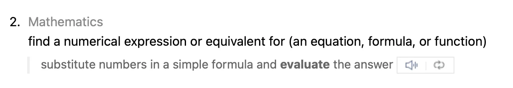



### Escaping Closures

클로저가 함수의 아규먼트로 전달이 됐는데, 함수가 리턴된 이후에 클로저가 호출되면 이를 함수를 탈출(escape)했다고 한다. 클로저를 파라미터로 받는 함수를 작성할 때, 파라미터의 타입 뒤에 @escaping을 작성해서 그 클로저가 탈출 가능하다는 것을 나타낼 수 있다.

클로저가 함수를 탈출하는 한가지 방법은 외부 변수에 저장되는 것이다. 예를 들어 많은 비동기 작업을 시작 하는 함수들은 클로저 아규먼트를 컴플리션 핸들러(completion handler)로 사용한다. 함수는 비동기 작업을 시작하고 리턴되지만, 클로저는 비동기 작업이 끝날때까지 호출되지 않는다. 따라서 나중에 호출되기 위해 탈출이 필요하다. 예를 들면:


```swift
var completionHandlers: [() -> Void] = []
func someFunctionWithEscapingClosure(completionHandler: @escaping () -> Void) {
    completionHandlers.append(completionHandler)
}
```
 

someFunctionWithEscapingClosure(_:) 함수는 클로저를 아규먼트로 받아 외부의 선언된 배열에 추가한다. 이때 파라미터에 @escaping을 적지 않았다면, 컴파일 타임 에러가 발생한다.

self가 클래스 인스턴스를 참조할때, self를 참조하는 이스케이핑 클로저는 특별히 주의가 필요하다. 이스케이핑 클로저가 self를 캡처하는 것은 강한 참조 사이클을 쉽게 만들기 때문이다.

일반적인 클로저는 꼭 캡처 리스트에 작성할 필요없이 캡처할 변수를 사용하기만 해도 캡처가 암시적으로 되지만, 이 경우에는 명시적이어야 한다. self를 캡처하고 싶다면, 명시적으로 self를 작성하거나, 캡처 리스트에 self를 추가해야한다. 예시로, 아래 코드에서 someFunctionWithEscapingClosure(_:)로 전달된 클로저는 명시적으로 self를 작성한다. 반대로 someFunctionWithNonescapingClosure(_:)로 전달된 클로저는 이스케이핑 클로저가 아니므로(nonescaping) 암시적으로 self를 참조할 수 있다.


```swift
var completionHandlers: [() -> Void] = []
func someFunctionWithEscapingClosure(completionHandler: @escaping () -> Void) {
    completionHandlers.append(completionHandler)
}

func someFunctionWithNonescapingClosure(closure: () -> Void) {
    closure()
}

class SomeClass {
    var x = 10
    func doSomething() {
        someFunctionWithEscapingClosure { self.x = 100 }
        someFunctionWithNonescapingClosure { x = 200 }
    }
}

let instance = SomeClass()
instance.doSomething()
print(instance.x)
// Prints "200"

completionHandlers.first?()
print(instance.x)
// Prints "100"
```
 

다음은 self를 클로저의 캡처 리스트에 포함시켜서 캡처한 후, 암시적으로 self를 참조하는 doSomething()의 코드이다.


```swift
class SomeOtherClass {
    var x = 10
    func doSomething() {
        someFunctionWithEscapingClosure { [self] in x = 100 }
        someFunctionWithNonescapingClosure { x = 200 }
    }
}
```
 

만약 self가 스트럭처나 이뉴머레이션의 인스턴스여도 self를 항상 암시적으로 참조할 수 있다. 하지만 이스케이핑 클로저가 스트럭처나 이뉴머레이션의 인스턴스 일때 변경가능한(mutating) 참조를 self를 통해서 캡처할 수 없다. 왜냐하면 스트럭쳐와 이뉴머레이션은 공유 가변성(shared mutability)를 허용하지 않기 때문이다.


```swift
struct SomeStruct {
    var x = 10
    mutating func doSomething() {
        someFunctionWithNonescapingClosure { x = 200 }  // Ok
        someFunctionWithEscapingClosure { x = 100 }     // Error
    }
}
```
 

someFunctionWithEscapingClosure를 호출할 때 에러가 발생한다. 뮤테이팅 메소드 내부에서 self가 변경될 수 있기 때문이다.

### Autoclosures

오토 클로저(autoclosure)는 함수에 아규먼트로 전달되는 표현식을 래핑하기 위해 자동으로 생성되는 클로저이다. 오토클로저는 아규먼트를 전달받지 않으며, 호출될 때 그 안에 감싼 표현식의 값을 리턴하는 클로저이다. 이러한 구문적 편리함(systactic convience)는 명시적인 클로저가 아닌 일반적인 표현식을 사용하여 함수 파라미터 주변의 중괄호를 생략할 수 있게 해준다.

오토클로저를 사용하는 함수를 호출하는 것은 일반적이지만, 구현하는 것은 일반적이지 않다. 예를 들면, assert(condition:message:file:line:) 함수의 condition과 message 파라미터는 오토클로저를 전달받는다. condition 파라미터는 디버그 빌드에서만 evaluate되고 message 파라미터는 condition이 false인 경우에만 evaluate 된다.

> **Kelly's Annotation)**  
>  evaluate는 표현식을 실행하여 값을 구한다 라는 의미가 있다.  
>  var a = 1 + 2라는 간단한 표현식을 생각해보면, a의 값을 구하기 위해 1 + 2라는 표현식을 계산해야한다.  
> 이 때 표현식을 계산하는 것을 evaluate라고 한다. (이 블로그에선 평가, 실행, 계산 모두 완벽하게 일치하지 않는다고 생각해서 evaluate를 그대로 쓰겠다.)

오토 클로저는 그 코드가 호출될 때까지 실행되지 않으므로 evaluation를 지연시켜준다. 따라서 언제 evaluate 할 것인지 시점을 컨트롤할 수 있게 되기 때문에 사이드 이펙트를 가지고 있는 코드나 계산이 복잡한 코드들에 유용하다. 아래의 예시는 어떻게 클로저가 evaluation를 지연시키는지 보여준다.


```swift
var customersInLine = ["Chris", "Alex", "Ewa", "Barry", "Daniella"]
print(customersInLine.count)
// Prints "5"

let customerProvider = { customersInLine.remove(at: 0) }
print(customersInLine.count)
// Prints "5"

print("Now serving \(customerProvider())!")
// Prints "Now serving Chris!"
print(customersInLine.count)
// Prints "4"
```
 

customerInLine 배열의 첫 번째 원소가 클로저 내부에서 제거되도록 작성 되었지만, 실제로 그 클로저가 호출되기 전까지는 제거되지 않는다. 만약 그 클로저가 호출되지 않는다면 클로저 내부의 표현식은 절대 evaluate 되지 않는다(배열 원소가 제거될 일이 없다). customerProvider의 타입은 String이 아니라 () -> String인 것을 알아두자

클로저를 함수의 아규먼트로 전달할 때 똑같이 평가를 지연할 수 있다.


```swift
// customersInLine is ["Alex", "Ewa", "Barry", "Daniella"]
func serve(customer customerProvider: () -> String) {
    print("Now serving \(customerProvider())!")
}
serve(customer: { customersInLine.remove(at: 0) } )
// Prints "Now serving Alex!"
```
 

serve(customer:) 함수는 고객의 이름을 리턴하는 명시적인 클로저를 받는다. 아래의 예시는 같은 행동을 하지만 명시적인 클로저를 받지 않고 @autoclosure를 파라미터의 타입과 함께 사용하여 오토클로저를 받는다. 이러면 클로저가 아닌 String 아규먼트를 받는 것 처럼 함수를 호출 할 수 있다. customerProvider의 파라미터 타입이 @autoclosure 속성이므로 아규먼트는 자동적으로 클로저로 변환된다.


```swift
// customersInLine is ["Ewa", "Barry", "Daniella"]
func serve(customer customerProvider: @autoclosure () -> String) {
    print("Now serving \(customerProvider())!")
}
serve(customer: customersInLine.remove(at: 0))
// Prints "Now serving Ewa!"
```
 

만약 오토클로저가 탈출 가능하길 원한다면 @autoclosure, @escapingclosure 두 속성을 동시에 쓸 수도 있다.


```swift
// customersInLine is ["Barry", "Daniella"]
var customerProviders: [() -> String] = []
func collectCustomerProviders(_ customerProvider: @autoclosure @escaping () -> String) {
    customerProviders.append(customerProvider)
}
collectCustomerProviders(customersInLine.remove(at: 0))
collectCustomerProviders(customersInLine.remove(at: 0))

print("Collected \(customerProviders.count) closures.")
// Prints "Collected 2 closures."
for customerProvider in customerProviders {
    print("Now serving \(customerProvider())!")
}
// Prints "Now serving Barry!"
// Prints "Now serving Daniella!"
```
 

위 코드에서 customerProvider의 아규먼트로 전달된 클로저를 호출하지 않고 collectCustomerProvider(_:) 함수가 외부에 선언된 customerProviders 배열에 클로저를 추가한다.

> 이 글은 Apple의 [The Swift Programming Language](<https://docs.swift.org/swift-book/documentation/the-swift-programming-language/>)를 번역 및 재구성한 글입니다.  
> 원저작물은 [Creative Commons Attribution 4.0 International (CC BY 4.0)](<https://creativecommons.org/licenses/by/4.0/>) 라이선스를 따르며,  
> 저작권은 © 2014–2023 Apple Inc. and the Swift project authors에게 있습니다.
