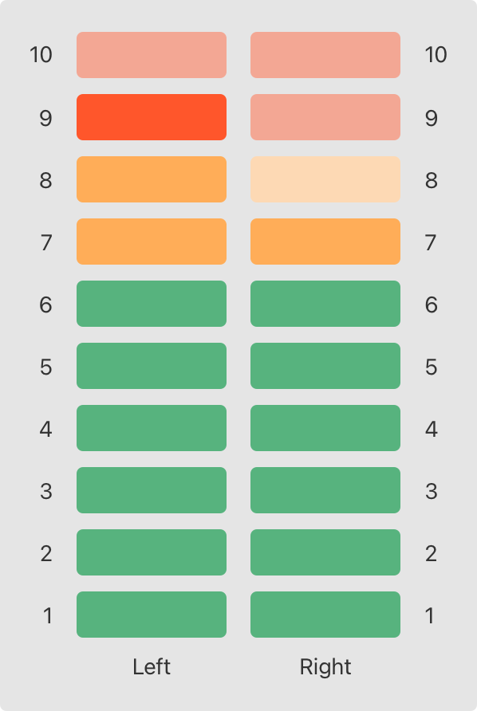



### Type Properties

인스턴스 프로퍼티는 특정 타입의 인스턴스에 속하는 프로퍼티이다. 새로운 인스턴스를 만들때 마다, 인스턴스는 다른 인스턴스와 구분되는 프로퍼티 집합이 생긴다.

인스턴스가 아닌 타입 자체에 속하는 프로퍼티도 있다. 이러한 프로퍼티를 타입 프로퍼티라고 하며, 얼마나 많은 그 타입의 인스턴스를 생성했느냐에 관련없이 단 하나만 존재한다.

타입 프로퍼티는 특정 타입의 모든 인스턴스들이 보편적으로 사용할 값을 정의할 때 유용하다. (C의 static이랑 유사하다)

> **Note**  
>  타입 그 자체는 이니셜라이저가 없기 때문에, 인스턴스 프로퍼티와 다르게 타입 프로퍼티는 저장 프로퍼티일 때 반드시 디폴트 값을 줘야한다.  
>   
> 저장 타입 프로퍼티는 처음 접근할 때 초기화되며, 여러 스레드가 동시에 접근하더라도 한번만 초기화 되도록 보장된다. 그리고 lazy 키워드를 붙일 필요도 없다.

#### Type Property Syntax

타입 프로퍼티를 static 키워드를 사용하여 정의한다. 클래스 타입의 컴퓨티드 타입 프로퍼티는 class 키워드를 대신 사용하여 서브클래스가 오버라이딩할 수 있도록 만들수 있다.


```swift
struct SomeStructure {
    static var storedTypeProperty = "Some value."
    static var computedTypeProperty: Int {
        return 1
    }
}
enum SomeEnumeration {
    static var storedTypeProperty = "Some value."
    static var computedTypeProperty: Int {
        return 6
    }
}
class SomeClass {
    static var storedTypeProperty = "Some value."
    static var computedTypeProperty: Int {
        return 27
    }
    class var overrideableComputedTypeProperty: Int {
        return 107
    }
}
```
 

#### Querying and Setting Type Properties

타입 프로퍼티는 인스턴스 프로퍼티와 마찬가지로 닷(.)구문을 이용하여 설정된다.


```swift
print(SomeStructure.storedTypeProperty)
// Prints "Some value."
SomeStructure.storedTypeProperty = "Another value."
print(SomeStructure.storedTypeProperty)
// Prints "Another value."
print(SomeEnumeration.computedTypeProperty)
// Prints "6"
print(SomeClass.computedTypeProperty)
// Prints "27"
```
 

아래의 예시는 여러 오디오 채널의 오디오 레벨 미터를 모델링하는 스트럭처에 두 개의 저장 타입 프로퍼티를 사용한다. 각각의 채널은 0에서 10까지의 오디오 레벨을 가지며, 0일때는 모든 불이 꺼져있고 10일때는 모든 불이 들어온다. 다음 그림은 두개의 오디오 채널의 오디오 레벨 미터의 그림이다.



각각의 오디오 채널은 아래 코드처럼 AudioChannel 구조에 의해 묘사된다.


```swift
struct AudioChannel {
    static let thresholdLevel = 10
    static var maxInputLevelForAllChannels = 0
    var currentLevel: Int = 0 {
        didSet {
            if currentLevel > AudioChannel.thresholdLevel {
                // cap the new audio level to the threshold level
                currentLevel = AudioChannel.thresholdLevel
            }
            if currentLevel > AudioChannel.maxInputLevelForAllChannels {
                // store this as the new overall maximum input level
                AudioChannel.maxInputLevelForAllChannels = currentLevel
            }
        }
    }
}
```
 

> 이 글은 Apple의 [The Swift Programming Language](<https://docs.swift.org/swift-book/documentation/the-swift-programming-language/>)를 번역 및 재구성한 글입니다.  
> 원저작물은 [Creative Commons Attribution 4.0 International (CC BY 4.0)](<https://creativecommons.org/licenses/by/4.0/>) 라이선스를 따르며,  
> 저작권은 © 2014–2023 Apple Inc. and the Swift project authors에게 있습니다.
