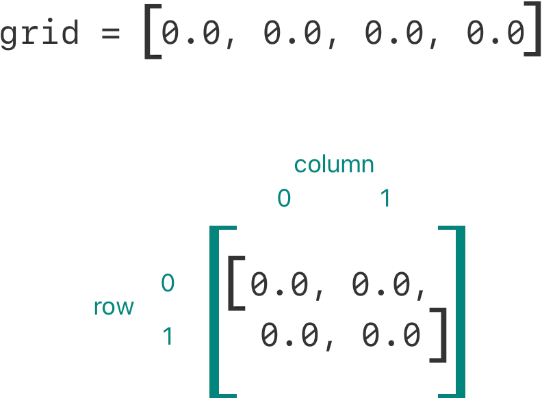
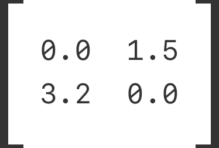



### Subscript Options

서브스크립트는 파라미터의 수와 타입에 제한없이 받을 수 있으며, 리턴 값도 타입에 제한이 없다.

함수처럼 서브스크립트는 가변 파라미터를 받고, 디폴트 값을 설정해줄 수 있다. 그러나 함수와 다르게 in-out 파라미터는 사용할 수 없다.

클래스나 스트럭처는 필요한 수만큼 서브스크립트를 제공할 수 있고, 대괄호 안에 전달된 값의 타입에 따라서 적합한 서브스크립트를 추론한다. 서브스크립트를 여러개 정의하는 것을 _서브스크립트 오버로딩_ 이라고도 한다.

서브스크립트는 하나의 파라미터를 받는 것이 일반적이지만, 필요한 경우 여러개의 파라미터를 받도록 정의할 수도 있다. 아래의 예시는 Double 타입 2차원 행렬을 나타내는 Matrix 스트럭처를 정의한다. Matrix 스트럭처의 서브스크립트는 두 개의 정수 파라미터를 받는다.


```swift
struct Matrix {
    let rows: Int, columns: Int
    var grid: [Double]
    init(rows: Int, columns: Int) {
        self.rows = rows
        self.columns = columns
        grid = Array(repeating: 0.0, count: rows * columns)
    }
    func indexIsValid(row: Int, column: Int) -> Bool {
        return row >= 0 && row < rows && column >= 0 && column < columns
    }
    subscript(row: Int, column: Int) -> Double {
        get {
            assert(indexIsValid(row: row, column: column), "Index out of range")
            return grid[(row * columns) + column]
        }
        set {
            assert(indexIsValid(row: row, column: column), "Index out of range")
            grid[(row * columns) + column] = newValue
        }
    }
}
```
 

Matrix는 rows와 columns라는 두 개의 파라미터를 받는 이니셜라이저를 제공하여, rows * columns 값을 충분히 저장할 만큼 큰 Double 타입 배열을 생성한다. 배열의 각 원소는 0.0 으로 초기화 된다.

이니셜라이저에 행과 열의 수를 전달하여 새로운 Matrix의 인스턴스를 만들 수 있다.


```swift
var matrix = Matrix(rows: 2, columns: 2)
```
 

위의 예시는 두개의 행과 두개의 열을 가진 새로운 Matrix 인스턴스를 만든다. 이 Matrix의 인스턴스의 grid 배열은 오른쪽 위에서 왼쪽 아래로 읽는 방식으로 평면화된 행렬이다.



서브스크립트에 행과 열의 값을 컴마로 구분하여 전달하면 행렬의 값을 설정할 수 있다.


```swift
matrix[0, 1] = 1.5
matrix[1, 0] = 3.2
```
 



Matrix의 서브스크립트의 getter와 setter는 서브스크립트의 row와 column 값이 유효한지 확인하기 위해 어설션을 포함한다. 어설션에서 쓰기 위해 Matrix는 indexIsValid(row:column:)이라는 메소드를 포함한다. 만약 유효하지 않은 인덱스로 서브스크립트에 접근한다면 어설션이 작동한다.

### Type Subscripts

위에서 설명한 인스턴스 서브스크립트는 특정 타입의 인스턴스에서 호출된다. 타입 자체에 관련된 서브스크립트를 타입 서브스크립트라고 하며, subscript 뒤에 static을 붙여서 작성할 수 있다. 클래스는 서브클래스에서 상속 가능하게 하려면 대신 class 키워드를 사용한다. 아래의 예시는 어떻게 타입 서브스크립트를 정의하고 호출하는지 보여준다.


```swift
enum Planet: Int {
    case mercury = 1, venus, earth, mars, jupiter, saturn, uranus, neptune
    static subscript(n: Int) -> Planet {
        return Planet(rawValue: n)!
    }
}
let mars = Planet[4]
print(mars)
```
 

> 이 글은 Apple의 [The Swift Programming Language](<https://docs.swift.org/swift-book/documentation/the-swift-programming-language/>)를 번역 및 재구성한 글입니다.  
> 원저작물은 [Creative Commons Attribution 4.0 International (CC BY 4.0)](<https://creativecommons.org/licenses/by/4.0/>) 라이선스를 따르며,  
> 저작권은 © 2014–2023 Apple Inc. and the Swift project authors에게 있습니다.
