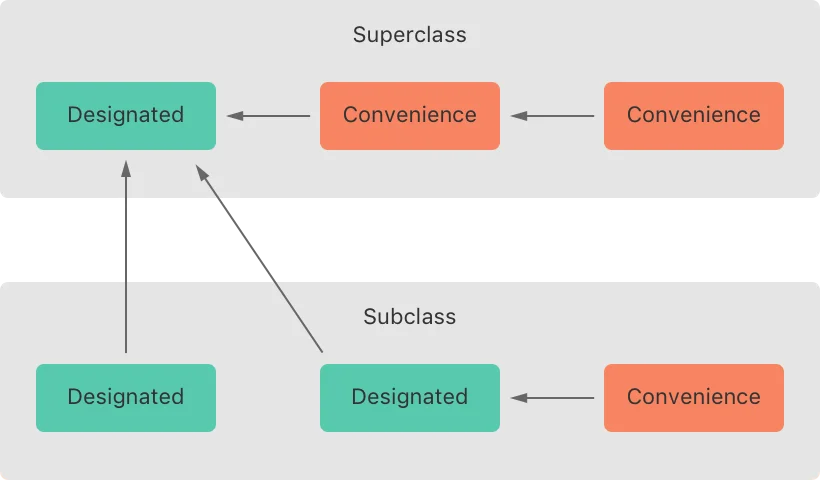
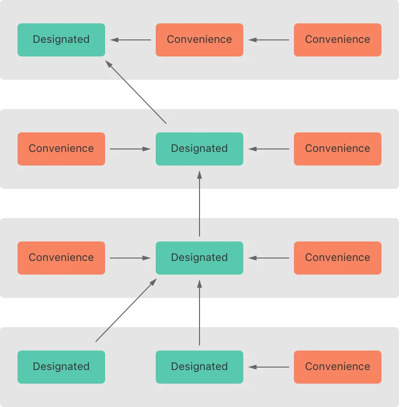
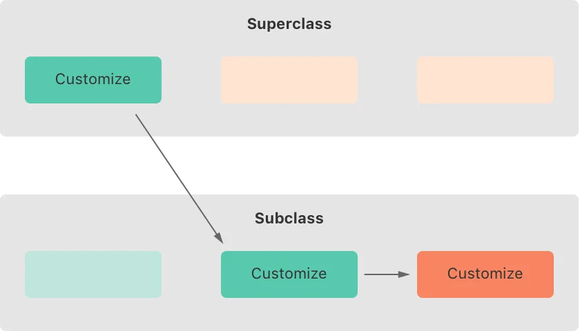



### Default Initializers

스위프트는 모든 프로퍼티에 디폴트 값을 제공하며, 이니셜라이저를 하나도 가지고 있지 않은 클래스나 스트럭처에게 _디폴트 이니셜라이저_ 를 제공한다. 디폴트 이니셜라이저는 모든 프로퍼티가 디폴트 값으로 설정된 새로운 인스턴스를 만든다.

이 예시는 쇼핑 리스트에 있는 품목의 이름, 수량, 구매 여부를 캡슐화한 ShoppingListItem 클래스를 정의한다.


```swift
class ShoppingListItem {
    var name: String?
    var quantity = 1
    var purchased = false
}
var item = ShoppingListItem()
```
 

ShoppingListItem 클래스의 모든 프로퍼티가 디폴트 값을 가지고 있고, 슈퍼클래스가 없는 베이스 클래스이기 때문에, ShoppingListItem 클래스는 자동적으로 디폴트 이니셜라이저를 가지게 된다.(name 프로퍼티는 옵셔널 프로퍼티이기 때문에 디폴트 값을 주지 않아도 자동적으로 nil이 자동적으로 디폴트 값이 된다) 위의 예시에서 디폴트 이니셜라이저를 이용해 ShoppingListItem의 새 인스턴스를 만든다.

#### Memberwise Initializers for Structure Types

스트럭처 타입은 자동적으로 _멤버와이즈 이니셜라이저_ 를 받는다. 커스텀 이니셜라이저를 정의하지 않은 경우에, 디폴트 이니셜라이저와는 다르게 디폴트 값이 없는 저장 프로퍼티가 있더라도 _멤버와이즈 이니셜라이저_ 를 가지게 된다.

멤버와이즈 이니셜라이저는 새 스트럭처 인스턴스의 멤버 프로퍼티들을 빠르게 초기화 하는 방법이다. 새 인스턴스의 프로퍼티들의 초기 값은 멤버와이즈 이니셜라이저에 이름으로 전달된다.


```swift
struct Size {
    var width = 0.0, height = 0.0
}
let twoByTwo = Size(width: 2.0, height: 2.0)
```
 

멤버와이즈 이니셜라이저를 호출할 때, 디폴트 값이 있는 프로퍼티들은 생략할 수도 있다. 위의 예시에서, Size 스트럭처의 height와 width 프로퍼티는 둘 다 디폴트 값을 가지고 있다. 따라서 둘 중 하나만 생략할 수도 있고, 둘 다 생략할 수도 있다. 생략한 프로퍼티의 초기 값으로 디폴트 값을 사용된다. 아래는 그 예시이다.


```swift
let zeroByTwo = Size(height: 2.0)
print(zeroByTwo.width, zeroByTwo.height)
// Prints "0.0 2.0"


let zeroByZero = Size()
print(zeroByZero.width, zeroByZero.height)
// Prints "0.0 0.0"
```
 

### Initializer Delegation for Value Types

이니셜라이저는 인스터스의 이니셜라이제이션의 한 부분으로 다른 이니셜라이저를 호출할 수 있다. 이 과정을 _이니셜라이저 델리게이션(initializer delegation)_ 이라 하고, 여러 이니셜라이저에서 코드가 중복되는 것을 방지해 준다.

이니셜라이저 델리게이션이 작동하는 규칙과, 허용되는 형태(form)는 값 타입과 클래스 타입이 다르다. 값 타입(스트럭처와 열거형)은 상속이 불가능하다. 따라서 값 타입의 이니셜라이저 델리게이션은 값 타입이 스스로 제공하는 다른 이니셜라이저에게만 위임(델리게이트)할 수 있기 때문에 상대적으로 간단하다.(주: 스트럭처나 열거형 내부에 오버로딩된 다른 이니셜라이저한태만 위이할 수 있다는 뜻) 그러나 클래스는 다른 클래스로부터 상속을 받을 수 있으므로, 상속받은 모든 저장 프로퍼티에 적절한 값을 이니셜라이제이션 동안 할당해야 하는 책임이 있다.

값 타입에서는 self.init을 사용하여 같은 값 타입의 다른 이니셜라이저를 참조할 수 있다. self.init은 이니셜라이저에서만 호출할 수 있다.

값 타입에 커스텀 이니셜라이저를 선언하면 그 타입의 디폴트 이니셜라이저(스트럭처면 멤버와이즈 이니셜라이저)에 더 이상 접근하지 못한다는 것을 알아두자.

> **Note**  
>  값 타입에서 커스텀 이니셜라이저와 디폴트 이니셜라이저를 동시에 쓰고 싶다면, 커스텀 이니셜라이저를 extension에 작성하면 가능하다.

다음의 예시는 사각형을 표현하는 Rect 스트럭처이다. Rect 스트럭처는 두 개의 스트럭처 Size와 Point가 필요하며, 두 스트럭처의 모든 프로퍼티는 디폴트 값으로 0.0을 가진다.


```swift
struct Size {
    var width = 0.0, height = 0.0
}
struct Point {
    var x = 0.0, y = 0.0
}
struct Rect {
    var origin = Point()
    var size = Size()
    init() {}
    init(origin: Point, size: Size) {
        self.origin = origin
        self.size = size
    }
    init(center: Point, size: Size) {
        let originX = center.x - (size.width / 2)
        let originY = center.y - (size.height / 2)
        self.init(origin: Point(x: originX, y: originY), size: size)
    }
}
```
 

첫 번째 이니셜라이저 init()은 디폴트 이니셜라이저와 같은 기능을 가진다. 이 이니셜라이저는 본문이 비어있으며 빈 중괄호쌍을 통해 이를 표현한다 { }. 이 이니셜라이저를 호출하면 origin 과 size 프로퍼티가 디폴트 값으로 초기화된 Rect 인스턴스를 리턴한다.


```swift
let basicRect = Rect()
// basicRect's origin is (0.0, 0.0) and its size is (0.0, 0.0)
```
 

두 번째 이니셜라이저 init(origin:size:)는 멤버와이즈 이니셜라이저와 같은 기능을 가진다. 이 이니셜라이저는 origin과 size 아규먼트 값을 적합한 저장 프로퍼티에 할당한다.


```swift
let originRect = Rect(origin: Point(x: 2.0, y: 2.0),
    size: Size(width: 5.0, height: 5.0))
// originRect's origin is (2.0, 2.0) and its size is (5.0, 5.0)
```
 

세 번째 이니셜라이저 init(center:size)는 약간 더 복잡하다. center 좌표와 size 값을 이용하여 적합한 원점을 계산하고, init(origin:size:) 이니셜라이저를 호출(혹은 델리게이트)한다. 


```swift
let centerRect = Rect(center: Point(x: 4.0, y: 4.0),
    size: Size(width: 3.0, height: 3.0))
// centerRect's origin is (2.5, 2.5) and its size is (3.0, 3.0)
```
 

init(center:size:) 이니셜라이저도 origin과 size의 새 값을 적합한 프로퍼티에 할당할 수 있지만, 똑같은 기능을 하는 이니셜라이저를 제공하는 것이 더 깔끔하고, 의도가 명확해진다.

### Class Inheritance and Initialization

슈퍼클래스에서 상속받은 프로퍼티를 포함한 모든 클래스의 프로퍼티들은 이니셜라이제이션 동안 초기 값을 할당 받아야 한다.

스위프트는 클래스의 모든 저장 프로퍼티들이 초기 값을 받게 도와주는 데지그네이티드 이니셜라이저(designated initializer)와 컨비니언스 이니셜라이저(convenience initializer)를 정의한다.

#### Designated Initializers and Convenience Initializers

데지그네이티드 이니셜라이저는 클래스의 기본 이니셜라이저이다. 데지그네이티드 이니셜라이저는 해당 클래스에서 도입된 모든 프로퍼티를 초기화하고, 적절한 슈퍼클래스의 이니셜라이저를 호출하여 이니셜라이제이션 프로세스가 슈퍼클래스 체인을 통해 올라가도록 한다.

클래스는 최소 한개의 데지그네이티드 이니셜라이저를 가져야 한다. 경우에 따라선 슈퍼클래스에서 상속받아 이를 충족하기도 한다.

컨비니언스 이니셜라이저는 클래스를 위한 보조 이니셜라이저이다. 컨비니언스 이니셜라이저를 데지그네이티드 이니셜라이저의 파라미터를 디폴트 값으로 설정하여 데지그네이티드 이니셜라이저를 호출 하도록 정의할 수 있다. 또는 특정 케이스나 입력 값 타입에 대한 새 이니셜라이저를 만들도록 정의할 수도 있다.

컨비니언스 이니셜라이저가 필요하지 않는다면 꼭 만들 필요는 없다. 일반적인 이니셜라이제이션 패턴을 단축하여, 시간을 절약할 수 있거나, 클래스의 이니셜라이제이션의 의도가 명확해질 때 만든다.

#### Syntax for Designated and Convenience Initializers

데지그네이티드 이니셜라이저는 값 타입 이니셜라이저와 똑같은 방법으로


```swift
init(parameters) {
   statements
}
```
 

컨비니언스 이니셜라이저도 같은 스타일이지만, init 키워드 앞에 공백으로 구분하여 convenience를 작성한다.

#### Initializer Delegation for Class Types

데지그네이티드 이니셜라이저와 컨비니언스 이니셜라이저의 관계를 단순화하기 위해, 스위프트는 이니셜라이저들간의 델리게이션 호출에 다음 세 가지 규칙을 적용한다.

> **규칙1**  
>  데지그네이티드 이니셜라이저는 바로 위 슈퍼클래스의 데지그네이티드 이니셜라이저를 반드시 호출해야 한다.  
>   
> **규칙2**  
>  컨비니언스 이니셜라이저는 같은 클래스의 이니셜라이저를 반드시 호출해야 한다.  
>   
> **규칙3**  
>  컨비니언스 이니셜라이저는 반드시 궁극적으로 데지그네이티드 이니셜라이저를 호출해야 한다.

세 가지 규칙을 쉽게 기억하는 방법은 다음과 같다.

  - 데지그네이티드 이니셜라이저는 위로(슈퍼클래스로) 위임해야 한다.
  - 컨비니언스 이니셜라이저는 반드시 같은 클래스에 있는 이니셜라이저로 위임해야 한다.


이 규칙들은 다음과 같이 그림으로 표현할 수 있다.



그림에서 슈퍼클래스는 하나의 데지그네이티드 이니셜라이저와 두 개의 컨비니언스 이니셜라이저를 가지고 있다. 그중 하나의 컨비니언스 이니셜라이저는 다른 컨비니언스 이니셜라이저를 호출하고, 호출 받은 컨비니언스 이니셜라이저는 데지그네이티드 이니셜라이저를 호출한다. 이는 위의 규칙 2와 3을 만족한다. 그림의 슈퍼클래스는 다른 슈퍼클래스를 가지지 않으므로 규칙 1은 적용되지 않는다.

그림의 서브클래스는 두 개의 데지그네이티드 이니셜라이저와 하나의 컨비니언스 이니셜라이저를 가지고 있다. 컨비니언스 이니셜라이저는 같은 클래스 내부의 다른 이니셜라이저만 호출할 수 있기 때문에 두 데지그네이티드 이니셜라이저중 하나를 반드시 호출해야 하며, 그럴 경우 규칙 2와 3을 만족하게 된다. 두 개의 데지그네이티드 이니셜라이저 모두 반드시 슈퍼클래스의 데지그네이티드 이니셜라이저를 호출하며, 이 경우 규칙 1을 만족하게 된다.

> **Note**  
>  이 규칙들은 사용자가 만든 클래스의 인스턴스를 어떻게 생성하는지에 대해 영향을 끼치지 않는다. 다이어그램 속 어떤 이니셜라이저도 자신이 속한 클래스를 완전히 초기화시키고 만들 수 있다. 이 규칙들은 클래스의 이니셜라이저를 어떻게 구현해야 하는지에만 영향을 끼친다.

다음 그림은 네 개의 클래스가 좀 더 복잡한 계층을 이루고 있는 것을 보여준다. 이 계층에서 데지그네이티드 이니셜라이저가 클래스의 초기화를 위한 "funnel" 지점 역할을 하여 연쇄적인 클래스들 간의 상호 관계를 간단하게 하는지 보여준다. (주: funnel: 깔때기, 굴뚝, 상속 계층 사이에서 이니셜라이저가 슈퍼클래스의 이니셜라이저를 호출하는 방식을 이렇게 표현한 것 같다)



#### Two-Phase Initialization

스위프트에서 클래스 이니셜라이제이션은 두 개의 페이즈로 이루어져 있다. 첫 번째 페이즈에서는 클래스에서 도입된 저장 프로퍼티들이 초기 값을 할당받는다. 모든 저장 프로퍼티들의 초기 상태가 결정되면, 두 번째 페이즈가 시작된다. 두 번째 페이즈에서는 새 인스턴스가 사용될 준비를 마치기 전에 각 클래스가 저장 프로퍼티들을 커스터마이즈할 수 있는 기회가 주어진다.

2 페이즈 이니셜라이제이션 프로세스는 클래스 계층 구조의 각 클래스에 완전한 유연성을 해치지 않고 이니셜라이제이션을 안전하게 만들어준다. 2 페이즈 이니셜라이제이션은 초기화 되기 전의 프로퍼티 값에 접근하거나, 프로퍼티 값이 예기치 않게 다른 이니셜라이저에 의해 설정되는 것을 방지해 준다.

스위프트의 컴파일러는 2 페이즈 이니셜라이제이션이 에러 없이 수행 되도록 네 가지의 세이프티 체크를 수행한다.

> **세이프티 체크 1**  
>  데지그네이티드 이니셜라이저는 슈퍼클래스의 이니셜라이저를 호출하기 전에 그 클래스에서 도입된 모든 프로퍼티들을 초기화 해야 한다.  
>   
> **세이프티 체크 2**  
>  데지그네이티드 이니셜라이저는 상속 받은 이니셜라이저를 할당하기 전에 반드시 슈퍼클래스의 이니셜라이저에 위임해야 한다. 그렇지 않는다면, 데지그네이티드 이니셜라이저가 상속받은 프로퍼티에 할당한 값이 호출한 슈퍼클래스의 이니셜라이저에 의해 덮어 씌워진다.  
>   
> **세이프티 체크 3**  
>  컨비니언스 이니셜라이저는 프로퍼티에 값을 할당하기 전에 다른 이니셜라이저에 위임해야 한다. 그렇지 않는다면, 컨비니언스 이니셜라이저가 할당한 새 값이 데지그네이티드 이니셜라이저에 의해 덮어 씌워진다.  
>   
> **세이프티 체크 4**  
>  이니셜라이저는 인스턴스 메소드를 호출할 수 없고, 인스턴스 프로퍼티에 접근할 수 없으며, 첫 번째 이니셜라이제이션 페이즈가 완료될 때 까지 self를 값으로 참조할 수 없다.

클래스의 인스턴스는 첫 번째 페이즈가 끝나기 전 까지는 완전히 유효하지 않다. 첫 번째 페이즈가 끝나고 클래스 인스턴스가 유효해졌을 때, 프로퍼티에 접근이 가능하고, 메소드 호출이 가능하다.

다음은 네 가지 세이프티 체크를 기반으로 2 페이즈 이니셜라이제이션이 작동하는 방식이다.

**Phase 1**

  - 이니셜라이저(데지그네이티드, 컨비니언스)가 클래스에서 호출된다.
  - 그 클래스의 새 인스턴스의 메모리가 할당되지만, 초기화 되지는 않는다.
  - 데지그네이티드 이니셜라이저가 그 클래스에서 도입된 모든 저장 프로퍼티가 값이 있는것을 확인한다. 저장 프로퍼티들의 메모리는 이제 초기화 된다.
  - 데지그네이티드 이니셜라이저가 위와 똑같은 작업을 슈퍼클래스에서 수행하도록 슈퍼클래스 이니셜라이저를 호출한다.
  - 위의 과정들이 상속 체인의 꼭대기 까지 도달할 때 까지(최상위 슈퍼클래스에 도달할 때 까지) 연쇄적으로 수행된다.
  - 상속 체인의 꼭대기에 도달하고, 체인의 최종 클래스(최상위 슈퍼클래스)가 모든 프로퍼티가 값을 가지고도록 보장하면, 인스턴스의 메모리가 모두 초기화 되었다고 가정한다. 그리고 페이즈 1이 종료된다.


**Phase 2**

  - 상속 체인의 꼭대기에서 아래로 다시 작업을 시작하면, 체인에 있는 각 데지그네이티드 이니셜라이저는 인스턴스를 커스터마이즈할 수 있는 옵션이 더 있다. 이니셜라이저는 이제 self에 접근 할 수 있고, 프로퍼티를 수정하고 호출할 수 있다.
  - 마지막으로 체인에 있는 컨비니언스 이니셜라이저는 인스턴스를 커스터마이즈하고 Self로 작업할 수 있다.


다음은 페이즈 1에서 가상의 서브클래스와 슈퍼클래스가 이니셜라이제이션 호출을 찾는 방법이다.


이 예시에서, 서브클래스의 컨비니언스 이니셜라이저를 호출함으로써 이니셜라이제이션이 시작된다. 이 컨비니언스 이니셜라이저는 아직 아무런 프로퍼티도 수정하지 못한다. 이 이니셜라이저는 같은 클래스의 데지그네이티드 이니셜라이저를 호출한다.

호출된 데지그네이티드 이니셜라이저는 세이프티 체크 1에 따라 서브클래스의 모든 프로퍼티들이 값을 가지는지 확인한다. 그리고 체인을 따라 초기화를 계속하기 위해 슈퍼클래스의 데지그네이티드 이니셜라이저를 호출한다.

슈퍼클래스의 데지그네이티드 이니셜라이저는 슈퍼클래스의 모든 프로퍼티들이 값을 가지고 있는지 확인한다. 더 초기화해야 할 슈퍼클래스가 없으므로 델리게이션도 더 이상 필요하지 않다.

슈퍼클래스의 모든 프로퍼티들이 초기 값을 가지자 마자, 클래스의 모든 메모리가 완전히 초기화 되었다고 간주되며 페이즈 1이 끝난다.

다음은 페이즈 2의 그림이다.



슈퍼클래스의 데지그네이티드 이니셜라이저는 인스턴스를 더 커스터마이즈할 기회를 가진다(커스터마이즈할 필요가 없어도 기회는 가진다).

슈퍼클래스의 데지그네이티드 이니셜라이저가 끝나면, 서브클래스의 데지그네이티드 이니셜라이저도 인스턴스를 더 커스터마이즈할 기회를 가진다(마찬가지로 필요가 없어도 기회는 가진다).

서브클래스의 데지그네이티드 이니셜라이저가 완료되면, 맨 처음 호출된 컨비니언스 이니셜라이저가 추가적인 커스터마이징을 진행한다.

> 이 글은 Apple의 [The Swift Programming Language](<https://docs.swift.org/swift-book/documentation/the-swift-programming-language/>)를 번역 및 재구성한 글입니다.  
> 원저작물은 [Creative Commons Attribution 4.0 International (CC BY 4.0)](<https://creativecommons.org/licenses/by/4.0/>) 라이선스를 따르며,  
> 저작권은 © 2014–2023 Apple Inc. and the Swift project authors에게 있습니다.
