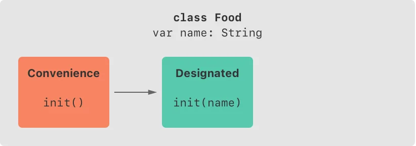
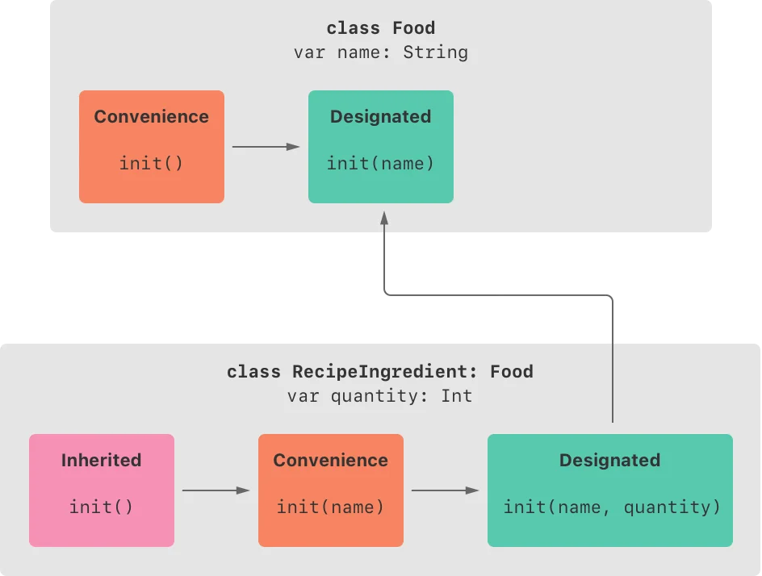
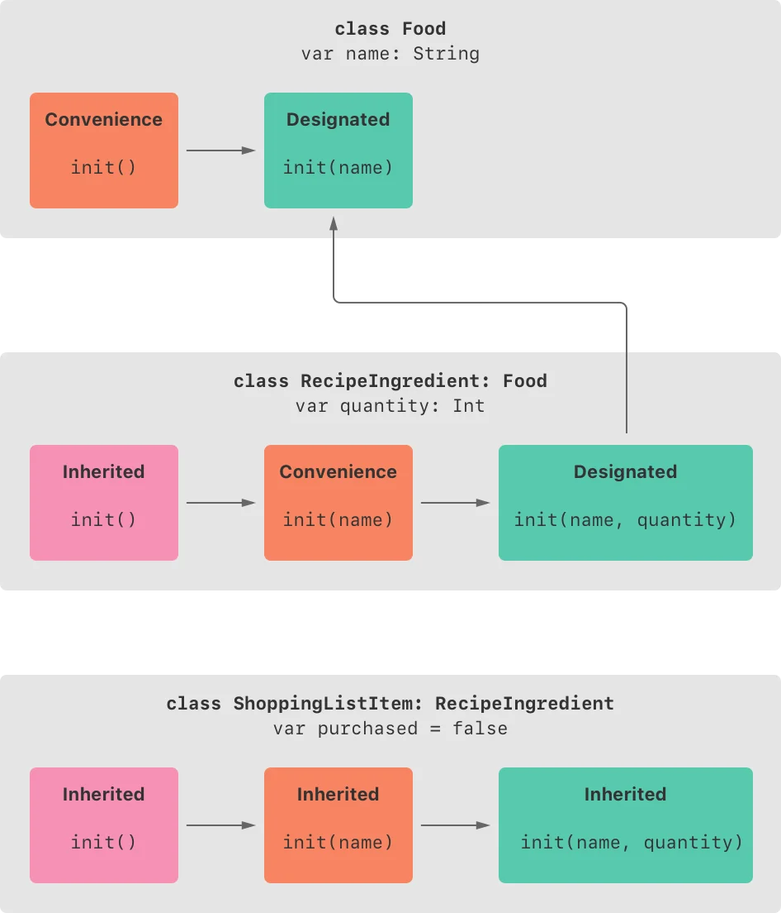



#### Initializer Inheritance and Overriding

Objective-C의 서브클래스와 다르게 스위프트의 서브클래스는 기본적으로 슈퍼클래스의 이니셜라이저를 상속받지 않는다. 이러한 스위프트의 접근방식은 슈퍼클래스에서 상속받은 간단한 이니셜라이저가 서브클래스의 완전히 초기화 되지 않은 새 인스턴스를 만드는 것을 방지한다.

> **Note**  
>  슈퍼클래스의 이니셜라이저는 특정 상황에서는 상속되지만, 안전하고 적합할 때만 상속된다. 자세한 내용은 아래의 Automatic Initializer Inheritance에 나온다.

서브클래스가 하나 이상의 슈퍼클래스와 동일한 이니셜라이저를 가지고 있으려면, 서브클래스 내부에 직접 구현하여 제공할 수 있다.

슈퍼클래스의 데지그네이티드 이니셜라이저와 일치하는 이니셜라이저를 서브클래스에 작성할 때, 그 데지그네이티드 이니셜라이저의 오버라이드를 효과적으로 제공할 수 있다. 그러므로 반드시 서브클래스의 이니셜라이저의 정의 앞에 override를 작성해야 한다. 자동적으로 제공된 디폴트 이니셜라이저라도 마찬가지다.

오버라이드된 프로퍼티, 메소드, 서브스크립트처럼 override를 작성하면 슈퍼클래스에 일치하는 데지그네이티드 이니셜라이저가 존재하는지 스위프트가 확인하고 파라미터가 유효한지 검사한다.

> **Note**  
>  슈퍼클래스의 데지그네이티드 이니셜라이저를 오버라이드하는 이유가 서브클래스의 컨비니언스 이니셜라이저 구현이더라도 반드시 override를 작성해야 한다.

반대로 슈퍼클래스의 컨비니언스 이니셜라이저와 일치하는 서브클래스 이니셜라이저를 작성할 때, 전에 설명한 규칙에 따라 서브클래스는 절대로 슈퍼클래스의 컨비니언스 이니셜라이저를 직접 호출할 수 없다. 그러므로 (엄격히 말하면) 서브클래스는 슈퍼클래스의 컨비니언스 이니셜라이저의 오버라이드를 제공하지 않는다. 결과적으로 슈퍼클래스의 컨비니언스 이니셜라이저와 매치되는 이니셜라이저를 구현할 때는 override를 앞에 적지 않아야 한다.

아래의 예시는 Vehicle이라는 베이스 클래스를 정의한다. 이 베이스 클래스는 저장 프로퍼티 numberOfWheels와 이 저장 프로퍼티를 사용하는 컴퓨티드 프로퍼티 description으로 이루어져 있다.


```swift
class Vehicle {
    var numberOfWheels = 0
    var description: String {
        return "\(numberOfWheels) wheel(s)"
    }
}
```
 

Vehicle 클래스는 저장 프로퍼티에 디폴트 값을 제공하고, 어떠한 커스텀 이니셜라이저도 제공하지 않는다. 따라서 자동적으로 디폴트 이니셜라이저를 가지게 된다. 디폴트 이니셜라이저는 항상 클래스의 데지그네이티드 이니셜라이저이다. 이 예시에서 디폴트 이니셜라이저는 numberOfWheels가 0인 새 Vehicle 인스턴스를 생성한다.


```swift
let vehicle = Vehicle()
print("Vehicle: \(vehicle.description)")
// Vehicle: 0 wheel(s)
```
 

다음 예시는 Vehicle의 서브클래스인 Bicycle을 정의한다.


```swift
class Bicycle: Vehicle {
    override init() {
        super.init()
        numberOfWheels = 2
    }
}
```
 

Bicycle 서브클래스는 커스텀 데지그네이티드 이니셜라이저 init()을 정의한다. 이 데지그네이티드 이니셜라이저는 슈퍼클래스 Vehicle의 이니셜라이저와 매치된다. 따라서 Bicycle 버전의 이니셜라이저 init()은 앞에 override를 표시한다.

Bicycle의 init() 이니셜라이저는 Vehicle의 기본 이니셜라이저인 super.init()을 호출함으로써 시작한다. 따라서 Bycle이 Vehicle로부터 상속받은 numberOfWheels을 수정할 기회를 가지기 전에 Vehicle이 우선 이 프로퍼티를 초기화 하는 것을 보장한다. super.init()을 호출한 후에, numberOfWheels의 원래 값은 새로운 값 2로 대체된다.

Bicycle의 인스턴스를 만들고, 상속받은 컴퓨티드 프로퍼티 description을 호출하면, numberOfWheels 프로퍼티가 어떻게 갱신되었는지 볼 수 있다.


```swift
let bicycle = Bicycle()
print("Bicycle: \(bicycle.description)")
// Bicycle: 2 wheel(s)
```
 

서브클래스의 이니셜라이저가 이니셜라이제이션 페이즈 2에 아무것도 하지 않고, 슈퍼클래스가 동기적이고 아무런 아규먼트를 받지 않는 데지그네이티드 이니셜라이저를 가지고 있을 때, 서브클래스의 저장 프로퍼티들에게 모두 값을 할당하고 나서 하는 super.init() 호출을 생략할 수 있다. 만약 슈퍼클래스의 이니셜라이저가 비동기적이라면 명시적으로 await super.init()을 작성해야 한다.

다음 예시는 Vehicle의 다른 서브클래스의 Hoverboard를 정의한다. Hoverboard의 이니셜라이저 안에서 Hoverboard 클래스는 super.init()을 명시적으로 호출하지 않고, 자신의 color 프로퍼티만을 설정한다.


```swift
class Hoverboard: Vehicle {
    var color: String
    init(color: String) {
        self.color = color
        // super.init() implicitly called here
    }
    override var description: String {
        return "\(super.description) in a beautiful \(color)"
    }
}
let hoverboard = Hoverboard(color: "silver")
print("Hoverboard: \(hoverboard.description)")
// Hoverboard: 0 wheel(s) in a beautiful silver
```
 

> **Note**  
>  서브클래스는 상속받은 변수 프로퍼티들을 이니셜라이제이션동안 수정할 수 있지만, 상수 프로퍼티는 수정하지 못한다.

#### Automatic Initializer Inheritance

위에 언급한 것처럼 서브클래스는 기본적으로 슈퍼클래스의 이니셜라이저를 상속받지 않는다. 하지만 특정 상황에서는 슈퍼클래스의 이니셜라이저들이 자동적으로 상속된다. 실제로 많은 일반적인 상황에서 이니셜라이저 오버라이드를 작성할 필요가 없고, 안전할 경우에 큰 노력을 들일 필요 없이 슈퍼 클래스의 이니셜라이저를 상속할 수 있다.

서브클래스에서 도입한 모든 새 프로퍼티에 디폴트 값을 제공한다고 가정하면, 다음 두 개의 규칙이 적용된다.

> **Rule 1**  
>  만약 서브클래스에 데지그네이티드 이니셜라이저가 정의되어 있지 않다면, 자동적으로 슈퍼클래스의 모든 데지그네이티드 이니셜라이저를 상속받는다.  
>   
> **Rule 2  
> ** 만약 서브클래스에 슈퍼클래스의 데지그네이티드 이니셜라이저를 모두 구현되어 있다면(Rule 1에 따라 모두 상속 받거나, 직접 구현했을 경우에) 슈퍼클래스의 모든 컨비니언스 이니셜라이저를 자동적으로 상속받는다.

이 규칙들은 서브클래스에 컨비니언스 이니셜라이저를 추가하더라도 적용된다.

> **Note**  
>  서브클래스는 Rule 2를 만족하기 위해 슈퍼클래스의 데지그네이티드 이니셜라이저를 컨비니언스 이니셜라이저로도 구현할 수 있다.

#### Designated and Convenience Initializers in Action

다음의 예시는 데지그네이티드 이니셜라이저, 컨비니언스 이니셜라이저 그리고 자동 이니셜라이저 상속이 동작하는 것을 보여준다. 이 예시는 Food, RecipeIngredient, ShoppingListItem 세 클래스의 계층을 정의하고, 이 클래스들의 이니셜라이저가 어떻게 상호작용하는지 시연한다.

이 계층에서 베이스 클래스는 음식의 이름을 캡슐화하는 간단한 클래스인 Food 클래스이다. Food 클래스는 하나의 String 타입 프로퍼티 name을 도입하고, 두 개의 이니셜라이저를 제공한다.


```swift
class Food {
    var name: String
    init(name: String) {
        self.name = name
    }
    convenience init() {
        self.init(name: "[Unnamed]")
    }
}
```
 

아래의 그림은 Food 클래스의 이니셜라이저 체인을 보여준다.



클래스는 디폴트 멤버와이즈 이니셜라이저를 가지고 있지 않으므로, Food 클래스는 name이라는 하나의 아규먼트를 받는 데지그네이티드 이니셜라이저를 제공한다.


```swift
let namedMeat = Food(name: "Bacon")
// namedMeat's name is "Bacon"
```
 

init(name: String) 이니셜라이저는 Food 클래스의 모든 이니셜라이저를 초기화 시키므로 데지그네이티드 이니셜라이저다. Food 클래스는 슈퍼클래스를 가지고 있지 않으므로, init(name: String) 이니셜라이저는 super.init()을 호출할 필요 없이 이니셜라이제이션을 완료할 수 있다.

Food 클래스는 아규먼트가 없는 컨비니언스 이니셜라이저 init()도 제공한다. init() 이니셜라이저는 name 값을 "[Unnamed]"로 설정하고 Food 클래스의 init(name: String) 이니셜라이저에 위임한다.


```swift
let mysteryMeat = Food()
// mysteryMeat's name is "[Unnamed]"
```
 

계층의 두 번째 클래스는 Food 클래스의 서브클래스인 RecipeIngredient이다. RecipeIngredient 클래스는 Int 타입 프로퍼티 quantity를 도입하고, 두 개의 이니셜라이저도 정의한다.


```swift
class RecipeIngredient: Food {
    var quantity: Int
    init(name: String, quantity: Int) {
        self.quantity = quantity
        super.init(name: name)
    }
    override convenience init(name: String) {
        self.init(name: name, quantity: 1)
    }
}
```
 

아래의 그림은 RecipeIngredient의 이니셜라이저 체인을 보여준다.



RecipeIngredient 클래스는 하나의 데지그네이티드 이니셜라이저 init(name: String, quantity: Int)를 가지고 있다. 이 이니셜라이저는 RecipeIngredient 인스턴스의 모든 프로퍼티들을 채울 수 있다. 이 이니셜라이저는 quantity 아규먼트를 받아 quantity 프로퍼티를 할당하는 것 부터 시작한다. 이후에 이니셜라이저는 Food의 init(name: String)에 위임한다. 이 프로세스는 2 페이즈 이니셜라이제이션의 세이프티 체크 1을 만족한다.

또한 RecipeIngredient는 컨비니언스 이니셜라이저 init(name: String)을 정의한다. 이 이니셜라이저는 명시적인 quantity값을 주지 않았을때, quantity의 값을 1로 추측한다. 이 컨비니언스 이니셜라이저의 정의는 RecipeIngredient 인스턴스를 더 빠르고 쉽게 만들수 있게 하며, quantity의 값이 1인 RecipeIngredient의 인스턴스를 만들 때, 코드 중복을 회피하게 해준다. 이 컨비니언스 이니셜라이저는 qauntity 값을 1로 하여 같은 클래스의 데지그네이티드 이니셜라이저에 위임한다.

RecipeIngredient의 init(name: String) 컨비니언스 이니셜라이저는 Food의 데지그네이티드 이니셜라이저 init(name: String)과 같은 파라미터를 받는다. 이 컨비니언스 이니셜라이저가 슈퍼클래스의 데지그네이티드 이니셜라이저를 오버라이드 하기 때문에 반드시 앞에 override를 작성하여 표시해줘야 한다.

RecipeIngredient의 init(name: String)이니셜라이저가 컨비니언스 이니셜라이저여도, RecipeIngredient는 슈퍼 클래스의 데지그네이티드 이니셜라이저의 모든 구현을 제공했다. 따라서 RecipeIngredient는 자동적으로 슈퍼클래스의 모든 컨비니언스의 이니셜라이저를 상속받는다.

이 예시에서, RecipeIngredient의 슈퍼클래스는 Food이다. Food는 하나의 컨비니언스 이니셜라이저 init()을 가지고 있고, 이 이니셜라이저는 RecipeIngredient에게 상속된다. 상속된 버전의 init() 함수는 Food 버전과 init(name: String)에 위임할 때, Food 버전의 init(name: String)이 아닌 RecipeIngredient 버전의 init(name: String)으로 위임한다는 것을 제외하고는 동일하다.

세 이니셜라이저 모두 RecipeIngredient의 새 인스턴스를 만드는데 사용할 수 있다.


```swift
let oneMysteryItem = RecipeIngredient()
let oneBacon = RecipeIngredient(name: "Bacon")
let sixEggs = RecipeIngredient(name: "Eggs", quantity: 6)
```
 

계층의 마지막 클래스는 RecipeIngredient의 서브클래스 ShoppingListItem이다.

쇼핑 리스트에서 항상 구매 여부는 구매하지 않음으로 시작되므로 이를 반영하기 위해, ShoppingListItem은 Bool 타입 프로퍼티 purchased를 도입하고, 디폴트 값으로 false를 준다. 또한 리스트의 현 상황을 보여주는 컴퓨티드 프로퍼티 description도 추가한다.


```swift
class ShoppingListItem: RecipeIngredient {
    var purchased = false
    var description: String {
        var output = "\(quantity) x \(name)"
        output += purchased ? " ✔" : " ✘"
        return output
    }
}
```
 

새로 도입된 모든 프로퍼티들이 디폴트 값을 가지고 있으므로, 새로운 이니셜라이저를 정의할 필요가 없다.(또한 purchased가 처음부터 true인 경우가 없기 때문에 더욱 필요가 없다) ShoppingListItem은 자동적으로 모든 데지그네이티드 이니셜라이저와 컨비니언스 이니셜라이저를 슈퍼클래스로부터 상속받는다.

다음의 그림은 이 세 개의 클래스의 전체적인 이니셜라이저 체인을 보여준다.



상속받은 세 개의 이니셜라이저 모두 ShoppingListItem의 새 인스턴스를 만드는데 사용할 수 있다.


```swift
var breakfastList = [
    ShoppingListItem(),
    ShoppingListItem(name: "Bacon"),
    ShoppingListItem(name: "Eggs", quantity: 6),
]
breakfastList[0].name = "Orange juice"
breakfastList[0].purchased = true
for item in breakfastList {
    print(item.description)
}
// 1 x Orange juice ✔
// 1 x Bacon ✘
// 6 x Eggs ✘
```
 

배열 breakfastList가 세 개의 ShoppingListItem 인스턴스를 포함하고 있다. 이 배열의 타입은 [ShoppingListItem]으로 추론된다. 배열이 생성된 이후 배열의 첫 번째 원소에 있는 ShoppingListItem의 name은 "[Unnamed]"에서 "Orange juice"로 바뀌고, purchased는 true로 바뀐다. 각 원소들의 description을 출력해보면, 원소들의 디폴트 상태가 예상된 대로 설정된 것을 확인할 수 있다.

> 이 글은 Apple의 [The Swift Programming Language](<https://docs.swift.org/swift-book/documentation/the-swift-programming-language/>)를 번역 및 재구성한 글입니다.  
> 원저작물은 [Creative Commons Attribution 4.0 International (CC BY 4.0)](<https://creativecommons.org/licenses/by/4.0/>) 라이선스를 따르며,  
> 저작권은 © 2014–2023 Apple Inc. and the Swift project authors에게 있습니다.
