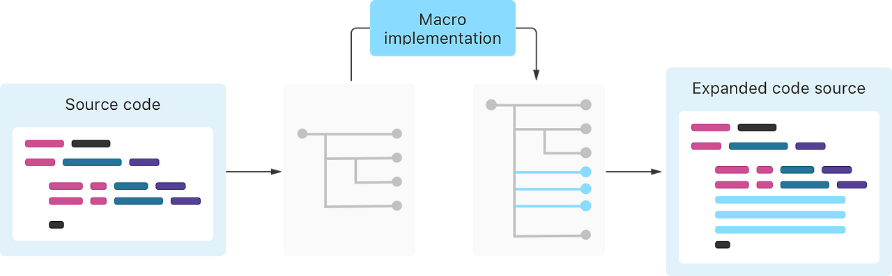
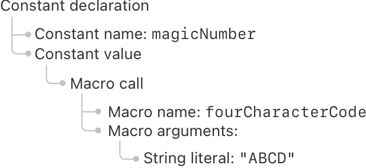
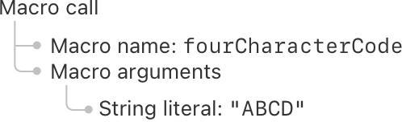
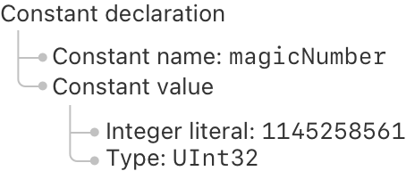



### Macro Expansion

매크로를 사용한 Swift 코드를 빌드 할 때, 코드를 확장하기 위해 매크로의 구현을 불러오게 된다.



구체적으로 Swift는 다음과 같은 방법으로 매크로를 확장한다:

  1. 컴파일러가 코드를 읽어, 구문의 in-memory 표현을 만든다.
  2. 컴파일러가 이 in-memory 표현의 일부를 매크로를 확장시키는 매크로 구현부에 보낸다.
  3. 컴파일러가 매크로 호출을 확장된 형태로 대체한다.
  4. 컴파일러가 확장된 소스 코드를 사용하여 컴파일을 계속 진행한다.


구체적인 단계들을 살펴보기 위해, 다음을 생각해보자:


```swift
let magicNumber = #fourCharacterCode("ABCD")
```
 

`#fourCharacterCode` 매크로는 4개의 캐릭터로 구성된 문자열을 받아, 그 문자열의 ASCII 값들을 이어 붙인 32비트 언사인드 인티저를 리턴한다. 일부 파일 포맷은 데이터를 식별하기 위해 이런 형태의 인티저를 사용하는데, 컴팩트 하면서도 디버거에서 읽을 수 있기 때문이다. 아래의 Implementing a Macro 섹션에서 이 매크로를 구현하는 방법을 보여준다.

위 코드에 있는 매크로를 확장하기 위해 컴파일러는 Swift 파일을 읽고, _추상 구문 트리(abstract syntax tree)_ 혹은 AST로 알려져 있는 in-memory 표현을 만든다. AST는 코드의 구조를 명시적으로 나타내므로, 그 구조(컴파일러나 매크로 구현과 같은) 와 상호 작용하는 코드를 작성하기 더 쉽게 해준다. 다음은 위의 코드를 AST로 표현이며, 몇몇의 디테일을 생략해 약간 단순화한 것이다:



위의 다이어그램은 이 코드가 메모리 안에서 어떻게 표현 되는지 보여준다. AST의 각의 원소는 소스코드의 각 파트에 대응한다. "Constant declaration" AST 원소는 상수 선언의 두 부분을 표현하는 두 개의 자식 원소를 가지고 있다. "Macro call" 원소는 매크로의 이름과 매크로에 전달되는 아규먼트들의 리스트를 자식 원소로 가지고 있다.

이 AST의 구성하는 과정의 일부로, 컴파일러는 소스 코드가 유효한 Swift인지 체크한다. 예를 들어, `#fourCharacterCode`는 하나의 스트링이어야 하는 하나의 아규먼트를 받는다. 만약 인티저 아규먼트를 전달하거나, 스트링 리터럴에 쌍 따옴표(`"`)를 쓰는 것을 잊었으면, 이 과정에서 오류가 발생하게 된다.

컴파일러는 코드에서 매크로를 호출한 장소를 찾고, 이 매크로들을 구현한 외부 바이너리를 로드한다. 각 매크로 호출마다, 컴파일러는 해당 매크로의 구현에 AST의 일부를 전달한다. 아래는 그 일부 AST의 표현이다:



`#fourCharacterCode` 매크로의 구현은 이 AST 조각을 매크로를 확장할 때, 입력으로 읽는다. 매크로의 구현은 입력으로 받은 AST 조각에서만 동작하므로, 항상 앞뒤에 어떤 코드가 있든 동일한 방식으로 확장된다. 이 제한은 매크로 확장을 더 쉽게 이해할 수 있게 해주고, Swift가 변경되지 않은 매크로를 확장하는 것을 피할 수 있게 하므로 빌드도 빠르게 해준다.

> **Kelly 주**  
>  '변경되지 않은 매크로를 확장하는 하는 것을 피하게 해준다'는 일종의 빌드 캐싱을 뜻한다.  
> 1\. 매크로의 구현이 변하지 않았으면 굳이 다시 매크로를 바이너리로 만들 필요가 없다.  
> 2\. 매크로에 들어가는 인자가 변하지 않았다면, 굳이 다시 확장하지 않아도 된다. (이전에 썼던 것을 그대로 쓰면 된다.)

Swift는 매크로 구현 코드를 제한하는 방법으로, 매크로 작성자가 다른 입력을 실수로 읽지 않도록 도와준다:

  - 매크로 구현에 전달되는 AST는 해당 매크로를 나타내는 AST 원소만 포함되고, 앞뒤에 있는 다른 코드를 포함하지 않는다.
  - 매크로 구현은 파일 시스템이나 네트워크에 접근할 수 없도록 샌드박스 환경에서 실행된다.


이러한 안전장치에 더해서, 매크로의 작성자는 매크로의 입력 밖에 있는 어떤 것도 읽거나 수정할 수 없게 하는 책임을 가진다. 예를 들어, 매크로의 구현은 절대로 현재 시간에 의존해서는 안된다.

`#fourCharacterCode`의 구현은 확장된 코드가 포함된 새로운 AST를 생성한다. 다음은 해당 코드가 컴파일러에 리턴하는 내용이다:


컴파일러는 이 확장을 받고, 매크로 호출을 포함하는 AST 원소를 매크로의 확장을 포함한 것으로 바꾼다. 매크로 확장 이후에, 컴파일러는 프로그램이 여전히 구문적으로 유효한지 여부와, 모든 타입이 올바른 것을 보장하는지 체크한다. 그러면 평상시와 같이 컴파일할 수 있는 최종 AST가 생성된다.



이 AST는 다음과 같은 Swift코드에 대응된다:


```swift
let magicNumber = 1145258561 as UInt32
```
 

이 예제에서는, 입력된 소스 코드가 하나의 매크로를 사용한다, 하지만 실제 프로그램은 같은 매크로의 여러 인스턴스와, 다른 매크로들의 여러 호출을 가지고 있을 수 있다. 컴파일러는 매크로들을 한번에 하나식 확장한다.

만약 하나의 매크로가 다른 매크로 안에 존재한다면, 바깥쪽 매크로가 우선 확장된다 — 이는 바깥 매크로가 안쪽 매크로가 확장되기 전에 그것을 수정할 수 있게 해준다.

### Implementing a Macro

매크로를 구현하기 위해, 두 개의 컴포넌트를 만들어야 한다: 매크로 확장을 수행할 타입과, 매크로를 API로 노출시키기 위해 선언할 라이브러리를 만들어야 한다. 이 컴포넌트들은 매크로와 클라이언트(Kelly 주: 매크로를 사용할 소스코드)를 동시에 개발한다 하더라도, 매크로를 사용하는 소스 코드와 분리되어서 빌드되어야 한다. 매크로 구현은 매크로의 클라이언트의 빌드의 한 부분으로 동작하기 때문이다.

> **Kelly 주**  
>  매크로와 그 매크로를 사용할 코드(클라이언트)가 서로 다르게 빌드되어야 한다는건 당연하다. 왜냐하면 소스코드는 바이너리로 빌드 되어야 의미를 가지고, 매크로는 클라이언트가 빌드 될 때 동작해야하는 부분이기 때문이다. 즉 클라이언트가 빌드되기 전에 매크로는 이미 바이너리의 형태로 존재해야한다. — 결국 Swift는 컴파일 언어다.

Swift Package Manager를 이용해 새로운 매크로를 만드려면, `swift package init --type macro`를 실행한다. — 이는 매크로의 구현과 선언에 필요한 템플릿을 포함한 여러 파일들을 생성한다.

이미 존재하는 프로젝트에 매크로를 추가하려면, `Package.swift` 파일을 다음과 같이 수정한다:

  - `swift-tools-version` 코멘트에서 Swift tools 버전을 5.9 혹은 이후로 설정한다.
  - `CompilerPluginSupport` 모듈을 임포트 한다.
  - `platforms` 리스트에서 macOS 10.15을 최소 배포 대상으로 포함한다.


아래의 코드는 `Package.swift` 파일의 시작 부분을 예시로 보여준다:


```swift
// swift-tools-version: 5.9

import PackageDescription
import CompilerPluginSupport

let package = Package(
    name: "MyPackage",
    platforms: [ .iOS(.v17), .macOS(.v13)],
    // ...
)
```
 

다음은, 기존 `Package.swift` 파일에 매크로 구현을 위한 타겟과 매크로 라이브러리를 위한 타겟을 추가한다. 예를 들어, 다음과 같이 추가할 수 있으며, 이름은 프로젝트에 맞도록 변경하면 된다:


```swift
targets: [
    // Macro implementation that performs the source transformations.
    .macro(
        name: "MyProjectMacros",
        dependencies: [
            .product(name: "SwiftSyntaxMacros", package: "swift-syntax"),
            .product(name: "SwiftCompilerPlugin", package: "swift-syntax")
        ]
    ),

    // Library that exposes a macro as part of its API.
    .target(name: "MyProject", dependencies: ["MyProjectMacros"]),
]
```
 

위 코드는 두 개의 타겟을 정의한다: 매크로의 구현을 포함하고 있는 `MyProjectMacros` 그리고 이 매크로를 사용 가능하게 해주는 `MyProject`이다.

매크로 구현은 AST를 사용하여 Swift 코드와 구조적으로 상호 작용하기 위해 SwiftSyntax 모듈을 사용한다. 만새로운 매크로 패키지를 Swift Package Manager를 사용해 만들었다면, 생성된 `Package.swift` 파일은 자동적으로 SwiftSyntax의 의존성을 포함하게 된다. 만약 이미 존재하는 프로젝트에 매크로를 추가한다면, SwiftSyntax 의존성을 `Package.swift` 파일에 추가해야 한다:


```swift
dependencies: [
    .package(url: "https://github.com/swiftlang/swift-syntax", from: "509.0.0")
],
```
 

매크로의 역할에 따라, 매크로 구현은 SwiftSyntax에서 제공하는 해당 역할에 맞는 프로토콜을 컨펌하게 된다. 예를 들어 앞에 나온 `#fourCharacterCode`를 생각해 보자. 아래는 그 매크로를 구현하는 스트럭처이다.


```swift
import SwiftSyntax
import SwiftSyntaxMacros

public struct FourCharacterCode: ExpressionMacro {
    public static func expansion(
        of node: some FreestandingMacroExpansionSyntax,
        in context: some MacroExpansionContext
    ) throws -> ExprSyntax {
        guard let argument = node.argumentList.first?.expression,
              let segments = argument.as(StringLiteralExprSyntax.self)?.segments,
              segments.count == 1,
              case .stringSegment(let literalSegment)? = segments.first
        else {
            throw CustomError.message("Need a static string")
        }

        let string = literalSegment.content.text
        guard let result = fourCharacterCode(for: string) else {
            throw CustomError.message("Invalid four-character code")
        }

        return "\(raw: result) as UInt32"
    }
}

private func fourCharacterCode(for characters: String) -> UInt32? {
    guard characters.count == 4 else { return nil }

    var result: UInt32 = 0
    for character in characters {
        result = result << 8
        guard let asciiValue = character.asciiValue else { return nil }
        result += UInt32(asciiValue)
    }
    return result
}
enum CustomError: Error { case message(String) }
```
 

이 매크로를 기존에 존재하는 Swift Package Manager 프로젝트에 추가하는 경우, 매크로 타겟의 진입점 역할을 하며, 해당 타겟이 정의하는 매크로의 리스트를 추가해야한다:


```swift
import SwiftCompilerPlugin

@main
struct MyProjectMacros: CompilerPlugin {
    var providingMacros: [Macro.Type] = [FourCharacterCode.self]
}
```
 

`#fourCharacterCode` 매크로는 익스프레션을 생성하는 프리스탠딩 매크로이므로, 이를 구현하는 `FourCharacterCode` 타입은 `ExpressionMacro` 프로토콜을 컨펌한다. `ExpressionMacro` 프로토콜은 AST를 확장하는 메소드인 `expansion(of:in:)`라는 요구사항 하나를 가지고 있다.

`#fourCharacterCode` 매크로를 확장하기 위해, Swift는 이 매크로를 사용하는 코드의 AST를 매크로 구현을 포함하고 있는 라이브러리로 보낸다. 라이브러리 내부에서, Swift는 `FourCharacterCode.expansion(of:in:)`을 호출하고, 이 메소드에 AST와 컨텍스트를 아규먼트로 전달한다. `expansion(of:in:)`의 구현은 `#fourCharacterCode`에 아규먼트로 전달된 스트링을 찾고, 대응하는 32비트 언사인드 인티저 리터럴 값을 계산한다.

위의 예제에서, 첫 번째 `guard` 블록은 AST에서 스트링 리터럴을 추출하여, 해당 AST 원소를 `literalSegment`에 할당한다. 두 번째 `guard` 블록은 private `fourCharacterCode(for:)` 함수를 호출한다. 이 두 블록은 매크로가 제대로 사용되지 않았다면 에러를 throw한다 — 이 에러 메세지는 잘못된 호출 지점에서 컴파일 에러가 된다. 예를 들어, 이 매크로를 `#fourCharacterCode("AB" + "CD")`같이 호출하면, 컴파일러는 "Need a static string"이라는 오류를 에러를 보여준다.

`expansion(of:in:)` 메소드는 SwiftSyntax에 있는 AST에서 익스프레션을 나타내는 타입인 `ExprSyntax`의 인스턴스를 리턴한다. 이 타입은 `StringLiteralConvertible` 프로토콜을 컨펌하므로, 매크로 구현에서 스트링 리터럴로 결과를 만들 수 있다(Kelly 주: 문자열 리터럴로 바로 `ExprSyntax`의 값을 만들 수 있다). 매크로 구현에서 리턴하는 모든 SwiftSyntax 타입은 `StringLiteralConvertible`을 컨펌하기 때문에, 어떤 종류의 매크로를 구현하든 이러한 접근 방식을 사용할 수 있다.

### Developing and Debugging Macros

매크로는 테스트를 이용한 개발에 잘 맞는다: 외부 상태에 의존하지 않고 하나의 AST를 다른 AST로 변환하고, 외부 상태를 변경하지 않는다. 추가적으로, 스트링 리터럴로 구문 노드를 생성할 수 있어, 테스트 입력을 설정하는 것이 간단해진다. 또한 AST의 `description` 프로퍼티를 읽어 얻은 스트링을 예상 값과 비교할 수 있다. 예를 들어, 다음은 이전 섹션에서 본 `#fourCharacterCode` 매크로를 테스트하는 예시이다.


```swift
let source: SourceFileSyntax =
    """
    let abcd = #fourCharacterCode("ABCD")
    """

let file = BasicMacroExpansionContext.KnownSourceFile(
    moduleName: "MyModule",
    fullFilePath: "test.swift"
)

let context = BasicMacroExpansionContext(sourceFiles: [source: file])

let transformedSF = source.expand(
    macros:["fourCharacterCode": FourCharacterCode.self],
    in: context
)

let expectedDescription =
    """
    let abcd = 1145258561 as UInt32
    """

precondition(transformedSF.description == expectedDescription)
```
 

위 예시는 precondition을 통해 매크로를 테스트하지만, 테스트 프레임워크를 대신 사용할 수 있다.

* * *

> 이 포스트는 The Swift Programming Language의 내용을 직접 번역한 내용에 주석을 달아 정리한 것입니다.   
> 원문: [The Swift Programming Language (Swift 6.2)](<https://docs.swift.org/swift-book/documentation/the-swift-programming-language/>)
