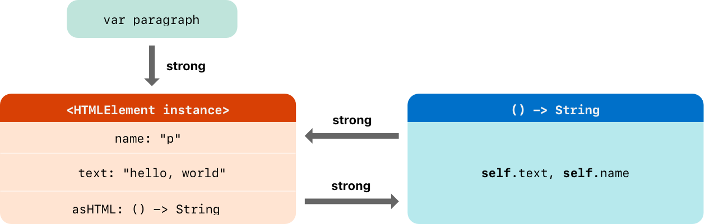



### Strong Reference Cycles for Closures

두 클래스 인스턴스의 프로퍼티들이 서로를 강한 참조하면서 강한 참조 사이클이 만들어지는지를 이전에 보았고, 약한 참조와 미소유 참조가 이러한 강한 참조 사이클을 깨뜨리는 것도 보았다.

강한 참조 사이클은 클래스의 인스턴스에 클로저를 할당하고, 해당 클로저의 본문에서 그 인스턴스를 캡처할때도 발생한다. 이러한 캡처는 `self.someProperty`처럼 그 클로저가 해당 인스턴스의 프로퍼티에 접근하거나, `self.someMethod()`처럼 해당 인스턴스의 메소드에 접근할 때 발생한다. 두 경우 모두, 이러한 접근으로 그 클로저가 `self`를 "캡처"할때, 강한 참조 사이클을 생성하게 된다.

이 강한 참조 사이클은 클래스와 같이 _참조 타입_ 인 클로저에 의해 발생한다. 프로퍼티에 클로저를 할당하면, 그 클로저의 참조를 할당하는 것이다. 본질적으로, 이는 이전에 나온 두 강한 참조가 서로를 살아있게(주: ARC에 의해 할당 해제되지 않게) 하는 문제와 같다. 하지만, 두 클래스 인스턴스와 다르게, 이는 클래스 인스턴스와 클로저가 서로를 살아있게 한다.

스위프트는 이 문제에 대하여 _클로저 캡처 리스트_ 라는 우아한(원문: elegant)해결법을 제공한다. 클로저 캡처 리스트를 통해 강한 참조 사이클을 깨뜨리는 방법을 배우기 전에, 사이클에 어떻게 만들어지는지에 대해 이해하는 것이 유용하다.

이 아래의 예시는 `self`를 참조하는 클로저가 강한 참조 사이클을 생성하는 것을 보여준다. 이 예시는 각각의 원소가 HTML 문서 내부의 개별 요소를 모델링 하는 클래스 `HTMLElement`를 정의한다.


```swift
class HTMLElement {

    let name: String
    let text: String?

    lazy var asHTML: () -> String = {
        if let text = self.text {
            return "<\(self.name)>\(text)</\(self.name)>"
        } else {
            return "<\(self.name) />"
        }
    }

    init(name: String, text: String? = nil) {
        self.name = name
        self.text = text
    }

    deinit {
        print("\(name) is being deinitialized")
    }

}
```
 

`HTMLElement` 클래스는 `"h1"`은 제목 원소, `"p"`는 문단 원소, `"br"`은 개행 원소와 같이 원소의 이름을 나타내는 `name` 프로퍼티를 정의한다. 또한, HTML 원소내에서 렌더링할 문자열을 나타내는 옵셔널 `text` 프로퍼티를 정의한다.

이 두 가지 간단한 프로퍼티에 추가하여, `HTMLElement` 클래스는 지연 프로퍼티 `asHTML`를 정의한다. 이 프로퍼티는 `name`과 `text`를 HTML 문자열 조각으로 조합한다. `asHTML` 프로퍼티의 타입은 `() -> String`이다.

기본적으로, `asHTML` 프로퍼티는 `HTML` 태그의 문자열 표현을 리턴하는 클로저가 할당된다. 이 태그는 옵셔널 `text` 값을 포함하거나, 텍스트 콘텐트가 존재하지 않는다면 `text`도 존재하지 않는다. 단락 원소에서 `text` 프로퍼티가 `"some text"` 혹은 `nil`인지에 따라 클로저는 `"<p>some text</p>"` 혹은 `"<p />"`를 리턴한다.

`asHTML` 프로퍼티는 인스턴스 메소드처럼 이름이 지어지고 사용된다. 하지만, `asHTML`은 인스턴스 메소드가 아니라 클로저 프로퍼티이기 때문에, `asHTML` 프로퍼티의 기본 값을 커스텀 클로저로 대체할 수 있다.

예를 들어, `asHTML` 프로퍼티는 `text` 프로퍼티가 `nil`일 때, 빈 HTML 태그가 아닌 디폴트 텍스트를 출력하게 할 수도 있다:


```swift
let heading = HTMLElement(name: "h1")
let defaultText = "some default text"
heading.asHTML = {
    return "<\(heading.name)>\(heading.text ?? defaultText)</\(heading.name)>"
}
print(heading.asHTML())
// Prints "<h1>some default text</h1>"
```
 

> **Note**  
> **asHTML** 프로퍼티는 원소가 실제로 HTML 출력 타겟의 문자열 값으로 렌더링 될 때만 필요하기 때문에, 지연 프로퍼티로 선언되어 있다. **asHTML** 이 지연 프로퍼티라는 사실은 초기화가 완료되고, **self** 의 존재를 알기 전 까지는 접근되지 않기 때문에, 디폴트 클로저에서 **self** 를 참조할 수 있다는 것을 의미한다.

`HTMLElement` 클래스는 `name` 아규먼트와 (원한다면) `text` 아규먼트를 받는 이니셜라이저를 제공한다. 또한 `HTMLElement` 인스턴스가 할당 해제 되었을 때 메세지를 출력하는 디이니셜라이저도 정의한다.

다음은 `HTMLElement` 클래스를 이용하여 새 인스턴스를 만들고 출력하는 방법이다:


```swift
var paragraph: HTMLElement? = HTMLElement(name: "p", text: "hello, world")
print(paragraph!.asHTML())
// Prints "<p>hello, world</p>"
```
 

> **Note**  
>  위의 **paragraph** 변수는 옵셔널 **HTMLElement** 로 정의되므로, 강한 참조 사이클의 존재를 보여주기 위하여 아래에서 **nil** 로 설정될 수 있다.

위에 작성한 `HTMLElement` 클래스는 `HTMLElement` 인스턴스와 디폴트 상태인 `asHTML` 사이에 강한 참조 사이클을 생성하게 된다. 다음은 사이클의 모습이다:



이 인스턴스의 `asHTML` 프로퍼티는 클로저를 강한 참조로 붙잡고 있다. 해당 클로저는 본문에서 `self`를 참조하고 있기 때문에 (`self.name`, `self.text`와 같은 방법으로), HTMLElement 인스턴스를 강하게 참조하게 된다. 따라서 이 둘 사이에서 강한 참조 사이클이 만들어지게 된다.

> **Note**  
>  클로저가 **self** 를 여러번 참조해도, **HTMLElement** 인스턴스에 대한 참조를 단 하나만 캡처한다.

`paragraph` 변수를 `nil`로 설정하여 `HTMLElement` 인스턴스에 대한 강한 참조를 깨뜨려도, 강한 참조 사이클에 의해 `HTMLElement` 인스턴스와 그 클로저는 할당 해제 되지 않는다.


```swift
paragraph = nil
```
 

`HTMLElement`가 할당 해제되지 않았기 때문에, `HTMLElement` 디이니셜라이저가 출력되지 않는 것을 알아두자.

### Resolving Strong Reference Cycles for Closures

클로저와 클래스 인스턴스 사이의 강한 참조 사이클을 클로저의 정의에서 _캡처 리스트_ 를 정의하여 해결할 수 있다. 캡처 리스트는 클로저의 본문 내부에서 하나 혹은 그 이상의 참조 타입을 캡처할 때 사용할 규칙들을 정의한다. 두 클래스 인스턴스의 강한 참조 사이클에서 처럼, 각 캡처된 참조들을 강한 참조가 아닌 약한 참조나 미소유 참조로 선언한다. 약한 참조나 미소유 참조를 적합하게 선택하는 방법은 코드의 다른 부분의 관계에 따라 달라진다.

> **Note**  
>  클로저의 내부에서 **self** 의 멤버를 참조할 때 스위프트는 (**someProperty** 혹은 **someMethod()** 가 아닌) **self.someProperty**나 **self.someMethod()**처럼 작성도록 요구한다. 이는 실수로 **self** 를 참조할 수 있음을 기억하는데 도움이 된다.

#### Defining a Capture List

캡처 리스트의 각 아이템은, 클래스 인스턴스에 대한 참조(`self` 처럼) 또는 일부 값으로 초기화된 변수(`delgate = self.delegate` 처럼)와 함께 `weak`나 `unowned` 키워드와 쌍을 이룬다. 이 쌍들은 컴마로 구분된 한 쌍의 대괄호 내부에 작성된다.

캡처 리스트는 클로저의 파라미터 리스트와 리턴 타입 앞에 위치한다:


```swift
lazy var someClosure = {
        [unowned self, weak delegate = self.delegate]
        (index: Int, stringToProcess: String) -> String in
    // closure body goes here
}
```
 

클로저가 파라미터 리스트나 리턴 타입을 지정하지 않았을 때는 캡처 리스트를 클로저의 맨 앞에 배치하고, `in` 키워드를 작성한다:


```swift
lazy var someClosure = {
        [unowned self, weak delegate = self.delegate] in
    // closure body goes here
}
```
 

#### Weak and Unowned References

클로저와 인스턴스가 서로를 항상 참조하고, 항상 같은 시간에 할당 해제될 때, 클로저의 캡처를 미소유 참조로 정의한다.

대조적으로, 캡처한 참조가 미래에 `nil`이 되는 지점이 있다면, 캡처를 약한 참조로 정의한다. 약한 참조는 항상 옵셔널 타입이고, 참조하고 있던 인스턴스가 할당 해제되면 자동적으로 `nil`이 된다. 이를 통해 클로저의 본문에서 존재를 확인할 수 있다.

> **Note**  
>  만약 캡처한 참조가 절대 **nil** 이 되지 않을때, 약한 참조보다는 미소유 참조로 선언해야 한다.

미소유 참조는 `HTMLElement`의 강한 참조 사이클을 해결하는 가장 적합한 캡처 방식이다. 다음은 `HTMLElement` 클래스가 사이클을 회피하도록 작성한 것이다:


```swift
class HTMLElement {

    let name: String
    let text: String?
    
    lazy var asHTML: () -> String = {
            [unowned self] in
        if let text = self.text {
            return "<\(self.name)>\(text)</\(self.name)>"
        } else {
            return "<\(self.name) />"
        }
    }

    init(name: String, text: String? = nil) {
        self.name = name
        self.text = text
    }

    deinit {
        print("\(name) is being deinitialized")
    }

}
```
 

`HTMLElement`의 이 구현은 `asHTML`의 내부에 캡처 리스트를 작성한 것을 제외하곤 이전의 구현과 동일하다. 이 경우에 캡처 리스트는 `[unowned self]`이다.

이전처럼 `HTMLElement`를 생성하고 출력할 수 있다:


```swift
var paragraph: HTMLElement? = HTMLElement(name: "p", text: "hello, world")
print(paragraph!.asHTML())
// Prints "<p>hello, world</p>"
```
 

다음은 캡처 리스트가 있는 참조들의 모습을 보여준다:


클로저가 `self`를 미소유 참조로 캡처하여 `HTMLElement` 인스턴스를 강하게 붙잡지 않기 떄문에, `paragraph` 변수에서 강한 참조를 `nil`로 설정하면, `HTMLElement` 인스턴스는 할당 해제되어, 디이니셜라이저가 출력하는 메세지를 아래와 같이 볼 수 있다:


```swift
paragraph = nil
// Prints "p is being deinitialized"
```
 

원문: [https://books.apple.com/kr/book/the-swift-programming-language-swift-5-7](<https://books.apple.com/kr/book/the-swift-programming-language-swift-5-7/id881256329?l=en>)

[ ‎The Swift Programming Language (Swift 5.7) ‎Computing & Internet · 2014 books.apple.com ](<https://books.apple.com/kr/book/the-swift-programming-language-swift-5-7/id881256329?l=en>)
