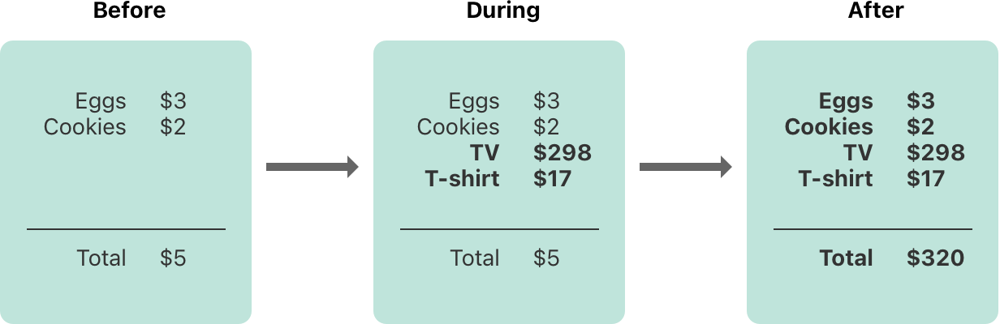



## Memory Safety

스위프트는 기본적으로 코드에서 일어나는 안전하지 않은 행동들을 방지한다. 예를 들어, 스위프트는 변수를 사용하기 전에 초기화가 되어있는지 확인하고, 할당 해제된 메모리에는 접근하지 않으며, 배열의 인덱스 값들이 범위 안에 있는지 확인한다.

또한 스위프트는 메모리를 수정하는 코드가 해당 메모리에 독점적으로 접근하도록 요구하여 같은 위치에 있는 메모리에 대한 동시 접근이 충돌하지 않게 한다. 스위프트가 메모리를 자동적으로 수정하기 때문에, 대부분의 경우에는 메모리 접근에 대해 생각하지 않아도 된다. 하지만, 충돌이 발생할 수 있는 잠재적인 위치를 이해하여, 메모리에 접근할 때 충돌하는 코드 작성을 회피하는 것도 중요하다. 만약 충돌을 일으키는 코드라면, 컴파일 에러 혹은 런타임 에러를 발생시키게 된다.

### Understanding Conflicting Access to Memory

변수의 값을 설정하거나, 함수에 아규먼트를 전달할 때 메모리 접근이 발생한다. 예를 들어, 다음의 코드는 읽기접근과 쓰기 접근을 포함하고 있다.


```swift
// A write access to the memory where one is stored.
var one = 1

// A read access from the memory where one is stored.
print("We're number \(one)!")
```
 

메모리 접근 충돌은 코드의 다른 부분이 같은 위치에 있는 메모리를 같은 시간에 접근하려고 할 때 발생할 수 있다. 같은 메모리 위치에 같은 시간에 다중 접근하는 것은 예측하지 못하거나 일관성 없는 행동을 만들어 낼 수 있다. 스위프트에서는 여러 줄의 코드에 걸쳐 있는 값을 수정하는 방법이 있으며, 이는 수정중에 값에 대한 접근 시도가 가능하게 만든다.

종이에 적혀있는 예산을 어떻게 갱신할 수 있는지 생각해보면 이와 비슷한 문제를 볼 수 있다. 예산을 갱신하는 것은 2단계의 과정으로 이루어진다: 첫 번째로 물건의 이름과 가격을 작성하고, 이를 반영하여 현재 리스트에 적혀있는 총 금액을 바꾼다. 아래의 그림처럼 갱신 전후에는 예산에서 어떠한 정보도 읽을 수 있고, 정확한 답을 얻을 수 있다.



예산에 물건을 추가할 때, 일시적이지만, 새로 추가한 물건이 총 금액에 반영이 되지 않기 때문에 유효하지 않은 상태가 된다. 물건을 추가하는 과정 도중에 총 금액을 읽는 것은 부정확한 정보를 주게 된다.

또한 이 예시는 메모리 접근 충돌을 해결할 때 발생할 수 있는 문제를 보여준다: 다른 응답을 만드는 충돌을 해결하는 방법은 여러 개가 있지만 어떤 응답이 정확한 것인지는 명확하지 않다. 이 예시에서, 기존의 총 금액을 원하는지, 혹은 갱신된 총 금액을 원하는지에 따라 정확한 응답이 \$5가 될 수도 있고 \$320가 될 수도 있다. 이 접근 충돌을 해결하기에 앞서, 무엇을 의도했는지 결정해야 한다.

> **Note**  
>  동시성 혹은 다중 스레드 코드를 작성한 경우에는 메모리 접근 충돌이 익숙한 문제일 수 있다. 하지만 여기서 말하는 접근 충돌은 동시성 혹은 다중 스레드 코드가 아닌 단일 스레드에서 발생 할 수 있는 것을 말한다.  
>   
> 단일 스레드에서 메모리 접근 충돌이 발생하는 경우, 스위프트는 컴파일 혹은 런타임 에러가 발생하도록 보장한다. 다중 스레드 코드에서는 [Thread Sanitizer](<https://developer.apple.com/documentation/xcode/diagnosing-memory-thread-and-crash-issues-early>)를 이용하여 스레드간 충돌하는 접근을 감지하는데 도움을 받을 수 있다.

#### Characteristics of Memory Access

접근 충돌의 컨텍스트에서 생각해야 할 세 가지 메모리 접근의 특성이 있다: 접근이 읽기인지 쓰기인지, 접근하고 있는 기간, 접근되고 있는 메모리의 위치이다. 특히 충돌은 아래에 적힌 조건을 모두 만족하는 두 개의 접근이 있으면 발생하게 된다:

  - 최소한 하나가 쓰기 접근이거나 논아토믹(nonatomic) 접근이다.
  - 같은 위치에 있는 메모리를 접근한다.
  - 접근하고 있는 기간이 겹친다.


읽기 접근과 쓰기 접근의 차이는 대체로 명확하다: 쓰기 접근은 해당 위치의 메모리를 변경시키고, 읽기 접근은 그렇지 않다. 메모리의 위치는 접근되는 항목(변수, 상수, 프로퍼티와 같은)을 참조한다. 메모리 접근의 기간은 즉시 혹은 장기적이다.

C 아토믹 연산만을 사용하는 경우에 연산은 _아토믹(atomic)_ 하다 하고, 그렇지 않은 경우에는 논아토믹(nonatomic)하다고 한다. 

접근이 시작된 후에 끝나기 전 까지 다른 코드를 실행할 수 없는 경우에 해당 액세스가 _즉시 수행(instantaneous)_ 된다고 한다. 이 특성상 두 개의 즉시 수행 접근은 같은 시간에 발생할 수 없다. 대부분의 메모리 접근은 즉시 수행된다. 예를 들어 아래의 코드에 있는 모든 읽기와 쓰기 접근은 즉시 수행된다:


```swift
func oneMore(than number: Int) -> Int {
    return number + 1
}

var myNumber = 1
myNumber = oneMore(than: myNumber)
print(myNumber)
// Prints "2"
```
 

하지만, 다른 코드의 실행에 걸쳐 장기(long-term) 접근이라 하는 다양한 접근 방식이 있다. 즉각 접근과 장기 접근의 차이는 장기 접근이 시작되고 끝나기 전에 다른 코드를 실행할 수 있고 이를 _오버랩(overlap)_ 이라고 한다. 장기 접근은 다른 장기 접근 혹은 즉각 접근과 오버랩 될 수 있다.

오버래핑 접근은 함수나 메소드에서 in-out 파라미터를 사용하거나, 스트럭처의 뮤테이팅 메소드를 사용할 때 주로 나타난다. 장기 접근을 사용하는 특정 종류의 스위프트 코드는 이후의 섹션에서 설명한다.

원문: [https://books.apple.com/kr/book/the-swift-programming-language-swift-5-7](<https://books.apple.com/kr/book/the-swift-programming-language-swift-5-7/id881256329?l=en>)

[ ‎The Swift Programming Language (Swift 5.7) ‎Computing & Internet · 2014 books.apple.com ](<https://books.apple.com/kr/book/the-swift-programming-language-swift-5-7/id881256329?l=en>)
