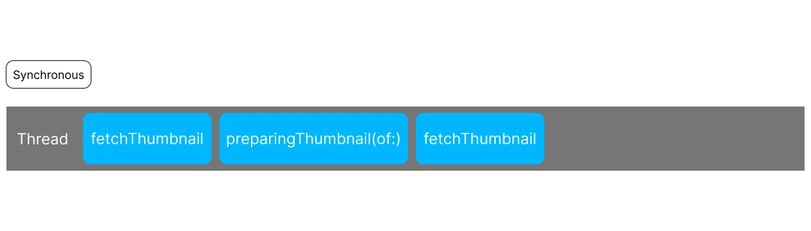
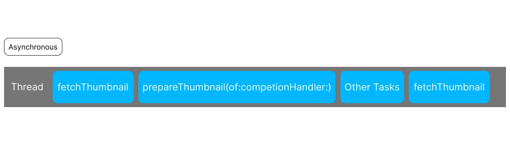
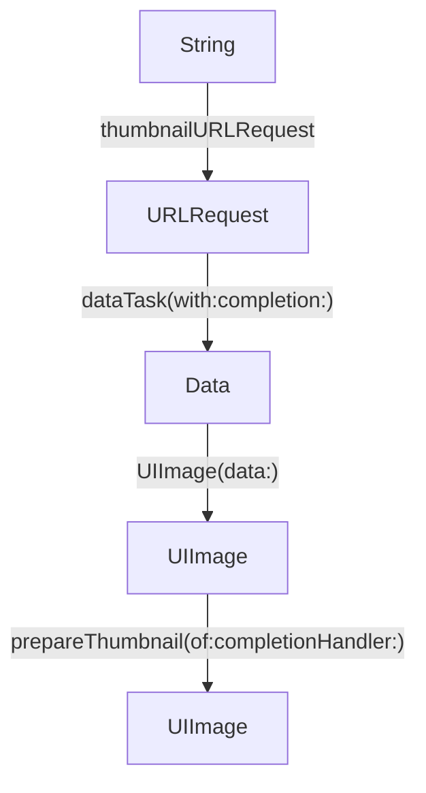
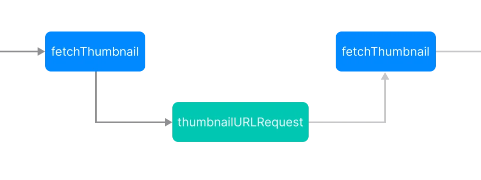
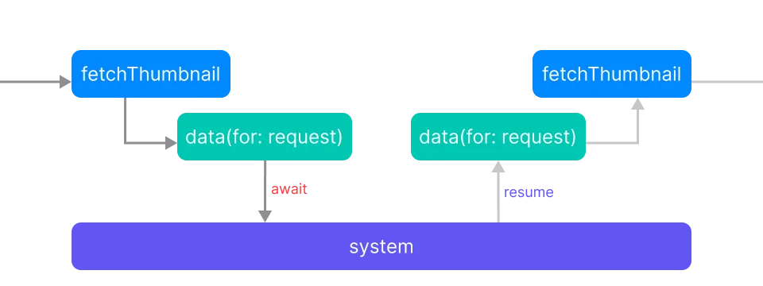

completion handler로 작성한 비동기 코드는 쉽게 장황해지고, 복잡해지고, 부정확해진다. 

Swift의 async/await는 비동기 코드를 일반 코드를 작성하는 것처럼 만들어 주고, 아이디어를 더 쉽게 반영하며, 더 안전하게 만든다.

async/await는 단순한 비동기 표현 방식이 아니다. 이 세션에서는 async/await가 왜 기존 completion handler 방식보다 좋은지, 그리고 Swift의 컨셉에 왜 잘 맞는지를 계속해서 설명한다.

## Meet async/await in Swift

Foundation 같은 Apple SDK에는 `await`할 수 있는 수백 개의 메소드가 존재한다. UIKit의 `UIImage`는 섬네일을 만드는 API를 동기 방식과 비동기 방식으로 모두 제공한다.

```swift
func preparingThumbnail(of size: CGSize) -> UIImage?
func prepareThumbnail(of size: CGSize, completionHandler: @escaping(UIImage?) -> Void)
```

함수는 동기적으로 호출하면 스레드가 블록되고, 그 함수가 끝나길 기다린다.


동기 호출에서는 현재 스레드가 바로 그 함수를 실행한다. 함수가 끝날 때까지 호출한 코드가 다음으로 진행할 수 없으므로, 스레드가 해당 작업에 묶인다.




예를 들어 `fetchThumbnail`이 UIKit의 `preparingThumbnail`을 호출하면, 섬네일 생성이 끝날 때까지 현재 실행 흐름(스레드)이 기다린다.

반대로 비동기 API를 호출하면 작업이 실행되는 동안 현재 스레드는 다른 작업을 수행할 수 있다. 작업이 끝나면 API가 completion handler를 호출해 결과를 전달한다.



SDK에는 이런 API가 많고, 작업이 완료되었음을 알리는 방식도 다양하다.

- 어떤 함수는 지금 본 것처럼 completion handler를 사용한다.
- 어떤 함수는 delegate callback을 사용한다.
- 또 많은 함수는 `async` 키워드가 붙어 있어서 값을 리턴한다.

이 API들의 공통점은 작업을 시작한 뒤 현재 스레드를 곧바로 언블록한다는 것이다. 덕분에 시간이 오래 걸리는 작업 중에도 스레드는 다른 일을 진행할 수 있다.

### UIKit 섬네일 이미지 리스트 예시



서버에 저장된 이미지의 섬네일을 보여주는 리스트를 예로 들어 보자.

리스트에 보여줄 섬네일이 필요하면 ViewModel의 `fetchThumbnail` 메소드가 호출된다. 이 함수는 문자열을 여러 단계에 걸쳐 `UIImage`로 변환한다.



1. ViewModel의 `thumbnailURLRequest` 메소드가 문자열로부터 `URLRequest`를 생성한다.
2. `URLSession`의 `dataTask` 메소드가 해당 요청의 데이터를 fetch 해온다.
3. `UIImage(data:)`가 받아온 데이터로부터 `UIImage`를 생성한다.
4. `UIImage`의 `prepareThumbnail(of:completionHandler:)` 메소드가 원본 이미지에서 섬네일을 렌더링한다.

각 단계는 이전 단계의 결과에 의존하므로 순서대로 실행되어야 한다. `URLRequest`를 만들거나 `Data`에서 `UIImage`를 만드는 작업은 비교적 짧아서 동기 함수로 제공된다. 반면 네트워크에서 `Data`를 받거나 이미지를 처리하는 작업은 시간이 오래 걸릴 수 있어 SDK가 비동기 API로 제공한다.


순차적이라는 것은 A의 결과가 있어야 B를 할 수 있다는 뜻이고, 동기적이라는 것은 A가 끝날 때까지 현재 실행 흐름이 기다린다는 뜻이다. 비동기 코드는 순서를 유지하면서도 대기 중인 스레드를 다른 작업에 사용할 수 있다.


### 기존 completion handler 방식

```swift
func fetchThumbnail(for id: String, completion: @escaping (UIImage?, Error?) -> Void) {
    let request = thumbnailURLRequest(for: id)
    let task = URLSession.shared.dataTask(with: request) { data, response, error in
        if let error = error {
            completion(nil, error)
        } else if (response as? HTTPURLResponse)?.statusCode != 200 {
            completion(nil, FetchError.badID)
        } else {
            guard let image = UIImage(data: data!) else {
                return
            }
            image.prepareThumbnail(of: CGSize(width: 40, height: 40)) { thumbnail in
                guard let thumbnail = thumbnail else {
                    return
                }
                completion(thumbnail, nil)
            }
        }
    }
    task.resume()
}
```

이 함수 `fetchThumbnail`은 스트링 `id`와 completion handler 클로저 `completion`을 아규먼트로 받는다. 함수의 동작은 다음과 같다.

1. `thumbnailURLRequest`가 `id`를 받아서 `URLRequest`를 만든다. 동기 함수니까 평범하게 실행된다.
2. `dataTask(with:)`를 호출할 때는 1에서 만든 `URLRequest`와 completion handler를 전달한다. `dataTask(with:)`는 즉시 `URLSessionDataTask` 객체를 리턴하고 종료된다.
3. `task.resume()`이 실행되어서 비동기 작업을 시작시킨다.
4. `fetchThumbnail` 함수가 종료되고(더 이상 할게 없으니), 현재 스레드는 다른 작업을 수행할 수 있게 된다.
5. 시간이 지나서 이미지 다운로드가 성공해서 데이터를 받아왔든, 실패해서 에러를 발생시키든 상관없이 `dataTask`에 전달한 completion handler가 `data`, `response`, `error` 3개의 아규먼트를 받고 호출된다.
6. 만약 성공했다면 `UIImage(data:)`를 사용해 다운로드한 데이터로부터 이미지를 생성한다. 동기 함수니까 평범하게 실행된다.
7. 데이터를 이미지로 변환했으면, `prepareThumbnail` 메소드를 호출하고 completion handler를 전달한다. 이 작업도 스레드를 블록시키지 않는다.
8. 섬네일 준비가 완료되면, 해당 completion handler가 호출된다. 생성에 성공하면, `UIImage`가 전달되고, 실패하면 `nil`이 전달된다. 
9. `completion` 을 호출하여 생성된 이미지를 호출한 쪽에 전달한다.

이 코드에는 문제가 있다. `guard ... else` 구문에서 바로 함수를 리턴하기 때문에, 이 함수를 호출한 쪽에서 영원히 결과를 받지 못하고 대기하게 된다. 

따라서 completion handler를 정확하게 사용하려면 함수의 모든 경로에서 completion handler를 정확하게 1번씩 호출해서 결과나 에러를 전달해야 한다.

```swift
func fetchThumbnail(for id: String, completion: @escaping (UIImage?, Error?) -> Void) {
    let request = thumbnailURLRequest(for: id)
    let task = URLSession.shared.dataTask(with: request) { data, response, error in
        if let error = error {
            completion(nil, error)
        } else if (response as? HTTPURLResponse)?.statusCode != 200 {
            completion(nil, FetchError.badID)
        } else {
            guard let image = UIImage(data: data!) else {
                completion(nil, FetchError.badImage)
                return
            }
            image.prepareThumbnail(of: CGSize(width: 40, height: 40)) { thumbnail in
                guard let thumbnail = thumbnail else {
                    completion(nil, FetchError.badImage)
                    return
                }
                completion(thumbnail, nil)
            }
        }
    }
    task.resume()
}
```

이렇게 에러가 발생했을 때도 completion handler를 호출해서 에러를 전달해야 한다. `throw`처럼 함수의 모든 실행 경로마다 에러를 전달하도록 강제되는 구조가 아니기 때문에, completion handler 방식에서는 이 책임을 직접 관리해야 한다.

그래서 방금 `guard`에서 `return`을 해도 컴파일에서 Swift가 경고나 에러를 띄우지 않았다. 즉, completion handler를 쓰는 것에 대한 모든 책임이 개발자에게 있다.

이 코드를 작성한 이유는 작업 4개(동기 2개, 비동기 2개)를 차례대로 수행하고 싶었을 뿐인데, 코드는 20줄이 된다. `completion` 호출 지점도 5곳이라 버그가 숨어들 여지가 있다. 또한 4개의 작업을 순서대로 수행한다는 의도가 코드에서 잘 드러나지 않는다.

`Result` 타입을 이용해도 조금 더 안전해질 뿐 근본적으로 문제를 해결하진 못하고, `Future`도 마찬가지다...


`Future`는 나중에 한 번 완료될 결과를 표현하는 추상화다. Combine에도 `Future`가 있지만, 이 문맥에서는 completion handler보다 결과와 실패를 하나의 값으로 다루는 방식 전반을 가리킨다.


## async/await로 다시 작성하기

```swift
func fetchThumbnail(for id: String) async throws -> UIImage {
    let request = thumbnailURLRequest(for: id)  
    let (data, response) = try await URLSession.shared.data(for: request)
    guard (response as? HTTPURLResponse)?.statusCode == 200 else { throw FetchError.badID }
    let maybeImage = UIImage(data: data)
    guard let thumbnail = await maybeImage?.thumbnail else { throw FetchError.badImage }
    return thumbnail
}
```

이전과 같이 스트링 하나를 아규먼트로 받지만, completion handler 없이 `async` 함수로 만들었다.

이전과 다르게 함수 시그니처가 훨씬 간단해졌다. 이미지를 만들었으면 `return`하고, 에러가 발생하면 `throw`하면 된다는 것이 시그니처에 바로 보인다.

1. `thumbnailURLRequest`에서 `id`를 받아서 `URLRequest` 생성, 동기 함수니까 일반적으로 실행
2. `data(for:)`를 호출해 데이터를 다운로드한다. `await`할 수 있는 메소드이므로 함수는 이 지점에서 일시 중단(suspend)될 수 있다. 중단되었을 때, 스레드를 다른 작업에 사용할 수 있다.
3. 다운로드가 끝나면 `data(for:)` 메소드를 재개(resume)해서 `fetchThumbnail`로 돌아온다. 재개된 시점에 `data(for:)` 메소드의 리턴 값이나 에러가 전달된다.
4. 에러가 없다면, `data`와 `response`가 제대로 채워지고, 에러가 있다면 `fetchThumbnail`도 에러를 그대로 다시 던진다.
5. 다운로드한 `data`로 `UIImage`를 생성한다.
6. 이미지 생성이 성공하면, `thumbnail` 프로퍼티에 접근해서 섬네일을 렌더링 한다. 
7. 렌더링이 끝나면 `thumbnail` 프로퍼티가 다시 재개되고, 결과를 `fetchThumbnail`로 리턴하고(`thumbnail`이 할당되고), 실패하면 에러를 던진다.

가장 큰 차이점은 직접 에러를 전달하던 completion handler 방식과 다르게, `data(for:)`가 발생시킬 수 있는 에러를 `try`를 이용해서 에러를 전파할 수 있다.

`throws`로 선언된 함수를 호출 할때 `try`를 쓰는 것 처럼, `async`로 선언된 함수를 호출하려면 `await`가 필요하다. 함수의 본문에 `async`가 여러개 있어도, 호출할때 `await`는 하나면 충분하다. 그래서 이 함수는 `try await`가 된다. 

그리고 completion handler와 다르게, `async throws` 함수는 정상적으로 끝날 때 값을 리턴하고 실패할 때 에러를 던진다는 흐름을 함수 시그니처로 표현한다. 컴파일러는 함수 본문의 모든 종료 경로가 이 약속을 지키는지 검사한다. 다만 `await`한 작업 자체가 끝나지 않는 경우까지 막아 주는 것은 아니다.

이러면 의도가 그대로 드러난다.


즉, async/await를 쓰면 

- 비동기 코드는 더 안전해지고 (Swift가 리턴, 에러와 같은 함수 종료를 보장해주니까)
- 더 짧아지고 (콜백이 없어진다.)
- 더 의도를 잘 표현할 수 있게 된다. (코드 자체적으로 순서를 한 눈에 볼 수 있다.)

### async 프로퍼티

```swift
guard let thumbnail = await maybeImage?.thumbnail else { 
    throw FetchError.badImage 
}
```

이 코드는 함수 호출이 없는데도 `await`가 붙어있다. `thumbnail`이 `async` 프로퍼티기 때문이다.

함수, 프로퍼티, 이니셜라이저에서는 스레드를 다른 작업에 사용할 수 있도록 내어줄 수 있는 지점을 표시하기 위해 `await`를 사용할 수 있다.

`thumbnail` 프로퍼티의 구현은 다음과 같다.

```swift
extension UIImage {
    var thumbnail: UIImage? {
        get async {
            let size = CGSize(width: 40, height: 40)
            return await self.byPreparingThumbnail(ofSize: size)
        }
    }
}
```

`CGSize`를 하나 만든 뒤, 그 크기를 `byPreparingThumbnail(ofSize:)`에 전달하고, 그 결과를 `await`로 기다린다. 이 메소드는 앞에서 사용했던 `prepareThumbnail`메소드의 `await`를 사용할 수 있는 버전이다.


getter가 `async` 또는 `throws`인 컴퓨티드 프로퍼티를 effectful property라고 한다. 효과는 프로퍼티 자체가 아니라 getter에 붙으므로, `get async`처럼 명시적인 getter를 작성해야 한다.

async property는 값을 한 번 읽어오는 getter만 비동기화할 수 있으므로 읽기 전용이다. 값을 저장하는 setter에는 `async`를 붙일 수 없다. 시간이 지나며 여러 값을 전달해야 한다면 아래의 `AsyncSequence`를 사용한다.


### async sequence로 여러 값 다루기

```swift
for try await id in try await staticImageIDsURL.lines {
    let thumbnail = try await fetchThumbnail(for: id)
    collage.add(thumbnail)
}
let result = await collage.draw()
```

`for` 루프에서도 `await`를 사용할 수 있다. 기존의 `for` 루프와 차이점은 원소를 비동기적으로 제공한다는 점이다. 다음 원소를 가져오는 작업이 비동기이므로 `await`가 필요하다.

함수가 `AsyncSequence`를 순회하는 동안 다음 원소를 기다릴 때마다 현재 스레드를 다른 작업에 사용할 수 있다. 다음 원소가 준비되면 반복을 이어가고, 더 이상 가져올 요소가 없으면 반복문을 빠져나온다.


`Sequence`는 다음 원소를 즉시 줄 수 있는 값들의 흐름이고, `AsyncSequence`는 다음 원소가 준비될 때까지 기다려야 할 수 있는 값들의 흐름이다. `lines`는 파일이나 네트워크에서 한 줄을 읽어야 다음 값을 알 수 있으므로 `AsyncSequence`를 제공한다.

`for await`는 내부적으로 다음 원소를 요청하고, 준비될 때까지 현재 작업을 일시 중단한 뒤 하나씩 가져온다. 이 예제의 `lines`와 `fetchThumbnail`은 모두 에러를 던질 수 있으므로 `try await`도 함께 사용한다.


### 일반 함수와 `async` 함수의 실행

어떤 함수를 호출하면 현재 실행 흐름은 호출된 함수의 작업을 수행한다. 동기 함수라면 함수가 끝날 때까지 현재 스레드는 해당 작업에 묶인다.



```swift
func thumbnailURLRequest(for id: String) -> URLRequest {
	// ...
	return request
}
```

일반 동기 함수가 스레드의 제어권을 내려놓는 방법은 값을 리턴하거나, 에러를 던져서 함수의 실행이 종료되었을 때, 자신을 호출한 함수에게 돌려주는 경우 밖에 없다.

`async` 함수도 일반 함수처럼 종료하면 호출한 함수로 결과를 돌려준다. 다만 실행 중 `await` 지점에서 일시 중단(suspend)될 수 있다는 점이 다르다.



현재 task가 `await`에서 일시 중단되면, 그 task가 사용하던 스레드는 다른 작업을 실행할 수 있다. 이후 런타임이 해당 task를 다시 스케줄링하면, task는 중단 지점 다음부터 작업을 이어서 한다. 재개되는 스레드가 이전과 같다는 보장은 없다.

함수가 몇 번 중단하더라도, 결국엔 함수는 작업을 마친 뒤 값을 리턴하거나 에러를 던지고, 실행을 이어가던 함수로 결과를 전달한다.


completion handler 방식에서는 원래 함수가 이미 리턴한 뒤 나중에 클로저가 호출된다. `async` 함수에서는 suspension 뒤 작업이 재개되며, 특정 호출 스택이나 같은 스레드로 돌아온다고 보장하지 않는다.


### 함수가 일시 중단(suspend)될 때

```swift
let (data, response) = try await URLSession.shared.data(for: request)
```

`data(for:)`를 `await`하는 현재 task가 일시 중단된다. 이 task는 `fetchThumbnail`을 실행하던 task이므로, 호출자 입장에서는 `fetchThumbnail`도 이 지점에서 멈춘 것처럼 보인다. 하지만 멈추는 대상은 함수나 스레드 자체가 아니라 task다.

제어권은 시스템이 관리하므로 작업이 언제 재개될지는 정해져 있지 않다. 예를 들어 앱의 버튼 액션이 대기 중인 네트워크 작업보다 먼저 실행될 수 있고, 그 작업이 끝난 뒤 `data(for:)` 메소드가 재개될 수도 있고, 혹은 또 다른 작업이 먼저 실행될 수도 있다.

시간이 지나 작업을 마치면 `fetchThumbnail`로 돌아오는데, 중단해 있던 동안 다른 여러 작업이 실행되어서 앱의 상태가 크게 바뀌었을 수도 있다.

이 코드가 (마치 트랜잭션처럼) 하나의 연속된 작업으로 실행되지 않을 수 있다는 사실을 표시하기 위해 `await` 키워드를 생략하지 않고 붙여야 한다.


`await`에서 함수가 일시 중단된 동안 다른 작업이 실행될 수 있다. 따라서 재개된 뒤에는 공유 상태가 이미 바뀌었을 수 있다는 점을 고려해야 한다. 여러 작업이 같은 상태를 함께 변경하는 데이터 레이스와 같은 문제가 있을 수 있으므로 해결 방법이 필요하다.


`await` 함수가 재개될 때, 전혀 다른 스레드에서 실행될 수도 있다. 이 문제는 이후 actor 관련 세션에서 다룬다.

### async/await 정리

- `async`로 선언한 함수는 실행 중 `await` 지점에서 일시 중단될 수 있다.
- `async` 함수가 일시 중단되면, 그 함수를 호출한 함수도 함께 일시 중단된다. 따라서 호출하는 함수 역시 `async`여야 한다.
- `async` 함수가 일시 중단될 수 있는 지점은 `await` 키워드를 사용해서 표시한다.
- `async` 함수가 일시 중단되어 있는 동안 스레드는 블록되지 않고, 다른 작업을 실행할 수 있다.
- `async` 함수가 일시 중단된 동안 앱의 상태는 크게 바뀔 수 있다.
- `async` 함수가 재개되면, 그 함수가 호출했던 `async` 함수의 리턴 값이나 에러가 재개된 함수로 전달되고, 실행은 멈췄던 바로 그 지점부터 계속 이어진다.

즉, `async/await`는 비동기 작업을 동기처럼 보이게 만드는 기능이 아니다. 비동기라는 사실은 그대로 유지하고 completion handler가 하지 못했던 제어 흐름을 다시 함수 안으로 가져와 `return`과 `throw`를 사용할 수 있게 하고, 컴파일러가 그 흐름을 검증할 수 있게 만든 언어 기능이다.
