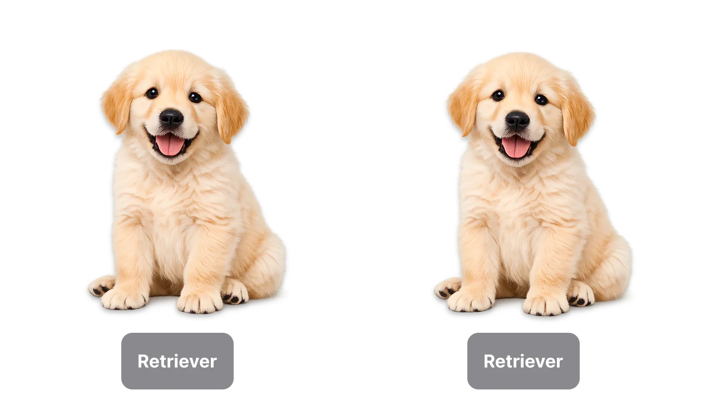


Identity는 화면에 띄워지는 UI 요소들이 같은 요소인지, 다른 요소인지 구분하는 방식이다.

이 WWDC 세션에서 가장 중요한건, View 프로토콜을 채택하여 작성하는 View Structure가 실제 화면에 보이는 요소가 아니라 그냥 그 요소의 설계도일 뿐이라는 것이다. (UIKit과 많이 다르다)

Swift에서 'Value Type은 Immutablity를 가진다.' 이라는 말이 가장 크게 체감되는 부분이기도 한데, SwiftUI에서 코드로 작성한 View도 Value Type이고 당연히 Immutable하다. 따라서 한 번 생성된 값은 변하지 않아야 한다. 만약 내부의 값이 변해야 하면 UIKit의 View Controller 처럼 은근슬쩍 내부 프로퍼티만 바꾸지 않고, Value 전체를 새로 만든다.

View의 Value가 실제 UI 요소라면 값이 변할 때 마다 사라졌다가 다시 생성 되겠지만 실제 동작은 그렇지 않다. View Value는 단순히 '설계도'일 뿐이기에, 새로 만들어진 설계도에 따라 `body`를 계산하여, SwiftUI 엔진이 내부에서 UI 요소만 조정한다. 즉, UIKit에서는 직접 하던 것을 SwiftUI 엔진이 대신 처리한다.

```swift
// UIKit
let label = UILabel()
label.text = "Hello" // 직접 UILabel 프로퍼티 수정 가능

// SwiftUI
@State var text = "Hello"
var body: some View {
    Text(text) // Text를 수정하는 API 제공하지 않음, State를 변경시켜서 SwiftUI가 변경하게 해야함
}
```

그러면 설계도인 View Value가 어떤 UI 요소를 가리키는지도 알아야 하는데, 이게 바로 Identity다. View Value는 일회성 값들일 뿐이고, SwiftUI는 Identity를 이용해 새로운 View가 기존 UI 요소를 계속 표현하는 것인지 판단한다. 즉, 같은 Identity를 공유하는 View들은 하나의 UI 요소가 서로 다른 상태를 표현하는 것으로 취급된다. 반대로 다른 UI 요소라면 서로 다른 Identity를 가진다.


## Identity

SwiftUI는 선언형 프레임워크다. 개발자는 무엇을 만들고 싶은지를 표현하고, SwiftUI는 그걸 바탕으로 실제 UI를 구성하고 업데이트한다. 보통은 이 방식이 자연스럽게 잘 동작하는데, 가끔 화면이 예상과 다르게 갱신되거나 애니메이션이 끊기거나 상태가 사라지는 것처럼 보일 때가 있다. 

Demystify SwiftUI 세션은 이런 현상을 이해하기 위해 SwiftUI가 코드를 바라보는 세 가지 관점, Identity, Lifetime, Dependency를 설명한다.

첫 번째로는 Identity다. 두 대상이 같은 존재인가, 다른 존재인가? 라는 질문이 바로 Identity의 핵심이다. 

> Same identity = same element
> 
> Different identities = distinct elements

서로 다른 상태에 있는 View들을 하나의 존재로 연결해 주는 것이 바로 Identity고, 같은 Identity를 공유하는 View들은 하나의 UI 요소가 여러 상태를 표현하는 것으로 SwiftUI는 이해한다.

## Identity의 종류

- Explicit identity: 데이터나 개발자가 직접 지정한 식별자를 사용하는 방식
- Structural identity: View의 타입과 View 계층에서의 위치를 이용해 Identity를 결정하는 방식

## Explicit identity

이름이나 고유한 식별자를 직접 부여하는 것이 Explicit Identity다.



세션에서는 강아지 예시를 사용한다. 두 강아지의 모습이 비슷하더라도 이름이나 태그 ID가 다르다면 서로 다른 존재로 구분할 수 있다. 반대로 같은 이름이나 같은 고유 ID를 공유한다면 같은 존재로 판단할 수 있다.

Explicit Identity는 강력하고 유연하지만, 대신 그 식별자를 계속 관리해야 한다.

#### Pointer Identity

`UIView`와 `NSView`는 모두 클래스다. 메모리 상에서 고유한 주소, 즉 포인터를 가진다. 이 포인터 자체가 자연스러운 Identity가 되어 두 View가 같은 포인터를 가지고 있다면 같은 View로 볼 수 있다.

SwiftUI의 View는 값 타입이기 때문에 이런 방식의 포인터 Identity를 사용하지 않는다. 대신 데이터나 개발자가 지정한 ID처럼 다른 형태의 Explicit Identity를 쓴다.

### Rescue Dogs 예제


{ width = "360" }

```swift
List {
	Section {
		ForEach (rescueDogs, id: \.dogTagID) { rescueDog in
			ProfileView (rescueDog)
		}
	}
Section("Status") {
	ForEach (adoptedDogs, id: \.dogTagID) { rescueDog in
		ProfileView (rescueDog, foundForeverHome: true)
		}
	}
}
```

여기서 `id`가 Explicit Identity다. 각 구조견이 가진 고유한 태그 ID를 이용해 각각의 뷰를 식별한다.

상태가 바뀌어 어떤 강아지가 다른 섹션으로 이동하더라도 같은 `dogTagID`를 유지한다면, SwiftUI는 그 대상을 완전히 새로운 View가 아니라 같은 Identity를 가진 요소로 추적할 수 있다.

### ScrollViewReader 예제


```swift
ScrollViewReader { proxy in
	ScrollView {
		HeaderView (rescueDog)
			.id(headerID)
		Text(rescueDog.backstory)
		Button("Jump to Top") {
			withAnimation {
				proxy.scrollTo(headerID)
			}
		}
	}
}
```

`id(_:)`는 View에 명시적인 Identity를 부여하는 Modifier다.

모든 View에 ID를 줄 필요는 없다. 다른 곳에서 참조해야 하는 View만 명시적인 ID를 가지면 충분하다. 여기서도 ScrollViewReader, ScrollView, Text, Button 등은 별도의 ID가 필요하지 않다.

하지만 명시적인 ID가 없다고 해서 Identity 자체가 없는 것은 아니다. 모든 View는 어떤 방식으로든 Identity를 가진다. 명시적으로 부여하지 않은 경우에는 SwiftUI가 구조를 통해 Identity를 판단한다.

## Structural Identity

생김새는 비슷하지만 이름을 모르는 강아지 두 마리가 있다고 하자.


이처럼 상대적인 위치와 구조를 이용해 대상을 구분하는 것이 Structural Identity다. SwiftUI는 API 전반에서 이 개념을 적극적으로 활용한다.

### View 안의 if문 예제

```swift
var body: some View {
	if rescueDogs.isEmpty {
		AdoptionDirectory(selection: rescueDogs)
	} else {
		DogList (rescueDogs)
	}
}
```

`AdoptionDirectory`는 조건이 `true`일 때만 등장하고, `DogList`는 조건이 `false`일 때만 등장한다. 조건문의 구조 자체가 각각의 View를 구분하는 기준이 된다.

둘의 모양이 비슷하더라도 SwiftUI는 두 View를 구분할 수 있다. 다만 이게 가능하려면 두 View의 위치가 임의로 뒤바뀌지 않는다는 걸 컴파일 시점에 보장할 수 있어야 한다.

SwiftUI는 이를 위해 View 계층의 Type Structure를 분석한다. SwiftUI가 실제로 보는 것은 View의 Generic Type이다.

```swift
some View =
	_ConditionalContent<
		AdoptionDirectory,
		
		DogList
	>
```

`if`는 내부적으로 `_ConditionalContent`라는 타입으로 변환된다. 이 타입은 `true`일 때의 View와 `false`일 때의 View를 제네릭 타입으로 가진다. 이러한 변환은 `ViewBuilder`가 하는데, `View` 프로토콜은 `body` 프로퍼티를 암묵적으로 `ViewBuilder`로 감싸준다.

`ViewBuilder`는 `body` 안에 작성한 조건문이나 반복문 같은 로직을 하나의 제네릭 View 타입으로 조합한다. SwiftUI의 선언형 문법이 하나의 DSL처럼 느껴지는 이유도 여기에 있다.

`body`의 리턴 타입인 `some View`는 정적 복합 타입(static composite type)을 나타내는 플레이스홀더다. 실제 타입은 매우 길고 복잡해질 수 있기 때문에 `some View`가 그 구체 타입을 숨겨준다. -> 이것이 Swift의 opaque return type이다!


처음에는 `some View`가 단순히 "View를 반환한다" 정도의 의미라고 생각하기 쉽다. 하지만 실제로는 `Text`, `VStack`, `_ConditionalContent` 같은 구체 타입들이 조합된 하나의 정적인 타입이 존재하고, `some View`는 그 긴 타입 이름을 숨겨주는 역할을 한다. 즉 타입이 없는 것이 아니라, 구체 타입은 정해져 있지만 바깥에 드러내지 않는 것이다.

`some`과 opaque return type에 대해서는 예전에 정리한 적이 있다: [Opaque Types]()


이러한 제네릭 타입 덕분에 SwiftUI는 `true`일 때 항상 `AdoptionDirectory`이고, `false`일 때 항상 `DogList`라는 사실을 컴파일 시점에 알 수 있다. 그래서 SwiftUI는 각각의 분기에 암시적인 Identity를 부여할 수 있다.


SwiftUI는 `body`를 실행해서 나온 결과만 보는 것이 아니라, `ViewBuilder`가 만들어 낸 정적인 타입 구조도 함께 본다. `if`의 참 분기와 거짓 분기가 `_ConditionalContent<TrueView, FalseView>` 같은 형태로 타입에 남기 때문에, SwiftUI는 "이 위치의 참 분기에는 항상 이 View가 온다"는 정보를 알 수 있다. 이 정보가 Structural Identity의 근거가 된다.


### good dog, bad dog 예제


```swift
VStack {
	if dog.isGood {
		PawView(tint: .green)
		Spacer()
	} else {
		Spacer()
		PawView(tint: .red)
	}
}
```

`if`를 사용하여 조건마다 서로 다른 View를 생성하면 SwiftUI는 이 둘을 서로 다른 Identity를 가진 별개의 View라고 이해한다. 그래서 상태가 바뀔 때 기존 View가 사라지고 새로운 View가 나타나는 전환을 수행한다.


```swift
PawView(tint: dog.isGood ? .green : .red)
	.frame(
		maxHeight: .infinity,
		alignment: dog.isGood ? .top : .bottom
	)
```

반대로 하나의 `PawView`만 두고 색상과 레이아웃만 변경하면 상태가 바뀌어도 View가 부드럽게 이동한다. Identity가 유지되는 하나의 View를 수정하고 있기 때문이다. 두 방법 모두 쓸 수 있지만, SwiftUI는 두 번째 방식을 권장하는 편이다. 더 자연스럽게 전환되기 때문이다.

View의 Lifetime과 State를 유지하는 데도 도움이 된다.

### AnyView

앞선 `if` 예제에서 SwiftUI는 조건문이 만들어 내는 제네릭 타입 구조를 그대로 인식했다. 그렇다면 반대로 이 타입 구조를 숨겨버리면 어떤 일이 생길까?

### 강아지 품종에 따라 서로 다른 View를 반환하는 헬퍼 예제

```swift
func view (for dog: Dog) -> some View {
	var dogView: AnyView
	if dog.breed == .bulldog {
		dogView = AnyView (BulldogView())
	} else if dog.breed == .pomeranian {
		dogView = AnyView(PomeranianView())
	} else if dog.breed == .borderCollie {
		dogView = AnyView(BorderCollieView())
		if sheepNearby {
			dogView = AnyView(HStack {
				dogView
				SheepView()
			})
		}
	} else {
		dogView = AnyView(UnknownBreedView())
	}
	return dogView
}
```

각 분기에서 반환하는 View 타입이 서로 다르기 때문에 `AnyView`로 감싼다.

`AnyView`는 type-erasing wrapper type이다. 내부에 어떤 View가 들어 있는지 구체 타입 정보를 숨긴다.

그래서 SwiftUI는 코드의 조건문 구조를 충분히 활용하지 못하고, 그냥 `AnyView` 하나를 반환하는 함수처럼 보게 된다.


`AnyView`는 SwiftUI가 제공하는 구체 타입이다. 여러 종류의 View를 하나의 타입처럼 다루기 위해 내부 View의 구체 타입을 지운다. 반면 `any View`는 Swift의 문법에 가깝다. 이름은 비슷하지만, SwiftUI에서 흔히 말하는 type erasure 도구는 `AnyView`다.


#### 코드를 단순하게 하고 SwiftUI에 더 많은 구조 정보 보여주기

양이 근처에 있을 때, 즉 `sheepNearby`가 `true`일 때만 `SheepView()`를 보여준다고 하자. `HStack` 자체를 조건부로 만드는 대신, `HStack` 안에서 `SheepView`만 조건부로 추가할 수 있다.

```swift
dogView = AnyView(HStack {
	BorderCollieView()
	if sheepNearby {
		SheepView()
	}
})
```

이렇게 하면 조건에 따라 바뀌는 범위를 더 안쪽으로 좁힐 수 있다.


`HStack` 전체를 조건부로 만들면 SwiftUI는 조건에 따라 컨테이너 구조 자체가 바뀐다고 이해할 수 있다. 반면 `HStack`은 유지하고 그 안의 `SheepView`만 조건부로 두면, 바뀌는 부분이 더 작아진다. 결과적으로 SwiftUI가 더 많은 구조 정보를 유지할 수 있다.


따라서 로컬 `dogView`도 더 이상 필요하지 않다. 각 분기에서 바로 View를 반환하면 된다.

```swift
func view (for dog: Dog) -> some View {
	if dog.breed == .bulldog {
		return AnyView(BulldogView())
	} else if dog.breed == .pomeranian {
		return AnyView(PomeranianView())
	} else if dog.breed == .borderCollie {
		return AnyView(HStack {
			BorderCollieView()
			if sheepNearby {
				SheepView()
			}
		})
	} else {
		return AnyView(UnknownBreedView())
	}
}
```

SwiftUI에서는 `if`문이 서로 다른 View 타입을 반환하는 것이 가능하다. 정확히는 `body`처럼 `ViewBuilder`가 적용되는 문맥에서는 서로 다른 분기를 하나의 정적인 View 타입으로 조합할 수 있다. 그런데 일반 함수에서 `return`과 `AnyView`를 단순히 삭제하면 컴파일 오류가 발생한다.

그 이유는 `body`는 `ViewBuilder`를 적용해 주기 때문에 특별하다. 조건문들을 하나의 제네릭 View 타입으로 조합해서 반환한다. 하지만 일반 함수에는 기본적으로 `ViewBuilder`가 적용되지 않는다. `ViewBuilder`를 적용시키고 싶으면, `@ViewBuilder` 어트리뷰트를 붙이면 된다.

```swift
@ViewBuilder
func view (for dog: Dog) -> some View {
	if dog.breed == .bulldog {
		BulldogView()
	} else if dog.breed == .pomeranian {
		PomeranianView()
	} else if dog.breed == .borderCollie {
		HStack {
			BorderCollieView()
			if sheepNearby {
				SheepView()
			}
		}
	} else {
		UnknownBreedView()
	}
}
```

`@ViewBuilder`가 붙은 함수에서는 각 분기의 표현식들이 Builder에 의해 조합되기 때문에 `return` 없이 View를 나열할 수 있다.


일반 Swift 함수에서는 단일 표현식 함수일 때만 `return`을 생략할 수 있다. 그런데 `@ViewBuilder`가 붙은 함수는 조금 다르게 동작한다. 함수 본문에 나열된 View 표현식들을 Builder가 모아서 하나의 View로 조합하기 때문에, 여러 줄의 조건문 안에서도 `return` 없이 작성할 수 있다.


반환 타입

```swift
some View =
	_ConditionalContent<
		_ConditionalContent<
			BulldogView,
			PomeranianView
		>,
		_ConditionalContent<
			HStack<
				TupleView<(
					BorderCollieView,
					SheepView?
				)>
			>,
			UnknownBreedView
		>
	>
```

함수의 조건문 구조가 그대로 `_ConditionalContent` 트리로 표현된다.

`switch`를 쓰면 코드를 좀 더 깔끔하게 정리할 수 있다. `switch`는 문법만 다를 뿐, 생성되는 타입 구조의 핵심은 동일하다.

```swift
@ViewBuilder
func view(for dog: Dog) -> some View {
	switch dog.breed {
	case .bulldog:
		BulldogView()
	case .pomeranian:
		PomeranianView()
	case .borderCollie:
		HStack {
			BorderCollieView()
			if sheepNearby {
				SheepView()
			}
		}
	default:
		UnknownBreedView()
	}
}
```

`AnyView`는 View의 타입 정보를 숨겨버린다. 반면 `ViewBuilder`를 활용하면 타입 정보를 유지하면서도 같은 기능을 구현할 수 있다. 그래서 특별한 이유가 없다면 `AnyView`는 피하는 편이 좋다. 코드가 더 복잡해질 뿐 아니라, SwiftUI가 구조를 이해하는 데 필요한 정보도 줄어들 수 있다.

### 정리

- Explicit Identity를 사용하면 데이터나 사용자 정의 ID를 View의 Identity와 연결할 수 있다.
- Structural Identity를 사용하면 SwiftUI는 View의 타입과 계층 구조만으로 각각의 View를 식별할 수 있다.
