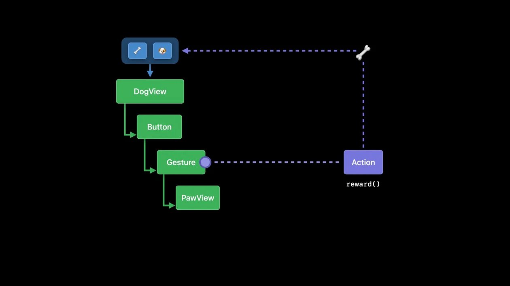

## Dependencies: SwiftUI는 무엇이 바뀌었는지 어떻게 알까?

앞선 글에서는 SwiftUI가 View를 구분하는 방식인 Identity와, Identity가 유지되는 기간인 Lifetime을 정리했다. 이번에는 SwiftUI가 View를 업데이트하는 기준인 Dependencies를 살펴본다.

먼저 결론부터 말하면 SwiftUI의 업데이트 과정은 다음과 같다.

```text
Dependency 변경
      ↓
관련된 View 무효화
      ↓
body 재평가
      ↓
새로운 View Value와 이전 Value 비교
      ↓
실제로 변경된 화면만 업데이트
```

Identity는 같은 View인지 판단하고, Lifetime은 상태를 유지하며, Dependency는 어떤 View를 다시 계산해야 하는지 결정한다. 이 세 가지를 함께 이해하면 단순히 API 사용법을 외우는 것보다 SwiftUI의 동작을 더 잘 예측할 수 있다.

### 강아지 간식 예제

```swift
struct DogView: View {
    @Binding var dog: Dog
    var treat: Treat

    var body: some View {
        Button {
            dog.reward(treat)
        } label: {
            PawView()
        }
    }
}
```

`DogView`의 `body`는 `dog`와 `treat`를 사용해 만들어진다. 따라서 두 값은 `DogView`의 Dependencies다.


Dependency는 단순히 View 안에 존재하는 모든 프로퍼티를 뜻하지 않는다. 더 정확하게는 `body`의 결과가 의존하는 입력값이다.


Dependency가 변경되면 SwiftUI는 해당 View의 `body`가 더 이상 최신 상태가 아니라고 판단하고, 이후 업데이트 과정에서 `body`를 다시 평가한다.



버튼을 탭하면 강아지에게 간식을 주는 Action이 실행되고 `dog`의 상태가 바뀐다. `dog`가 `DogView`의 Dependency라면 SwiftUI는 `DogView`를 무효화하고 `body`를 다시 계산한다.


무효화는 "이 View의 `body`는 이전 Dependency를 기준으로 계산되었으므로 이제 최신 상태가 아니다"라고 표시하는 것이다. 무효화된 View는 이후 업데이트 과정에서 `body`가 다시 평가될 수 있다.


SwiftUI는 무효화된 View에서 `body`를 호출하고 새로운 View Value를 생성한다. 그런 다음 새로운 View Value와 이전 View Value를 비교해 실제 화면에서 필요한 부분만 업데이트한다.

View Value는 `body`를 계산할 때마다 새로 만들어질 수 있는 짧은 값이다. 반면 View의 Lifetime은 Identity를 따라 더 길게 이어진다. 그래서 `body`가 다시 계산되더라도 Identity가 유지되면 State와 같은 저장 공간은 계속 유지될 수 있다.

모든 View에는 명시적이든 구조적이든 Identity가 있다. SwiftUI는 이 Identity를 이용해 변경 사항을 올바른 View에 전달하고 UI를 업데이트한다.


Dependency가 변경되면 SwiftUI는 어떤 View를 다시 계산해야 하는지 알아야 한다. 그런데 그 View를 안정적으로 가리키려면 Identity가 필요하다. (다시 말하지만 View Value는 우리 눈에 보이는 뷰가 아니다.)

Identity는 View의 Lifetime을 만들고, Lifetime은 상태 저장소와 Dependency Graph의 노드를 이어준다. 그래서 Dependencies를 이해할 때도 Identity가 다시 등장한다.


Dependency에는 여러 종류가 있다.

```swift
@Binding
@Environment
@State
@StateObject
@ObservedObject
@EnvironmentObject
```


일반 저장 프로퍼티도 부모로부터 전달되어 `body` 계산에 사용된다면 View의 입력값이다. 다만 SwiftUI가 변경을 관찰하고 업데이트를 예약하는 방식은 property wrapper의 종류에 따라 달라진다.


## Identifier Stability

SwiftUI가 변경된 데이터를 올바른 View에 전달하려면 Identifier가 안정적이어야 한다. 2편에서 정리했듯이 View의 Lifetime은 Identity가 유지되는 기간이므로, Identifier가 불안정하면 Lifetime도 끊길 수 있다.

안정적인 Identifier는 State와 애니메이션을 유지하는 데 도움이 되고, View의 저장 공간과 Dependency Graph를 불필요하게 다시 구성하는 상황도 줄인다.

### 좋아하는 펫 예제


아래에 첨부된 동영상은 예제 코드와 이미지를 보고 재현한 코드를 당시의 환경(iOS 15)도 재현해서 실행한 것이다. 따라서 애니메이션 동작이 현재와 약간 다르다. 지금은 아래처럼 애니메이션 버그가 심각하게 발생하지 않고 깜빡이는 정도로만 보일 수 있다.

다만 아래 버그가 잘못된 Identity를 구성하는 것이 왜 문제인지 더 직관적으로 보여주기 때문에, 당시 환경을 재구성했다.


```swift
enum Animal { case dog, cat }

struct Pet: Identifiable {
    var name: String
    var kind: Animal
    var id: UUID { UUID() }
}

struct FavoritePets: View {
    var pets: [Pet]

    var body: some View {
        List {
            ForEach(pets) { pet in
                PetView(pet)
            }
        }
    }
}
```


`Pet`에는 Identifier가 있지만 문제가 있다. `id`에 접근할 때마다 새로운 UUID가 만들어지므로, 같은 `Pet`도 매번 다른 항목처럼 보인다.

{{< callout type="note" title="var id: UUID { UUID() }" >}}
`var id: UUID { UUID() }`는 저장 프로퍼티가 아니라 계산 프로퍼티다. `id`에 접근할 때마다 새 `UUID`를 만들어 반환한다.

따라서 같은 `Pet` 값이라도 매번 다른 ID를 가진 것처럼 보인다. SwiftUI는 이를 같은 데이터의 변화로 추적하지 못하고 새로운 항목으로 취급하게 된다.


### Index를 Identifier로 사용하면 어떨까?

```swift
struct FavoritePets: View {
    var pets: [Pet]

    var body: some View {
        List {
            ForEach(pets.indices, id: \.self) { index in
                PetView(pets[index])
            }
        }
    }
}
```

이것도 좋은 해결책은 아니다. Index는 데이터 자체가 아니라 컬렉션 안에서 데이터가 놓인 위치이기 때문이다.

새로운 펫을 가장 앞에 추가하면 기존 펫들의 Index가 모두 밀리고, SwiftUI는 항목이 이동한 것이 아니라 여러 항목의 Identity가 바뀐 것으로 해석할 수 있다.


버튼이 Index 0에 새로운 요소를 삽입했는데 실제 애니메이션에서는 끝에 삽입된 것처럼 보일 수 있다. SwiftUI가 데이터 자체가 아니라 바뀐 Index를 기준으로 추적하기 때문이다.

이런 경우에는 데이터베이스에서 가져온 ID처럼 영속적인 Identifier를 사용해야 한다.

```swift
ForEach(pets, id: \.databaseID) { pet in
    PetView(pet)
}
```


좋은 Identifier에는 안정성뿐만 아니라 유일성도 필요하다. 각 Identifier는 같은 시점에 하나의 View에만 대응해야 한다.


안정성은 같은 데이터가 시간의 흐름 속에서도 같은 Identifier를 유지한다는 뜻이다.

유일성은 같은 시점에 서로 다른 데이터가 같은 Identifier를 공유하지 않는다는 뜻이다.

`var id: UUID { UUID() }` 같은 계산 프로퍼티는 안정성이 없고, 간식 이름처럼 중복될 수 있는 값은 유일성이 부족하다.


## 유일한 Identifier

```swift
struct TreatJar: View {
    var treats: [Treat]

    var body: some View {
        ScrollView {
            LazyVGrid(...) {
                ForEach(treats, id: \.name) { treat in
                    TreatCell(treat)
                }
            }
        }
    }
}
```

간식에는 이름, 이모지, 유통기한, 일련번호가 있다고 하자. 간식을 이름으로 식별하면 같은 이름을 가진 간식이 두 개 이상 있을 때 문제가 생길 수 있다.


{ width = "360" }

간식을 추가해도 화면에 나타나지 않거나, 애니메이션과 업데이트가 이상하게 동작할 수 있다.

```swift
ForEach(treats, id: \.serialNumber) { treat in
    TreatCell(treat)
}
```

대신 각 간식의 일련번호처럼 안정적이고 유일한 값을 사용하면 모든 간식 데이터를 올바르게 추적할 수 있다.


`var id: UUID { UUID() }` 예제는 안정성이 없는 문제였다. 같은 항목인데도 매번 다른 ID가 나왔다. 이번 예제는 유일성이 없는 문제다. 서로 다른 항목인데 같은 ID를 공유할 수 있다. 둘 다 SwiftUI가 데이터를 제대로 추적하지 못하게 만든다는 점에서는 같은 종류의 버그지만, 원인은 서로 다르다.


일반적으로 Identifier는 시간이 지나도 바뀌지 않아야 하고, 같은 시점에 여러 항목이 공유해서도 안 된다. 새로운 Identifier는 SwiftUI에게 새로운 Lifetime을 가진 새로운 항목이 생겼다는 의미가 될 수 있기 때문이다.

## Structural Identity

Identifier는 데이터가 제공하는 Explicit Identity만을 의미하지 않는다. View를 작성한 코드의 구조도 Identity를 만든다.


{ width = "360" }

```swift
ForEach(treats, id: \.serialNumber) { treat in
    TreatCell(treat)
        .modifier(ExpirationModifier(date: treat.expiryDate))
}

struct ExpirationModifier: ViewModifier {
    var date: Date

    func body(content: Content) -> some View {
        if date < .now {
            content.opacity(0.3)
        } else {
            content
        }
    }
}
```

유통기한이 지나면 Cell을 흐리게 만드는 Modifier다. 하지만 이 코드에는 서로 다른 두 개의 `content` 분기가 존재한다.

조건이 바뀌면 SwiftUI는 같은 View의 속성이 변경되었다고 보기보다, 서로 다른 구조 중 하나가 선택되었다고 해석할 수 있다.


`ForEach(treats, id: \.serialNumber)`로 간식 셀에 Explicit Identity를 주더라도, 그 안쪽 View 구조에는 여전히 Structural Identity가 존재한다. Explicit Identity를 줬다고 해서 조건 분기로 생기는 내부 구조 변화가 사라지는 것은 아니다.


실제 프로젝트에서는 분기가 서로 다른 파일이나 Modifier 안에 흩어져 있을 수 있다. 분기가 Modifier 안에 있다는 사실을 놓치기 쉬운 이유다.

Modifier의 `body` 역시 View를 반환하므로, 그 안의 조건문도 Structural Identity를 만든다.

## Inert Modifier로 구조 유지하기

이 경우에는 두 분기를 하나로 합치고 조건을 `opacity` Modifier 내부로 옮길 수 있다.

```swift
struct ExpirationModifier: ViewModifier {
    var date: Date

    func body(content: Content) -> some View {
        content.opacity(date < .now ? 0.3 : 1.0)
    }
}
```

첫 번째 코드는 서로 다른 두 View 구조 중 하나를 선택한다. 두 번째 코드는 하나의 View 구조를 유지한 채 `opacity` 값만 변경한다.

따라서 지금 표현하려는 것이 새로운 View가 아니라 같은 View의 상태 변화라면, 구조를 갈아끼우기보다 Modifier의 값을 변경하는 편이 SwiftUI의 Identity 모델과 더 잘 맞는다.


`if`로 View 구조 자체를 나누면 SwiftUI는 서로 다른 두 구조를 보게 된다.

반면 `opacity(date < .now ? 0.3 : 1.0)`처럼 값을 조건부로 바꾸면 View 구조는 유지되고 Modifier의 입력값만 바뀐다.

같은 View의 두 상태를 표현하고 싶다면 구조를 갈아끼우기보다 Modifier 값만 바꾸는 편이 SwiftUI의 Identity 모델과 잘 맞는다.


이처럼 렌더링 결과에 아무런 영향을 주지 않는 Modifier를 Inert Modifier라고 한다.

```swift
opacity(1)
padding(0)
transformEnvironment(...) { }
```


`transformEnvironment`는 Environment 값을 변형해서 하위 View에 전달하는 Modifier다.

여기서는 빈 변형 클로저를 넘기면 실제 Environment 값이 바뀌지 않으므로 Inert Modifier의 예시가 된다.

핵심은 Modifier가 존재하더라도 결과가 같다면 SwiftUI가 비용을 낮게 처리할 수 있다는 점이다.


조건 분기는 유용하고 SwiftUI에 존재하는 이유가 분명하다. 다만 필요하지 않은 곳에서 사용하면 다음과 같은 문제가 생길 수 있다.

- 성능 저하
- 예상치 못한 애니메이션
- State 손실

그러므로 조건 분기를 추가할 때는 잠시 멈추고, 지금 표현하려는 것이 정말 서로 다른 View인지, 아니면 같은 View의 다른 상태인지 구분해야 한다.

하나의 View를 표현할 때는 조건 분기보다 Inert Modifier를 사용하는 편이 더 잘 동작하는 경우가 많다.

## 마무리

SwiftUI의 View 업데이트를 이해하려면 “화면을 다시 그린다”는 표현만으로는 부족하다.

- Identity로 이전 View와 같은 View인지 판단한다.
- 같은 Identity가 유지되는 동안 Lifetime을 이어간다.
- Lifetime에 연결된 State와 저장 공간을 보존한다.
- Dependency가 변경되면 관련된 View를 무효화한다.
- 무효화된 View의 `body`를 다시 계산한다.
- 새로운 View Value와 이전 Value를 비교해 필요한 부분만 업데이트한다.

결국 중요한 질문은 이것이다.

> 지금 만들고 있는 것은 새로운 View인가, 아니면 같은 View의 다른 상태인가?

이 질문을 기준으로 Identity와 조건 분기를 바라보면, State가 초기화되거나 애니메이션이 이상하게 동작하는 이유도 더 쉽게 추적할 수 있다.
