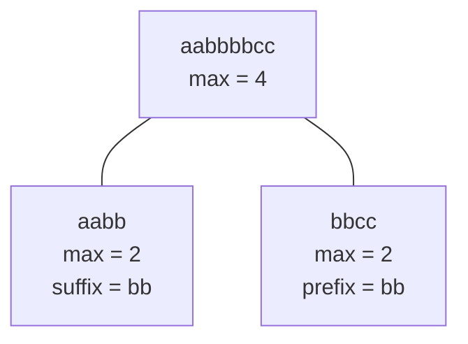

## 문제

<https://leetcode.com/problems/longest-substring-of-one-repeating-character>

## 풀이

스트링 `s`에 대해 여러 번의 문자 변경 쿼리가 주어진다. 각 쿼리마다 특정 인덱스의 문자를 변경하고, 같은 문자가 연속되는 가장 긴 부분 스트링의 길이를 리턴하면 된다.

스트링의 길이와 쿼리의 개수가 최대 $10^5$이므로, 문자를 변경할 때마다 스트링 전체를 탐색하는 방식으로는 해결할 수 없다.

문자 하나를 변경하는 업데이트가 반복되고, 변경 이후 스트링 전체에서 가장 긴 연속 스트링의 길이를 구해야 한다. 따라서 변경된 구간만 갱신할 수 있는 [Segment Tree]()를 사용했다.

다만, 단순히 concat을 하면 안되고, 두 접합부의 경계를 확인한 다음 처리를 해줘야 한다.

예를 들어 `"aabb"`와 `"bbcc"`의 가장 긴 연속 스트링 길이는 각각 `2`지만, 두 구간을 합치면 경계의 `b`가 연결되면서 길이가 `4`가 된다.

따라서 각 구간에 다음 정보를 저장했다.

- 왼쪽 문자와 왼쪽부터 연속되는 길이
- 오른쪽 문자와 오른쪽부터 연속되는 길이
- 구간에서 가장 긴 연속 스트링의 길이
- 구간 전체 길이

두 구간을 합칠 때 경계의 문자가 같다면 왼쪽 구간의 suffix와 오른쪽 구간의 prefix를 연결할 수 있다.



각 쿼리에서는 변경된 문자가 있는 리프 노드부터 루트까지 다시 계산한다. 트리의 루트에는 스트링 전체에서 가장 긴 연속 스트링의 길이가 저장된다.

Segment Tree 생성에 $O(n)$, 각 문자 변경에 $O(\log n)$이 필요하므로 쿼리의 개수를 $q$라고 하면 전체 시간 복잡도는 $O(n + q\log n)$이다.

`sCount = s.count`가 이상해 보일 수 있는데, Swift 스트링의 `count` 프로퍼티의 시간복잡도가 $O(n)$이라서 미리 계산했다. 안하면 $O(n^2 + q\log n)$이 되어버린다.

## 코드

```swift
class Solution {
    typealias Node = (
        leftChar: Character, leftCount: Int,
        rightChar: Character, rightCount: Int,
        maxCount: Int,
        total: Int
    )

    struct SegmentTree {
        private var container: [Node]
        private var n: Int
        var top: Node { container[0] }

        init(nodes: [Character]) {
            self.n = nodes.count
            let empty: Node = (" ", 0, " ", 0, 0, 0)
            self.container = [Node](repeating: empty, count: 4 * nodes.count)
            build(0, 0, n - 1, nodes)
        }

        mutating func build(
            _ cur: Int,
            _ start: Int,
            _ end: Int,
            _ nodes: [Character]
        ) {
            if start == end {
                container[cur] = (nodes[start], 1, nodes[start], 1, 1, 1)
            } else {
                let leftChild = 2 * cur + 1
                let rightChild = leftChild + 1
                let mid = (start + end) / 2
                build(leftChild, start, mid, nodes)
                build(rightChild, mid + 1, end, nodes)
                container[cur] = merge(container[leftChild], container[rightChild])
            }
        }

        mutating func update(
            _ cur: Int,
            _ start: Int,
            _ end: Int,
            _ idx: Int,
            _ val: Character
        ) {
            if start == end {
                container[cur] = (val, 1, val, 1, 1, 1)
            } else {
                let mid = (start + end) / 2
                if idx <= mid {
                    update(2 * cur + 1, start, mid, idx, val)
                } else {
                    update(2 * cur + 2, mid + 1, end, idx, val)
                }
                container[cur] = merge(container[2 * cur + 1], container[2 * cur + 2])
            }
        }

        private func merge(_ left: Node, _ right: Node) -> Node {
            let total = left.total + right.total

            let boundaryCount = left.rightChar == right.leftChar
                ? left.rightCount + right.leftCount
                : 0

            let maxCount = max(left.maxCount, right.maxCount, boundaryCount)

            let leftCount = left.leftChar == right.leftChar && left.leftCount == left.total
                ? left.leftCount + right.leftCount
                : left.leftCount

            let rightCount = right.rightChar == left.rightChar && right.rightCount == right.total
                ? right.rightCount + left.rightCount
                : right.rightCount

            return (
                leftChar: left.leftChar, leftCount: leftCount,
                rightChar: right.rightChar, rightCount: rightCount,
                maxCount: maxCount,
                total: total
            )
        }
    }

    func longestRepeating(_ s: String, _ queryCharacters: String, _ queryIndices: [Int]) -> [Int] {
        var segmentTree = SegmentTree(nodes: Array(s))
        var answer = [Int]()
        let sCount = s.count

        for (char, idx) in zip(queryCharacters, queryIndices) {
            segmentTree.update(0, 0, sCount - 1, idx, char)
            answer.append(segmentTree.top.maxCount)
        }
        return answer
    }
}
```
